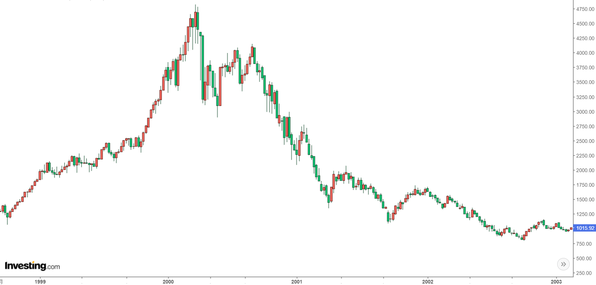

# Navigating the Frontiers of Tomorrow

**Still under construction**

## Turkeys on the Farm

Blockchain is all the rage these days. It seems like everyone is buying cryptocurrencies.

The quadrennial bull market, digital gold Bitcoin, red-hot ICOs, meme coins with hundredfold increases...

Hold on, let me check the calendar. It's May 2023... Looks like we're almost due for another bull market, if it comes on schedule. Last time was 2020, so maybe this time it'll be 2024.

But don't get too excited, let me tell you a story:

In a farm, there was a group of turkeys. The farmer fed them every day at 11 a.m. One turkey, the scientist of the flock, observed this phenomenon for almost a year without any exception.

So, it proudly announced its great discovery: every day at 11 a.m., food would arrive. The next day at 11 a.m., the farmer came again, and the turkeys were fed once more. Consequently, they all agreed with the scientist's law.

But on Thanksgiving Day, there was no food. Instead, the farmer came in and killed them all.

This story was originally put forth by British philosopher Bertrand Russell to satirize unscientific inductive reasoning and the abuse of induction.

Let's not talk about whether the bull market will come or not. 

Instead, let's look at some similar situations from history and see what happened:

During the late '90s Internet bubble, the market experienced several ups and downs. In '96, '97, and '98, there were several fluctuations. The last and largest surge occurred from October '98 to March 2000 when the Nasdaq index rose from just over 2000 points to around 4900 points. This gradual climb instilled a resolute belief in speculators: no matter how badly the market falls, it will always bounce back.

As people went through several bull and bear cycles, this unwavering belief was further reinforced. When the real, prolonged bear market began, they continued to follow their own summarized experience, doubling down and buying at what they thought were the lowest points...

When the bubble burst, stock prices plummeted more than 50% in just a few days, with most stocks eventually losing 99% of their value and going straight to zero. Many people who had quickly become wealthy by leveraging their investments bet their entire net worth on bottom-picking during the bear market, only to end up losing everything.

 

The essence of the Internet is to reduce the cost of searching and interacting with information to almost zero, and on this basis, it has given birth to many highly scalable, highly profitable, and monopolistic business models that traditional economists cannot comprehend. However, many projects and ideas from the '90s were launched prematurely, before the necessary hardware and software infrastructure was in place, and before personal computers and broadband internet became widespread. As a result, they ended up failing miserably, like Webvan, founded in 1996 and bankrupt by 2001, with a total funding of around $800 million.

After the dot-com bubble burst in 2001, the maturation of infrastructure and the decrease in various costs led to the emergence of new applications (such as Taobao, YouTube, Netflix, Facebook, Amazon, AWS, iPhone, Uber, TikTok, and so on). Their explosive growth and massive scale far surpassed even the most pessimistic imaginations.

Similarly, a large number of overly advanced blockchain projects that cannot directly generate value for end users will eventually wither away, giving rise to various pessimistic and negative emotions.

However, once the infrastructure matures, many of the boasts and dreams of the past will ultimately be realized by entrepreneurs who appear at the right time and place.

 

The essence of blockchain technology is to reduce the barriers and costs of value exchange between individuals and machines worldwide to almost zero.

Ethereum cannot currently achieve this vision; ultimately, it still requires the maturity and popularization of various infrastructure components.

Just imagine what it would look like if a blockchain technology successfully addressed scalability, security, and usability issues. The possibilities would be endless and the impact on our world, profound.

 

Bitcoin is a decentralized ledger.

Ethereum created a decentralized computer.

Cosmos and Polkadot enable composability and scalability of blockchains.

Internet Computer is building a highly scalable, composable, and decentralized cloud.

 

Like the difference between distributed systems and cloud computing, the past required immense resources and dedication to develop and maintain distributed systems for scalability. Yet, cloud computing allows for automatic elastic expansion, an advantage that traditional distributed systems lacked. Thus, numerous companies have migrated their distributed businesses to the cloud.

The essence of scalability lies in near-zero marginal costs. Polkadot's scalability is built upon software engineers' development, while IC's scalability occurs automatically at the foundational level. This allows application development teams to reduce costs significantly on the IC platform.

To achieve highly scalable businesses:

* First, scalability must be prioritized in planning, with every aspect of design and layout focused on achieving scalability as quickly as possible, even at the expense of minor local gains.
* Second, one needs confidence and strength to persevere on their chosen path until the day scalability explodes. Until then, one must endure the pressure from low-scalability competitors, withstand the strain of long-term cash flow, and ignore the world's misunderstanding.

By focusing on the development of underlying infrastructure, a myriad of creative applications will emerge, increasing the number of participants in the ecosystem. The growth in numbers leads to the emergence of valuable ideas and applications, forming a positive feedback loop that fosters an increasingly complex and thriving ecosystem:

Scalability / Zero Marginal Cost / Open System → Increased Application Numbers → Exponential Growth in Connections → Valuable Ideas Emerge → Application Formation → System Complexity → Continued Exponential Growth in Numbers → Positive Feedback Loop → Ecological Prosperity.

All technology development choices have pros and cons. Judging who will ultimately succeed based on partial and one-sided technical strengths and weaknesses is both naive and risky. The ultimate winners in the blockchain space will be those with the most abundant ecosystems, developers, software applications, and end-users.

I believe the keywords for the future of blockchain are: Zero-latency, zero marginal cost, open interfaces, and the massive scale effects they bring, extremely low unit costs, and a highly complex, rich ecosystem.

For most ordinary people, the technological revolution and the ensuing industrial upheaval appear sudden. However, behind this suddenness lie years, even decades, of gradual evolution.

Once several key parameters that shape the industry's landscape cross the critical threshold and the ecosystem enters a period of great prosperity, the transformation is extremely swift. The far-reaching impacts leave most people unprepared. After the change, the industry enters a new long-term equilibrium, during which competitors can hardly catch up with the industry leaders.

 

In 2014, when Bitcoin was seen as the future of internet payments, its throughput was actually nowhere near sufficient for grocery payments at the supermarket.

Similarly, Ethereum's early claim to be "a world computer" led many to believe it could replace Bitcoin due to its programmability. However, this was a false assumption, which could easily lead to another mistaken view: that a next-generation smart contract platform could be the "Ethereum killer" simply because it offers more scalability.

Just as Ethereum couldn't "kill" Bitcoin, scalable decentralized computing might not "kill" Ethereum either. Today, Ethereum's purpose is not computation but rather serving as a battle-tested, slow, and secure computer for token-based applications like crowdfunding, lending, digital companies, and voting in a global accounting system.

Even with some network congestion, expensive gas fees, and waiting a few minutes for transactions to complete, these DApps can still compete with banks, shareholder voting, and securities firms. This is because smart contracts allow strangers to transact freely without centralized institutions, rendering massive staffing in these organizations obsolete. Ethereum's automated market maker, Uniswap, has a team of just over 20 employees and a market cap of approximately $20 billion. In contrast, the parent company of the New York Stock Exchange, Intercontinental, has nearly 9,000 employees and a market cap of over $60 billion.

Renowned blockchain investor Raoul Pal estimates that the number of global blockchain users is currently growing at over 110% per year, compared to a 63% growth rate for global internet users in 1997. Even following the trajectory of internet development after 1997, the number of global blockchain users will rise from the current 200 million to around 4.3 billion by 2030.
