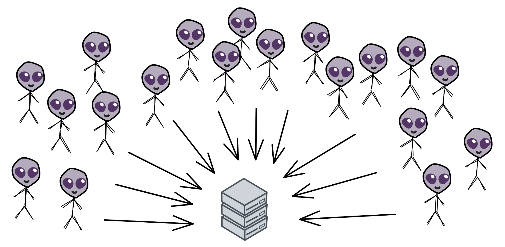
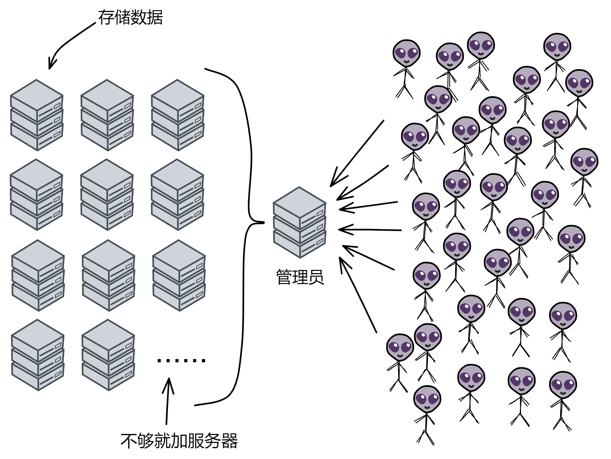
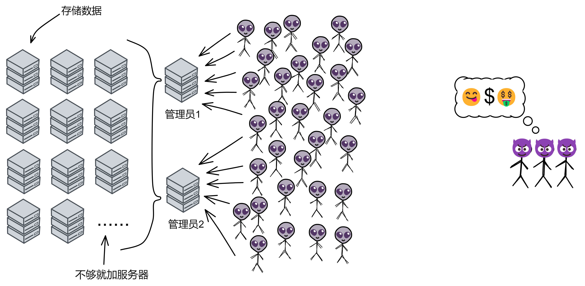

# What is the Blockchain?

What is blockchain?

Blockchain is a decentralized distributed system formed through cryptography.

Wait, what does decentralized mean?

Don't worry, let me explain it one step at a time.

 

 

Suppose a few neutron star beings want to establish an online banking system called "Neutron Star Bank." They purchase a server to handle all requests. The balance and transaction information for all users are stored on this single server. Thus, Neutron Star Bank begins its operations.

As online payments become increasingly popular, the number of users and use cases continue to grow, leading to exponential growth in transaction data.

The capabilities of a single server are continuously challenged, and it starts to struggle: 

On one hand, storage capacity is insufficient to meet the massive storage demands of transaction data; on the other hand, during shopping frenzies like Double 11 and 618, system access volume surges, CPU loads continue to climb, and overload situations occur frequently. Even more severe, server failures sometimes occur, resulting in the entire system becoming paralyzed and transaction data being lost.

 

The growth in business is putting a heavy strain on the system, and to prevent system paralysis, the neutron star beings decide to scale and optimize the system:

They purchase one server to act as an "administrator" and several additional servers dedicated to data storage. When the administrator server receives transaction data, it forwards it to the servers responsible for data storage. Once one server is full, the data is stored in another server.

If the administrator becomes overwhelmed, more administrator servers can be added. In this way, the system is finally expanded.

However, at this point, a group of hackers set their sights on Neutron Star Bank. After all, money is just a string of numbers, and by secretly infiltrating the bank's database to modify account balances and transaction records, they could achieve financial freedom.

Initially, the bank's system lacked proper protection measures, making it vulnerable to attacks.

After paying a heavy price, the bank realized the severity of the issue and began implementing a series of measures to protect their system: first, they purchased several servers for data backup, backing up data every 3 hours. Then, they deployed an independent sentinel monitoring system on the network, dedicated to protecting the system's security.

 

With these security forces in place, the system's safety was greatly enhanced, and hackers could no longer use their previous attack methods.

 

Since all of the servers were located within Neutron Star Bank's building, the hackers thought: if they couldn't break into the system, they might as well physically attack it 😎. They planned to borrow a large sum of money from the bank, then destroy the bank's servers. Alas, the servers would be dead, and there would be no evidence left.

Fortunately, the security at the bank's entrance was not to be trifled with; who would bring a bomb to a bank? The security intercepted the bomb, successfully preventing the hackers from physically destroying the servers.

 

This incident frightened the bank, as it became apparent that having the servers in the bank building was not safe. What should they do?

They needed to come up with a foolproof plan to ensure the security of the servers.

 

So, Neutron Star Bank decided to establish a dedicated data center and independently protect all network devices, such as routers, switches, and interfaces.

The requirements for building the data center were very strict: it could not be near railways, highways, airports, chemical plants, landfills, nuclear power stations, munitions factories, gas stations, or any other facilities posing safety risks. It also couldn't be located in flood-prone or earthquake-prone areas, nor could it be in areas with high crime rates. Despite these precautions, the bank still feared sudden natural disasters, so they built the data center with flood protection and 8-level earthquake resistance.

In addition to finding a suitable location, the data center had to meet many strict construction standards, including building materials, internal heating, ventilation, and air conditioning systems, lighting systems, fire suppression systems, lightning protection measures, and constant temperature and humidity control, among others.

 

If the hackers managed to cut off the power supply to the data center, the entire system would be paralyzed, and even the most secure equipment wouldn't function without electricity.

To address this concern, two power plants were set up near the data center to provide electricity simultaneously. Each power plant could meet the data center's entire power demand, with a backup power supply in case both power plants experienced outages. Each power plant was equipped with an independent power distribution room.

No, it's still not reassuring enough. What if, after a city-wide power grid interruption, both power plants experience accidents and can't generate electricity?

No worries, the data center is also equipped with a UPS room. This room houses a multitude of batteries that can support the data center's full-load operation for over 15 minutes.

 

Even if hackers cut off the power supply to the data center, it can still maintain operation for a period through the UPS uninterrupted power supply.

Can power be restored within 15 minutes? There's no rush. That's because the data center is also equipped with generators and fuel storage tanks, capable of supporting full-load operation for more than 12 hours.

Additionally, the bank has signed agreements with at least two nearby gas stations to ensure diesel supply within 4 hours. Though relying on fuel delivery is not a long-term solution, it's more than enough to support operations for a week.

 

What if the fuel storage tanks catch fire, as they're full of oil?

The data center's fire detection system consists of a temperature sensing system, a video system, and on-duty personnel keeping watch. Upon detecting a fire, the fire suppression system extracts a portion of gas and then releases heptafluoropropane. This substance is colorless and odorless, killing stealthily and invisibly — wait, no, it's actually colorless, odorless, low-toxicity, non-conductive, non-polluting, and non-corrosive.

 

Won't people inside be suffocated?

When the data center's fire suppression system is activated, alarm bells ring, and the access control system automatically cuts off power, allowing personnel to evacuate the affected area. Even if they cannot leave in time, the data center is equipped with a sufficient number of oxygen masks.

 

However, no matter how many safety measures are taken, a single data center cannot guarantee the system's absolute security.

During the 9/11 attacks in 2001, Morgan Stanley's data center in the World Trade Center was completely destroyed. However, thanks to a mature disaster recovery system, all business operations were restored the next day. Despite the total destruction of their 25-story office space in the World Trade Center and the emergency evacuation of over 3,000 employees, a secondary office was established within half an hour at the disaster recovery center, and all business operations resumed the following day. Conversely, some companies had to file for bankruptcy due to inadequate backup disaster recovery systems.

 

You see, having another data center would be beneficial in such situations.

This is what's known as a "dual-active data center," where two data centers operate simultaneously. If one is destroyed, the other continues to function, leaving the system virtually unaffected.

What if, by chance, an asteroid strikes the very area where the data center is located? Wouldn't everything be wiped out in one fell swoop?

No worries, there's a remote disaster recovery data center. If both primary data centers fail, operations can be switched to the remote disaster recovery center, which has the same configuration and is ultra-secure.

 

What if the remote disaster recovery data center is also destroyed?

At that point, the system would truly be down, but the data would still be safe. That's because there's a cold backup in place, which doesn't run within the system but operates independently. The backup system performs incremental backups every 2 hours and is housed in several other cities.

 

Have you noticed? After all these preparations, the ultimate goal is singular: to ensure the smooth operation of the system and maximize its reliability as much as possible.

 
