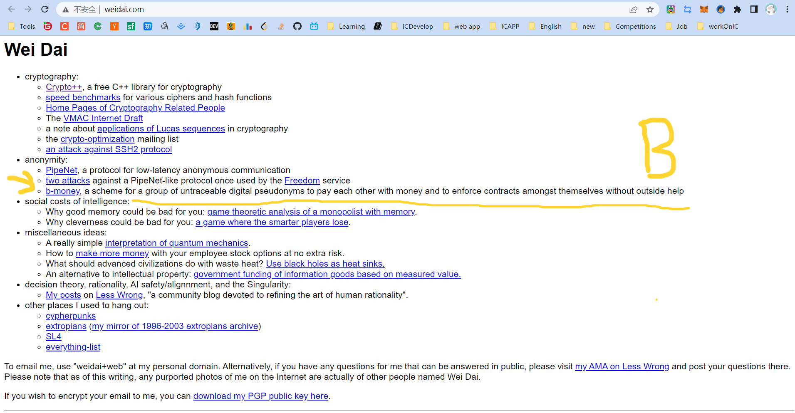
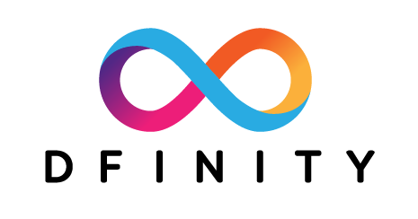
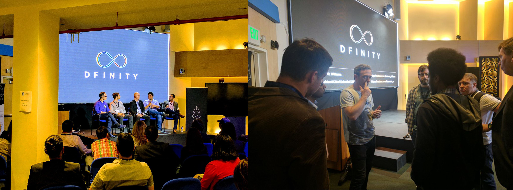
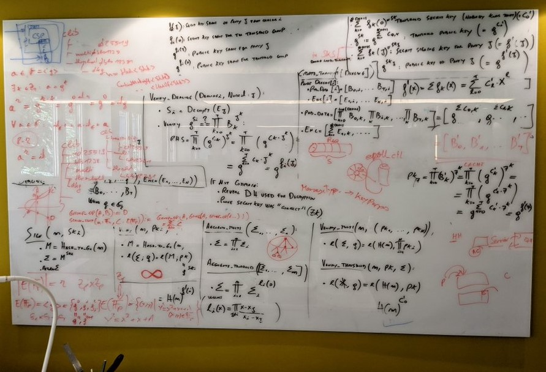
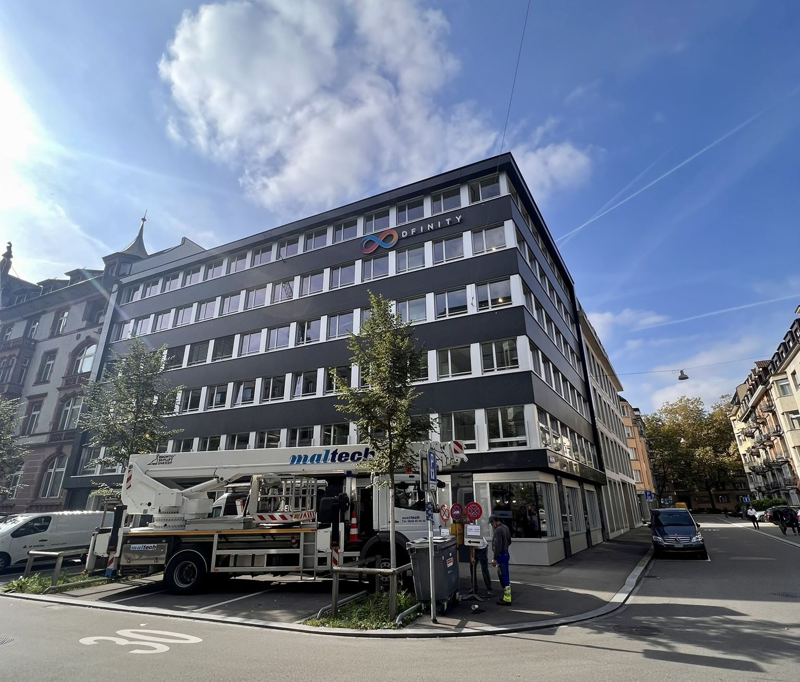
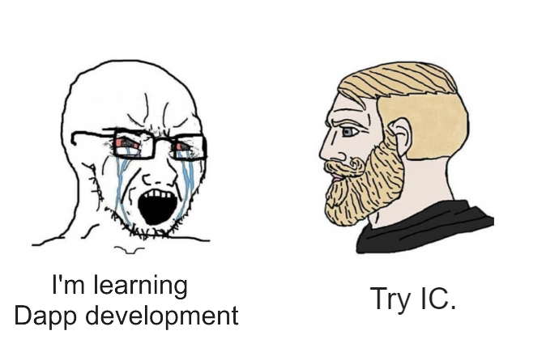

# Journey of the Dream Weaver

In every geek's heart lies a dream of decentralization. 

This is a story about Dominic Williams.

 

## JAHEBIL😎

He liked to call himself "JAHEBIL", which stands for "Just Another Hacker Entrepreneur Based in London".

He wrote code, started businesses, and worked as a "dream maker" in London.

He was brave and optimistic, living secludedly, was not interested in socializing, and was only concerned about the brand of his company, living a repetitive and focused life. Even working 18 hours per day in an unfriendly entrepreneurial environment in the UK, he could still hum the happiest tunes.

 

Compared to Silicon Valley, the UK's entrepreneurial environment was like a living hell. The success of numerous companies in Silicon Valley led to even greater investments, which attracted top entrepreneurs from around the world to the area, either to reach the pinnacle of success or fail. Unlike Silicon Valley's talented pool, in the UK, every company that Dominic founded could only produce limited returns, then he would start another company, getting caught in a vicious cycle of working hard, making dreams, maintaining dreams, and making new dreams... He had to sharpen his skills to improve technically while ensuring the company remained profitable.

 

Tired of the cyclical life that was only draining his enthusiasm, the seed of hope ground at Dominic's heart. In 2010, as a dream maker, he decided to take chances!

Fight My Monster was a massively multiplayer online game and a children's social network. He planned to connect children from all over the world to play this game online. Players have their own monsters and use different skills to attack each other in a turn-based battle. At that time, on the other side of the earth, China was also going crazy for "Roco Kingdom" developed by Tencent.

 

After comparing HBase, Cassandra, and other databases, Dominic chose the early Cassandra beta, the first horizontally scalable distributed database. Dominic built various tools for Cassandra, including the first system that ran atomic transactions on scalable eventually consistent storage. They were the first team in the world to attempt to use a complex Cassandra system in a production environment.

Dominic wanted to connect millions of users worldwide through a distributed system, which was a significant innovation at the time. After several test runs, the game was officially launched on New Year's Day in 2011, and in just two weeks, it gained 30,000 users, skyrocketing to 300,000 users in just a few months.

    

The team achieved remarkable success in scaling up their business despite having a meager budget. However, they had overlooked one crucial factor - the development of a large-scale online game required an army of specialists, including Flash developers, database administrators, network engineers, payment system experts, operations and maintenance personnel, complexity analysts, cartoon artists, sound engineers, music composers, animation experts, advertising gurus, and more.

This massive expenditure surpassed any budget they had previously allocated to their entrepreneurial projects. In due course, Dominic and his friends exhausted their investment and were forced to seek additional funding. Day and night's overnight work resulted in an almost perfect growth chart, "so raising funds shouldn't be too difficult".

 

Dominic introduced the project to investors, saying, "Fight My Monster is growing rapidly and will soon exceed one million users. We believe that engineers live in an exciting era, and the Internet infrastructure is already mature. Many things can suddenly be achieved in new ways. This company was initially self-sufficient on a very limited budget. You may have heard that Fight My Monster is expanding, and now many excellent engineers have the opportunity to join us".

"Let me explain our architecture plan and why we did it this way. As you can see, it is not a traditional architecture. We chose a simple but scalable three-tier architecture, which we host in the cloud. I hope this system works..." Dominic continued passionately.

"Since you already have so many users, maybe you should try to get more of them to pay. This will not only prove your ability to make money but also get our investment." The other party frowned, clearly reluctant to invest. Faced with such a crazy user growth, London investors even suspected Dominic of fabricating data.

 

Now, Dominic's heart was shattered like a biscuit. He had underestimated the difficulty of financing.

Soon, the pieces turned to crumbs. At this point, competitors had already secured funding from other investment firms and prevented other investment firms from investing in Fight My Monster.

Was it because they weren't working hard enough?

Since Cassandra was also in early development, at the end of 2011, due to bugs in Cassandra beta code, Fight My Monster's user data was almost lost. It took several days and nights of work from Cassandra senior engineers and Dominic's team to save the data, ultimately resolving this horrific incident.

 

Dominic was in a constant flurry of activity. 

He raced between his home and the company like a wound-up toy car: just after fixing a bug, he was off to meet with investors without even testing it first; he barely had time to eat, his head buried in meetings with engineers to discuss system adjustments; as soon as he left the company, he was off to the supermarket to buy Christmas gifts for his wife...

The team relied heavily on him, and his workload became overwhelmingly heavy - a rare sight even in the startup capital of Silicon Valley. Dominic worked 12 to 18 hours every day, a work pattern that is almost unheard of in today's startup world. He juggled business management, system administration, and coding, all while trying to maintain a personal life. In no time, his wife became accustomed to this lifestyle: during the day, she directed and planned games, perfecting game play and project processes, and at night, she cooked and cleaned the house, all in seamless cooperation with Dominic.

 

Dominic's photos.

Dominic became even more hardworking after that. Fortunately, he happened to meet a company willing to invest in him in Silicon Valley. Finally, an investor was moved by this dreamer in front of them. Within a few weeks of raising funds, Fight My Monster's user count quickly reached 1 million. A few months later, Dominic relocated the company to San Mateo (a small town near San Francisco). 

He went downstairs to have coffee and when he came back, his memo was filled with common problems and solutions for ConcurrentHashMap, he listened to geeks talking about how to build a team for a startup, and he made connections with venture capitalists in Silicon Valley. 

 

After a year of development, Dominic was very excited in 2012: 

"Fight My Monster appeared on TechCrunch today, worth a big cheer, thank you!!! We are working hard and hope we can achieve our dreams."

"If you haven't played Fight My Monster yet, I suggest you give it a try - there really is nothing better online. We are incubating in the UK, and the best time to experience the site is weekdays (after school) from 4 pm to 8 pm or weekends during the day."

 

However, setbacks soon followed. After raising funds, the company's newly hired financial executive disagreed with the original team on strategy, and the disagreement escalated into a fatal decision-making mistake. Although the user base continued to grow, Fight My Monster was facing insurmountable obstacles. 

From a financial return perspective, Fight My Monster was a failure, with the user base only expanding to over 3 million in 2013. 

However, this experience was very valuable, and the most precious part was finding a group of capable colleagues who were also obsessed with the distributed system that Dominic loved. Dominic admired Fight My Monster's designer Jon Ball, who was always able to create a bunch of beautiful models using the team's design system, and later set the record for the highest ad viewing rate. There was also Aaron Morton, the Cassandra engineer who said "We work together, believe each other", who worked with Dominic to build the "engine" behind the game - a distributed database. 

    

In hindsight, Dominic's Flash game was no longer popular as people were gradually shifting towards mobile games and tablets. In 2010, Steve Jobs announced that Apple would no longer support Flash on its devices due to its impact on device performance. Additionally, due to frequent security vulnerabilities, BBC published an article titled "How much longer can Flash survive?" Shortly after, Adobe announced that it was abandoning the Flash project and switching to Animate for professional animation.

Reflecting on his experience, Dominic said, "We could have succeeded but needed to move faster: if I had my time again, I would have relocated to The Valley very soon after the company started growing to raise money faster and gain access to a bigger pool of experienced gaming executives".

 

## Engineers turned entrepreneurs, entrepreneurs turned engineers

Although the gaming industry was withering away, in Silicon Valley, a strange yet formidable force captured Dominic's attention, causing ripples to emerge in his mind's stagnant pool of inspiration. These ripples quickly transformed into rolling waves, propelling him towards a new frontier.

Rewinding back to 1998, Dominic was developing an online storage system for a London-based startup and utilizing [Wei Dai](http://www.weidai.com/)'s [Crypto++](http://www.weidai.com) library extensively. While browsing Wei Dai's website, Dominic stumbled upon an article about "b-money", one of the early precursors to Bitcoin.

Little did Dominic know that this article from 1998 would ignite the spark for Bitcoin and connect the timeline of his cryptography career for the next decade.

    

After leaving Fight My Monster in 2013, Dominic became obsessed with Bitcoin, a long-dormant interest that had been sparked by the "b-money" article he had stumbled upon back in 1998. 

    

Wei Dai wrote in [b-money](http://www.weidai.com/bmoney.txt): 

"I am fascinated by Tim May's crypto-anarchy. Unlike the typical understanding of 'anarchy', in a crypto-anarchy the government is not temporarily destroyed but permanently forbidden and unnecessary. It's a community where the threat of violence is impotent because violence is impossible, and violence is impossible because its participants cannot be linked to their true names or physical locations through cryptography". 

Click [here](ThingsaboutCryptoPunks.md) to see more about Crypto Punks.

 

B-money outlined a protocol for providing currency exchange and contract execution services in an anonymous community. Wei Dai first introduced a less practical protocol as a prelude because it required a synchronous, interference-free anonymous broadcast channel. He then proposed a practical protocol. In all schemes, Wei Dai assumed the existence of an untraceable network where senders and receivers could only be identified by digital pseudonyms (i.e., public keys), and each message was signed by the sender and encrypted for the receiver. 

Wei Dai described in detail how to create currency, how to send it, how to prevent double-spending, how to broadcast transaction information, and how to achieve consensus among servers. 

We cannot determine the relationship between Wei Dai's b-money and Bitcoin or whether he was inspired by "The Sovereign Individual" to design a scheme. However, Wei Dai's website shows that it was last updated on January 10, 2021. 

    

 

Dominic said, "I love algorithms and distributed computing, and I won many awards in this field during university. More importantly, I had never encountered a technical field that combined the thinking of finance, law, politics, economics, and philosophy, while also having the potential to drive significant change in the world. For me, this emerging field was a dream come true. I made a bigger life decision to re-enter this field with my career".

 

In 2013, Dominic started trading cryptocurrencies full-time, while picking up some basics about consensus algorithms on the side 🤣😉. He was interested in designing faster consensus mechanisms to work in conjunction with proof-of-stake (PoS) architectures.

Here is Dominic's "Bitcoin ATM kiss" in 2014.

    

 

On February 7th, Mt. Gox, the world's largest Bitcoin exchange, announced its bankruptcy. Dominic took to Twitter to express his distress at the beloved Bitcoin's plummeting value.

Bitcoin crashed to 666 USD. (It's currently priced at 23,000 USD, down from its peak of 69,000 USD.)

    

He buckled down, diving deep into traditional Byzantine fault tolerance, combined with his previous experience building online games. Dominic conceived a decentralized network that could horizontally scale like Cassandra - allowing more and more servers to join while maintaining high performance. In just a few days, Dominic published a [paper](https://drive.google.com/file/d/1agn88cO5ED1phN2vVx_Tj-jWmrfJ8Hmo/view?usp=sharing) describing a scalable cryptocurrency called Pebble. The paper quietly circulated in the small crypto circles, the first to describe a decentralized sharded system. In this system, each shard uses an asynchronous Byzantine consensus algorithm to reach agreement.

 

While learning, Dominic didn't forget to trade Bitcoin. Investing in Bitcoin brought him some peace of mind, and now he could focus on designing consensus algorithms without having to work day and night or in a frenzy.

    

 

Later Dominic fused the early Ethereum ethos, like an intricate tapestry. Inspired by Ethereum, after Dominic heard of the concept of the "World Computer", it became his ultimate goal - he thought perhaps this was what the future internet would look like.

He realized smart contracts were actually a brand new, extremely advanced form of software. He saw that if the limitations of performance and scalability could be broken through, then undoubtedly almost everything would eventually be rebuilt on blockchains. Because smart contracts run on open public networks, superior to private infrastructure, they are inherently tamper-proof, unstoppable, can interconnect on one network, making each contract simultaneously part of multiple systems, providing extraordinary network effects, and can operate autonomously, inheriting blockchain properties, and so on.

Most of the details have faded over time into the mists of history - although not much time has passed, in the rapidly changing evolution of blockchain, this period seems to have already spanned the peaks and valleys of an entire lifetime.

 

Dominic's research focuses on protocols and cryptography, which are like dry kindling that reignites the dreamer's inner spark. Dominic believes that these protocols and cryptographic algorithms can change the world. He took the "D" for decentralized and the "finity" for infinity and combined them to create "DFINITY". DFINITY aims to create a decentralized application platform with infinite scalability.

After returning to Mountain View, California from China, Dominic tweeted, "China Loves Blockchain :)". 

    

Like Ethereum, Dominic also received investment in China. The reason is simple. Silicon Valley invested in Bitcoin very early and gained huge returns, so they don't care much about "altcoins" (the secular view is that coins other than Bitcoin are "altcoins", which are basically coins that are slightly improved versions of Bitcoin).

 

Next, I need to introduce what the DFINITY team is doing in detail.

 

## Point. Line. Surface. Solid!

We know that Bitcoin is the pioneer of blockchain. Bitcoin itself emerged slowly in the long-term pursuit of decentralized currency projects by cypherpunks. Click [here](WhatistheBlockchain.md) to see more about Blockchain.

It created an open ledger system: people from all over the world can join or leave at any time, rely on consensus algorithms to keep everyone's data consistent, and create a co-creation, co-construction, and shared decentralized network. People just need to download the Bitcoin software (downloading the source code and compiling it is also possible), and then start running it on their own machines to join the Bitcoin network. Bitcoin will enable computers around the world to reach a consensus and jointly record every transaction. With everyone's record, the legendary feature of "immutability" in blockchain is achieved, which is actually a matter of majority rule and not being able to cheat everyone.

 

In the traditional network architecture, user data is indiscriminately stuffed into servers. Users cannot truly control their own data, and whoever controls the server has the final say. If we can view this one-to-many relationship as "**points**" scattered around the world, the user's data flows into each point tirelessly.

    

So the Bitcoin network can be seen as a "**line**", it connects isolated points into a line, making the internet more fair and open. What Bitcoin does is to combine computers from all over the world to form a huge "**world ledger**". So what if you want to record something else? Just imitate Bitcoin and create a new one!

Six years after the birth of Bitcoin, a "**surface**" that can deploy software on a decentralized network gradually emerged, called [Ethereum](WhatisEthereum.md). Ethereum is not a replica of Bitcoin's world ledger. Ethereum has created a shared and universal virtual "**world computer**", with Ethereum's virtual machine running on everyone's computer. Like the Bitcoin ledger, it is tamper-proof and cannot be modified. Everyone can write software and deploy it on the virtual machine, as long as they pay a bit of ether to the miners. (There are no miners anymore, but that's another article 😋)

    

Deployed software on the blockchain becomes an automated vending machine, permanently stored within a distributed and decentralized network that fairly and justly evaluates each transaction to determine if conditions are met. With the blockchain's immutable storage capabilities, the phrase "code is law" is coined. Here, software is referred to by another name: "smart contracts". 

However, ahem, interrupting for a moment. The idea is beautiful, but reality can be cruel. In the early Ethereum community, there was indeed a desire to create a "world computer," establishing a decentralized infrastructure distributed worldwide. But Ethereum's architecture has certain limitations, including lower transaction execution performance, high gas fees due to rising ETH prices, poor scalability, and the inability to store large amounts of data, among other issues. 

 

Dominic eagerly hoped his research could be put to use by the Ethereum project. His motivation was not for money, but a long-held passion for distributed computing, now sublimated into boundless aspirations for blockchain, making it hard for him to imagine anything that could eclipse the excitement and determination before him. He soon became a familiar face in Ethereum circles, often discussing at various conferences the possibilities of applying new cryptography and distributed computing protocols in next-generation blockchains.

The solution to this problem can take two approaches. The first is to improve the existing architecture, such as transitioning Ethereum's consensus from PoW to PoS (Casper), building shard chains, or creating sidechains. The other approach is to start over and design a new architecture that can handle information processing and large-scale data storage at high speeds. 

Should they keep improving, scaling and retrofitting Ethereum's old architecture, or start from scratch to design a real "World Computer"?

At the time, people were interested in his ideas, but the inertia was that his concepts were too complex and distant, requiring too much time to realize and fraught with difficulties. Even though Ethereum did not adopt Dominic's ideas later, he was still grateful to early Ethereum members like Vitalik and Joe Lubin for patiently listening to his ideas in many early discussions.

Finally, Dominic made the difficult decision to start from scratch and design a real "World Computer".

 

When we try to solve a specific problem, we often find that the key is to create powerful "tools". With a more advanced and practical tool, and continuously maintain and improve it, it gradually becomes a more powerful tool to solve many valuable problems. A common business phenomenon is that in order to realize a product or service, a tool is developed, and then it is found that this tool has wider applicability, and then the tool itself evolves into a larger, more successful and higher-valued product.

Amazon's cloud services were originally designed to solve the problem of waste of computing resources after Black Friday. Later, it became the world's earliest and largest cloud service provider. Similarly, SpaceX solved the problem of high rocket launch costs. In order to thoroughly solve the scalability problem, Dominic decided to redesign the consensus algorithm and architecture.

The opportunity finally arrived in November 2015, in London.

Dominic presented the consensus algorithm he had been studying at devcon one.

    

Now we can see from Dominic's presentation at devcon one in 2015 that he described the IC as Ethereum 3.0. In fact, it wouldn't be too much to call it Blockchain 3.0. If Bitcoin and Ethereum are called "Blockchain 1.0" and "Blockchain 2.0", he wanted to create a "**solid**", a true world computer, even naming the project the Internet Computer (IC for short). Based on the "face" to support large-scale applications, it can horizontally expand and achieve unlimited scalability as a "**world computer**". 

    

Oops, sorry, it should be this one:

    

During the conversation, Dominic discovered that even the staunchest Bitcoin supporters were very interested in the concept of Ethereum. This reinforced his belief in the potential of Trusted Computing.

Dominic had an even grander vision than Ethereum. He wanted to create a public network of servers that would provide a "decentralized cloud" - a trusted computing platform. Software would be deployed and run on this decentralized cloud.

    

Dominic is working on reshaping a completely decentralized infrastructure, which can also be understood as the next generation of internet infrastructure or as a decentralized trusted computing platform combined with blockchain😉.

 

Simply put:

Traditional defense systems: mainly composed of firewalls, intrusion detection, virus prevention, etc. The principle of traditional network security is passive defense, often "treatment after the event". For example, when an application has a virus, it is necessary to use anti-virus software to detect and kill it. At this time, the enterprise has already incurred losses to some extent.

Trusted computing: based on cryptographic computation and protection, combined with secure technology to ensure full traceability and monitoring. The principle of trusted computing is active defense. Since the entire chain from application, operating system to hardware must be verified, the probability of virus and network attacks is greatly reduced.

 

Blockchain has something called a consensus algorithm, which is responsible for coordinating the nodes in the network (a node is a group of servers, which can be understood as a high-performance computer). The consensus algorithm can ensure that everyone's information in the network is in agreement, because this is a network that anyone can join or leave at any time, and it is not known which node might intentionally disrupt it (you can refer to my future blog post about the Byzantine Generals problem). With the consensus algorithm, even if one-third of the nodes in the network are malicious, the other nodes can still reach a consensus normally (the resistance of different consensus algorithms varies).

    

Decentralized platforms not only involve token transfers between parties, but also rely on consensus algorithms to establish a barrier and keep malicious actors at bay. However, efficiency and decentralization are difficult to achieve simultaneously, and it's challenging to create a fully decentralized system that can both protect nodes and allow for coordination and data synchronization among them. Dominic's goal is to merge trusted computing and blockchain to create a limitless, open, high-performance, strongly consistent, scalable, and data-intensive blockchain network composed of servers from all over the world, without the need for firewalls.

For Dominic, the future of blockchain is the future of the internet, and vice versa. The internet is no longer just about connecting servers in data centers to users, but first forming a trusted and secure blockchain network composed of servers from around the world, and then deploying apps and serving users on top of it. Dominic hopes that banking and finance, the sharing economy (such as Uber), social networks, email, and even web searches can all be transferred to such a network.

 

In retrospect, Ethereum made the right call not adopting Dominic's ideas back then. Because while focused on proof-of-work (PoW), Ethereum was also exploring upgrade paths to proof-of-stake (PoS). The blueprint he outlined was too ambitious to realize in a limited timeframe. To achieve his vision would have required an enormous, stellar team relentlessly researching, inventing new cryptographic techniques, and more.

In the fall of 2016, Dominic announced his return as a "decentralized adventurer". With the theoretical framework in place, the adventure of a dreamer has officially begun!

 

## DFINITY !

IC re-designed the blockchain architecture and developed more efficient consensus, along with innovative cryptographic combinations, in order to achieve the idea of a "world computer". The goal is to solve the limitations of speed, efficiency, and scalability in traditional blockchain architectures. 

 

Dominic is busy researching with the technical team on his left hand, writing strategic plans for the team on his right hand, and going to various blockchain forums to introduce the project with his mouth. 

    

Over the years, Dominic has shared many critical cryptographic technologies with other blockchain teams, such as the application of VRF, which has been adopted by many well-known projects (such as Chainlink, etc.).

In February 2017, Dominic participated in a roundtable forum with Vitalik Buterin and many other experts. From left to right: Vitalik Buterin (left one), Dominic (left two), Timo Hanke (right one).

    

 

Ben Lynn (second from left in the red T-shirt) is demonstrating a mind-blowing technology called Threshold Relay, which can significantly improve the performance of blockchain and quickly generate blocks. 

    

By the way, engineer Timo Hanke (third from left in the middle) was a mathematics and cryptography professor at RWTH Aachen University in Germany before he created AsicBoost in 2013, which increased the efficiency of Bitcoin mining by 20-30% and is now a standard for large-scale mining operations.

Ben Lynn is one of the creators of the BLS signature algorithm, and the "L" in BLS stands for the "L" in his name. After graduating from Stanford with a Ph.D., he worked at Google for 10 years before joining DFINITY in May 2017. If you haven't heard of the BLS algorithm, you must have read Ben Lynn's "Git Magic," which was all the rage on the internet a few years ago.

    

 

 

2021 was not an ordinary year. 

May 10th. The IC mainnet was launched. 

    

The chart above shows a comparison of performance, storage data costs, and energy consumption against other blockchains.

 

When the IC mainnet went live, there were already over 4,000 active developers. The chart below shows the growth of developers compared to other blockchains. 

    

 

 

IC has many innovations, such as unlimited horizontal scalability. Through Chain Key, IC network has the ability to infinitely expand. The network is managed by a DAO - the **Network Nervous System (NNS)**. So this requires an **unusual consensus algorithm**. IC's consensus only **orders messages so that replicas execute messages in the same order. Relying on the BLS threshold signature algorithm and non-interactive distributed key generation (DKG) to randomly select who produces blocks, the consensus speed is very fast.** **This also gives IC higher TPS**, millisecond level queries and second level data updates. The experience of using Dapps is much smoother than other public chains.

IC's goal is decentralized cloud services. In order to deploy **Full Dapps on chain**, all Dapps are installed in a virtualized container. "Canister" on IC is equivalent to smart contracts on Ethereum. Canisters can store data and deploy code. Developers can also test through the **Candid UI** automatically generated by the backend virtual container without writing a line of code. Clients can directly access the frontend pages and smart contracts deployed on IC through https. The virtual containers are like small servers, providing each Dapp with its own on-chain storage space. They can also support smart contracts directly calling external https servers without an oracle. This is the first time in the history of blockchain that smart contracts can communicate directly with **external https servers**. After further processing the messages, the smart contracts can respond. Like Ethereum and Bitcoin, IC also accepts the paradigm of "code is law". This also means that there is no governance to regulate the use of the platform or the underlying network itself. IC's "smart contracts" Canisters are not immutable. They can store data and update code.

    

 

Historically, for the first time, Bitcoin and Ethereum are directly integrated at the bottom layer through cryptography (not cross-chain bridges): IC is directly integrated with Bitcoin at the protocol level. The Canisters on IC can directly receive, hold and send Bitcoin on the Bitcoin network. In other words, Canisters can hold Bitcoin like a user's wallet. Canisters can securely hold and use ECDSA keys through the Threshold ECDSA Chain Key signing protocol. It is equivalent to giving Bitcoin smart contract functionality!

The whiteboard of the Zurich office's computing Bitcoin integration.

    

Since the data is on the chain, the **Gas fee has to be very low** so people will use it: 1 G for 1 year is $5! Low Gas alone is not enough. In order for users to use Dapps without barriers, IC uses a **reverse Gas fee model** where the Gas is paid by the development team. The DFINITY team also pegged Gas to SDR, turning it into **stable Gas** that does not fluctuate with the coin price. IC has a unified decentralized anonymous identity: **Internet Identity (ii)** as the login for Dapps and joins the network neural system to participate in governance...

The IC architecture and consensus are also unique. In theory, IC has unlimited computation and storage - just keep adding server nodes. The improved consensus is a bit like practical Byzantine fault tolerance, yet more complex, because it's quite different from existing consensuses. Dominic gave it the name "PoUW" consensus, for [Proof of Useful Work](../2.CoreProtocol/IntroductiontoConsensusLayer.md). BLS threshold signatures with VRF produce truly unpredictable random numbers, and everyone can verify the randomness is not forged. Sybil attack-resistant edge nodes, hierarchical architecture, randomly assigned block production - no need to elaborate, just one word: exquisite.

 

According to statistics from GitHub and Electric Capital (2023), IC has the most active developer community and is still growing rapidly.

    

 

The photo on the office wall when IC was about to reach 30 million blocks after three weeks of mainnet launch. 

    

 

In July 2021, many new DFINITY members interviewed and joined the team via video conferencing during the COVID-19 pandemic without meeting in person. On this day, a small group of people came to the office located in Zurich to meet face-to-face. 

    

 

Dominic has written two visions for DFINITY in his blog: 

On the one hand, many traditional monopolistic technology intermediaries, such as Uber, eBay, social networks, instant messaging, and even search engines, may be redesigned as "open-source enterprises," using proprietary software and their own decentralized governance systems to update themselves. 

On the other hand, we hope to see large-scale redesign of enterprise IT systems to take advantage of the special properties offered by blockchain computers and dramatically reduce costs. The last point is not obvious, as computing on blockchain computers is much more expensive than traditional cloud computing such as Amazon Web Services. However, significant cost savings are possible because the vast majority of costs involved in running enterprise IT systems come from supporting human capital, not computing itself, and IC will make it possible to create systems with much less human capital involvement. 

 

Image from Shanghai, October 2021. 

    

 

On July 14, 2022, at a street café in Zurich, Dominic and his team were waiting for the 1,000,000,000th block of IC to be mined, while checking the real-time statistics of IC data on the [dashboard](https://dashboard.internetcomputer.org/). 

    

 

DFINITY's new office building is located in Switzerland. 

    

 

When leaving the office, Dominic took some photos of murals on the cafeteria wall that were created by talented IC NFT artists. 

    

Dominic moved into his new house, and shared the good news on Twitter while enjoying a piece of cake. 

    

After work, one must not neglect their musical pursuits. 

    

 

After talking for so long, what problems does IC actually solve? In general, it solves the problems that traditional blockchains have low TPS, poor scalability, and Dapps still rely on some centralized services.

Bitcoin is a decentralized ledger.

Ethereum created a decentralized computer.

Cosmos and Polkadot implemented the composability and scalability of blockchains.

The Internet Computer is building a highly scalable, ultra-high TPS decentralized cloud service.

The key to scalability is near-zero marginal cost. Polkadot's scalability is built on software engineers' development, while IC's scalability is automatically completed at the lower level. This greatly reduces the development cost of application teams on IC.

To build a highly scalable and high-performance public chain:

- First, scalability and performance must be valued in the planning stage, and the design and layout in all aspects are aimed at achieving scalability and TPS as soon as possible.

- Second, confidence and strength are needed to stick to their own path until the day the ecosystem explodes. In the short term, we need to endure the suppression of other competitors, withstand the pressure of cash flow for a long time, and ignore the incomprehension of the world.

Focus on the research and development of underlying infrastructure until various creative applications appear and increase the number of participants in the ecosystem. The increase in quantity leads to the further emergence of new ideas and applications. This forms a positive feedback loop, making the ecosystem spontaneously more prosperous and more complex:

Scalability / Zero marginal cost / Open system → Increase in number of applications → Exponential increase in various connections → Valuable ideas emerge → Form applications → System complexity → Quantity continues to increase exponentially → Positive feedback loop → Ecosystem prosperity.

    

All technological development options have advantages and disadvantages. Judging who will eventually win based on the partial and one-sided technological advantages and disadvantages is naive and dangerous. The ultimate winner on the blockchain will be the one with the richest ecosystem, the largest number of developers, software applications, and end users.

The key words for the future of blockchain are: zero latency, zero marginal cost, open ecosystem, huge network effects, extremely low unit cost, and an extremely complex and rich ecosystem.

The huge changes in industries brought about by technological revolutions are sudden for most ordinary people. But behind this suddenness are years, even decades, of gradual evolution.

Once a few critical parameters affecting the industrial pattern cross the critical point, the ecosystem enters a period of great prosperity, and changes are extremely rapid. The profound impact on most people is completely unexpected. After the change ends, the industry enters a new long-term balance. For some time, almost no competitors can catch up with the leaders in the industry.

    

After 2 years of development, the IC ecosystem has emerged with many excellent applications. The front end and back end are all on-chain, and Dapps that do not rely on centralized services at all.

In the social Dapp (SocialFi) field, there are [DSCVR](https://h5aet-waaaa-aaaab-qaamq-cai.icp0.io/), [Distrikt](https://az5sd-cqaaa-aaaae-aaarq-cai.ic0.app/), [Mora](https://mora.app/), [Openchat](https://oc.app/), etc. DSCVR is an end-to-end decentralized Web3 social media platform. Distrikt is a Web3 microblogging platform that allows everyone to share content or participate in discussions in a decentralized network. Mora can deploy a smart contract for each user to store the user's blog data. Mora allows users to publish blogs on the blockchain and permanently store their own data. [Here](https://mora.app/planet/fohs7-baaaa-aaaan-qdcga-cai/7RCY77KRAC4NX8AQ98T2RGGJZB) is more about Mora. Openchat provides decentralized instant messaging services and is a decentralized chat Dapp.

In the decentralized finance (DeFi) field, the IC ecosystem also has some very good Dapps: [ICLightHouse](https://avjzx-pyaaa-aaaaj-aadmq-cai.raw.ic0.app/ICDex), [InfinitySwap](https://app.infinityswap.one/swap) and [ICPSwap](https://app.icpswap.com/). 2022 was a year of collapse of trust in centralized institutions. 3AC, Celsius, Voyager Digital, BlockFi, Babel Finance, FTX and other leading hedge funds, lending platforms and exchanges were defeated and went bankrupt this year. Not only that, DCG grayscale, Binance and Huobi and other giants also suffered varying degrees of [FUD](../Glossary.html#fud). Centralized institutions cannot achieve complete transparency. Their trust depends on the reputation of the founders and the external image of the company's brand. Decentralization is based on "code is law" and "Don't trust, verify!". Without breaking, there is no standing. Under this revolutionary idea, the myth of centralization has been completely shattered, paving the way for a decentralized future. Decentralized financial services allow users to borrow, trade and manage assets without intermediaries, enhancing the transparency and accessibility of the financial system.

[AstroX ME](https://astrox.me/) wallet is a highly anticipated wallet app. The ME wallet can securely and reliably store and manage digital assets, allowing users to easily manage their IC tokens and various digital assets.

There is also the decentralized NFT market [Yumi](https://tppkg-ziaaa-aaaal-qatrq-cai.raw.ic0.app/). Users can create, buy and trade digital artworks, providing artists and collectors with new opportunities and markets.

The IC ecosystem has already emerged with many impressive Dapps, covering social, finance, NFT markets and wallets, providing rich and diverse experiences and services. As the IC ecosystem continues to grow and innovate, we look forward to more excellent applications. There are more interesting projects waiting for you to discover on the [official website](https://internetcomputer.org/ecosystem).

    

Switzerland is now a prominent "Crypto Valley", where many well-known blockchain projects have been born. DFINITY is the first completely non-profit foundation here.

Dominic has assembled a very strong team of blockchain developers, including cryptography, computer science, and mathematics professors, PhDs and postdocs, cryptocurrency experts, senior engineers, and professional managers.

The Internet Computer is the crystallization of 5 years of R&D by top cryptographers, distributed systems experts, and programming language experts. Dfinity currently has close to 100,000 academic citations and over 200 patents.

I believe that blockchain will still be one of the most interesting, influential, and fastest-growing technology fields in the next 10 years. 🚀🚀🚀

Currently, there is no other chain better suited for deploying applications than IC.

This is the story I wanted to tell about Dominic, but his own story is far from over, and has just begun... 

As Dominic himself said: "Our mission is to push towards a blockchain singularity, where the majority of the world's systems and services are created using smart contracts, and run entirely on chain, a transformation that will also take years."

    

Who could have imagined that a blog post from distant 1998 would ignite the "crypto movement" that has been sweeping the world for the past twenty years, fueled by Dominic's passion for unlimited distribution...

That was a new world.

 

### Epilogue

After completing the conclusion, I perceived a faint disturbance. The rustling, rustling sound approached gradually, rendering the entire room utterly silent. The source of the sound remained indistinct and unfathomable - it could have been the hum of the computer's fan, the gentle sway of tree branches outside the window, or simply a figment of my own imagination.

The sound became clearer and clearer. It sounded like it was coming from inside the computer?

I hurriedly pressed my ear against the computer's motherboard, but the sound did not emanate from there. I turned my gaze towards the window - could it be coming from outside? Yet everything outside appeared perfectly normal.

Then the sound came again, louder this time. It was a buzzing sound! That's it!

Suddenly, time came to a standstill. Everything around me froze in place. Neurons expanded and burst, releasing pheromones that catalyzed other neurons. My head began to shake uncontrollably, then suddenly expanded. My eyes bulged like a mouse's, and my ears twisted into pretzels... The sound seemed to be accompanied by the sound of breaking glass, footsteps on the ground, and the sound of birds and dogs barking...

    

A burst of white light coursed through my mind, quickly swelling into a vast, shimmering expanse of brilliance. All around me, an endless canvas of blue unfurled, adorned with intricate squares and lines of every hue. Then, a radiant spark flickered to life, blossoming into a majestic orb that engulfed all else in its path. As the light dissipated, the blue canvas gave way to an immaculate vista of pristine white.

 

Now, I don't remember anything.

Maybe it was just a dream.

Or maybe it was something that could change the world.

    

That's it for now, it's time to sleep. Goodnight.

By the way, the structure of the article is as follows:

    

If there are any parts you don't understand, feel free to take a break from the main storyline and explore them.

Next, let's delve into [the technical architecture of IC](../1.OverviewofIC/1.html).

 

