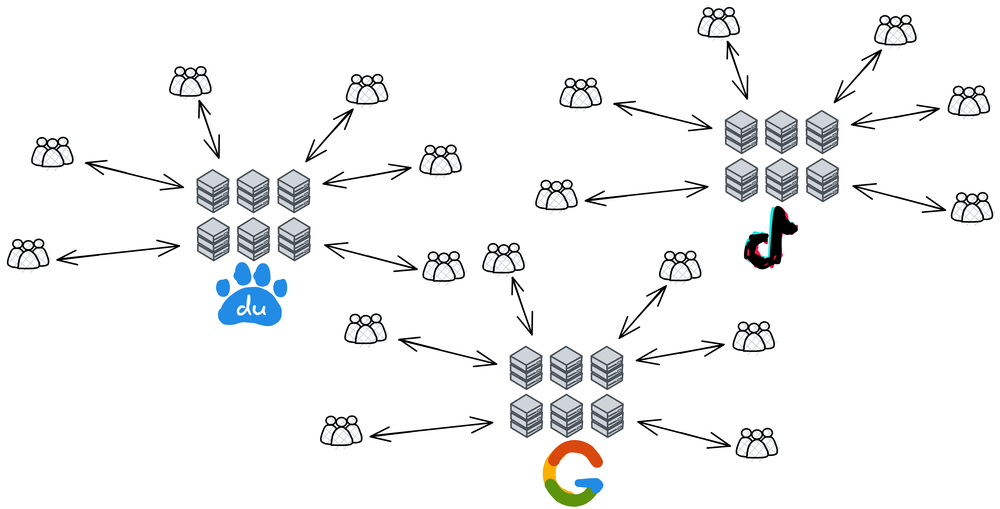
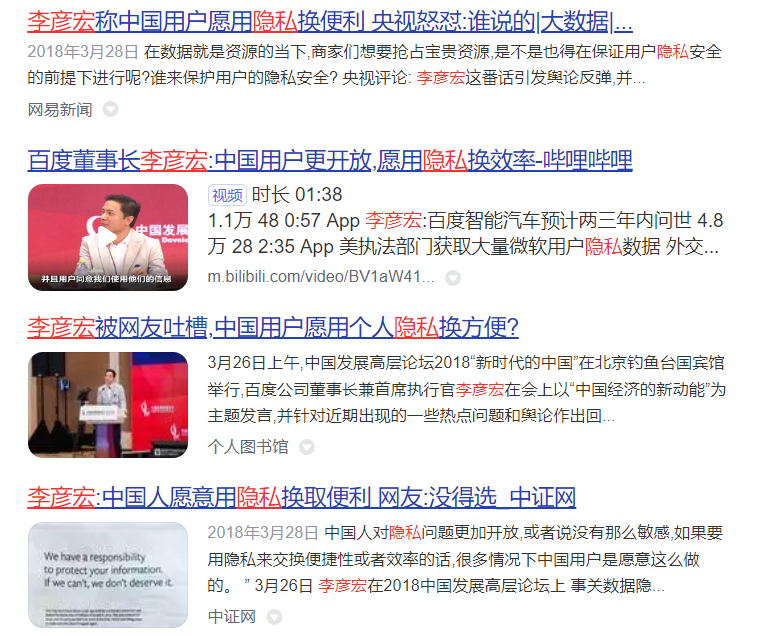
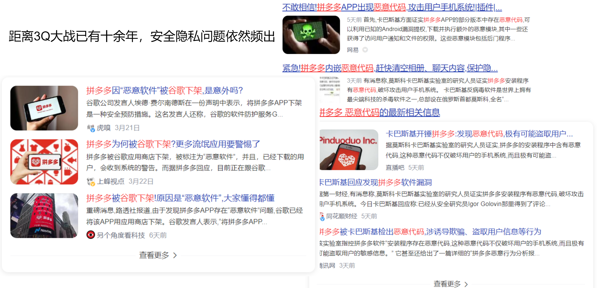

This is a rather serious problem. Although the Internet can store your data, your data will not necessarily be permanently preserved by the Internet. Because now most applications' back-ends are "independent". Each company has its own maintained servers, either self-built computer rooms or cloud services. All users transmit network information and interact with other users by accessing their servers. Once the company announces service termination, your data will be gone.

For example, TikTok is like this:

Each company's servers provide users with their own network services:

While data brings convenience to the information age, it also leads to data abuse, personal privacy leaks, infringement of corporate trade secrets and many other problems. Your data has been dumped into their servers in one swoop. They control the servers and have the final say in how to handle the data in the servers. Although engineers are only responsible for studying AI recommendation algorithms and do not peek at your data. Only AI knows what you like, stored in servers, and there are too many user data to see. But when they want to find someone, the management can still see all kinds of data.

The data contains your privacy, **what you bought today, what you chatted about, what you like to watch, what you want to eat at night, taste preferences, height and weight when buying clothes, map positioning**... can all be analysed through data. They can completely monitor your every move on the network.

You may say: Who asked them to see my data! Indecent! Help! Is anyone in charge?

But I still have to say a fair word. In fact, when you first installed the app, they would let you check a "User Agreement" or more euphemistically called "User Experience Improvement Program". Although almost no one will read the entire "User Agreement" in full, you have already "agreed" to give them your usage data. Otherwise, you can't use it!😡

Although on the surface, you agreed to the "User Agreement" first, and then they used your data to improve the experience.

No one knows what they have done with the data.

We already know about PRISM, Facebook's leak of hundreds of millions of user data in 2018, Amazon was fined 746 million euros by the EU privacy regulator in July 2020 for violating the EU General Data Protection Regulation, which was also the largest data privacy leak fine in EU history. Domestic takeaway platforms such as Meituan and Ele.me have also been exposed to user information leaks and resales, down to order contents, addresses and other private information; Li Yanhong: Chinese people can be more open to data privacy and are willing to exchange privacy for efficiency...

(Screenshot of Li Yan Hong's claim on the internet:"Users are willing to exchange privacy for efficiency!)

And they think that unfavorable content to them can be deleted directly without your consent. (Of course, illegal content must be deleted)

The current situation of the Internet can be said to be: When I open my mobile phone, my apps want to read through my private information. Otherwise, you can't use it.

The large-scale disclosure of personal privacy data has become a major global social problem in the era of big data. Internet platforms massively collect user data and centrally store users' personal information for a long time. Once the data is leaked, it will be a large-scale group incident, not only violating the user's right to privacy, infringing on the life and property safety of citizens, but also causing unpredictable economic losses to Internet companies themselves. The negative impact on corporate reputation after data leakage is also difficult to eliminate.

Just last week, on March 21, 2023, Pinduoduo was forcibly removed from Google Play and prompted existing Pinduoduo users to uninstall it as soon as possible. This was the first time Google prompted users to uninstall an app. Subsequently, the well-known antivirus software laboratory Kaspersky confirmed that Pinduoduo recklessly collected user information by exploiting vulnerabilities in the Android system, cracked system shielding mechanisms, tampered with mobile phone system records, concealed its own whereabouts, ran in the background of the system to monitor mobile phones, evaded system cleanup processes, and read mobile phone input method information.

(A famous shopping app in China: Pinduoduo. Had been exposed that they implemented malicious code in users' device for purpose of tracking and collecting users' information)

> The malicious behaviours and functions of Pinduoduo including:
>
> 1. Collect user's images and social relationships.
> 2. Install apps in the background when users clicked on certain links
> 3. Reading information from user's phone keyboard.  
> 4. Produce fake notifications by hijacking Alarm,wallpaper and calander.
> 5. Making fake icons in the main page which users are unable to uninstall, keep running and consume battery in the background.
> 6. Delete record of access to system information when Pinduoduo's app is running, or a virus detecting app is on.
> 7.  Act as communication app such as Wechat and mislead users to run it.
> 8.  Stealing message records from communication apps, browser history, ban users from using apps from competitors. 

Damn it! It's so hard to store information, it's better to engrave it on stone!

The essence of this phenomenon lies in the fact that users do not have their own data rights. Your own data, you don't even have the data rights!

Users should have the right to know how their personal information is collected, used and shared, the right to decide how their personal information is used and shared, and the right to control how their personal information is collected, stored and used. Then if I want to delete some privacy data, hey hey, you don't even know if they will really delete the content you want to delete. They can even hide the information and secretly save it themselves.