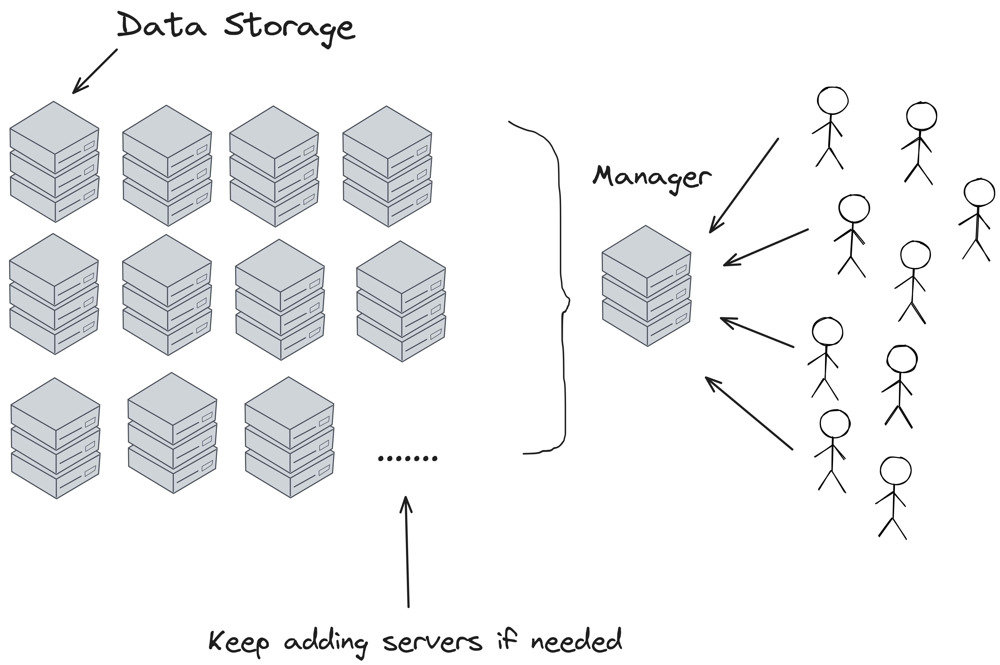
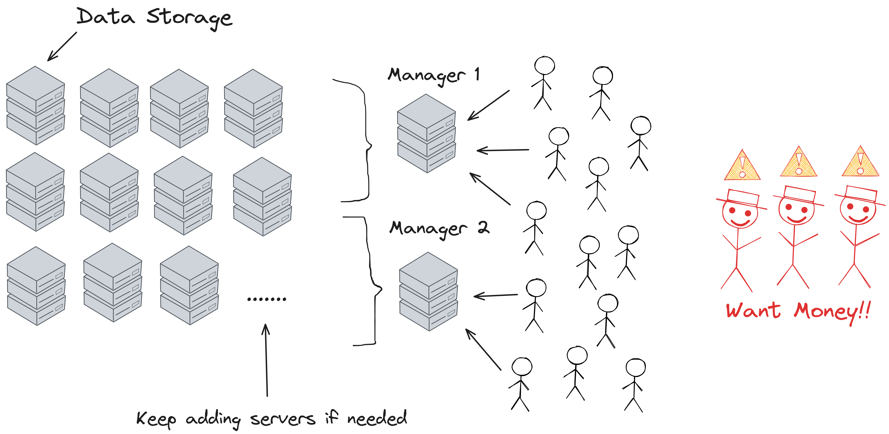
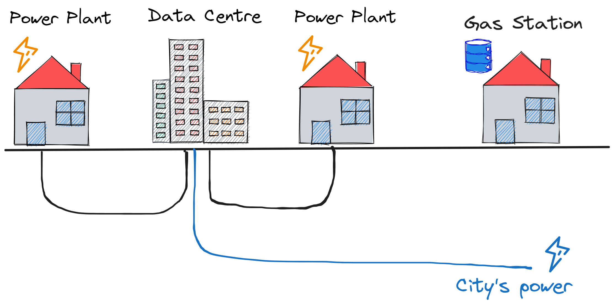
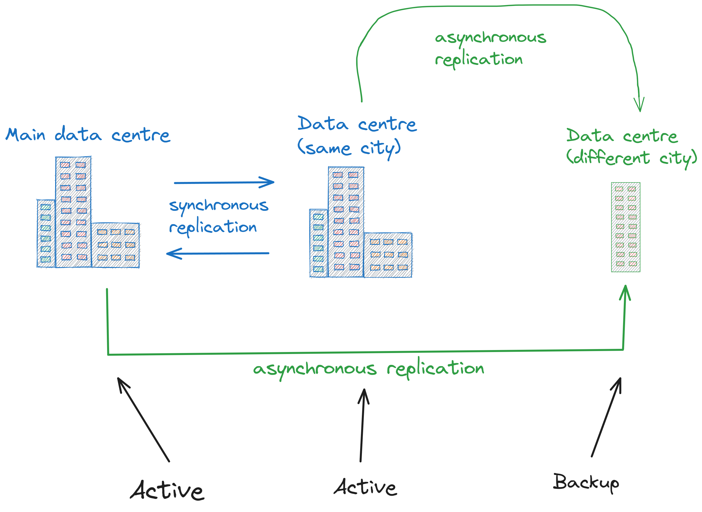

# What is the Blockchain?

What is blockchain?

Blockchain is a decentralized distributed system formed through cryptography.

Wait, what does decentralized mean?

Don't worry, let me explain it one step at a time.

 

 

Suppose a few neutron star beings want to establish an online banking system called "Neutron Star Bank." They purchase a server to handle all requests. The balance and transaction information for all users are stored on this single server. Thus, Neutron Star Bank begins its operations.

As online payments become increasingly popular, the number of users and use cases continue to grow, leading to exponential growth in transaction data.

The capabilities of a single server are continuously challenged, and it starts to struggle: 

On one hand, storage capacity is insufficient to meet the massive storage demands of transaction data; on the other hand, during shopping frenzies like Double 11 and 618, system access volume surges, CPU loads continue to climb, and overload situations occur frequently. Even more severe, server failures sometimes occur, resulting in the entire system becoming paralyzed and transaction data being lost.

 

The growth in business is putting a heavy strain on the system, and to prevent system paralysis, the neutron star beings decide to scale and optimize the system:

They purchase one server to act as an "administrator" and several additional servers dedicated to data storage. When the administrator server receives transaction data, it forwards it to the servers responsible for data storage. Once one server is full, the data is stored in another server.

If the administrator becomes overwhelmed, more administrator servers can be added. In this way, the system is finally expanded.

However, at this point, a group of hackers set their sights on Neutron Star Bank. After all, money is just a string of numbers, and by secretly infiltrating the bank's database to modify account balances and transaction records, they could achieve financial freedom.

Initially, the bank's system lacked proper protection measures, making it vulnerable to attacks.

After paying a heavy price, the bank realized the severity of the issue and began implementing a series of measures to protect their system: first, they purchased several servers for data backup, backing up data every 3 hours. Then, they deployed an independent sentinel monitoring system on the network, dedicated to protecting the system's security.

 

With these security forces in place, the system's safety was greatly enhanced, and hackers could no longer use their previous attack methods.

 

Since all of the servers were located within Neutron Star Bank's building, the hackers thought: if they couldn't break into the system, they might as well physically attack it 😎. They planned to borrow a large sum of money from the bank, then destroy the bank's servers. Alas, the servers would be dead, and there would be no evidence left.

Fortunately, the security at the bank's entrance was not to be trifled with; who would bring a bomb to a bank? The security intercepted the bomb, successfully preventing the hackers from physically destroying the servers.

 

This incident frightened the bank, as it became apparent that having the servers in the bank building was not safe. What should they do?

They needed to come up with a foolproof plan to ensure the security of the servers.

 

So, Neutron Star Bank decided to establish a dedicated data centre and independently protect all network devices, such as routers, switches, and interfaces.

The requirements for building the data centre were very strict: it could not be near railways, highways, airports, chemical plants, landfills, nuclear power stations, munitions factories, gas stations, or any other facilities posing safety risks. It also couldn't be located in flood-prone or earthquake-prone areas, nor could it be in areas with high crime rates. Despite these precautions, the bank still feared sudden natural disasters, so they built the data centre with flood protection and 8-level earthquake resistance.

In addition to finding a suitable location, the data centre had to meet many strict construction standards, including building materials, internal heating, ventilation, and air conditioning systems, lighting systems, fire suppression systems, lightning protection measures, and constant temperature and humidity control, among others.

 

If the hackers managed to cut off the power supply to the data centre, the entire system would be paralyzed, and even the most secure equipment wouldn't function without electricity.

To address this concern, two power plants were set up near the data centre to provide electricity simultaneously. Each power plant could meet the data centre's entire power demand, with a backup power supply in case both power plants experienced outages. Each power plant was equipped with an independent power distribution room.

No, it's still not reassuring enough. What if, after a city-wide power grid interruption, both power plants experience accidents and can't generate electricity?

No worries, the data centre is also equipped with a UPS room. This room houses a multitude of batteries that can support the data centre's full-load operation for over 15 minutes.

 

Even if hackers cut off the power supply to the data centre, it can still maintain operation for a period through the UPS uninterrupted power supply.

Can power be restored within 15 minutes? There's no rush. That's because the data centre is also equipped with generators and fuel storage tanks, capable of supporting full-load operation for more than 12 hours.

Additionally, the bank has signed agreements with at least two nearby gas stations to ensure diesel supply within 4 hours. Though relying on fuel delivery is not a long-term solution, it's more than enough to support operations for a week.

 

What if the fuel storage tanks catch fire, as they're full of oil?

The data centre's fire detection system consists of a temperature sensing system, a video system, and on-duty personnel keeping watch. Upon detecting a fire, the fire suppression system extracts a portion of gas and then releases heptafluoropropane. This substance is colorless and odorless, killing stealthily and invisibly — wait, no, it's actually colorless, odorless, low-toxicity, non-conductive, non-polluting, and non-corrosive.

 

Won't people inside be suffocated?

When the data centre's fire suppression system is activated, alarm bells ring, and the access control system automatically cuts off power, allowing personnel to evacuate the affected area. Even if they cannot leave in time, the data centre is equipped with a sufficient number of oxygen masks.

 

However, no matter how many safety measures are taken, a single data centre cannot guarantee the system's absolute security.

During the 9/11 attacks in 2001, Morgan Stanley's data centre in the World Trade centre was completely destroyed. However, thanks to a mature disaster recovery system, all business operations were restored the next day. Despite the total destruction of their 25-story office space in the World Trade centre and the emergency evacuation of over 3,000 employees, a secondary office was established within half an hour at the disaster recovery centre, and all business operations resumed the following day. Conversely, some companies had to file for bankruptcy due to inadequate backup disaster recovery systems.

 

You see, having another data centre would be beneficial in such situations.

This is what's known as a "dual-active data centre," where two data centres operate simultaneously. If one is destroyed, the other continues to function, leaving the system virtually unaffected.

What if, by chance, an asteroid strikes the very area where the data centre is located? Wouldn't everything be wiped out in one fell swoop?

No worries, there's a remote disaster recovery data centre. If both primary data centres fail, operations can be switched to the remote disaster recovery centre, which has the same configuration and is ultra-secure.

 

What if the remote disaster recovery data centre is also destroyed?

At that point, the system would truly be down, but the data would still be safe. That's because there's a cold backup in place, which doesn't run within the system but operates independently. The backup system performs incremental backups every 2 hours and is housed in several other cities.

 

Have you noticed? After all these preparations, the ultimate goal is singular: **to ensure the smooth operation of the system and maximize its reliability as much as possible**.

 

Although distributed systems are geographically distributed in different places with multiple data centres undertaking business. But all servers still need banks for protection. This is a centralized approach, and many people are calling for visibility, choice and reasonable control over existing networks and data. Users need the right to know who can access their data, how their data is used, and if users don't want to share certain data, we also have the right to refuse. Perhaps most importantly, users want their own data to be used for their own benefit. If you are interested in the history of this, you can take a look [here](Things about Crypto Punks.md) first.

So what is the essence of blockchain?

A globally distributed network, a "decentralized" system, a "shared distributed" system, a "fault tolerant, disaster tolerant" system.

The concept of blockchain consists of two parts: "blocks" and "chains". Let's start with "blocks". Blocks are like pages in a ledger that contain some information. In the blockchain world, this information is usually transaction records, such as A transfers 10 bitcoins to B, which is a transaction. Packaging a certain number of transactions together forms a block.

Now let's look at "chains". The concept of chains is very simple, just connect these blocks in a certain order. With chains, we can trace the connection between each block. Each newly generated block is connected to the previous block to form a chain.

The full picture of the blockchain is: a series of blocks arranged in chronological order, connected together by a specific algorithm. This structure ensures the security and integrity of the data.

Next, we need to understand an important concept - encryption. In the blockchain, each block has a unique digital string called a "hash value". The hash value is generated by an algorithm called a "hash function". This algorithm is magical, even if only a small piece of information is changed, the hash value will change dramatically. This ensures the security of the blockchain, because tampering with any block information will change the hash value and affect all subsequent blocks.

Another key concept is "decentralization". In a traditional database, data is controlled by a centralized institution. This means that if there is a problem with this institution, the security of the entire system will be affected. The blockchain is different, it is jointly maintained by tens of thousands of computers around the world. These computers are called "nodes".

The decentralized nature of the blockchain means that it does not rely on a single centralized entity to maintain the data. Traditional databases are controlled by a centralized institution. In this way, if there is a problem with this institution, the security of the entire system will be affected. The blockchain, on the other hand, is jointly maintained by tens of thousands of computers around the world. These computers are called "nodes". For a transaction to be recorded on the blockchain, it must reach a consensus from most nodes. This brings many advantages, such as higher security, better privacy protection, lower operating costs, etc. On the blockchain, for a transaction to be recorded on the blockchain, it must reach a consensus from most nodes. This consensus mechanism ensures the transparency and security of the blockchain.

So how to reach a consensus? Here we take Bitcoin as an example. Bitcoin uses a consensus mechanism called "Proof of Work" (PoW). The core idea of Proof of Work is to let nodes participate in competition and compete for the right to keep accounts by solving a complex mathematical problem. Whoever solves this problem first has the right to package transactions into a new block and add it to the blockchain. At the same time, other nodes will verify this block and accept it after confirming that it is correct. This process is known as "mining".

The mining process ensures the security and decentralization of the blockchain. However, this method also has some problems. For example, it requires a lot of computing power and energy consumption. To solve this problem, other consensus mechanisms have emerged, such as "Proof of Stake" (PoS) and "Delegated Proof of Stake" (DPoS).

Proof of Stake (PoS) is a more environmentally friendly consensus mechanism. In a PoS system, a node's right to keep accounts depends on the amount of currency it holds. Nodes with more currency have a higher probability of obtaining the right to keep accounts. This method reduces energy consumption but may lead to uneven distribution of currency.

Delegated Proof of Stake (DPoS) is a variant of PoS. In a DPoS system, token holders can delegate their token interests to other nodes, allowing them to keep accounts on their behalf. This can further reduce energy consumption while improving system efficiency and security.

Blockchain is like a public, secure, distributed ledger. It can be used to record transactions, store data, and more. Blockchain technology has already been applied in many fields, such as finance, the Internet of Things, healthcare, and more. Blockchain technology has a lot of potential for the future. Other technologies such as AI and VR improve productivity. Blockchain changes the way that work is organized.

There are two main points:

First, use technology to solve the "trust" problem.

Second, achieve "autonomy" based on technology.

For example, in a massive multiplayer online game set many years in the future like Ready Player One, character and equipment assets must be stored on the blockchain, otherwise game companies or hackers could tamper with the data at will.

In the world of blockchain, you only need a blockchain account identity to join any network without permission, without sacrificing privacy or paying costs to use a service. Unlike the Web2 era when commercial value was completely controlled by major platforms, Web3 is built on decentralized networks. Application developers are responsible for developing and deploying to the blockchain platform. Once deployed on the blockchain, they cannot monopolize and use user data. This will fundamentally change business logic and the attribution of commercial value, creating a fairer internet business environment and breaking the monopoly of industry giants.

The blockchain emphasizes equality, fairness, democracy and autonomy more, which is completely inherited from the idea of communist society. In the blockchain network, the mechanisms of shared interests and democratic autonomy will curb the emergence of all monopolistic giants. The way to accumulate wealth by exploiting the surplus value of users and content creators has been completely subverted.

The application scenarios of the blockchain are very extensive, covering all aspects of daily life, health care, energy charity, elections and finance:

Digital currency: The most famous application of blockchain is digital currency, such as Bitcoin and Ethereum. Digital currency is a kind of virtual currency based on blockchain technology, which can be used for point-to-point transactions without going through centralized financial institutions.

Smart contract: A smart contract is a blockchain-based, automatically executed contract. It can automatically trigger corresponding operations when certain conditions are met, thereby reducing the cost and risk of contract execution. Platforms such as Ethereum support smart contracts, enabling developers to build various decentralized applications (DApps) on the blockchain.

Supply chain management: Blockchain can be used to track the circulation of goods in the supply chain. This can improve the transparency of the supply chain, prevent counterfeit products, and reduce costs.

Identity authentication: The blockchain can be used as a decentralized identity authentication system to help users verify their identity on the network. This can reduce dependence on centralized institutions and improve privacy protection.

Copyright protection: Blockchain can be used to store and verify intellectual property information to prevent piracy and counterfeiting. This is very valuable for creators and intellectual property owners.

Cross-border payments: Digital currencies can be used to make cross-border payments, which can reduce the fees and time costs of remittances.

- Internet of Things: The blockchain can be used to record and verify the data of Internet of Things devices to ensure data security and integrity.
- Healthcare: Blockchain can be used to store and share medical data, improve data security and availability. This helps to improve medical standards and reduce medical costs.
- Energy trading: Blockchain can be used to record and verify energy transactions, such as solar energy and wind energy. This helps to achieve decentralization of the energy market and improve energy utilization efficiency.
- Election voting: Blockchain can be used to build a transparent and secure election voting system. This can prevent election fraud and increase democratic participation.
- Charity: Blockchain can be used to track the flow of charitable donations to ensure that donations are truly used for those in need. This helps to increase the transparency of charities and enhance public trust in charitable organizations.
- Financial services: Blockchain can be used to build decentralized financial service platforms such as lending, insurance, and securities. This can reduce the cost of financial services and improve the efficiency and security of the financial system.
- Automotive industry: Blockchain can be used to record the life cycle information of vehicles such as production, sales, and maintenance. This helps to improve the transparency of the automotive industry and prevent fraud in the used car market.
- Real estate: Blockchain can be used to record real estate transaction information, simplify real estate transaction processes, and reduce transaction costs. In addition, real estate transactions can be automated through smart contracts.
- Education: Blockchain can be used to store and verify educational information such as degrees and certificates. This helps to prevent degree fraud and improve the credibility of the education system.
- Social media: Blockchain can be used to build decentralized social media platforms to protect users' privacy and data security. In addition, blockchain can also be used to incentivize content creators and achieve fair income distribution.
- Game industry: Blockchain can be used in the game industry for virtual asset transactions, copyright protection, and more. Through blockchain technology, players can have truly digital assets in the game and realize cross-game asset circulation. resources: Blockchain can be used for human resource management, such as recording employees' work experience, skills, and performance. This helps simplify the recruitment process, improve recruitment efficiency and accuracy.
- Legal services: Blockchain can be used to store and verify legal documents such as contracts and wills. This helps improve the efficiency of legal services and reduce the cost of legal services.
- Food safety: Blockchain can be used to track the circulation of food in the supply chain to ensure food safety and quality. This helps prevent food safety issues and boost consumer confidence.

The above are only some of the applications of blockchain technology in various fields. With the development and innovation of technology, blockchain will show great potential in more fields. At the same time, we should also pay attention to the challenges brought by blockchain technology, such as energy consumption, network congestion, privacy protection, and other issues. Continuous discussion and improvement of blockchain technology will help create a safer, more transparent and efficient digital world.
