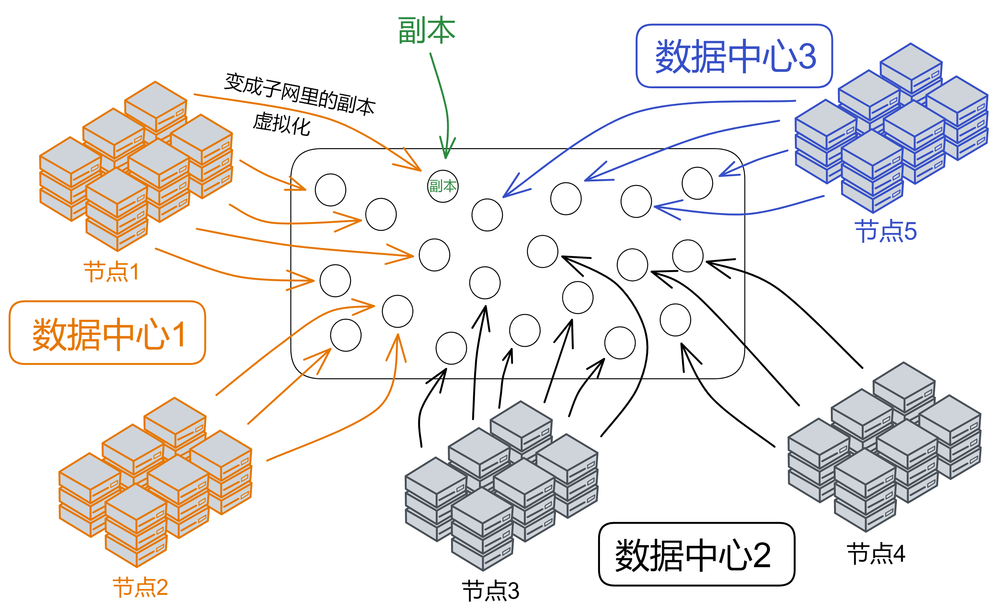
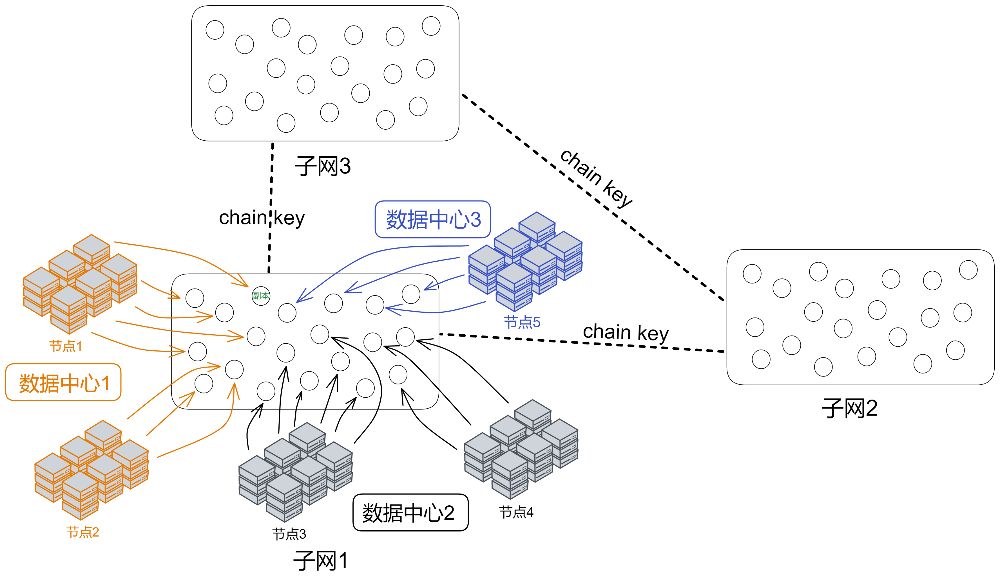
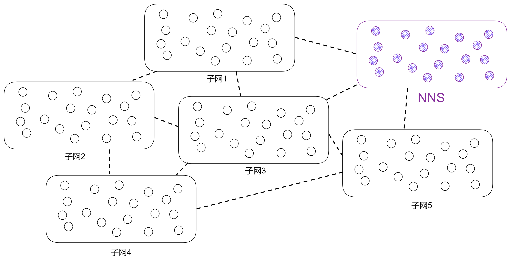
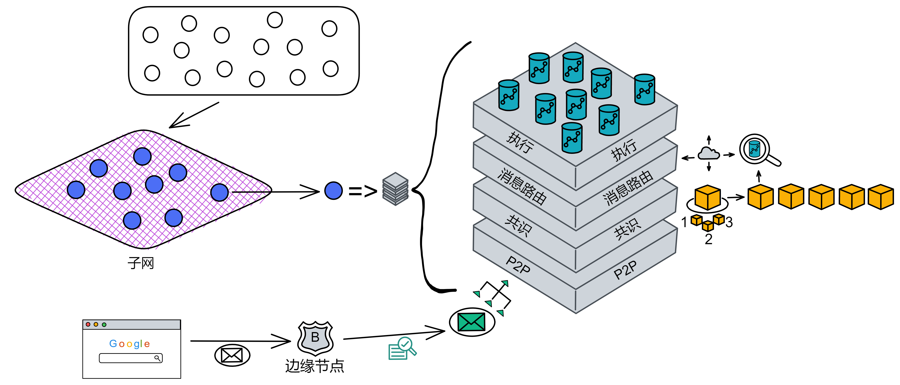

# Internet Computer

## Overview

What are IC and ICP?

* IC stands for Internet Computer, a high-speed blockchain network specifically designed for decentralized applications.

* ICP refers to the Internet Computer Protocol and also serves as the name of the token.

As discussed in the previous chapter, one of the key features of IC is its ability to scale horizontally, offering "**infinite expansion**" capabilities. This is achieved through ChainKey, which allows for scaling as new nodes join the network. A DAO, the **Network Nervous System (NNS)**, manages the splitting and merging of the network. Consequently, this requires an unconventional consensus algorithm. IC's consensus is solely focused on message ordering, ensuring that replicas execute messages in the same sequence. Relying on BLS threshold signature algorithms and randomness generated by non-interactive Distributed Key Generation (DKG), the consensus mechanism achieves **rapid speeds**. This, in turn, grants IC a **higher TPS**, resulting in millisecond-level queries and second-level data updates, making the Dapp user experience significantly smoother compared to other public chains. IC aims to provide a decentralized cloud service, allowing for **full-stack Dapp deployment on-chain**. All Dapps are installed within a virtualized container. Furthermore, developers can test their applications through the autogenerated **candid UI** of the backend virtual container without writing a single line of code. Clients can directly access frontend pages and smart contracts deployed on IC through HTTP. The virtual container acts like a mini-server, providing each Dapp with its own **on-chain storage space** and supporting **HTTP external calls**, as well as **Bitcoin and Ethereum integration**. Given that data is stored on-chain, it is essential to maintain **sufficiently low gas fees**: 1 GB for 1 year costs only 5 US dollars! Low gas fees alone are not enough; to ensure barrier-free user access to Dapps, IC employs a **reverse gas fee model** where the development team covers the gas costs. The Dfinity team has also pegged gas fees to SDR, creating a **stable gas fee** that is not affected by token price fluctuations. IC features a unified decentralized anonymous identity system called **Internet Identity (ii)**. This serves as the login portal for Dapps, allowing users to join the Network Nervous System and participate in governance.

# Architecture

**Data centers** host **nodes** that are virtualized into numerous **replicas** through the IC-OS node software. A random selection of replicas then forms a **subnet**. Each subnet is composed of nodes from multiple data centers. Every node utilizes IPv6 to establish TCP sessions, connecting with NNS nodes and other nodes within the same subnet.

The **NNS (Network Nervous System)** is the governance system embedded within IC, functioning as a DAO. Anyone holding ICP tokens can vote on proposals submitted to the NNS. Replicas can be understood as "virtual nodes" virtualized within a subnet. In essence, they are still nodes, but with a different name to distinguish them from physical node machines.

IC's subnets resemble the concept of sharding, a blockchain scaling solution. Taking Bitcoin as an example, nodes worldwide compete for the right to record transactions in a single block, essentially forming a global network. Imagine if all Asian nodes formed a "Bitcoin subnet," with Europe, Africa, the Americas, and Oceania also creating their own subnets. Transactions would reach consensus within their respective subnets, resulting in fewer nodes and shorter communication distances, thus improving performance.

IC is composed of numerous subnets, with no overarching concepts like mainnets, side chains, or beacon chains. Each subnet is equal to one another (except for the NNS). Subnets operate independently, reaching consensus and producing blocks within their internal structure. Different subnets synchronize and produce blocks in parallel. It can be understood that each subnet represents an individual blockchain, with multiple chains together forming IC. Cross-subnet communication at the IC level is facilitated by **chain key**. Developers and users do not need to concern themselves with which subnet their smart contracts are deployed on or how to communicate across subnets.

Subnets can dynamically increase, decrease, merge, or split based on the network's resource usage. There is no upper limit to the number of subnets, theoretically supporting "infinite expansion," with new subnets being added worldwide. 

The NNS is a special type of subnet, also composed of several nodes, like other subnets. The **NNS has the ability to manage other subnets**. Actions such as data centers becoming nodes, a specific node joining a subnet, determining which nodes comprise a subnet, selecting nodes to create a new subnet, or splitting a subnet into multiple subnets, all require permission from the NNS. 

Now let's shift our focus to the internals of a subnet and explore IC's core protocols. To facilitate understanding, I have converted the top view of a subnet into a side view; the purple grid represents the subnet, and the blue spheres represent replicas within the subnet.

IC's core protocol consists of 4 layers. From bottom to top, they are: P2P Layer, Consensus Layer, Message Routing Layer, and Execution Layer:

* **P2P Layer**: Collects and sends messages from users, other replicas within the subnet, and other subnets. Ensures messages are delivered to all nodes in the subnet, guaranteeing security, reliability, and resilience.

* **Consensus Layer**: Reaches consensus on the order in which messages are processed. The blocks are then passed to the Message Routing Layer.

* **Message Routing Layer**: Forwards messages. Once the Consensus Layer finalizes the blocks, the corresponding payload is transferred to the Message Routing Layer, which then inputs it into the Execution Layer.

* **Execution Layer**: The location where canisters run. The Execution Layer updates the state of the corresponding canister in the replicated state machine, completes the computational tasks of smart contracts, and hands the output over to the Message Routing Layer for processing.

Each replica contains these 4 layers within its structure.

