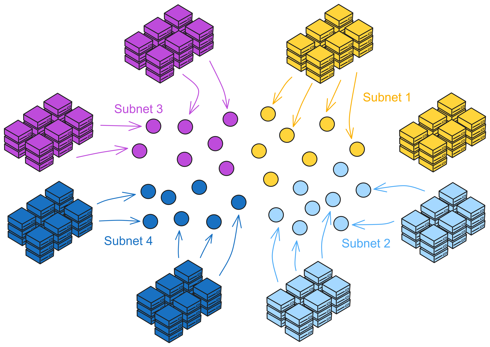
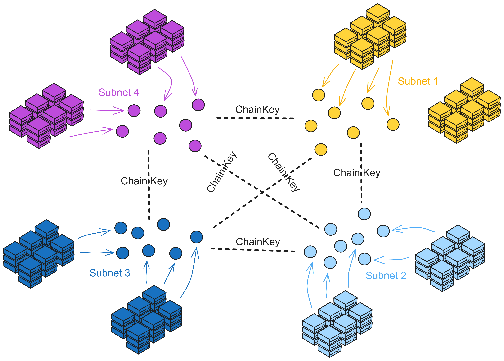
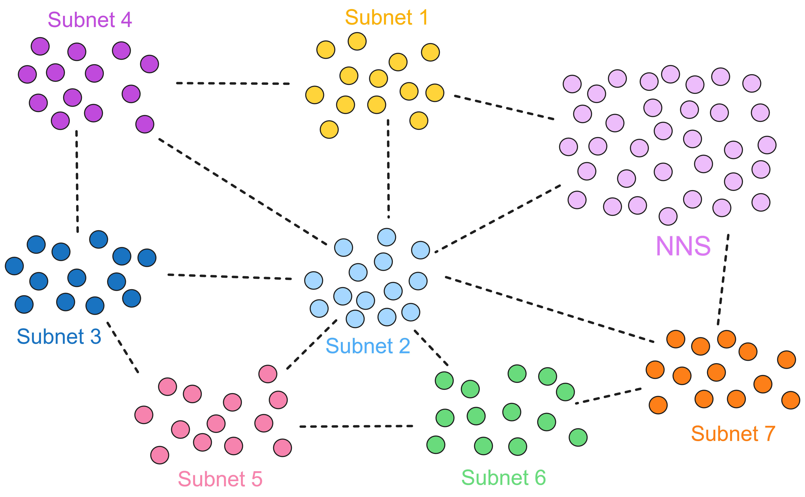
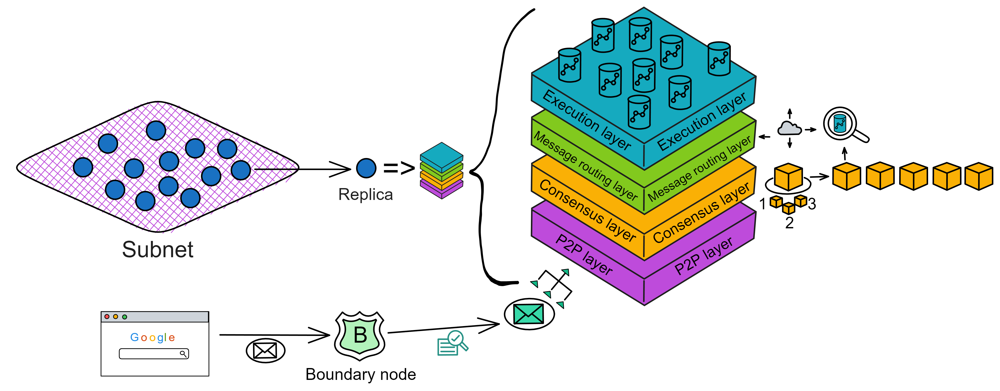
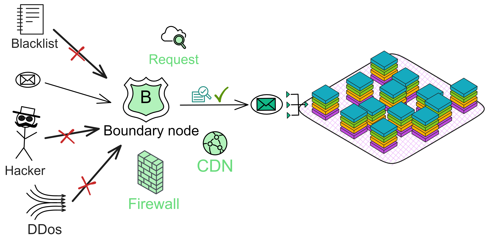
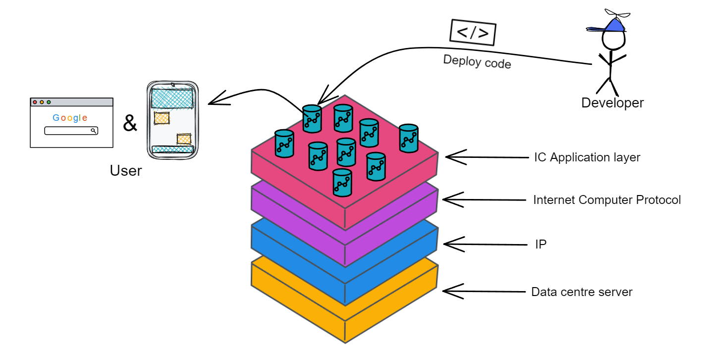
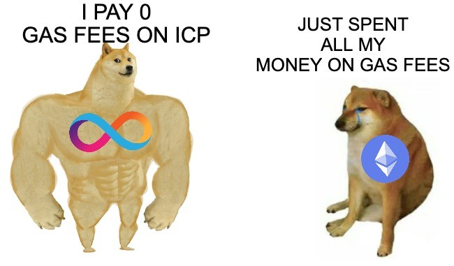

# Overview

What are IC and ICP?

* IC is a high-speed blockchain network specifically designed for decentralized applications.

* ICP is both the name of the Internet Computer Protocol and the native token.

The emergence of the Internet Computer (IC) has brought revolutionary changes to software development. It allows developers to build applications directly on a decentralized cloud, free from dependence on traditional centralized cloud services, reducing development and operating costs. The security and high performance of IC greatly improves the security of applications and services.

The vision for IC is to become a global computing platform providing unlimited scalability, security and decentralized governance.

IC is built with high performance and decentralized cloud services through technologies such as sharding, VRF random numbers, BLS threshold signatures, DKG, and embedded DAO governance models.

How high is its performance?

The current confirmed block rate of subnets is 36 blocks per second.

    

For every second, 6,355 transactions could be handled.

    

[Here](https://dashboard.internetcomputer.org/) you can see the real-time statistics of the IC network. While the number of the subnet keeps growing, the performance of the network will also get higher. (TPS is unlimited!)

Currently (June 2023), each shard contains 1000 entries, meaning a subnet can process 1000 update calls per second (Actual data is slightly less than 1000 msgs/sec, around 970/sec). Each subnet does around 970 updates/sec, 4000 queries/node.

## The new era of software development

The Internet Computer (IC) is a brand new blockchain design built on the Internet Computer Protocol. Its core part is divided into 4 layers, running on nodes of each subnet. By running the core protocol, the nodes of a subnet implement a blockchain-based replicated state machine that progresses independently of other subnets (but communicates asynchronously with them). IC adopts a multi-subnet shards structure, which overcomes the performance bottlenecks of traditional blockchains while maintaining decentralization. This architecture allows IC to generate subnets (shards) indefinitely, allowing IC to scale almost limitlessly.

    

In traditional non-sharded blockchains, typically only one block is produced over a period of time, with all miners in the network competing for the sole mining right or reaching consensus on a single block. To increase throughput and lower latency, scaling up often can only be achieved by speeding up block production or increasing block size. Both approaches have downsides (frequent forks or network latency).

IC scales horizontally by creating new subnets, similar to how traditional cloud infrastructure scales by adding new machines. Once IC's Network Nervous System (NNS) decides to create a new subnet, it will select a group of spare nodes that have not been allocated to any subnet and create the initial configuration for the new subnet. Then, the selected nodes form a new subnet blockchain.

IC eliminates the speed, storage, and computing limitations faced by smart contracts on traditional blockchains. Making smart contracts fully decentralized, from front-end to back-end can be hosted on the blockchain. IC's smart contracts are called Canisters. Canisters can store data, perform general computing on data, and provide a complete technology stack to provide network access services directly to end users.

Computing and storage overhead uses a "reverse gas model", and **gas fees** are paid by the developer who deployed the Canister by exchanging native tokens ICP into Cycles. ICP tokens are also used for governance: IC is managed by a decentralized autonomous organization (**DAO**). IC embeds the DAO system as its base: **Network Nervous System**. The DAO can decide to change IC's network topology and upgrade the IC protocol.

IC can also interoperate with other blockchains. IC's chain key cryptography enables it to interact with other blockchains and integrate other cryptocurrencies.

IC uses WebAssembly (Wasm) as the standard for code execution, so developers can write smart contracts in a variety of popular programming languages (such as Rust, Motoko, Java, etc.).

Traditional IT developers face many problems: they have to go through a series of hurdles such as multiple commercial cloud services, cloud tools, proprietary and open source variants of operating systems, databases and firewalls, virtualization technologies, software development platforms, etc., to address the high customization of assembling systems, the labor costs of specialist developers needed to maintain them, and related vendor relationships, making it expensive and difficult to change, migrate and adjust old systems as needs change. The result is high development and operating costs, and security issues with centralized data storage.

    

IC allows developers to build applications, enterprise systems and Internet service apps in an open world. Based on the decentralized blockchain concept, it ensures that it can operate safely and stand the test of time. IC can automatically scale, resist attacks, and never go down. This novel design allows developers to focus on creating new applications and services without worrying about the security, cost and scalability of the underlying infrastructure. This will have a profound impact on the new era of software development.

## Architecture

IC's architecture is unique:

The **nodes** in each **data centre** are **virtualized into replica** **through the node software IC-OS**, and then some replicas are randomly selected to form a **subnet** .

    

A subnet consists of nodes from multiple data centres. Each node establishes a TCP session with IPv6 and connects to NNS nodes and other nodes in the same subnet.

    

**NNS (Network Nervous System)** is the governance system embedded in IC, a DAO. Anyone who staked ICP can vote on proposals on NNS.

The nodes of the Bitcoin network can join whenever and wherever they want, but the problem is that the confirmation of transactions is too slow; the consortium blockchain first determines several nodes in the network, and then these few fixed nodes reach consensus, the speed is fast. IC combines the advantages from both, like a consortium blockchain composed of several fixed nodes to form subnets, the consensus speed between nodes (replicas) is very fast, and controlled by a DAO: NNS, to control subnets and nodes (replicas). Win-win.

IC integrates a DAO at the bottom layer of the blockchain protocol: a **DAO-controlled network**. This DAO controls each subnet, configures the network topology, creates subnet public keys, and upgrades the protocol version of replicas. Therefore, all NNS decisions are made by community members, and the voting weight of community members is determined by the amount of IC native governance tokens they stake in NNS.

If the proposal is approved by voting, the Canister in NNS will automatically execute the according decision. For example, if a proposal to change the network topology is approved, the NNS will automatically update the registry Canister with the new configuration.

    

NNS is also a decentralized governance system that helps the IC network achieve self-evolution. The purpose of NNS is to manage the Internet Computer network in an open, decentralized and secure manner. It is a system subnet of IC that controls IC subnets. It can also upgrade node protocols; adjust the exchange ratio of Cycles to ICP; in extreme cases, it can even freeze malicious Canisters to protect the network.

Replicas can be understood as "virtual nodes" virtualized in subnets. In the following content, we will call IC "nodes" as replicas.

    

IC's subnets are similar to the idea of sharding. Sharding is a blockchain scalability solution. Take Bitcoin as an example. Nodes all over the world are competing for the accounting rights of a block, which is equivalent to a network covering the entire earth. If all nodes in Asia constitute a "Bitcoin subnet", Europe, Africa, America and Oceania also constitute their own subnets. Then consensus is reached within the subnet, with relatively fewer nodes and shorter communication distances, which can improve performance.

IC consists of many subnets, without the concept of parent network, main chain, side chain, beacon chain, etc. Each subnet is equal (except NNS). Each subnet runs independently, reaches consensus within the subnet, and there is no "global consensus" like Bitcoin. Different subnets synchronize and generate blocks in parallel. It can be understood that each subnet is a blockchain, and many chains together constitute IC. Cross-subnet communication is solved by **Chain Key** at the bottom layer of IC. Developers and users do not need to worry about which subnet the smart contract is deployed in, how to communicate across subnets, etc.

**Chain Key** is the core technology behind the Internet Computer that solves the problem of inter-subnet communication of IC. Chain Key allows each subnet to generate its own unique **subnet public key** (or Subnet Key) based on the **root key**. This is the underlying technology for IC's unlimited scalability.

Dude, this is so freakin' cool! Each subnet on the IC network has a public key that's just 48kb in size. Anyone can easily verify that a message they receive actually came from the IC network and wasn't tampered with. All kinds of IoT devices and other blockchains can also verify info from IC, so handy! Compared to that, verifying stuff from traditional blockchains like ETH is a pain - cuz each block is signed by different nodes, so devices gotta sync hundreds of GBs of signature data to complete verification. But on IC, all the nodes sign each block together, so devices only need to store one unique 48kb public key to verify any message from a subnet. This design is just ingenious!

    

Subnets can dynamically increase, delete, merge and split according to the network resource usage. The number of subnets has no upper limit, so theoretically it supports "infinite expansion" by adding subnets around the world.

But who decides the splitting and reorganization of subnets? NNS!

NNS is a special subnet, just like other subnets composed of some nodes. **NNS can manage other subnets**. However, NNS has more nodes than other subnets, so its security is naturally higher than other subnets. Becoming a node in a data centre, which subnet a node joins, which nodes make up a subnet, selecting a few nodes to create a new subnet, splitting a subnet into several subnets, etc., these operations require NNS permission.

The architecture of many subnets allows IC to scale infinitely.

    

The core part of the IC protocol is divided into 4 layers, running on the nodes of each subnet. Now we turn our perspective into the interior of the subnet to take a look at the core protocol of IC. For easy understanding, I change the top view of the subnet to a side view; the purple square blocks represent subnets, and the blue spheres represent replicas in the subnet.

    

The IC core protocol has a total of 4 layers, and each replica has this 4-layer structure. From bottom to top are the P2P layer, consensus layer, message routing layer, and execution layer:

- **P2P layer** collects and sends messages from users, other replicas in the subnet and other subnets. It ensures that messages can be delivered to all nodes in the subnet to ensure security, reliability and elasticity.
- **Consensus layer** reaches consensus within the subnet on the order in which various messages are processed. Then these blocks are passed to the message routing layer.
- **Message routing layer** forwards messages. After the consensus layer finalizes the block, the corresponding payload will be passed to the message routing layer. The message routing inputs the execution layer.
- **Execution layer** is where the Canister runs. The execution layer updates the state of the corresponding Canister in the replicated state machine, completes the computing task of the smart contract and passes the output to the message routing layer for processing.

## P2P layer

The P2P network is like a large party, and the participants in the party are replicas in the subnet. At this party, people want to share the latest news and hope that as many people as possible can hear this news. However, it is tiring for everyone to shout out the complete message loudly (occupying network resources). We can adopt a more efficient approach.

This approach is the advertise-request-deliver mechanism. Just like at a party, someone (replica) loudly announces: "Hey, I have big news to share!" This is a small announcement. After hearing this announcement, others (other replicas) who heard and think that the message is important will come over (request) and ask that person to tell them the specific content of the message (deliver). This process may sacrifice some time (delay) but can save energy (reduce bandwidth usage).

If this party is very large, such as a huge music festival. In such a huge event, the advertise-request-deliver mechanism will run on an **overlay network**. This overlay network is like a large circle of friends, and everyone only shares messages with their good friends (peers).

    

When someone wants to broadcast a message, he will first tell his good friends about the announcement of the message. Those good friends, upon receiving the announcement, may request the delivery of the message and, under certain conditions, tell their good friends about the announcement of the message. This is like a gossip network.

The P2P layer can effectively reduce bandwidth usage and achieve high throughput at the cost of some latency by using the advertise-request-deliver mechanism and running on the overlay network.

Learn more about how the IC P2P layer works [here](../2.CoreProtocol/P2Player.md).

## Consensus

Consensus is reached within the subnet by replicas.

The task of the IC consensus layer is to sort incoming messages to ensure that all replicas process incoming messages in the same order. These messages are communications between users and Canisters, communications between Canisters, and the order of these communications.

By sorting replicas with unpredictable random numbers, select who to make blocks first. If the selected replica is honest and has no problems, it will package the block and broadcast to everyone for verification. If everyone agrees that there is no problem, they will provide their own notarization shares. After the threshold of two-thirds of the notarization shares is reached, a notarization of this block is formed. If most replicas have only made a notarization for one block, everyone will finalize and make a confirmation of the block.

The consensus protocol of IC satisfies: low latency (almost instant finality); high throughput; robustness (in the event of replica or network failures, latency and throughput will drop slightly instead of directly crashing and shutting down).

Learn more about how the IC consensus layer works [here](../2.CoreProtocol/IntroductiontoConsensusLayer.md).

## Message routing

In each round of IC, the consensus layer packs incoming messages into block payloads. After the consensus layer's final confirmation, the corresponding payload is passed to the message routing layer. The message routing component receives a message to be processed from consensus. Message routing routes the message to the corresponding Canister input queue. It then triggers execution. After execution is complete, the Canister places the result in the output queue. Finally, the output is passed to the message routing layer to send out.

 

The message routing layer can also communicate between subnets. This is called cross-subnet messages or XNet messages for short.

Another key function implemented by the message routing layer is state authentication. In each round, the subnet performs BLS threshold signature on the state changed by the subnet in this round. This authentication can be used by subnets to verify the authenticity of a data flow from one subnet to another, and also allows users to submit responses to messages submitted previously before reading. State authentication and secure XNet protocols enable Canisters to communicate securely and transparently between subnets, a challenge faced by any sharded blockchain.

 

Note that the consensus layer and the message routing layer are independent. Forks happened in consensus have already been resolved before incoming payloads. And the consensus layer can proceed to the next round in advance without keeping exactly the same progress as the message routing layer.

Learn more about how the IC message routing layer works [here](../2.CoreProtocol/Messageroutinglayer.md).

## Execution

The basic computing unit in IC is called a Canister. IC provides a runtime environment that allows programs to run in Canisters and communicate (via messages) with other Canisters and external users.

    

The execution layer has many functions that other blockchains do not have:

- **Deterministic time slicing (DTS)**: For large messages requiring billions of Wasm instructions to execute, they can be split up and completed gradually over multiple consensus rounds. This ability to execute messages over multiple consensus rounds is unique to IC.

- **Concurrency**: Execute multiple Canisters simultaneously on multiple CPU cores. Since each Canister has its own isolated state.

- **Pseudo-random number generator**: The execution layer can access unpredictable and unbiased pseudo-random number generators. Now Canisters can execute algorithms that require randomness.

Learn more about how the IC execution layer works [here](../2.CoreProtocol/executionlayer.md).

## Boundary node

As mentioned earlier, IC (Internet Computer) is a decentralized cloud, capable of directly providing complete network services to users without reliance on any centralized services.

So, how are users' requests dispatched to replicas (nodes) within a subnet? How does IC protect against DDoS attacks? Is there a firewall? CDN caching, perhaps? 😏 You know what I mean.

    

These services are provided by the boundary nodes of IC.

Boundary nodes are tasked with forwarding requests to the corresponding subnets, protecting the subnets, and providing caching.

When a user accesses the IC via a browser, we utilize the URL link on the ic0.app domain to locate the canister. Initially, the browser checks for the DNS record related to the URL link and obtains the IP address of the boundary node. Subsequently, it sends an HTTPS request to the boundary node.

The boundary node assumes the responsibility of routing our requests to the target canister's subnet replica. It retrieves the necessary routing information from the NNS and arbitrarily selects one from a list of real-time response replicas. The security of communication between the user and the boundary node, as well as between the boundary node and the replica, is assured by TLS.

Beyond interacting with the main network, boundary nodes also provide services like caching, load balancing, rate limiting, firewall, and verification of IC response messages, thereby enhancing the user experience.

More details about boundary nodes can be found here.

 

## Message request workflow

With these 4 core protocol layers, let us take a look at the flow of a user request on IC:

User requests are divided into query calls and update calls.

 

Query call:

The client sends a request message to the boundary node wanting to access a Canister. The boundary node forwards this message to replicas in the subnet hosting the target Canister. After receiving the message, the replicas return a response and send it to the user through the boundary node.

    

Update call:

The client sends a request message M to the boundary node, targeting Canister C. The boundary node forwards the message M to the subnet replica hosting Canister C.

Upon receiving message M, the replica broadcasts message M to all replicas in the subnet through the P2P layer.

    

The main node that receives message M will package message M and other inputs into a block B.

After a while, the block B is finalized, and the contents are sent to the message routing layer for processing.

The message routing layer puts the message into Canister C's input message queue.

The execution layer processes message M and updates Canister C's internal state.

Subsequently, the message routing layer takes out the response R and returns it to the boundary node, which returns it to the user.

    

Sometimes processing a request message M requires calling canisters from other subnets. For example, Canister C needs to initiate a request M' to Canister C' in another subnet. Request M' will be placed in Canister C's output queue, and then the following steps are performed:

- The message routing layer moves the call request M' to the corresponding cross-subnet data stream, which eventually transports it to the subnet hosting Canister C'.
- Upon receiving request M', the second subnet processes it through the consensus layer and message routing layer, and finally the execution layer updates the state of Canister C' and generates a response R' to request M'. Response R' enters Canister C's output queue and is eventually passed back to the first subnet.
- Upon returning to the first subnet, after receiving the response R' from the second subnet, it is processed through the consensus layer, message routing layer, and execution layer. The execution layer updates the state of Canister C and generates a response R to the original request M. This response R is recorded in the ingress history data structure.

    

 

## Chain Key

IC uses an advanced cryptographic toolkit called Chain Key cryptography. This technology enables IC to achieve functionality and scalability that other blockchains cannot.

A key component is the threshold signature scheme, similar to ordinary digital signature schemes, but with the difference that the secret signature keys are distributed among the subnet replicas, making the keys less prone to leakage or get stolen.

    

Chain Key brings many benefits. For example:

- Anyone (mobile phone, tablet, laptop) can easily verify signatures to validate content received from IC without synchronizing the entire blockchain.
- It allows IC's topology to evolve autonomously, such as adding new replicas and subnets, recovering failed replicas, and autonomous protocol upgrades.
- It also provides unpredictable and unbiased pseudo-random numbers to allow Canisters to securely run algorithms that require randomness.

 

A key innovation of IC is that subnets act as separate consensus islands. Chain Key allows subnets to communicate securely and validate each other's messages without downloading other blocks. This allows IC to achieve high scalability and security while remaining lightweight and easy to validate.

This unique [Chain Key](../3.ChainKey/Chainkey.md) technology provides a powerful foundation for building the next generation of distributed applications.

 

## Network Nervous System (NNS)

IC's decentralization is slightly different from Bitcoin and Ethereum. Its nodes do not join and leave as they please. Instead, to join or leave IC network, no third-party centralized agency's approval is needed. Before nodes join the IC network, they need to obtain approval through voting in the NNS. IC's underlying protocols have a built-in DAO for governance.

To explain in detail:

Early consensus protocols such as PBFT were permissioned. That is, the network topology and nodes were fixed, not open for anyone to join. Although such protocols are more efficient, they violate the spirit of decentralization. Therefore, permissionless consensus protocols such as Bitcoin and Ethereum now use proof-of-work or proof-of-stake mechanisms. Although fully decentralized, these protocols are relatively inefficient.

IC combines the advantages of both. It has the efficiency of permissioned protocols and the benefits of permissionless PoS protocols. You can call it a DAO-controlled network (semi-permissioned network).

 

Each subnet runs a permissioned consensus protocol with fixed replicas (nodes) in the subnet. When the network topology needs to be adjusted, a DAO called the **Network Nervous System (NNS)** determines which nodes can join a subnet, configures the network topology, configures public keys, and controls the protocol version deployed by replicas. **NNS decisions are made by community members voting, with voting rights related to the ICP they stake in the NNS. The more ICP, longer period they stake, the more votes, the greater the weight they have.**

 

Through this governance system, IC can add or remove replicas in existing subnets; deploy software updates; upgrade replicas; create new blockchain subnets for expansion; split subnets to balance network load; configure economic parameters such as adjusting the exchange ratio of Cycles to ICP and the Cycles burn rate; in extreme cases, it can freeze malicious Canisters to protect the network, and so on. The NNS runs on a specific subnet, similar to other subnets. However, it has more replicas, is more secure, and the NNS subnet is a system subnet that only deploys a few of the most critical Canisters.

The Canisters in the system subnet do not charge Cycles fees because only a few of IC's own Canisters are deployed. Ordinary developers cannot deploy Canisters on the system subnet. So IC is managed by a DAO across all subnets.

    

[The NNS](../5.NNS/NNS.md) maintains a database called the **registry** to track the network topology of the IC, such as which replicas belong to which subnets, the public keys of the replicas, etc.

 

The DAO-governed IC network allows the IC to enjoy the benefits of permissioned networks in efficiency while retaining the advantages of decentralized networks under DAO governance. Moreover, the replicas running the IC protocol are hosted in geographically distributed and independently operated data centres, which also enhances the security and decentralization of the IC.

## Canister

After I understood the IC, I saw the first time a blockchain that can directly deploy web pages.

The IC is the only blockchain that can host complete dapps (front end, back end and data). The IC can securely provide HTTP requests.

 

A canister is the IC's smart contract that can store code logic, data state, and front-end resources. Developers do not need to care about the underlying communication. As long as the code is deployed in the Canister, users can directly access the application through the URL.

For example, there is a canister dedicated to front-end pages in the project and a back-end canister. The request message passes through the IC protocol to locate a front-end canister, and the front-end canister directly sends an HTML page to the client. Then it interacts with the back-end canister through the official JS proxy library. Canisters can also call and interact with each other.

ETH is a synchronous state update machine triggered by transactions, and then reaches consensus; IC is an asynchronous state update machine. As long as the client sends a message to the IC, a result will be returned: success or failure.

    

IC simplifies both Ethereum Dapp and traditional web development. Developing Dapps does not require third-party wallets, nor do developers need to consider load balancing and firewalls, which are solved by the IC protocol layer.

Above is just the simplest Dapp project example. In actual development, a Dapp usually has many canisters.

 

The meaning of Canister is a jar or container. On IC, it is a lightweight Wasm (WebAssembly) container.

Canisters automatically persist data in memory, eliminating the need for separate database servers and storage management. This improves computational efficiency and simplifies development. In theory, all languages that can be compiled into Wasm bytecode can be used to write IC smart contracts: Motoko, Rust, C, C++, Go, JavaScript, etc. (Now Motoko and Rust's CDKs are more mature, and the SDKs of other languages are under development) Therefore, both front-end and back-end can be compiled into Wasm and installed in the container for on-chain deployment. Of course, only browsers that support Wasm can open Dapps, but more and more browsers will support Wasm in the future.

    

In addition,with integration on HTTP, Canisters could access to webpages outside IC without the use of Oracle!

See [here](../4.Canister/Canister.md) for more content about Canister.

 

## Internet Identity

On the Internet, we usually use usernames and passwords to identify and authenticate identities, but these methods are difficult to manage and have many security vulnerabilities. To solve these problems, IC has created a more advanced and secure encrypted authentication method called **Internet Identity**, which can be used on Dapps in the IC ecosystem. When logging in to Dapps, no password is required, nor do you need to remember complicated private keys or recoverys to easily control your decentralized identity.

When users use Internet Identity, websites will not collect information about the user's online activities. Since it will help you create and manage anonymous, independent accounts on each website, allowing you to enjoy the privacy protection of having many different accounts without worrying about managing these accounts. It not only frees you from complex username and password management but also makes you safer and more private when using network services.

 

Users can perform face scanning, fingerprint recognition, Ledger or [Yubikey](https://en.wikipedia.org/wiki/YubiKey) hardware wallets to create a decentralized identity. This identity can be used to log in/register to various Dapps.

Logging in to different Dapps with this identity will have different accounts. That is to say, it is isolated, and the identities are not interoperable (different from ETH). This identity is a completely isolated account in different Dapps. In each Dapp, it is like a split derived from the main identity. Use one DID identity to control all Dapps.

 

We like to call it "ii".

ii is an identity authentication mechanism. The underlying principle is still private keys, public keys, and things like that.

The user's mobile phone and computer have a TPM security chip that can generate a pair of keys. The public key is uploaded and stored in the ii Canister. The private key is saved by the TPM chip of the device, and no one can get it (including the user).

On the IC, user and Dapp interactions require signature authentication each time. Since the private key exists in the security chip, of course, the user cannot use fingerprint signature for each interaction request. So ii uses a delegated key to form a delegated key chain. Set an expiration time for the delegated key and then sign with the private key of the delegated key.

    

So what exactly does this delegated key mean?

You see, the device security chip generates a pair of keys, and then let the browser generate a pair of keys (Session key). Let the private key generated by the security chip sign the public key, expiration time, and other information generated by the browser. The generated signature is the delegation. With this delegation, you can sign the request with the private key of the browser.

    

As shown in the figure above. The recipient receives the blue public key, Delegation, the pink private key signed content, and the pink public key. Unlock the Delegation with the blue public key and find the pink public key inside, indicating that the blue private key has signed the pink public key. That is, the blue private key has granted permission, just like a general holding the emperor's tiger symbol to dispatch troops and generals. The tiger symbol represents the emperor's authorization.

Since the domain names of each Dapp are different, the generated [pid](../7.ii/pid.md) (Principal id) are also different. Pid is a user's identity identifier in a Dapp. This will be described in detail later.

 

An anchor is equivalent to a username, that is, the User number in the above figure. Each device saved by the user in ii is a private key. The user can add or delete devices, that is, the user can add or delete private keys. So if the user's phone is lost, it is equivalent to losing a private key. As long as you log in to anchor on other devices, you can delete the phone device.

One thing ii does is to add the user's different devices and bind them to the anchor's corresponding Master key. This Master key is hosted on the Canister. As long as one device can be added, the devices saved in ii can be changed. The user does not need to contact the private key. The Master key can be understood as a total private key. As long as the device is bound to this total private key, there is no need to worry about losing the ii identity. If all are lost, only the recovery phrase can be recovered. If the recovery phrase is lost, there is no way to recover it. All lost 😝.

    

So ii is an identity authentication mechanism. ii does not save user information, only the user's ii identity. User related information is saved by Dapp itself.

The Canister stores anchors and the corresponding Master keys. Anchors start from 10000 and increment.

This gives ii the following two characteristics:

- When an anchor logs in to different Dapps, the identities are different. As for the user information corresponding to this identity, such as username, ii will not save it.
- When logging into Dapp on different devices with the same anchor, the identity is the same.

More information about ii can be found [here](../7.ii/ii.md).

## ICP tokenomics

The IC network is governed by the Network Nervous System (NNS), and the governance token is called ICP. There is another token called Cycles, which is used to pay for the storage, transmission and calculation fees of Canisters on the IC network, similar to Ethereum's gas fee.

Cycles are used to pay for the Canister (smart contract) operations. ICP can only be burned into Cycles in one direction and cannot be changed back to ICP. The exchange rate between ICP and Cycles is dynamically adjusted according to the ICP price to always maintain a stable exchange of a certain amount of Cycles. In this way, ICP will become less and less. As the number of IC network users increases, more people will buy ICP to run smart contracts, and the value of the IC network will continue to increase.

Data centres who want to become nodes need to buy a large amount of ICP as collateral. If the data centre goes evil, ICP will be fined from them.

As the ecology on IC becomes more and more prosperous, and more and more enterprises and organizations deploy decentralized applications Dapp on IC, ICP needs to be burned into Cycles to pay for the deployment of applications.

ICP holders can pledge ICP in the NNS to create Neurons and then vote. After voting, they will receive ICP rewards, which is one of the inflation mechanisms of ICP. However, the role of NNS is to govern by voting, not to earn interest.

 

In addition, NNS will send ICP token incentives to data centre providers every month. This is another inflation mechanism.

The amount of Cycles consumed in the Canisters of these data centres and the amount of ICP obtained by these data centres are dynamically balanced. The amount of ICP incentives depends on the contribution of data centres to the IC network. The more Canisters deployed and the more computing power and storage provided, the more ICP incentives.

 

In the process of using Ethereum smart contracts to sign, transfer and trade, cryptocurrency users need to pay a certain amount of gas fee to the network. The gas fee will rise with network congestion. Especially when the De-Fi market is booming, high gas fees have become a barrier for the majority of ordinary users to participate.

    

ICP can be exchanged for Cycles tokens. The exchange rate between the two is dynamically changing to ensure the relative stability of the value of Cycles and prevent Gas fees from fluctuating sharply.

## Blockchain Singularity

Cross-chain bridges inherently have 51% attack security risks.

However, IC solves this issue by abandoning cross-chain bridges entirely. IC itself is a cloud service. IC can directly integrate other chains.

 

Currently, IC has integrated with Bitcoin and Ethereum. Canisters can directly receive, hold, and send Bitcoin. Canisters can perform ECDSA signatures. IC implements ECDSA threshold signatures. This technology allows Canisters to control ECDSA private key fragments, and private key fragments are distributed across replicas in the Bitcoin subnet, similar to BLS threshold signatures.

In this way, cross-chain no longer needs bridges, nor does it need to wrap assets, such as wrapping BTC into WBTC.

 

Developers only need to write business logic in Canisters to build Bitcoin DeFi products, like trading and lending platforms. It is very fast, only takes a few seconds, and the cost is very low.

So after saying so much, I don't need to say much about what IC can do 😏. The following content comes from the IC white paper:

> In addition to a smart contract platform, IC is designed as a complete technology stack so systems and services can be built entirely on IC. In particular, smart contracts on the IC can service HTTP requests created by end users, so that smart contracts can directly serve interactive web experiences. This means that systems and services can be created without relying on corporate cloud hosting services or private servers, thus providing all of the benefits of smart contracts in a true end-to-end fashion.
>
> Realizing the vision of Web3. For end users, accessing IC-based services is a seamless experience. Their personal data is more secure than when accessing applications on a public or private cloud, but the experience of interacting with the application is the same. For the people creating and managing those IC-based services, however, the IC eliminates many of the costs, risks, and complexities associated with developing and deploying modern applications and microservices. For example, the IC platform provides an alternative to the consolidation driven by large technology companies that are monopolizing the Internet. In addition, its secure protocol guarantees reliable message delivery, transparent accountability, and resilience without relying on firewalls, backup facilities, load balancing services, or failover orchestration.

That's why I believe that IC will start a new era on the internet. The singularity!

 

Dominic Williams was very excited in his blog post on January 6, 2021:

    

    

You could see the structure of this chapter below, which links to different chapters:

    

 

WAGMI!!

 

Continue delving deeper into [the four core protocols of IC](../2.CoreProtocol/P2Player.html).

 
