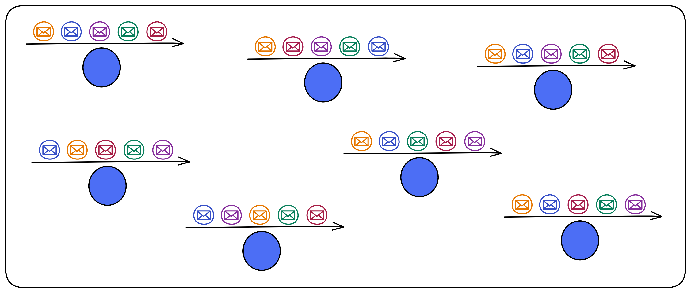
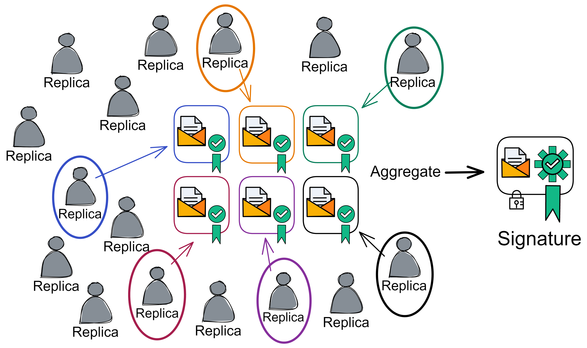
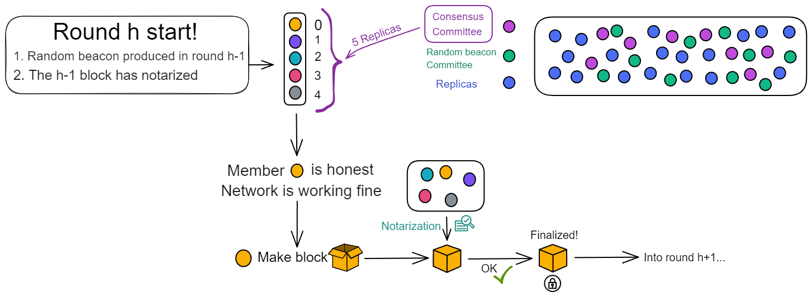
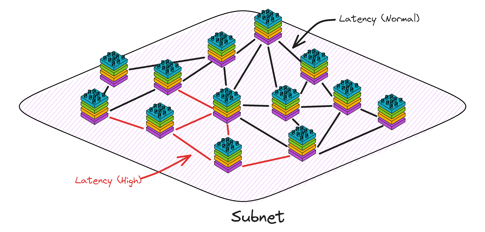
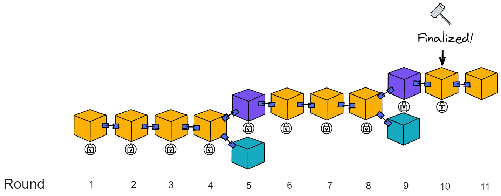

# Introduction to Consensus Layer

## What? PoUW? Isn't it Pow?

Consensus on IC ? Take a look at this term: PoUW, Proof of Useful Work.

Does it looks familiar to you?

Proof of Work (PoW) is the consensus algorithm of Bitcoin, which is very inefficient from today's perspective, but still it is relatively secure. 

What is Proof of Work ? 

Imagine a school organizing an competitive exam, only students who get full marks are eligible to put their names on the "Honor Wall" of the Education Bureau, they will be also rewarded with one full bitcoin! The school is open 24 hours a day, anyone can come and take the exam at any time, and the results will be released automatically after finishing all the questions. After one student gets full marks, the answer sheets of students who are still taking the exam will be immediately invalidated. That is because the answer (full mark paper) has already been born. In addition,other students must copy the full mark paper and then start the next exam.

In the school of PoUW, the candidates are randomly divided into several classes, and the exams are conducted in these classes. This time,not everyone can enter the school but only teachers can join. Each class completes a set of questions together. Since everyone is supposed to be an experienced teacher, they will roll the dice to decide who gets to do the first question, and who gets to do the second ... After finishing the questions, everyone has to discuss and reach a consensus on various opinions, and then hand in the papers eventually. Each person in the class shares the reward equally.

 

How efficient it is!😉😎

PoUW adds a 'U' to PoW, it significantly improves performance and reduces useless work for node machines. PoUW does not artificially create difficult hash calculations. It tries to put as much computing power as possible into serving users of the network. Most resources (CPU, memory) are used to execute codes in Canisters.

## How is consensus reached?

No matter what, Bitcoin is one of ancestors of the blockchain. Even though the consensus reaching speed is inefficient, it is a solution to distributed system issues.

Satoshi Nakamoto's Bitcoin is a feasible solution to the "Byzantine generals problem".

Simply put, this problem involves attempts to reach consensus on a course of action through information exchange in an unreliable network with potential threats. Satoshi Nakamoto's solution used the concept of Proof of Work to reach consensus without a centralized authority that needs to be trusted, representing a scientific breakthrough in distributed computing and transcending the widespread applicability of currency.

 

However, can consensus only be reached in this way? Is there a more efficient way with high security?

Let's talk about the essence of consensus.

 

The essence of consensus is to maintain data consistency in a globally distributed network.

Bitcoin's approach is that everyone competes for computing power to determine who gets to pack valid blocks, then everyone has to copy the winner's blocks. In this way, Bitcoin transaction ledgers will have multiple copies, and the goal of keeping data consistent across all nodes is achieved. However, the efficiency is very low.

 

Let's take a look at the logic of consistency here:

The goal: Maintain data consistency across all nodes.

The method: Rely on some means to select a node to pack the block, and others copy the block packed by that node. The same node cannot be selected repeatedly in a continuous way, and the process of getting selected to pack the blocks is random.

Let us analyse the purpose only. Since the purpose is to maintain data consistency between nodes, as long as the nodes receive messages at the same time, the problem will be solved.

In the actual network environment ,it could not be achieved. Information transmission always has varying delays, not to mention that nodes are not located in a same place. The locations of clients are also far and near,the transmission distances are different. It is chaotic and sounds impossible to guarantee that all nodes receive messages at the same time. What should we do?

The answer is simple. Building a "relay station" can solve this problem. No matter where the messages come from, they are first queued in the relay station, then the relay station sends the messages and execution order to the nodes. As long as the nodes execute the operations in the order received from the relay station, data consistency can be guaranteed!

It is not over yet! Since there is another big issue: Centralization. All nodes have to obey the commands of the relay station. If the relay station says to execute messages in the order of ABDC, the nodes have to follow ABDC. Going round and round a big circle, the result returns to its starting point. So how can we sort messages in a decentralized way?

 

Decentralizing is actually simple, that is, doing something completely independent of any other one. There is no "boss" or "manager".It is very democratic,  everyone works together to reach a consensus. Anyone who comes is allowed to pick up the jobs, and anyone who leaves will not affect the continuous operation of the system. (Unless everyone leaves, but with economic incentives, someone will always come!)

So how can we design it? The nodes need to reach consensus on the order of executing messages and we need to decentralize the working process of the relay station.

 

**IC is designed like this**: (IC abstracts nodes into replicas in subnets)

We could not rely on a relay station. Although the time for messages to arrive at each replica may be different (that is, the time of executing messages is different), all replicas must execute messages in the same order.

Then if everyone's order is different, which order should be executed? It will use random number to decide! (IC's Random Beacon)

IC uses a verifiable random function (VRF) at the base layer. It can generate unpredictable random numbers, and everyone can verify that the random numbers are not made by human.

VRF uses threshold BLS signature scheme. The threshold BLS signature algorithm uses DKG to distribute private key shares to replicas. This is a non-interactive distributed key generation protocol. DKG can distribute private key shares between members. There is no need for a trusted third-party, it does not depend on any member to distribute private key shares, avoiding single points of failure. Everyone uses the private key shares to sign information. Once the signature reaches the threshold, it can be aggregated into a complete signature. The signature process is non-interactive. Any third party can aggregate after receiving enough shares. Anyone can verify the signature with the unique public key. The public key is also recorded in the NNS registry.

 

If a message is confirmed, no matter which private key shares participate in the signature, as long as the threshold quantity is reached (the threshold for generating the Random Beacon is one-third), the final unique signature information can be aggregated. For example, the threshold in the following figure is 6. In order for the 16 replicas to generate the random beacon signature for this round, as long as the signature is greater than 6, it can be aggregated.

As long as the bad guys get less than one-third of the private key shares, they cannot interfere with the threshold BLS signature. It is also impossible to predict the signature result because the private key shares are not enough. That is to say, no one knows the signature result.

> The consensus of the subnet can resist up to less than one-third malicious replicas. If the malicious replicas are less than one-third, all they can do is sign or not sign, they are unable to interfere with the final result of the threshold signature, nor prevent the signature from being generated. If malicious replicas are greater than or equal to one-third, the subnet has been destroyed, so the random number does not matter. Therefore, the threshold for the random beacon is low, at one-third. The speed of generating random numbers can be faster.

- In the traditional RSA algorithm, you control the private key and the message is public, which is equivalent to knowing the signature result yourself. After the private key is leaked, others can also know the signature result in advance.
- However, in the threshold BLS  signature algorithm, a group of people control the private key shares. The signer himself does not have the complete private key, so he does not know the signature result. Only after everyone has signed and aggregated ,then they know the signature. Throughout the process, no one knows the global private key, but the signature result is the result recognized by most people. A group of people generate signatures, and no individual can predict the signature result. A single person cannot prevent the signature from being released.

 

This can serve as Random Beacon to provide a reference for which replica to produce a block. This random number is also a consensus result and cannot be tampered with by a single person. Moreover, this can continuously safely generate random numbers, as long as different information is used for each round of signatures. This different information is naturally the random beacon and some block dkg_ids of the previous round, so that the information signed in each round is different.

IC's random beacon, notarization, finality, random tape, and certified copy status all use threshold BLS signatures. (The random tape and certified copy status are content at the execution layer)

 

## Solution

Let us take a closer look on how IC's consensus protocol produces a block

### Preparation before block

The consensus protocol produce block by rounds. For example, consensus is reached on the genesis block in round 1, and round 6 for block 6.

Before start, the subnet first randomly selects some replicas to form a "consensus committee" according to the number of replicas. If the number of replicas is too low, all replicas will join the committee. The members in the committee are responsible for producing the blocks, so even if there are a large number of replicas in the subnet, it will not affect performance.

There is also the concept of "**epoch**" in the subnet. An epoch is approximately a few hundred rounds. The NNS can adjust the epochs for each subnet.

Each subnet operates within epochs that contain multiple rounds (typically around a few hundred rounds). Different replicas make up the committees in each epoch.

At the end of each epoch, the consensus committee members for the next epoch are selected through the random beacon, and the current consensus committee members will all become random beacon committee members in the next epoch.

 

The first block of the new epoch contains the list of consensus committee members and random beacon committee members for this epoch.

And at the beginning of the new epoch, the private key shares will be redistributed to the members. This process is called Pro-active resharing of secrets. There are two reasons for doing this:

- When the members of the subnet change, resharing can ensure that any new member will have new private key shares, and any member exiting the subnet will not have a new private key share.
- Even if a small amount of private key shares are leaked to attackers in each epoch, it will not threaten the consensus.

 

The number of consensus committees is related to the total number of replica members in the subnet. To improve scalability, in small-scale networks, committee members can be all replicas. In large-scale networks, committee members are part of all replicas and constantly changing in each epoch.

 

The number of consensus committee members cannot be too large or too small. Too few are insecure, too many affect the consensus speed.

So the relationship between the number of committees and the total number of members has a mathematical model to describe: When the total number of members in the subnet tends to infinity, the hypergeometric distribution tends to the binomial distribution, that is, non-replacement random sampling tends to replacement random sampling. Because the total number of replica members is infinite, there is no difference between replacement and non-replacement. If you are interested, you can read the introduction [here](https://github.com/NeutronStarDAO/ICCookBook-English/blob/main/src/2.CoreProtocol/RelatedConcepts/1.md).

 

Once the preparation is complete, blocks can be produced.

 

### Block Maker

At the start of each round, the random beacon generated from the previous round produces a ranking to determine the weight of members to produce blocks. The leader with the highest weight is given priority to produce blocks. (As shown in the figure below, the ranking assigns a number from 0 to 4 to the 5 consensus committee members, with 0 having the highest weight)

Under normal circumstances, the leader is honest and the network connection is normal. The leader is responsible for producing blocks. Others are waiting to notarize the leader's block. Even if block from the 2nd member is received, it will not be notarized until the leader's block is received.

At the same time, the random beacon committee will also package, sign and broadcast the hash of the previous round's beacon and the NiDKG record of this round. When the signature reaches the threshold, this round's random beacon is generated, which also determines the block production weight for the next round.

A non-genesis block generally contains:

- The messages received from the time the previous block was notarized to the time this block was packaged, called the "payload".
- The hash of the previous block.
- The ranking of the block-producing replica.
- The height of the block.

 

After the block is assembled, the replica responsible for producing the block will generate a **block proposal**, including:

- The block itself.
- Its own identity.
- Its own signature on this block.

Then broadcast the block proposal to other members.

The leader produces a block and broadcasts it to everyone. After notarization is completed, since only the leader's block is notarized, there is no need for finalization, and it enters the next round. This is the fastest and most common situation. About 1 second to finalize a block. (Optimistic responsiveness: The protocol will continue to execute based on actual network latency rather than the upper limit of network latency)

 

If after waiting for a period of time, the leader's block has not been received, it may be that the leader has a poor network or the machine has malfunctioned. Only then will members accept block from 2nd member or 3rd member and notarize their blocks.

The system has an agreed upon waiting time. If the leader's block is not received within a period of time, it will expect block 2 in the second time period. Then in the third time period, block 3 is expected. If block 3 is its own, then produce the block itself ...

 

### Notarization

**Notarization only verifies the reasonableness of the block**, and the notarized block does not represent consensus. This ensures that at least one block in the current round can be notarized.

Therefore, notarization does not mean consensus, nor does it require consensus. If multiple blocks have the same weight, these blocks will be signed.

 

During notarization, the members of the consensus committee verify the following three aspects:

1. The block should contain the hash of the block already notarized in the previous round.
2. The payload of the block must meet certain conditions (specific regulations on the payload content, these conditions are independent of the consensus protocol).
3. The ranking of the replica responsible for producing this block must correspond to the ranking in the random beacon (for example, if the replica ranked 2nd claims to be ranked first, then this block will not be notarized).

 

If the block information is correct, the replica responsible for verification first signs the block height and block hash, and then forms a "**notarization share**" with the just signed signature, hash, height, and its own identity. Broadcast the notarized shares.

Notarization also uses BLS threshold signatures. When a replica receives enough (the threshold is two-thirds) notarization share, it aggregates the signature share to form a notarization for this block.

The aggregated notarization information includes the block hash, block height, aggregated signature, and more than two-thirds of the identity identifiers. Replicas either find that they have collected enough notarization shares and aggregate them into notarizations themselves; or they receive aggregated notarizations from others.

After notarization, the block is still broadcast. When other members receive the notarized block, they will re-broadcast the notarized block and will not generate notarization shares for other blocks.

 

For example, in the figure below, the girl holding the cell phone and the blue hat enter the next round of consensus. When the girl sends messages to the other three people, the network is interrupted for 700 milliseconds. The message forwarded by the blue hat plays a key role. Otherwise, five missing three would not be able to work.

If the leader's block has a problem and the notarization fails, the weighting of the second block will now be the largest. If the blocks of the second member and the third member have both passed notarization, the leader of the next round will choose to produce block after the block with the greatest weight. As in round 5 and 6 below, the weight of the 2nd block is greater than the weight of the 3rd block. Adding up the weights of all blocks, the chain composed of yellow and purple blocks is the chain with the greatest weight.

 

In order to maximize efficiency, each replica has a "maximum waiting time" (Delay functions), which is the maximum waiting time before accepting new blocks or voting on blocks. After this time, it will not wait. The length of this waiting time varies from person to person, and is different for each replica.

If a replica does not receive messages for several consecutive rounds due to network latency, it is because its waiting time is too short. Before the message arrives, it does not wait. If the final confirmation fails, all honest replicas will wait a little longer until the final confirmation is received.

At this time, replicas can appropriately increase the delay and wait a little longer. This makes it more likely to receive messages in the next round.

### Finalization

Because sometimes more than one block may be generated (when the leader does not respond, the second and the third may produce block to save time). This requires a finalization. The finalization stage will determine the only block that everyone has notarized. Then the blocks before the block that everyone agrees with will also be implicitly finalized, and other branches will become invalid.

The finalization process is specifically:

After a replica finds a notarized block, it will check whether it has notarized any other blocks in this round. If it has not notarized any other blocks, it will broadcast a "finalization share" for the block. To prove that it has only issued a notarization share for this block.

To achieve the finalization of a block, two-thirds of different replicas need to issue finalization share, and then aggregate for the finalization of a block. The format of the finalization share is exactly the same as the notarization share (but marked in a specific way to prevent confusion). After receiving the finalized block, like the notarization process, it will broadcast to other members again.

Note: The replica does not deliberately wait for the aggregation of the finalization share into the finalized before entering the next round. After receiving a finalization share of a certain height, the replica only checks whether it has notarized blocks other than that block, and then broadcasts its own signed finalization share; or forwards the finalization share intact.

 

For example, after a replica receives the finalization share of round 10 in round 11, it will check its behaviour at that time and then broadcast a reply.

If after a while, if you receive the finalization of the block in round 10, you can implicitly consider all previous blocks as finalized.

These finalized blocks can be considered as safe confirmed by everyone, meaning that all replicas agree with the branch where the finalized block is located. At the height of block 10, only this block has passed notarization. Then the replica reaches consensus at this height.

 

For example:

If a replica only generates a notarization share for one block in Round 5, the replica will also issue a finalization share and then enter Round 6 consensus. If the finalization is received later, the branch containing the finalization is considered valid. If the block after finalization does not fork , there will be no problem without finalization.

It is possible that in Round 4, half of the replicas generated notarization shares for the leader and the 2nd blocks, and the other half of the replicas only generated notarization shares for the leader's block. Then the finalization share proposed by the replicas that only notarized the leader's block cannot reach the threshold and cannot obtain finalization. Only half of the replicas generate notarization shares for the 2nd member's block, so the 2nd member's block does not obtain notarization.

Compared with many other blockchains, the advantage of the IC consensus protocol is that it adopts asynchronous finalization. In other blockchains, nodes usually need to find the longest chain. If the chain forks, the nodes need to wait for a while to find the longest chain. If some blocks are missed due to network failures, the longest chain cannot be found, and data from other nodes needs to be synchronized.

The IC protocol does not rely on finding the "longest chain" to eventually confirm the block. IC's finality method only relies on cryptographic signatures, not on the confirmation of the entire chain. A small number of signatures can observe a block consensus formed without waiting for the confirmation of the entire chain. Forks can be eliminated in a short time, and finalization speeds can be achieved in less than one second.

 

**The consensus process is over here!**

 

To summarize, the members of the Consensus Committee need to do 3 things when entering a new round:

(1) See how they rank and then decide whether to produce block yourself

(2) Notarize the block

(3) Observe the blocks, find the main chain, and ignore invalid branches

The Consensus Committee will become a random beacon committee in the next period and be responsible for generating random beacons for each round.

 

The consensus process is for the leader to block, everyone verifies and then issues a notarization share, the notarization share reaches the threshold and aggregates into notarization, and enters the next round. Finalization does not have to be completed every round.

The IC consensus protocol ensures that when there are individual malicious attacks, IC's performance will flexibly decrease instead of directly freezing. The consensus protocol currently tends to maximize performance as much as possible in the "optimistic case" without failures.

As the protocol progresses round by round, the blocks connected from the genesis block form a chain that extends continuously. Each block contains a payload, consisting of a series of inputs and the hash of the parent block.

Honest replicas have a consistent view of the path of the blockchain. The blocks record the messages that have been sorted, which are sent by the message routing layer to the execution layer for processing.

 
 

|                       |             Classic public chain             |                    Consortium Blockchain                     |                      Internet Computer                       |
| :-------------------: | :------------------------------------------: | :----------------------------------------------------------: | :----------------------------------------------------------: |
|      Write order      |         Write first, then consensus          |                 Consensus first, then write                  |                 Write first, then consensus                  |
|   Typical algorithm   |                 PoW,PoS,DPos                 |                           PBFT,BFT                           |                             PoUW                             |
|   Consensus process   | Finalized when consistent (high probability) |         consistent confirmation before P2P broadcast         |          Select block nodes through random numbers           |
|      Complexity       |        High computational complexity         |                   High network complexity                    |                   High network complexity                    |
|        forked?        |                     Yes                      |                              No                              |                              No                              |
|  Security threshold   |                   One half                   |                          One third                           |                          One third                           |
|    Number of nodes    |  The number of nodes can change at any time  | The number of nodes cannot be changed arbitrarily, and the more the number, the lower the performance. | The number of nodes cannot be changed arbitrarily, and the large number has little effect on performance. |
| Application scenarios |              Non-licensed chain              |                        Licensed chain                        | Semi-licensed chain, decided whether nodes join by DAO voting |

## Comparison of several consensus algorithms

|    Consensus algorithm     |    PoW     |    PoS     |    DPoS    |   PBFT   |   VRF    |        PoUW        |
| :------------------------: | :--------: | :--------: | :--------: | :------: | :------: | :----------------: |
|      Node management       | No license | No license | No license | Licensed | Licensed | DAO voting license |
|     Consensus latency      |    High    |    Low     |    Low     |   Low    |   Low    |     Ultra low      |
|         Throughput         |    Low     |    High    |    High    |   High   |   High   |        High        |
|       Energy saving        |     No     |    Yes     |    Yes     |   Yes    |   Yes    |        Yes         |
|      Safety boundary       |    1/2     |    1/2     |    1/2     |   1/3    |   1/3    |        1/3         |
| Representative application |  Bitcoin   |  Ethereum  |  BitShare  |  Fabric  | Algorand | Internet Computer  |
|        Scalability         |    Good    |    Good    |    Good    |   Poor   |   Poor   |     Unlimited      |

