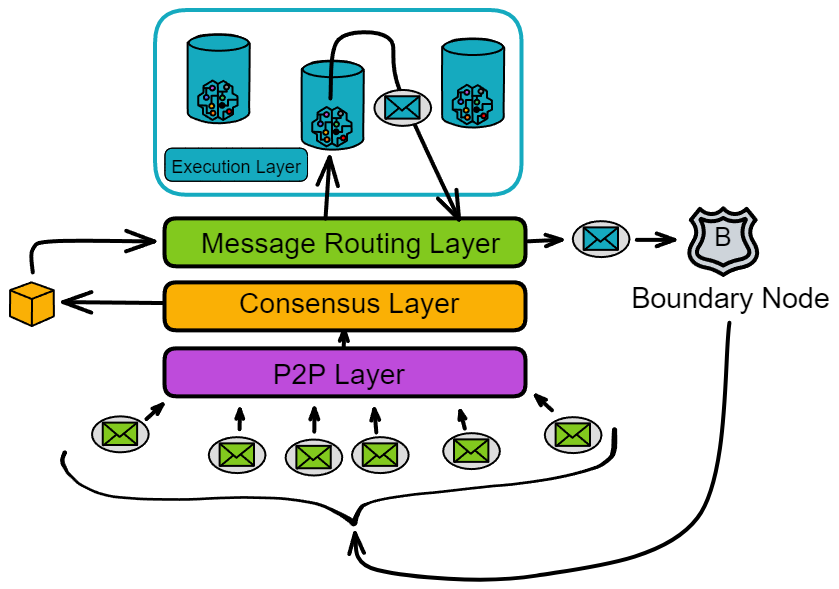

# Message routing layer

## Message relay station in the replica

The message routing layer, as its name suggests, is responsible for message transimission within a replica. It acts as an intermediary, interfacing between upper and lower layers.

### Introduction

The consensus layer packages messages into block payloads. Once a block is finalized, each replica in the subnet parses the payloads in the block. The message routing layer then passes the messages to the corresponding canisters in the execution layer. After executing the messages, the canisters update their internal state and return message responses to the message routing layer.

The messages received by the message routing layer are of two types:

One type is messages from users, called **ingress messages**. The other type is messages from canisters in other subnets, called **cross-subnet messages**.

The messages **sent** by the message routing layer are also of two types:

One is responses to user messages, called **ingress message responses**. The other type is still **cross-subnet messages**, which are messages sent by canisters in its own subnet to canisters in other subnets.

### Message queues

Each canister in the execution layer has an input queue and an output queue. The message routing layer routes the payloads in the blocks to the input queues of the target canisters.

Each canister has its own **input queues** and **output queues**.

- **Input queues**:

The input queues contain: messages from users, inter-subnet messages from canisters in other subnets, and messages from other canisters in the subnet.

Each round, the canister executes some messages from the input queues and puts the message responses into the canister's **output queue**.

- **Output queues**:

The output queues contain: responses to user messages, messages sent to canisters in other subnets, and messages sent to other canisters within the subnet.

When the message routing layer takes messages from the message queues and puts them into the **subnet-to-subnet streams**, the **crossnet transfer protocol** is responsible for actually transferring these messages to other subnets.

In addition to the output queues, there is an **ingress history** data structure. It records in a hash tree called the "**Per-round certified state**". The ingress history only records the responses after the canister executes the messages so that users can get responses to their messages.

> Note: The ingress history does not retain a complete history of all ingress messages. It only retains the response messages after execution.

Looking at the message routing and execution layers separately, it looks like this:

### Intra-subnet cross-canister call

In addition to cross-subnet messages, there are also messages from one canister calling another canister in the same subnet, called **intra-subnet messages**. The message routing layer forwards these messages directly from the output queue to the input queue of the corresponding canister without an extra round of consensus.

Q: So why do messages from canisters to other subnets require consensus, but messages from canisters to the same subnet do not need consensus?

A: Because these state-changing operations are within the subnet. 😂

Think about it, the data states in the replicas are the same, and consensus is also to ensure the consistency of the data in the replicas. After the replicas reach consensus, each honest replica will execute intra-subnet cross-canister calls, and everyone will execute cross-canister calls together. This is still a consistent operation.

Consensus is used when everyone faces different choices to make everyone execute the same operation.

So when a canister in a subnet calls another canister within the same subnet, each replica will make the same cross-canister call. Each replica stores all the data in the subnet. When the replicas execute cross-canister calls, the consistency of data in the subnet is still maintained.

### Summary

The state of a subnet's replica  includes the state of canisters and the "system state". The "system state" includes the input and output queues of canisters, subnet-to-subnet streams, and ingress history data structures.

In other words, the message routing layer and the execution layer together maintain the state of a replica. And the state of the replica is updated in a completely deterministic manner, so that all replicas in the subnet maintain the same state. The consensus layer does not need to keep exactly the same progress as the message routing layer.

### Per-round certified state

In each round, the state of each replica in the subnet will change.

Of course, the parts that change in each round also need to be recorded separately. Because IC's consensus only guarantees that honest replicas process messages in the same order. Consensus only acts as a "gatekeeper" before messages enter the execution layer, but after message processing, the output is still lacking a "guard": What if message responses are not sent successfully due to network issues? How does the client verify the authenticity of messages after receiving them? If the message response is made by a hacker, there will be some troubles. What if a strange bug in the server system causes the message not to execute...

Replicas need to check the state again after processing messages. The per-round certified state, also known as the system state tree, acts as this guard and is the last link in a complete round. The per-round certified state can record the state changes of replicas in a round and rebroadcast it to everyone for threshold signature verification, which requires confirmation from two-thirds of the replicas.

After executing messages in every one round, each replica hashes its own generated per-round certified state, packages it into a Merkle tree, and signs it with a private key share. Once two-thirds of the signature share are collected, they are aggregated into a complete signature as the certificate of the per-round certified state for that round.

> Q: Does this consensus algorithm reach agreement only on the inputs to computation, or also on the outputs of computation?
>
> A:  For inputs, they are blocks. For outputs, they are ceritifications. So yes, both inputs and outputs must go through consensus, otherwise we risk divergence.

The per-round certified state includes:

- Cross-subnet messages added to subnet-to-subnet data streams in this round
- Other metadata, including the ingress history data structure
- The root hash of the Merkle tree of the previous per-round certified state

The first branch stores various metadata about each canister (but not the full replica state of the canister).

The second branch stores the ingress history data structure.

The third branch stores information about subnet-to-subnet data streams, including a "view" of new cross-subnet messages added to each stream.

Other branches store other types of metadata, which are not discussed here. This tree structure can then be hashed into a Merkle tree.

Per-round state certification in IC has the following use cases:

- **Output authentication**. Cross-subnet messages and ingress message responses can be authenticated using per-round certified state. Using the Merkle tree structure, a single output (cross-subnet message or ingress message response) can be authenticated by any party by providing the threshold signature on the root and the hashes on the path (and adjacent) from the root to the leaf in the Merkle tree. Therefore, the number of hashes required to authenticate a single output is proportional to the depth of the Merkle tree, which is usually very small even for very large hash trees. Thus, a single threshold signature can be effectively used to verify many individual outputs.
- **Preventing and detecting non-determinism**. Consensus ensures that each node processes inputs in the same order. Because each replica deterministically processes these inputs, each replica should reach the same state.

However, IC adds an extra layer of robustness by design to detect and prevent any (unintended) non-deterministic computation if it actually occurs.

Among them, the per-round certified state is part of this mechanism, because we use $(n-f)/n$ threshold signatures to certify, and $f < n/3$, so only a single state sequence can be certified.

To understand why chaining states is so important, consider the following example. Suppose we have 4 replica nodes $P_1, P_2, P_3, P_4$, where one replica $P_4$ is malicious. $P_1, P_2, P_3$ start with the same initial state.

- In round 1, due to non-deterministic computation, $P_1$ and $P_2$ both start computing a message $m_1$ to send to subnet A, while $P_3$ computes $m'_1$ to send to subnet A.
- In round 2, $P_1$ and $P_3$ both start computing message $m_2$ to send to subnet $B$, while $P_2$ computes message $m'_2$ to send to subnet $B$.
- In round 3, $P_2$ and $P_3$ both start computing message $m_3$ to send to subnet $C$, while $P_1$ computes message $m'_3$ to send to subnet $C$.

As express below:

$$ P_1\ \ m_1 \rightarrow A\ \ m_2 \rightarrow B\ \ m'_3 \rightarrow C \ P_2\ \ m_1 \rightarrow A\ \ m'_2 \rightarrow B\ \ m_3 \rightarrow C \ P_3\ \ m'_1 \rightarrow A\ \ m_2 \rightarrow B\ \ m_3 \rightarrow C \ $$ 

Let's say $P_1,P_2,P_3$ each executes a valid sequence of computations, but due to non-determinism, these sequences are not the same. (Even though there should be no non-determinism, we still assume its existence in this example.)

Now suppose we do not chain these states. Because $P_4$ is malicious and can sign anything, it can create a $3/4$ threshold signature in state round 1 claiming "$m_1\rightarrow A$", similarly claim "$m2 \rightarrow B$" in state round 2, and claim "$m_3\rightarrow C$​" in state round 3, despite the corresponding sequence$$ m_1 \rightarrow A, m_2 \rightarrow B, m_3 \rightarrow C $$  may not be compatible with any valid sequence. Worse yet, this invalid computation sequence may have led to inconsistent states across other subnets.

By chaining, we ensure that even with some degree of non-determinism, any authenticated sequence of states corresponds to some valid sequence executed by honest nodes.

Suppose there are 4 replicas, namely $P_1$, $P_2$, $P_3$ and $P_4$, where $P_4$ is assumed to be malicious. Initially, the states of $P_1$, $P_2$, and $P_3$ are the same.

Over the next few rounds, each replica starts computing some messages and sending them to different subnets, namely A, B and C.

- However, in round 1, $P_1$ and $P_2$ start computing message $m_1$ while $P_3$ computes a different message $m'_1$.
- In round 2, $P_1$ and $P_3$ start computing message $m_2$ while $P_2$ computes a different message $m'_2$.
- Finally, in round 3, $P_2$ and $P_3$ start computing message $m_3$ while $P_1$ computes a different message $m'_3$.

Therefore, each replica computes different messages and their state sequences are not the same. In this example, we assume that there is some non-determinism in the computation that leads each replica to compute different messages and state sequences.

Without addressing this issue, replica $P_4$ can sign whatever it wants since it is malicious.

If we did not chain the states, $P_4$ could:

- Sign a threshold signature claiming “$m_1\rightarrow A$” in round 1,
- Sign a threshold signature claiming “$m_2\rightarrow B$” in round 2,
- Finally sign a threshold signature claiming “$m_3\rightarrow C$” in round 3.

Even though this sequence of signed messages is invalid and incompatible with any valid sequence, the malicious replica can still forge signatures.

By chaining the states, we ensure that any authenticated sequence of states corresponds to some valid sequence executed by honest replicas, even with some degree of non-determinism. This prevents the malicious replica from abusing its signing rights to nake invalid state sequences and prevents inconsistent states across subnets.

The consensus layer ensures that replicas process messages in a same order. However, during execution, machine failures, unknown system bugs, etc. Could interfere, resulting in failure to execute certain messages.

Therefore, to ensure that each replica processes messages correctly, after a canister executes a message, the executed message must be recorded so that replicas can verify each other.

//From WhitePaper.

**Coordination with consensus.** The per-round certified state is also used to coordinate the execution and consensus layers, in two different ways: 

1. Consensus throttling. Each replica will keep track of the latest round for which it has a certified state — this is called the certified height. It will also keep track of the latest round for which it has a notarized block — this is called the notarized height. If the notarized height is significantly greater than the certified height, this is a signal that execution is lagging consensus, and that consensus needs to be throttled. This lagging could be due to non-deterministic computation, or it could just be due to a more benign performance mismatch between the layers. Consensus is throttled by means of the delay functions discussed in Section 5.9 — specifically, each replica will increase the “governor” value  as the gap between notarized height and certified height grows (this makes use of the notion of “locally adjusted delay functions, as in Section 5.12.2). 
2. State-specific payload validation. As discussed in Section 5.7, the inputs in a payload must pass certain validity checks. In fact, these validity checks may depend to a certain degree on the state. A detail we skipped is that each block includes a round number, with the understanding that these validity checks should be made with respect to the certified state for that round number. A replica that needs to perform this validation will wait until the state for that round number has been certified, and then use the certified state for that round to perform the validation. This ensures that even with non-deterministic computation, all replicas are performing the same validity tests (as otherwise, consensus could get stuck).

### Query calls & Update calls

As we have described it so far, ingress messages must pass through consensus so that they are processed in the same order by all replicas on a subnet. However, an important optimization is available to those ingress messages whose processing does not modify the replicated state of a subnet. These are called **query calls** — as opposed to other ingress messages, which are called **update calls**. 

Query calls are allowed to perform computations which read and possibly update the state of a canister, but any updates to the state of a canister are never committed to the replicated state. As such, a query call may be processed directly by a single replica without passing through consensus, which greatly reduces the latency for obtaining a response from a query call. 

Note that a response to a query call is not recorded in the ingress history data structure. As such, we cannot directly use the per-round certified state mechanism to authenticate responses to query calls. 

However, a separate mechanism for authenticating such responses is provided: **certified variables**. As a part of the per-round certified state, each canister on a subnet is allocated a small number of bytes, which is the certified variable for that canister, whose value may be updated via update calls, and may be authenticated using the per-round certified state mechanism. Moreover, a canister may use its certified variable to store a root of a Merkle tree. In this way, a response to a query call to a canister may be authenticated so long the response is a leaf in the Merkle tree rooted at the certified variable for that canister.

.....//Unfinished here

