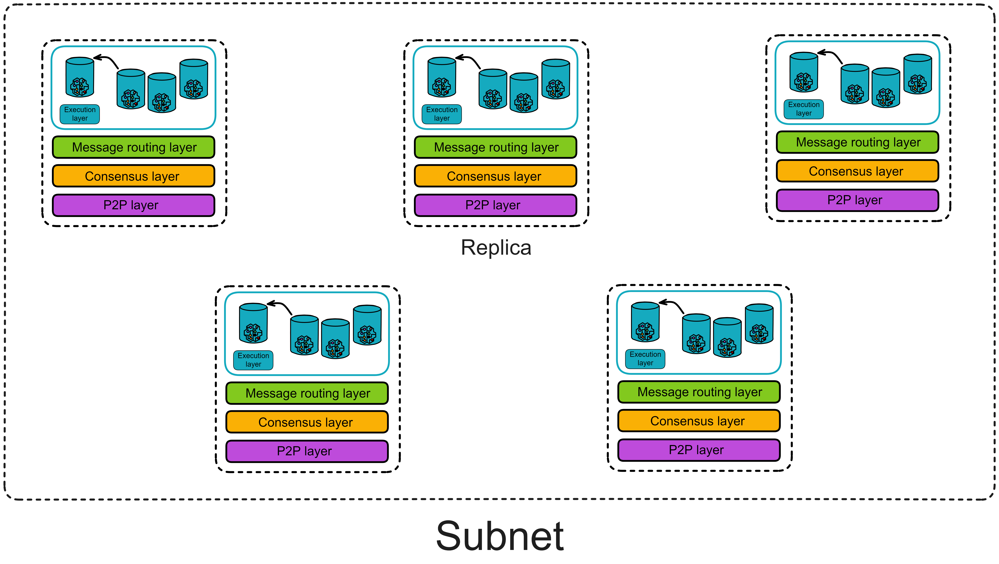

# Message routing layer

## Message relay station in the replica

The message routing layer, as its name suggests, is responsible for message transimission within a replica. It acts as an intermediary, interfacing between upper and lower layers.

### Introduction

The consensus layer packages messages into block **payloads**. Once a block is finalized, each replica in the subnet parses the payloads in the block. The message routing layer then passes the messages to the corresponding canisters in the execution layer. After executing the messages, the canisters update their internal state and return message responses to the message routing layer.

The messages received by the message routing layer are of two types:

One type is messages from users, called **ingress messages**. The other type is messages from canisters in other subnets, called **cross-subnet messages**.

The messages **sent** by the message routing layer are also of two types:

One is responses to user messages, called **ingress message responses**. The other type is still **cross-subnet messages**, which are messages sent by canisters in its own subnet to canisters in other subnets.

### Message queues

Each canister in the execution layer has an input queue and an output queue. The message routing layer routes the payloads in the blocks to the input queues of the target canisters.

Each canister has its own **input queues** and **output queues**.

- **Input queues**:

The input queues contain: messages from users, inter-subnet messages from canisters in other subnets, and messages from other canisters in the subnet.

Each round, the canister executes some messages from the input queues and puts the message responses into the canister's **output queue**.

- **Output queues**:

The output queues contain: responses to user messages, messages sent to canisters in other subnets, and messages sent to other canisters within the subnet.

When the message routing layer takes messages from the message queues and puts them into the **subnet-to-subnet streams**, the **crossnet transfer protocol** is responsible for actually transferring these messages to other subnets.

In addition to the output queues, there is an **ingress history** data structure. It records in a hash tree called the "**Per-round certified state**". The ingress history only records the responses after the canister executes the messages so that users can get responses to their messages.

> Note: The ingress history does not retain a complete history of all ingress messages. It only retains the responses after update calls.
>
> The responses of query calls are not recorded in the ingress history (the ingress history only records the responses of update calls), so they cannot be verified by each round of authentication status. But IC provides another verification mechanism, called certified variables. We can store some important information using certified variables.
>
> If the content of a query call is a certified variable, then the query call is secure and verifiable. Because the certified variables of the Canister are also recorded in each round of authentication status after hashing. And each round of authentication status is consensus-based, meaning that this information is the same in all replicas in the subnet.

Looking at the message routing and execution layers separately, it looks like this:

## Intra-subnet messages

When a Canister sends information to Canisters in other subnets, this information is placed in the cross-subnet queue and verified by the subnet at the end of this round. The receiving subnet can confirm that the information is authorized by the sender by verifying the signature. These messages require consensus. IC implements cross-subnet communication using the Xnet protocol, which will be introduced in detail later.

### Intra-subnet cross-canister call

In addition to cross-subnet messages, there are also messages from one canister calling another canister in the same subnet, called **intra-subnet messages**. The message routing layer forwards these messages directly from the output queue to the input queue of the corresponding canister without an extra round of consensus.

So why do messages from canisters to other subnets require consensus, but messages from canisters to the same subnet do not need consensus?

Because these state-changing operations are within the subnet. 

Think about it, the data states in the replicas are the same, and consensus is also to ensure the consistency of the data in the replicas. After the replicas reach consensus, each honest replica will execute intra-subnet cross-canister calls, and everyone will execute cross-canister calls together. This is still a consistent operation.

Consensus is used when everyone faces different choices to make everyone execute the same operation.

So when a canister in a subnet calls another canister within the same subnet, each replica will make the same cross-canister call. Each replica stores all the data in the subnet. When the replicas execute cross-canister calls, the consistency of data in the subnet is still maintained.

**Guarantees provided by the message routing layer**

1. Cross-subnet messages must be delivered to the execution layer of the target Canister subnet at one time.
2. If a message cannot be delivered, a rejection response must be generated.
3. If a Canister A sends two messages m1 and m2 to Canister B, and if they are not rejected, it must be guaranteed that they are placed in Canister B's input queue in order.

## Summary

At this point, let's summarize. The state of a replica (subnet) includes the state of Canisters and "system state". The "system state" includes the input and output queues of Canisters, cross-subnet data streams, and the ingress history data structure.

In other words, the message routing layer and the execution layer together maintain the state of a replica. And the state of the replica is updated under fully deterministic conditions, so that all replicas in the subnet maintain exactly the same state. The consensus layer does not need to keep exactly the same progress as the message routing layer.

## Per-round certified state

In each round, the state of each replica in the subnet will change.

Of course, the part that changes in each round also needs to be recorded separately. Because IC's consensus only guarantees that honest replicas process messages in the same order. Consensus only guards before messages enter the execution layer, but the exit after message processing lacks a "guard": What if the message response is not sent successfully due to network issues? How does the client verify the authenticity of the message after receiving the message? If the message response is forged by hackers, it will be troublesome. In case the server system has strange bugs that prevent messages from being executed...

Replicas need to verify the state again after processing messages. The **per-round certified state**, also known as the system state tree, serves as the last guard in a complete round. The per-round certified state can record the state changes of replicas in one round, and re-broadcast a threshold signature to everyone for confirmation by two-thirds of the replicas.

Both input and output must be certified by consensus, otherwise there is a risk of divergence.

Therefore, in order to ensure that each replica processes the message correctly, after the Canister executes the message, the executed message must be recorded to allow the replicas to verify each other again.

After executing messages in each round, each replica hashes its own per-round certified state, packs it into a Merkle tree, and signs it with a private key fragment. Collect two-thirds of the signature fragments to aggregate into a complete signature. The state tree and the certified signature are called the per-round certified state.

Because the execution layer processes messages in the same way, theoretically each replica in the subnet will independently create the same tree.

The per-round state tree only contains some data information that has changed after each round of execution. The overall state of the replica is not in the per-round certified state.

Each round of certification states contains the following in this round:

- Various metadata about each Canister (such as the hash of wasm, etc., not the complete status of the Canister)
- The root node hash of the Merkle tree of the certification status of the previous round
- Intra-subnet messages added to the data flow between subnets
- Ingress history, various responses to messages
- The ID and public key of each subnet
- Current time
- Metadata

The consensus layer and execution layer of IC are separated and are two independent parts. The consensus layer and execution layer can also adjust their own rhythms and speeds. If the consensus is too fast and the execution layer accumulates too many messages to keep up with the consensus, message routing needs to notify the consensus layer to slow down. (It may be due to some bugs in the execution layer, etc.) **Here** we see how the consensus slows down.

How do you know if the execution layer is slow? Through the certification status of each round. Each replica will observe the round of threshold signature certification and the round of consensus reaching in each round. If the difference is too large, the speed must be reduced.

Just like the assembly line in a traditional factory, if one part slows down, the entire production line has to slow down. Otherwise, the backlog of messages to be processed will accumulate more and more.

## XNet Protocol

IC implements communication between subnets through the XNet protocol. In order to reduce the latency of message transmission, replicas tend to choose replicas closer to themselves for communication.

Simply put, cross-subnet messages are transmitted as follows:

After the Canister in the execution layer processes the message, it puts the cross-subnet message into the output queue. The message routing layer has a component called the **Stream builder**, which is responsible for forming cross-subnet messages into data streams. After **Per-round state** threshold signature certification, the XNet endpoint of the replica executes and sends. The **XNet endpoint** sends messages to the nearest replica of subnet B. After the replica XNet payload builder of subnet B receives the message, it broadcasts the payload. Then pack it out and reach consensus.

**The Stream builder** extracts messages from the Canister's output queue and queues the messages. It needs to meet determinism, orderliness and fairness:

1. Determinism: All replicas must reach consensus on the content of the stream. (Replicas perform threshold signature certification for each round of state certification)
2. Orderliness: If Canister A sends a request R1 to Canister B first, then sends a request R2, then R1 is ahead of R2 in the data stream.
3. Fairness: We do not want a Canister to occupy too much bandwidth. The Stream builder will try to give each Canister the same bandwidth.

The Stream builder sorts these messages according to the target subnet and forms message streams (one message stream per target subnet). Each message in the message stream has a unique increasing index.

After that,  **per-round certified state ** will certify the submitted state. After the certification is completed, the certified data stream can be sent to other subnets.

The **XNet endpoint** is responsible for sending certified messages to other subnets. The XNet endpoint is a component that provides messages to other subnets. It provides services through secure TLS connections and only accepts connections from other replicas. The XNet endpoint obtains a complete list of nodes, subnet allocation, IP addresses and public keys (for establishing TLS connections) from the registry.

If a replica of subnet B wants to get new messages from subnet A, it will choose the nearest replica of subnet A and send a request to this replica through the XNet protocol. XNet transmits information through the HTTPS protocol.

**The XNet payload builder** is responsible for receiving cross-subnet messages. As the name suggests, after receiving these messages, it will package them as payloads into blocks, reach consensus, execute ...

In addition to cross-subnet messages, user ingress messages and Bitcoin transactions (for subnets enabling Bitcoin integration) will also be packaged as payloads into blocks.

After combining and packaging these payloads into a block, the consensus protocol will verify the entire block and reach consensus. After the consensus is reached, the messages in the payload will be processed.

This is the process of transmitting messages from one subnet to another subnet. As shown in the figure below.

Garbage collection: After sending the messages, subnet A still needs to tell subnet B which messages have been processed so that subnet A can clear those messages that are no longer needed.

These components ensure that cross-subnet messages can be delivered correctly and implement secure and scalable blockchain communication.
