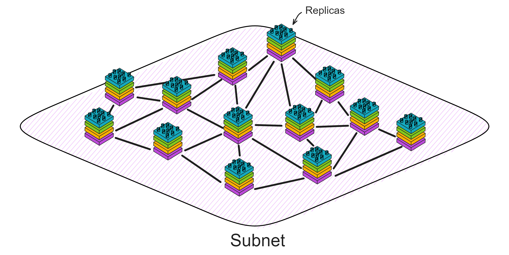
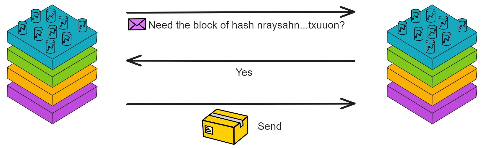
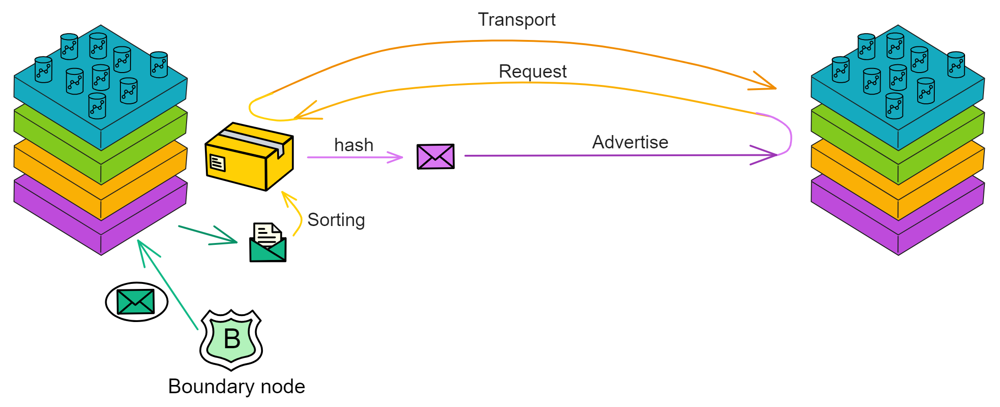
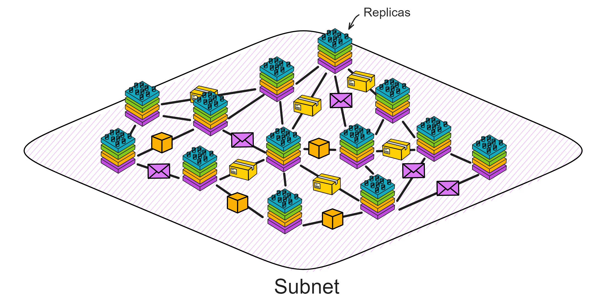

# Brief Description of the P2P Layer

The P2P layer is primarily responsible for transmitting protocol messages between replicas within a subnet. These messages include those required to reach consensus, such as block proposals and attestations, as well as ingress messages from the message routing layer. When edge nodes send messages, the P2P layer of the replica receives and broadcasts these messages.

There are two main types of these messages: one is the signed messages used to reach consensus, and the other is the input messages sent by user clients. For input messages sent by users, the P2P layer will arrange them in order so that the consensus layer can package the data into payloads and generate blocks in order.

## Artefacts

For example, we have a neutron star express company (IC), and the P2P layer is the distribution network of the express company, responsible for transmitting parcels (information) between distribution points (replicas) in different regions (subnets). 

The P2P layer is a broadcast channel. The design of the P2P layer ensures that if an honest distribution point (replica) broadcasts a message, the message will eventually be received by all honest replicas in the subnet. Even if someone tries to maliciously interfere or the network is occasionally interrupted, the parcel can still be delivered efficiently to the recipient. Even if some replicas fail, it cannot affect the mutual communication between honest replicas. 

Each delivery terminal (replica) has some parcels, these parcels are "artefacts". So each delivery terminal (replica) has an "artefact pool" to store its own information. Artefacts are the information used by the delivery terminals to create, verify and reach consensus. This information can be consensus block proposals, user ingress information or response signatures for HTTPS external calls. The delivery terminals will distribute these parcels to other delivery terminals so that they all know the status of the subnet.

delivery terminals, the P2P layer is called. This is like a express company manager (such as a component of the consensus layer) notifying the delivery staff that they need to send out a new parcel. For example, now a delivery terminal (replica) has created a new block proposal and needs to send it to other delivery terminals in the subnet. Or, for example, a delivery terminal (replica) receives a parcel from another delivery terminal and then forwards it elsewhere.

## Advertise-Request-Deliver

> The P2P layer is responsible for ensuring high throughput, which is more important than low latency.
>
> However, in the consensus protocol, some messages, especially block proposals, are very large. And according to the consensus protocol, for security reasons, these messages will be repeatedly broadcast by all replicas.

They hope to deliver a large number of parcels as fast as possible (high throughput), but also consider transportation costs (bandwidth).

The express company adopts a advertise-request-deliver mechanism to improve efficiency. When a delivery terminal (replica) has an important parcel (large message) to send, they will not send the parcel directly. Instead, they will send a parcel list (adverts) to inform other delivery terminals that there is an important parcel. When other delivery terminals receive this list and confirm that this is the parcel they need, they will actively contact the sending delivery terminal (request) and request to deliver the parcel (deliver). This process may sacrifice some time (latency), but it can save transportation costs (reduce bandwidth usage). For small parcels (messages), it is not worth sacrificing latency to pursue bandwidth. You can skip the advertisement and send the message directly.

> In order to save bandwidth, the P2P layer will create a short message called Advertisements, which is very small and only contains the hash value of the artefact and some metadata. Then these messages are broadcast to other replicas. When other replicas receive the advertisement, they will determine whether they want to download the relevant artefact. If the answer is yes, they will send an explicit request message to the replica that issued the advertisement.

If this express company operates well and develops into a very large scale, containing many delivery terminals. At this time, the advertise-request-deliver mechanism can run on an overlay network. In this **overlay network**, each delivery terminal only sends parcels to their partners (peer nodes/peers). When a delivery terminal wants to broadcast a parcel, it will first tell the parcel list to its partners. Those partners may request the delivery of the parcel after receiving the list, and under certain conditions, tell the parcel list to their partners. This is like a gossip network, one passes ten, ten passes a hundred. If the number of replicas in the subnet is small, the advertisement will be sent to all replicas in the subnet.

The express company (P2P network) can effectively reduce transportation costs (bandwidth usage) at the cost of a certain delay, achieving the goal of high throughput. This is very important for an efficient express company (distributed network system).

But don't be careless. In order to ensure that each parcel is complete, secure and efficiently delivered, each advertisement contains an integrity hash value, like the barcode of the parcel. After downloading the parcel, the delivery terminal will check the downloaded content to ensure that it matches the hash value in the advertisement, so as to ensure the integrity of the parcel.

Of course, relying solely on hashes is not secure enough. Malicious delivery terminals may send an advertisement and then send a forged parcel with a hash value that matches the hash value in the advertisement. At this time, the delivery terminal needs to check that the parcel meets the requirements (for example, check if the parcel has the correct signature) before further processing or forwarding it to other delivery terminals to ensure that the parcel is secure.

When it is found that the received advertisement has a problem or when joining a new subnet, the delivery terminal will send a retransmission request to other delivery terminals. This request can be sent to a specific delivery terminal or to all delivery terminals. The request contains information about the current status, and other delivery terminals can help the delivery terminal update its status by sending advertisements. Learn more [here](Relatedconcepts/P2PLayerAndMaliciousAttack.md).

## Chunks

Sometimes some parcels (such as state synchronization artefacts) are too large to send as a whole. We can cut them into several small data blocks (Chunks), and then use an advertisement to represent these data blocks.

When downloading these data blocks, the delivery terminal will try to download the corresponding data blocks from multiple delivery terminals that have issued advertisements. This can speed up the download speed and make better use of bandwidth. Blocked parcels will undergo verification of individual blocks and the whole, and the corresponding delivery terminals will be responsible for verifying individual blocks.

## Re-request

Courier companies need to ensure that parcels are delivered on time. Sometimes, for some reason, the parcel list (announcement) may have problems during the journey, such as the courier forgetting to scan the bar code of the parcel, the delivery is overdue or the parcel list is lost. Or when new delivery terminals are added to the subnet.

At this time, the delivery terminal needs to send a "re-request", similar to asking: "Hey, did I miss any parcels? Did I miss any information? Please send it to me again."

Other delivery terminals can send the information he missed to him. Although re-requests are mainly to help delivery terminals synchronize missed parcels, delivery terminals will regularly send such requests to ensure accurate parcel delivery.

## Transport

The core business of courier companies is to transport parcels between locations. The transport component at the P2P layer, which is the transport tool (trucks, airplanes, etc.) of the courier company, is responsible for transporting parcels from one place to another. These means of transport create TLS-based TCP connections between delivery terminals, and both parties verify their identities with their own private keys. The transport layer protocol will choose appropriate methods according to network conditions, parcel size and other factors to ensure that parcels can be smoothly transported (Transport). The protocol has certain fault tolerance and ability to handle network failures.

In order for delivery terminals to know which delivery terminals they should connect with, courier companies need to maintain a "roster" (NNS Canister registration) containing information about all delivery terminals. This roster will contain the address of the delivery terminal and a special identifier for identity verification.

> Each replica has its own public key, stored in a place called the "Network Nervous System" (NNS). To prevent DOS attacks, replicas only connect with other replicas in the same subnet. Connections between replicas will be adjusted according to NNS records.
>
> The NNS registry also contains the latest subnet membership information (which replicas belong to which subnet) and historical information. Replicas query the NNS registry to learn about their own membership, replicas, IP addresses, and public keys. When establishing a TLS connection, replicas can ensure that they only connect to other replicas in the same subnet, enabling two-way identity verification.

Over time, courier companies may open new delivery terminals or close some old delivery terminals. Therefore, the transport component needs to constantly track these changes and accordingly adjust the connections with the delivery terminals.

In addition, the transport component also needs to ensure that communication lines are unobstructed and automatically re-establish contact in case of problems. The transport component provides a mechanism to maintain stable connections, can quickly detect connection problems (through heartbeat mechanisms), and automatically re-establish connections when connections are disconnected. When a TCP connection is idle for more than 200 milliseconds, the system will send a heartbeat message. On the receiving end, if no data (including heartbeat messages) is received within 5 seconds, the connection will be disconnected and reconnection will be attempted. This avoids the possibly very long timeout of the TCP protocol, which sometimes occurs when Internet routing changes. After successfully re-establishing the connection, a retransmission request will be sent to the corresponding replica.

Sometimes, the transport component will also connect with delivery terminals (replicas) that have just been deleted from the registry until the consensus layer no longer needs such connections.

## Summary

The P2P layer efficiently transports parcels through the announcement-request-delivery mechanism, while using integrity hash values and other checks to ensure the correctness of parcels. The transport component is responsible for transmitting parcel information between couriers and sorting centres. It uses a method called retransmission request to ensure that no critical information is missed, and performs identity verification and reconnection when needed. It provides an efficient, secure and stable communication basis for information transmission through various mechanisms.

