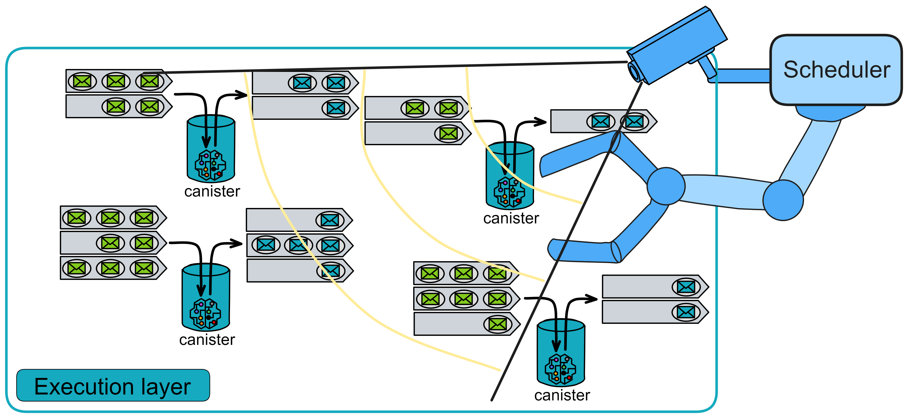
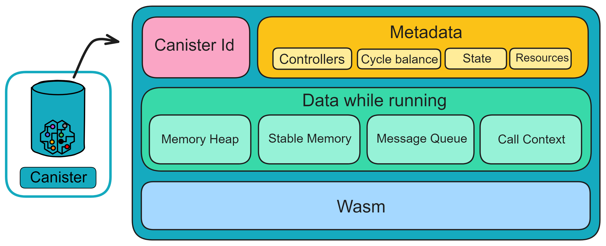
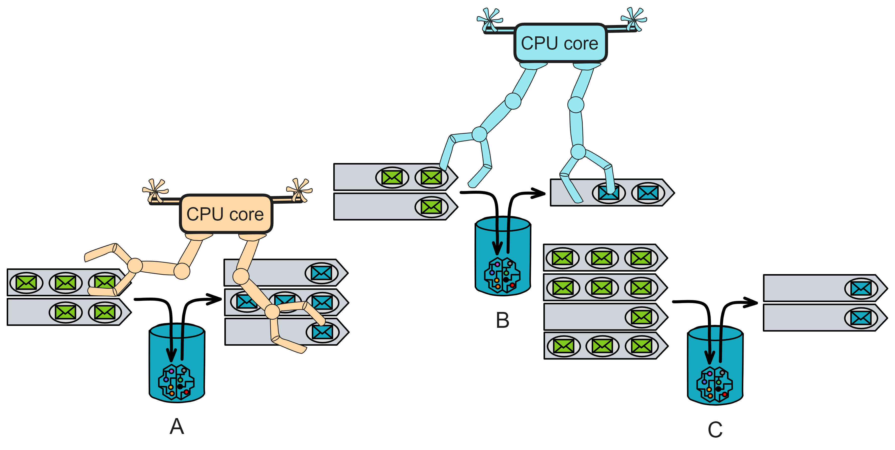
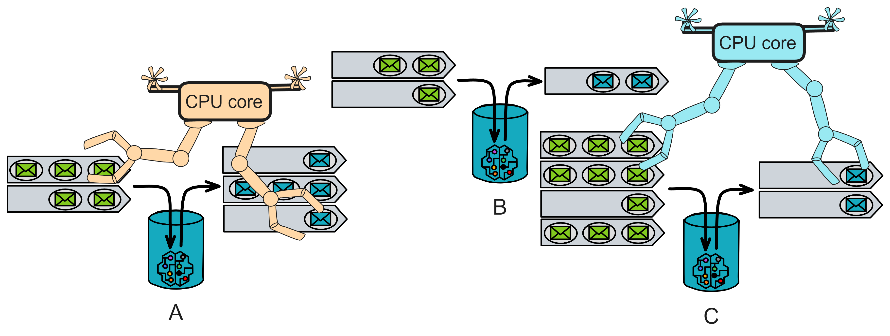

# Execution Layer

The execution layer is responsible for executing smart contracts. On IC, a smart contract is a virtualized container: Canister.

## Introduction

IC works in rounds, with each round triggered by the consensus layer reaching agreement on a set of message blocks.

At the beginning of each round, messages are assigned to the input queues of contracts according to their destinations. Subnet messages are assigned to the subnet input queue. The scheduler will sort these messages for execution. Each time the subnet state is processed in a round, the execution will end when the limit is reached.

The scheduler can fairly allocate workloads between Canisters and give priority to Canisters that need to optimize throughput. When a Canister is scheduled to execute, it will be assigned an available CPU core and execute the messages in the input queue one by one until all messages are processed. Then, the scheduler selects the next Canister for execution until the instruction round limit is reached or there are no Canisters left to schedule.

The execution environment monitors resource usage and deducts corresponding Gas fees from the Canister's balance.

For security and reliability, each Canister executes in an isolated sandbox environment. When executing each individual message, the scheduler starts the sandbox process hosting the Canister and executes the provided message. Executing each message may send new messages to other Canisters, modify the Canister's memory pages, or generate a response. The execution environment charges according to the number of instructions consumed by the Canister.

As shown in the figure above, for more details about Canisters, please refer to **Chapter 4**.

To manage the execution time of Canisters, the IC limits the number of instructions executed by each Canister. Each Canister has a fixed number of instructions in each round. At the end of a round of execution, the Canister's execution will pause and continue in the next round. To prevent Canisters from occupying too many resources, the maximum number of instructions that can be executed in a single call of each Canister is limited. If the limit is exceeded, the execution will be terminated, the state of the Canister will be rolled back, and the consumed Cycles will be deducted.

The execution environment also limits the number of heap pages that a Canister can modify in each round. However, after a Canister exceeds the limit, the execution result will still be saved, just no subsequent operations will be performed. Only when the number of heap memory pages a Canister plans to modify is less than the limit will subsequent operations be performed.

## Scheduler

The scheduler is like a brain that is responsible for arranging the execution order of Canisters running on the execution layer. The scheduler needs to do the following:

1. It must be deterministic, that is, under the same conditions, its decisions must be the same every time.
2. It needs to fairly allocate workloads between Canisters.
3. It should prioritize overall processing speed rather than the execution speed of a single task.

To allow Canisters to respond quickly even when the system is busy, they can choose to prepay a certain amount of computing resources. Each Canister has its own allocation of computing resources, which is like a small part of a CPU core. Only part of the subnet's computing power can be allocated so that Canisters that have not pre-allocated computing resources can also be executed.

Fairness means ensuring that each Canister can obtain its allocation of computing resources and distribute the remaining computing resources evenly. The scheduler will select several Canisters to execute a complete round. In one round, Canisters will either complete executing all their tasks or reach the instruction limit.

The scheduler will use the cumulative points accumulated by each Canister over multiple rounds as priorities. At the beginning of each round, each Canister will receive a certain number of points, including their allocation of computing resources and the average share of the remaining computing resources. The scheduler will allocate Canisters to CPU cores for execution in a polling manner and deduct 100 points from Canisters that have executed a full round.

**Here is an example:**

Assume there are three Canisters: A, B and C. Each replica has 2 CPU cores. Each Canister has an input queue for receiving messages to be processed. The scheduler handles the execution of these Canisters.

1. At the beginning of the round, the input queues of Canister A, B and C have 5, 3 and 10 messages respectively. The scheduler will evaluate these messages and sort them for execution.
2. Assume the scheduler first chooses Canister A for processing. It will allocate an idle CPU core to Canister A and execute the messages in Canister A's input queue one by one. After all messages (5) of Canister A have been processed, the scheduler will mark Canister A as completed.
3. Without waiting for Canister A to complete, the scheduler can allocate a core to Canister B after allocating a core to A. It allocates another core to Canister B and executes the messages in Canister B's input queue one by one. After all messages (3) of Canister B have been processed, the scheduler marks Canister B as completed. Then it allocates the CPU core to Canister C.
4. Finally, according to its own rules, the scheduler selects Canister C for processing. It will allocate an idle CPU core to Canister C and start executing the messages in Canister C's input queue one by one. At this point, after processing 6 messages, Canister C reaches the instruction limit for this round. The scheduler will mark Canister C as incomplete, suspend execution, and continue in the next round.
5. At the beginning of the next round, the scheduler will evaluate the input queues of all Canisters, including the unprocessed messages of Canister C. Then, according to priorities, accumulated shortages and other factors, it will schedule to ensure fair and efficient allocation of tasks.

Canisters are single-threaded, and multiple Canisters can run in parallel on multiple cores. If there are 300 CPU cores, the scheduler will try to run different Canisters on these cores as much as possible. On each CPU core, Canisters will be executed one by one until the limit is reached.

Each Canister has an independent state, and communication between Canisters is asynchronous. This gives IC scalability similar to traditional cloud services. By increasing the number of subnets, IC can achieve horizontal scaling.

## Cycles cost

When performing tasks, Canisters consume resources such as CPU, network bandwidth, and memory usage. These resource consumptions are measured by "Cycles".

Technically, the Wasm bytecode running in smart contracts is checked when installing or updating Wasm bytecode to the IC to count the number of instructions required to execute smart contract messages. This can calculate the amount of Cycles required to execute the message. Using Wasm as the bytecode format for smart contracts helps achieve determinism to a large extent because Wasm itself is essentially deterministic during execution. Most importantly, Cycles billing must be completely deterministic, so that the number of Cycles billed by each replica for a given operation is exactly the same and maintains the replica state machine properties of the subnet.

The memory used by smart contracts, whether Wasm bytecode or smart contract state, needs to be paid for through Cycles. Network activities such as receiving ingress messages, sending XNet messages, and making HTTPS calls to Web 2.0 servers are also paid for by smart contracts through Cycles.

Compared with other blockchains, the cost of storing data on the IC is quite low (of course, cheaper than Arweave, Ar, which specializes in storage, and others).

Cycles are a price-stable token anchored to the **SDR**. 1 SDR = 1 Trillion Cycles = $10^{12}$ Cycles

## Consumption of resources of Canister

Each Canister has a Cycles account, and Canisters can hold, send and receive Cycles. The billing standards are controlled by the NNS and can be adjusted through voting proposals. Consumption of Cycles includes the following:

1. **Execution fee**: When a Canister processes a request (calls a Canister function), a fee is charged according to the number of instructions executed.

2. **Call fee**: Fees are generated when Canisters send messages to each other. The fee is proportional to the message size. When a Canister sends a message to another Canister, it has to pay for the bandwidth consumed. The cost of message transmission is proportional to the size of the message, and the size of messages on the IC is limited, so the fees are also limited.

   When a Canister initiates a call to another Canister, the execution environment will deduct Cycles from the calling Canister's account to pay for the cost of the outgoing call message and the cost of the reply message that the callee will send. Since the size of the reply message is unknown, the maximum message size is deducted first, and excess Cycles are returned to the caller if the reply is short.

3. **Storage fee**: Canisters pay a fee to store data (including Wasm bytecode and state). The system reaches consensus on the "current" time after each round of consensus and then charges according to the number of rounds. For more details, please refer to the **source code**.

4. **Creating a Canister**: When deploying a Canister online for the first time, you need to top up some Cycles for the Canister. The default is 3T cycles, with a minimum top-up of 0.01T.

## Cycles calculation

IC adopts a "reverse gas model". That is, the maintainer of the Canister needs to provide Gas fees (Cycles) to perform calculations, and users do not need to pay for sending messages.

During the execution of the Canister, IC's execution layer uses contract-level scheduling and batch message processing to optimize the system's throughput and latency. At the same time, to ensure security and reliability, Canisters run in isolated sandbox environments. The execution environment records the Canister's usage, such as CPU time, memory, disk space, and network bandwidth, and then deducts the corresponding fees from the Canister's Cycles balance.

The more Cycles consumed in a subnet, the more ICP the corresponding data center of that subnet will receive. The amount of newly issued ICP is proportional to the amount of Cycles consumed. Therefore, if there are more replicas (more data centers) in a subnet, the Gas fee will be higher because the ICP ultimately has to be paid to the data centers. Similarly, (if) if no Canisters are deployed in a subnet, no Cycles are consumed, and the data center does not receive ICP (loss). However, Dapp developers cannot choose which subnet their Canisters are deployed in, this is randomly assigned, so each subnet will be fairly allocated Canisters.

If there are more Canisters in the subnet,

Since it is a reverse gas model, Canisters pay for their own Gas fees for running, how does the IC prevent malicious consumption of Cycles calling attacks?

- Before executing messages from users, the Canister can inspect the user's message, called the ingress message. When receiving a user's update call, the system will use the **canister_inspect_message** method to check if the message should be accepted. If the Canister is empty (no Wasm module), the ingress message will be rejected. If the Canister is not empty and is not intercepted by the **canister_inspect_message** method, the Canister will execute the ingress message.

  In the **canister_inspect_message** method, the Canister can call **ic0.accept_message: () -> ()** to accept the message. If the Canister has called the message acceptance function **ic0.accept_message** too many times, the **canister_inspect_message** method will reject it. Or if the Canister does not call the **ic0.accept_message** method, it is equivalent to rejecting it. If the Canister rejects the message, no fees will be charged.

  In addition, query calls, cross-Canister calls, and Canister management calls do not check the **canister_inspect_message** method.

- When a Canister sends a message to another Canister, it is called a cross-Canister message. The sending Canister must pay for the transmission of the request and the final response. See [here](https://github.com/dfinity/ic/blob/master/rs/config/src/subnet_config.rs#L120) for operating fees.

  

## Freeze threshold

To prevent Canisters from suddenly depleting cycles and losing data, there is a freeze threshold in the system. If the Cycles are insufficient to maintain the Canister's storage fees for the next 30 days, the Canister will be frozen.

After being frozen, the Canister will no longer receive and send messages, stop computing, and directly reject all requests. At this time, the Canister only consumes Cycles for storing data. After the Canister is frozen, topping up some Cycles to make the balance higher than the threshold can unfreeze it. If no Cycles are topped up within 30 days after being frozen, the Canister will be deleted from the subnet when the Cycles run out.

In addition, if deducting Cycles for a certain operation will drop below the freeze threshold, the Canister will not be able to perform that operation.

Next, let's take a look at the scheduler **code**.
