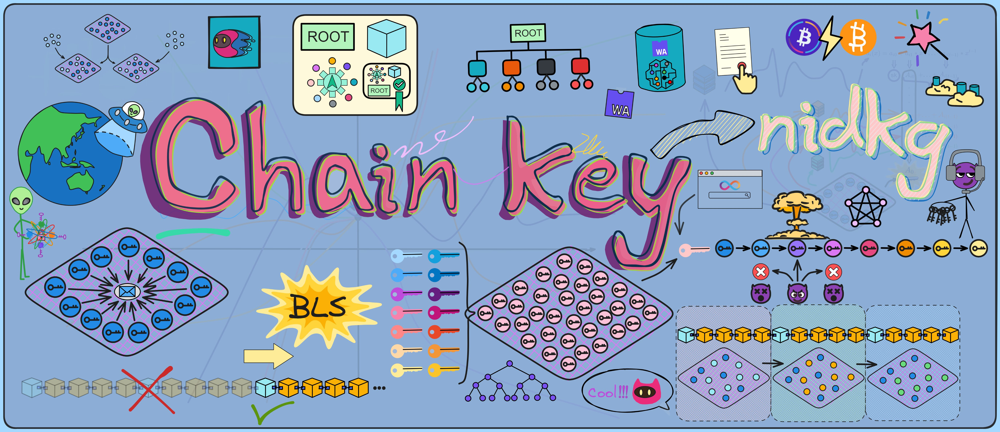

## Chain-key cryptography

Chain-key cryptography refers to the suite of cryptogenic protocols embedded in Internet Computer lower-level systems. It is the complete set of cryptographic protocols that ICs rely on for runtime operations, including Threshold BLS signatures, non-interactive key distribution (NIDKG), non-interactive zero-knowledge proofs (NIZK), Threshold ECDSA signatures, and verifiable encrypted threshold keys (VETKeys).

The most important among these is Threshold BLS signatures.

## Threshold BLS signatures

What is BLS threshold signatures? ฅʕ•̫͡•ʔฅ

It is the most important, fundamental, and core component of cryptographic key chains. Subnet operations rely on threshold BLS signatures to achieve consensus, provide message authentication to users, generate random beacons on which consensus depends, and sign catch-up packages, among other tasks. 

To give an example, a threshold BLS signature is like a "DAO" - any place the subnet needs to sign something requires enough replicas in the subnet to "agree" (sign) before it can go through. When enough replicas agree, that represents consensus and the majority rules.

In traditional asymmetric cryptography, we can generate a public and private key pair; the public key is shared openly while the private key is kept secret. The public key encrypts information, the private key decrypts it. The private key signs information, the public key verifies it. You can learn more about asymmetric cryptography here.

As I explained with consensus earlier, when a replica in a subnet creates a block proposal, if everyone agrees the block looks good, they will each sign it with their private key to indicate their approval.

If every replica generated their own key pair, managing the keys would be complex and inefficient 🥲. Even more importantly, if users wanted to verify chain contents, they'd have to download hundreds of GBs to check everything themselves 😭. That's just unfriendly.

To solve this, Dfinity chose a threshold BLS signature scheme to enable subnet signatures.

### BLS signatures

Let me explain why BLS signatures were chosen.

One reason for using BLS signatures is that the final signature produced by the subnet is unique - for a given public key and message, there is only one valid signature. This unique signature property allows smart contracts to generate unpredictable random numbers: after a smart contract requests a random number, (through one round of consensus) the subnet will generate a signature on a special message, then hash that signature to derive a random number seed, and finally generate the required (pseudo) random number from the seed. 

Due to the security properties of BLS signatures, no one can predict or tamper with this randomness.

BLS signatures are quite different from common signature algorithms like RSA and DSA in many ways. 

First, BLS signatures are much shorter and more secure. 

A signature value only needs one coordinate of an elliptic curve point, around 160 bits is enough. But RSA and DSA signature contain two large integers, usually 320 bits are needed to achieve an equivalent security level, so BLS signatures have a clear advantage in length. The security of BLS signatures does not rely on integer factorization or other mathematical problems, but rather on computationally hard problems on elliptic curves, like the CDH problem. These kinds of problems seem even harder to break today.

Although BLS signatures verification is slower due to requiring some pairing computations, signature generation is very fast, requiring only a simple point multiplication. RSA and DSA are the opposite - signing is slow but verification is fast.

Another advantage of BLS signatures is they don't require maintaining signature state, the signature is fixed as long as the message content doesn't change. But RSA and DSA signature need to save randomness to prevent replay attacks. 

Additionally, BLS signatures can be efficiently batch verified together, greatly improving efficiency in many use cases. This is not possible with RSA and DSA.

These properties make BLS signatures very suitable for many blockchain applications with high requirements on signature size and scalability. 

The algorithm itself is very elegant and a promising signature algorithm. You can learn more about the cryptographic principles of BLS signatures here.

Most importantly, BLS signatures can split the private key into share fragments and be upgraded to multi-signature or **threshold signature** schemes! Doing this directly with RSA and DSA would be very difficult.

### threshold BLS signatures

Splitting the private key into share fragments!

It sounds very sophisticated, but it's actually just an algorithm that allows multiple parties to participate in signing. The private key is split into many shares and given to different people to keep. When signing, enough people (meeting the threshold) have to collaborate to combine the signature fragments into a valid signature.

In movies, books, and games, there are often quests that require collecting multiple keys, crystals, or other artifacts to unlock the gateway to the final level or obtain the ultimate treasure. Like in Avengers: Infinity War, Thanos had to assemble the six Infinity Stones to wipe out half of all life in the universe. In the Harry Potter series, Voldemort split his soul to create multiple horcruxes, and Harry had to find and destroy them all to fully defeat Voldemort. In Dragon Ball, gathering the seven Dragon Balls allows you to summon the dragon and make a wish.

Plots involving collecting or combining items to produce some magical effect are common tropes across various media.

In reality, threshold BLS signatures implement this kind of magic through cryptography. Each person generates a signature fragment using their private key share, and when enough fragments meet the threshold, they can be combined into a complete signature. Even if some replicas (less than one third) in the subnet fail or lose network connectivity, signing can still complete. Yet the public key used to verify the signature is unique!

Although threshold signature schemes existed long before, the IC is the first blockchain to integrate this technology into the low-level protocol.

Without the full private key, only dispersed key shares, even replicas holding shares can't directly obtain signature results. Enough signature fragments have to be collected to generate the signature. Requiring multiple replicas to jointly confirm operations on the blockchain enhances security and reliability. It becomes very difficult for an adversary to control enough replicas to forge signatures.

BLS is the only signature scheme that enables a very simple and efficient threshold signing protocol. Replicas holding private key shares can easily generate fragmentary signatures on messages, and reaching the threshold number of fragments allows composing the complete signature for the message. Moreover, the replicas don't need interaction, each one just broadcasts out its fragment. And inheriting excellent genes from BLS, the signature is unique - for a given public key and message, there is only one valid signature. No matter which private key fragments sign, as long as enough fragments are combined, the final signature is always the same.

Threshold BLS signatures are the foundation of the IC. With threshold signatures, replicas in a subnet can use BLS thresholds to achieve consensus:

* When enough replicas in a subnet sign a new block, their fragments can be combined into a complete signature, meaning consensus is reached with the majority ruling. Other replicas can verify the block using the subnet's public key.

* When enough replicas sign a random beacon, their fragments also make a full signature, meaning the new signature becomes a new random number. As long as the signed message is different each time, the signature result will definitely be different too. And each private key fragment allows other replicas to verify this randomness using the subnet's public key.

* When enough replicas sign a Merkle tree root, their fragments make a complete signature, meaning most replicas in the subnet have consistent state. Users can verify the output using the subnet's public key.

Additionally, these threshold signatures serve as the source of unpredictable pseudorandomness:

As an unpredictable and unbiasable source of pseudorandomness available to any smart contract, this is a unique capability that enables applications impossible on other blockchains (e.g. NFT lotteries).

BLS threshold signatures have another critical benefit - users need to ensure messages returned from the subnet haven't been tampered with, otherwise there could be trouble if a hacker swaps them out. 

So the subnets sign messages back to users.

With BLS thresholds, even if some replica nodes fail or go offline, the remaining honest nodes can still reach consensus and sign messages as long as their number meets the threshold. This maintains liveliness and security.

The fragments from honest nodes are sufficient to compose valid signatures that users can verify with the subnet's public key. Threshold signatures provide decentralization, scalability, and antifragility!

As I mentioned earlier - if every replica generated their own key pair, managing all those keys would be complex and inefficient 🥲. And if different replicas signed each block, for users to verify chain contents they'd have to download hundreds of GBs to check everything themselves 😭. That's just unfriendly.

But with BLS threshold signatures, it's like each subnet only has "one key pair". The private key is jointly held by replicas in the subnet, while there is only one corresponding public key for the subnet! Anyone can use the subnet public key to verify content signed by the subnet 👍!

This means verifying chain data no longer requires downloading hundreds of GBs - you can just use a 48 kb subnet public key to independently check any message. Even mobile phones, computers, and IoT devices can verify messages signed by subnets.

Similarly, when communication between subnets is needed, Subnet B can use Subnet A's public key to verify messages from Subnet A.

This cross-shard verification enables the IC to scale horizontally - with enough replicas, unlimited shards (subnets) can be created.

Each subnet is like an independent "mini blockchain", with subnets using public keys to verify communication. Since consensus already happened internally in Subnet A, Subnet B just needs to verify messages from A using its public key. This greatly streamlines cross-shard communication.

But wait, if every subnet has a public key, won't there be tens of thousands of keys to manage with so many subnets in the future?

No worries 😏. There's the system subnet - the NNS! The NNS Canister has a registry holding every subnet's public key. Just ask the NNS if you need a subnet's key.

And for extra safety, the NNS subnet threshold signs all other subnets' public keys. So you can use the NNS subnet key to verify its signatures on other subnets' keys.

Then cache a few common subnet keys on user devices, and we're good to go 👌.

Alright, BLS threshold verification is no problem now.

But this is still far from enough.

## NIDKG

The replicas in a subnet need BLS threshold signatures to operate, so the first step is distributing keys to each replica. However, threshold schemes usually rely on a trusted key generation center to distribute the keys. But in a blockchain, no single replica can be easily trusted as non-malicious.

This requires a distributed key generation (DKG) protocol - such protocols had very limited use before, are complex to implement, and inefficient taking a long time just to distribute keys, far from practical.

The main reason is traditional DKGs either assume synchronous networks for communication, or lack robustness, or both require synchrony but aren't robust.

Synchronous communication means if there's even a slight delay in messages, the whole DKG process would fail or be insecure. And no robustness means if any replica crashes during DKG, the whole protocol fails.

But to realize BLS thresholds on a blockchain requires DKG, otherwise it wouldn't be a blockchain! With no choice, Dfinity's masters had to research improving DKG efficiency.

For ordinary people, the complex crypto theory would look like hieroglyphics. Luckily Dfinity's masters each have incredible skills.

Dfinity has many experienced experts, including computer scientists, cryptographers, researchers, and PhDs from top institutions like ETH Zurich, MIT, Stanford, UCLA, Yale, and more, with many previously at tech giants like Google, Amazon, IBM.

CTO **Jan Camenisch** is a computer scientist, IEEE and IACR fellow, published over 120 highly-cited papers on privacy and crypto, and was an IBM Chief Scientist for 19 years. **Ben Lynn** co-created BLS signatures - the "L" in BLS is for Lynn. He got his PhD from Stanford and worked at Google for 10 years. **Timo Hanke** was a professor of mathematics and cryptography at RWTH Aachen University. In 2013 he created AsicBoost, improving Bitcoin mining efficiency by 20-30%, now a standard for large mining operations.

There's also cryptographic wizard **Jens Groth**, who invented pairing-based NIZKs, pairing-based SNARKs, and sub-logarithmic sized proof systems for Bulletproofs. With a PhD from Aarhus University, he did postdoctoral research at UCLA, became a cryptography professor at UCL, and has published over 50 papers.

Ah yes, Jens is our protagonist here.

No existing DKGs could meet the IC's high standards - it needed one that was secure and robust even on an asynchronous network with many faulty replicas.

To tackle inefficient DKGs, Jens went back to basics and heavily optimized the complex multi-round interaction required in DKG. DKGs use zero knowledge proofs, but normal proofs require multiple rounds of interaction just between two parties, let alone the many replicas in a subnet. And proofs have high computation complexity, needing intricate crypto and protocols, with expensive proof generation and verification.

So master Jens rolled up his sleeves and got to work on the cryptography: inventing efficient non-interactive zero knowledge proofs (NIZKs) that complete proofs without interaction.

With NIZKs, the new DKG gained wings, and soon NIDKG was born!

The novel NIDKG can run on asynchronous networks with great robustness - it keeps operating even if a third of replicas in a subnet fail or crash. Replicas just generate transactions without interacting further with others. The remaining replicas can aggregate transactions to compute the subnet's public key for the threshold scheme. Each replica can also decrypt its own private key share from the transactions.

As Dfinity boasted about their scientific team 👇.

The "non-interactive" in NIDKG means replicas don't need interaction. Without multiple communications, each replica just generates its polynomial secrets and NIZK proofs based on the protocol, then broadcasts them out. If interaction was required, complexity scales exponentially with more replicas, messing up the whole subnet. And any replica's slight delay could cause failure across the subnet.

By the way, zero knowledge (ZK) proofs are a cutting-edge cryptography technique that lets you prove something to someone without revealing what it is. Sounds unbelievable right! But it's possible in cryptography. It's like when your girlfriend says "I want to tell you something, but you have to promise me first." And you ask "What do you need to tell me?" She replies "You have to promise first!"

Besides integrating new tech into the low-level system, Dfinity has also started applying it to other areas recently, building the encrypted utopia Dominic envisions. In 2021 they proposed using ZK proofs for identity on the IC. And in 2023 the crypto wizards are already planning to add zero knowledge proofs!

### The Specific Process

Whoops, I rambled too much just now. Been feeling lonely lately, tend to babble on and on when talking. Anyway, let's dive into the NIDKG internals and see how it enables our operation.

After the previous overview, we know NIDKG has each replica independently generate a transaction (dealing) and broadcast it out. The transaction contains the replica's secret encrypted file, NIZK proof of the encryption, and material to generate the subnet's public key. Other replicas receive and verify the NIZK proofs, and once 2/3 of dealings are collected, they can reconstruct the subnet public key and their own private key shares.

#### Public Parameters

Before starting, the NIDKG protocol needs some public parameters, such as NNS will tell everyone **how many replicas there are in the subnet (n)**, **what the threshold is (t)**, and some parameters that are predetermined, bilinear groups \\(G1\\) ,\\(G2\\) ,\\(GT\\) and generators \\(g1\\) ,\\(g2\\) , hash function \\(H\\) and binary tree height \\(λ\\) etc. NNS will also assign each replica a **node ID (node_id)** as the replica's own identity. ([Source code](https://github.com/dfinity/ic/blob/master/rs/consensus/src/dkg.rs#L98C25-L98C25) calls it this, I don't know why not call it replica ID 😝, maybe "replica" was coined later ~)

These parameters need to be determined and published before running the protocol.

 

#### Generate Key Pairs

In NIDKG, each replica needs to generate its own public and private key pair. The steps to generate the key pairs are:

1. Choose a random \\(x\\), uniformly randomly selected from \\(Z_{p}\\).
2. Use the chosen \\(x\\) to compute the public key:

$$ y = g_{1}^{x} $$

where \\(g1\\) is a predefined generator of the protocol.

3. Construct a zero knowledge proof \\(π\\) to prove knowledge of the discrete logarithm \\(x\\) of \\(y\\). This uses the standard Schnorr proof for elliptic curve discrete log.
4. Set the public key to:

$$ pk = (y, π_{dlog})
 $$

where it contains \\(y\\) and the proof \\(π\\).

5. Choose another random \\(ρ\\), uniformly randomly selected from \\(Z_{p}\\).
6. Use \\(ρ\\) and the predefined protocol parameters \\(f0, ..., fλ, h\\) to compute the private key:

$$ dk\ =\ (g_{1}^ρ,\ g_{2}^x\ *\ f_{0}^ρ,\ f_{1}^ρ,\ ...,\ f_{λ}^ρ,\ h^ρ) $$

$$ dk_{0}\ =\ (0,\ dk) $$

where the private key \\(dk\\) is a forward secure private key that can be used to decrypt subsequent ciphertexts.

7. Delete the intermediate temporary variables \\(x\\), \\(ρ\\) used in the computations.
8. Use the generated public and private key pair (pk, dk) as this replica's key pair.

Each replica needs to generate such a key pair (pk, dk).

 

#### Generate Deals

The process of generating deals:

**Each replica independently randomly generates a (t-1)-degree polynomial \\(a_{i}(x\\)).**

For example, replica \\(i\\) generates:

$$ a_{i}(x)\ =\ a_{i0}\ +\ a_{i1}*x\ +\ ...\ +\ a_{i(t-1)}*x^{t-1} $$

where when \\(x = 0\\), the value of the polynomial \\(a_{i}(0\\)) is a randomly generated secret \\(s\\). If it is re-distributing keys, the private key share from before is used as the secret \\(s\\).

**The constant \\(a_{i0}\\) of the polynomial represents the shared secret, \\(a_{i1},\ ...,\ a_{it-1}\\) are randomly chosen coefficients from \\(Z_{p}\\):**

$$ Set\ a_{i0}\ =\ s\ \ and\ \ pick\ random\ a_{1},\ ...,\ a_{t-1}\ \overset{$}{\leftarrow} Z_{p} $$

Then compute all the constant terms \\(a_{i0},\ ...,\ a_{i(t-1)}\\) of the polynomial \\(a_{i}(x\\)) corresponding \\(g_{2}\\) group elements \\(A_{i0}\ ...\ A_{i(t-1)}\\):

$$ A_{i0}\ =\ g_{2}^{a_{i0}} $$

$$ A_{i1} = g_{2}^{a_{i1}} $$

$$ ... $$

$$ A_{i(t-1)} = g_{2}^{a_{i(t-1)}} $$

Then put these \\(A_{i}\\) as public parameters into the deal \\(d\\).

So \\(A_{i0},\ ...,\ A_{i(t-1)}\\) correspond to the coefficients of the Shamir secret sharing polynomial \\(a(x\\)) used to generate the deal. They are part of deal d, used to verify the correctness of the secret sharing.

When the threshold number of deals are collected, the public polynomial \\(a(x\\)) of all replicas can be recovered using Lagrangian interpolation, where \\(a(0\\)) is the public key of the subnet.

  

**Replica i computes its secret share \\(s_{1},\ ...,\ s_{n}\\) of the polynomial \\(a_{i}(x\\)) using Shamir secret sharing:**

$$ s_{i}\ =\ {\textstyle \sum_{k=0}^{t-1}} a_{k}i^{k} \bmod p \ \ \ (k\ =\ 1,...,t-1) $$

Then convert \\(s_{i}\\) to binary:

$$ s_{i}\ =\ {\textstyle \sum_{j=1}^{m}} s_{i,j} B^{j-1} $$

Then, we need to encrypt and broadcast the secret share \\(s_{i}\\) so that other replicas will believe that decrypting the ciphertext gives \\(s_{i}\\)!

 

So we must provide evidence that we can decrypt the ciphertext in the deal, so other replicas can recover their private key share with enough deals. We use a multi-recipient forward secure encryption scheme where the ciphertext is publicly verifiable.

The only problem is the plaintext should be partitioned into small chunks, as recipients need to compute discrete logs to extract these chunks. So if the chunks a recipient needs to extract are too large, they will have problems. This requires a non-interactive proof system that can ensure all chunks are moderately sized.

 

**The secret share \\(s_{i}\\) is split into multiple small chunks mi, using a forward secure encryption scheme based on bilinear pairings.**

Each chunk \\(mi\\) has a small domain, so it can be brute forced decrypted later. ElGamal encryption is used on each chunk \\(mi\\).

Before generating the deal, we already generated a public/private key pair, now we can encrypt the chunks using the public keys of all replicas: \\(pk_{i}\ =\ (y_{i},\ π_{i}\\)).

Choose m random numbers \\(r_{m},\ s_{m}\\), uniformly randomly selected from \\(Z_{p}\\): \\(r_{1},\ s_{1},\ ...,\ r_{m},\ s_{m}\ \overset{$}{\leftarrow} \ Z_{p}\\).

First compute: \\(C_{1,1},\ ...,\ C_{n,m},\ R_{1},S_{1},\ ...,\ R_{m},S_{m}\\):

$$ C_{i,j} \ = \ y_i^{r_{j}} \ * \ g_{1}^{s_{i,j}}
 $$

$$ Ri \ = \ g_{1}^{ri} $$

$$ S_{j}\ =\ g_{1}^{s_{j}} $$

Then do some computations: (where \\(\tau\\) denotes epoch):

$$ \tau *{ λ* { T + 1 } } ... \tau *{ λ* { H } }\ =\ H *{ λ* { H } } ( pk *{ 1 },\ ...,\ pk* { n },\ C *{ 1 , 1 },\ ...,\ C* { n,m },\ R *{ 1 } , S* { 1 },\ ...,\ R *{ m }, S* { m } ,\ \tau ) $$

$$ f\ =\ f(\tau *{1}\ ...\ \tau* {λ}) $$

$$ Z_{j}\ =\ f^{r_{j}}h^{s_{j}} \ \ \ (Z_{1},\ ...,\ Z_{m}) $$

We can use the same random number \\(R\\) for all chunks to optimize performance:

$$ r\ = {\textstyle \sum_{m}^{j=1}} r_{j} B^{j-1} \bmod p $$

$$ R\ = \ g_{1}^{r} $$

The ciphertext C is the collection of encryptions of all chunks \\(y_n^{r} \ * \ g_{n}^{s_{n} }\\):

$$ C_{1} \ = \ y_1^{r} \ *\ g_{1}^{s_{1}},\ ...,\ C_{n} \ = \ y_n^{r} \* \ g_{1}^{s_{n}}
 $$

Now the chunked encryption is done.

 

**Finally construct two NIZK proofs:**

* \\(π\_share\\): Proof that the secret share \\(s_{i}\\) is a correct Shamir secret sharing, satisfying the polynomial \\(a_{i}(x\\)).

$$ π_{share} \gets Prove_{share}(y_{1},\ ...,\ y_{n},\ A_{0},\ ...,\ A_{t−1},\ R,\ C1,\ ...,\ Cn;\ r,\ s_{1},\ ...,\ s_{n}) $$

* \\(π\_chunk\\): Proof that each ciphertext chunk is a correct encryption of \\(s_{i}\\).

$$ π_{chunk} \gets Prove_{chunk}(y_{1},\ ...,\ y_{n},\ R_{1},\ ...,\ R_{m},\ C_{1,1},\ ...,\ C_{n,m};\ r_{1},\ ...,\ r_{m},\ s_{1,1},\ ...,\ s_{n,m})
 $$

  

**Replica i packages the encrypted private key share C, polynomial coefficients \\(A_{i}\\), and two NIZK proofs into a deal \\(d_{i}\\).** It broadcasts this deal \\(d_{i}\\) to other replicas in the subnet.

$$ d\ =\ \binom{C_{1,1},\ ...,\ C_{n,m},\ R_{1},\ S_{1},\ ...,\ R_{m},\ S_{m}}{Z_{1},\ ...,\ Z_{m},\ A_{0},\ ...,\ A_{t-1},\ π_{share},\ π_{chunk}}
 $$

The key to generating a deal is doing the secret sharing, encryption, and providing NIZK proofs. This process ensures verifiability and security of the deal.

 

#### Verify Deals

When a replica receives a deal d broadcast by another replica, it can verify the deal like this:

The key is to verify the correctness of the NIZK proofs, that the plaintext chunks in the ciphertext are correct, and that it finally matches the published share verification key.

Input parameters explained:

* Optional \\(shvk\\) (share verification key), generated during public key aggregation.

* Threshold t.

* Public keys of n participants \\(pk_{1},\ ...,\ pk_{n}\\).

* Current epoch \\(τ\\).

* Deal \\(d_{j}\\) to verify.

**Check deal format:**

* Ensure it contains the right components: ciphertext, NIZK proofs, etc.

* Ensure each component is a valid group element.

**If there is \\(shvk_{j}\\), check if it equals \\(A_{j,0}\\).**

**Compute leaf path and epoch \\(τ\\):**

* Extract hash parameters from ciphertext.

* Run hash function to compute path \\(τ\\).

**Compute f function value:**

* Compute \\(f(τ1,\ ...,\ τλ\\)) according to path \\(τ\\).

**Verify ciphertext relation with f:**

* Check pairing relation: \\(e(g_{1}, Z_{j}) = e(R_{j}, f) · e(S_{j}, h\\))

**Verify NIZK proof \\(π\_share\\):**

* Input instance info, run \\(π\_share\\)'s verification algorithm.

**Verify NIZK proof \\(π\_chunk\\):**

* Input instance info, run \\(π\_chunk\\)'s verification algorithm.

If all checks pass, the deal d is considered valid. Otherwise it is invalid, reject the deal.

This verification process can be done publicly by all replicas, ensuring verifiability of deals, i.e. PVSS (Publicly Verifiable Secret Sharing).

 

#### Combine Deals

When calling the function to recover the public key by combining deals, the input parameters are:

* Threshold t.

* Total number of participants n.

* Index set indicating which deals I were selected.

* Validated deals \\(d1,\ ...,\ d\ell\\).

**Parse deals:**

Each deal \\(d_{j}\\) contains: \\(A_{j,0},\ ...,\ A_{j,t-1}\\).

Where \\(A_{j,k} = g_{2}^{a_{j,k} }\\), \\(a_{j,k}\\) is the polynomial coefficient of some replica j. The polynomial generated by each replica is random, like this:

  

And \\(A_{j,k}\\) is \\(a_{j,k}\\) of each replica's polynomial computed as \\( g_{2}^{a_{j,k} }\\). Like a hash function, knowing \\(A_{j,k} = g_{2}^{a_{j,k} }\\) does not reveal \\(a_{j,k}\\). As long as \\(a_{j,k}\\) is unchanged, \\(A_{j,k}\\) remains unchanged.

 

**Multiply \\(A_{j,k}\\) from each deal to recover the public polynomial:**

Compute the public polynomial's \\(A_{0}, ..., A_{t-1}\\) of all replicas, for each \\(k\ =\ 0,\ ...,\ t-1\\):

$$

A *{ k } \ =\ \prod* { j=1 } ^ { \ell } A *{ j , k } ^ { L ^ { I }* { i _ { \ell } } ( 0 ) }

$$

  

This recovers the public polynomial's coefficients \\(A_{0}, ..., A_{t-1}\\) through interpolation. When \\(k=0\\), \\(A_{0}\\) is the public key of the subnet.

**Generate public key:**

$$ vk = A_{0}
 $$

**Compute verification key:**

$$ shvk_{j}\ =\ \prod_{k=0}^{t-1}A_{k}^{j^{k}} $$

If successful, return \\((vk, shvk_{1},\ ...,\ shvk_{n}\\)).

Then the public key \\(vk\\) still needs to be verified:

Check parameters \\(t,n\\) are in valid range: \\(1 <= t <= n <= N\\)

Check \\(vk, shvk_{1}...shvk_{n}\\) are all in group \\(G2\\). Set \\(shvk_{0}\\) to \\(vk\\).

Define index set \\(J = {0,...,t-1}\\).

For \\(i\\) from \\(t\\) to \\(n\\):

* Check if \\(shvk_{i}\\) equals:

$$ shvk_{i}\ =\ \prod_{j=0}^{t-1}A_{k}^{j^{k}} $$

That is, check if \\(shvk_{i}\\) lies on the Lagrangian interpolation polynomial of \\(shvk_{0}...shvk_{(t-1)}\\).

If all checks pass, then there are no issues. This verifies \\(vk\\) and \\(shvk\\) satisfy the public key validity requirements of the BLS threshold signature scheme, ensuring they are a valid public key set that can correctly perform threshold signatures.

 

#### Extract Private Key

Finally each replica uses its own decryption key to decrypt and compute its private key share sk from all valid deals.

**Parse input:**

* Recipient's decryption private key: \\(dk_{τ'}\\).

* Deal index set used: \\(K\\).

* Deals: \\(d1,\ ...,\ d\ell\\).

* Epoch: \\(τ\\).

**Parse each deal:** Parse each deal to get its various elements, including \\(C_{k,n,m}、R_{k,m}、S_{k,m}、Z_{k,m}\\) etc. These elements are in groups \\(G1\\) and \\(G2\\). Ensure \\(1 ≤ i ≤ n ≤ N\\).

**Define and compute \\(τ\\):** For each deal, based on the given \\(τ\\) value, define a series of \\(τ_{k,1}\\) to \\( τ_{k, λ_{T} }\\), then compute subsequent \\(τ_{k,λ_{T+1} } ... τ_{k, λ}\\).

**Compute intermediate \\(f_{k}\\):** Use function f to compute intermediate \\(f_{k}\\) for each deal's \\(τ\\) value:

$$ f_{k}\ =\ f(\tau_{k,1},\ ...,\ \tau_{k,\lambda }) $$

**Derive decryption key:** Based on given key update information \\(dk_{τ'}\\), derive the decryption key \\(dk_{τ_{k,1},\ ...,\ τ_{k, λ} }\\). These decryption keys are in the set \\(\{0, 1\}^{λ} × G_{1} × G_{2}^{2}\\).

**Compute \\(M_{k,j}\\):** For each element of each deal, use the given algorithm to compute \\(M_{k,j}\\) values, involving some multiplications and exponentiations:

$$ M_{k,j}\ =\ e(C_{k,i,j},\ g_{2})\ \cdot e(R_{k,j},\ b_{k}^{-1})\ \cdot e(a_{k},\ Z_{k,j})\ \cdot e(S_{k,j},\ e_{k}^{-1}) $$

**Brute force search:** For each k and j, use the Baby-Step Giant-Step algorithm to brute force search for a suitable \\(s_{k,j}\\) value, such that \\(M_{k,j}\\) equals a specific value:

$$ M_{k,j}\ =\ e(g_{1},\ g_{2})^{s_{k,j}}
 $$

**Compute \\(s_{k}\\):** Use the found \\(s_{k, j}\\) values to compute part of the private key \\(s_{k}\\):

$$ s_{k}\ =\ \sum_{j\in J}^{m} s_{k,j}B^{j-1} \bmod p $$

**Parse K and compute \\(s_{i}\\):** Parse set \\(K\\), compute \\(s_{i}\\) from all \\(s_{k}\\) using Lagrangian interpolation, involving previous private key shares and \\(s_{k, j}\\):

$$ sk\ =\ s_{i}\ =\ \sum_{j\in J}^{\ell} s_{k,j}L_{k}^{K}(0) $$

**Return result:** If all steps succeed, erase intermediate computations, return private key share sk.

 

**Finally, verify the private key share:** Validate secret sharing signature key validity, to verify the private key matches the signature verification parameters.

If sk is an integer in the normal range, and \\(shvk\\) equals \\(g_{2}^{sk}\\), then the verification succeeds.

 

**The key to NIDKG is that zero knowledge proofs make the verification process publicly verifiable, without needing interaction with other replicas to independently judge if a deal is correct.**

**Each replica chooses a random secret (random number or private key share from last epoch) to generate a polynomial, then computes the shared secret \\(s_{i}\\). Finally it chunks \\(s_{i}\\), encrypts the chunks, builds two zero knowledge proofs, and packages it as a deal for other replicas to verify. After verification, the public key of the subnet and the replica's own private key share can still be computed through non-interactive methods.**

 

### Resharing Protocol

After a subnet has generated its public key, if a new public key is generated every time subnet members change, it would be quite troublesome. Also, if the key is only updated when subnet members change, it is not secure enough. Because if over one third of replicas are compromised by hackers in various ways, the whole subnet would be paralyzed. If a hacker first silently compromises one replica, continues to lurk and silently tries to compromise the next replica, until controlling enough replicas, then launches an attack... 

 

So to solve these two problems, the resharing protocol can retain the subnet public key, and only reshare the private key share of each replica. This also provides proactive security, periodically refreshing the private key shares of all replicas in the subnet. 

  

Now let's review:

Assume the old public key \\(vk\\) has passed public key validation.

In the verification after public key aggregation, it is guaranteed that \\(shvk_{1},...,shvk_{n}\\) can be derived from \\(vk\\) and \\(shvk_{1},...,shvk_{t-1}\\) through Lagrangian interpolation.

That is, \\(vk\\) and \\(shvk_{1},...,shvk_{n}\\) satisfy the same \\(t-1\\) degree polynomial \\(a(i\\)):

\\[

vk\ =\ A *{ 0 } \ =\ \prod* { j=1 } ^ { \ell } A_ {j,0} ^ {L ^ { I } *{ i* { \ell } } ( 0 ) } \ = \ g *{ 2 } ^ { a* { 0 } }

\\]

\\[

shvk_{ i } = g^{ a( i ) }_{ 2 }\ \ \ (i\ =\ 1,\ ...,\ n)\ = A_{ i }

\\]

For any index set \\(I\\) containing \\(1<=i_{1} < ... < i_{t} <= n \\) , we can compute the public key \\(vk\\) from \\(shvk_{i}\\) using:

\\[

vk\ =\ \prod_{j=1}^{t} shvk_{ i_{ j } } ^ { L^{I}_ {i_{ j } }(0)}

\\]

During key resharing, given \\(t\\) deals \\(d_{1},...,d_{t}\\) that correspond to valid \\(shvk_{ i_{ 1 } },...,shvk_{ i_{ t } }\\) respectively.

When verifying the validity of these deals, we know:

$$

A *{ 1 , 0 } = shvk* { i *{ 1 } } ,\ ...,\ A* { t , 0 } = shvk *{ i* { t } }

$$

Compute the new public key \\(vk'\\) from these deals:

$$

vk' \ = \ A *{ 0 } \ = \ \prod* { j = 1 } ^ { t } A *{ j , 0 } ^ { L ^ { I }* { i _ { \ell } } ( 0 ) }

$$

Substitute \\( A *{ 1 , 0 } = shvk* { i *{ 1 } },\ ...,\ A*{ t , 0 } = shvk *{ i* { t } } \\) into this formula, we get:

$$

vk'\ =\ A *{ 0 } \ = \ \prod* { j = 1 } ^ { t } shvk *{ i* { j } } ^ { L ^ { I } *{ i* { j } } ( 0 ) }

$$

The new \\(vk' = A_{0}\\), so \\(vk' = vk\\). Thus the verification keys are perfectly retained.

 

So each time after key update, the public polynomial \\(a(i\\)) plotted looks something like this: the other coefficients of the public polynomial change each time, but each different public polynomial passes through the same point when \\(x = 0\\).

  

This ensures that each NIDKG can recover the same public key. The subnet public key remains unchanged, but the other coefficients of the public polynomial change, thus achieving forward security.

 