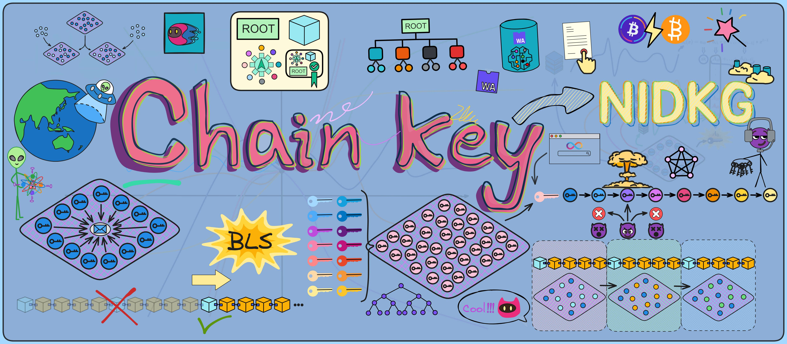
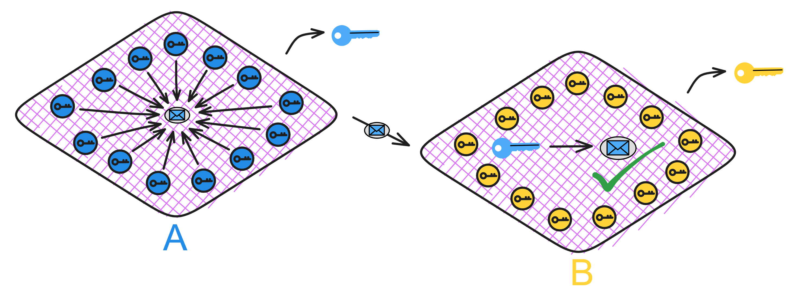
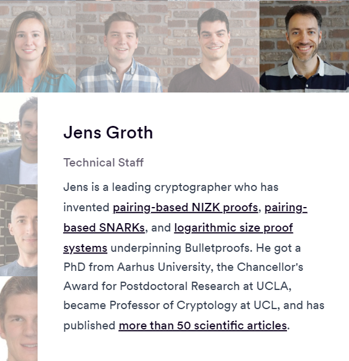
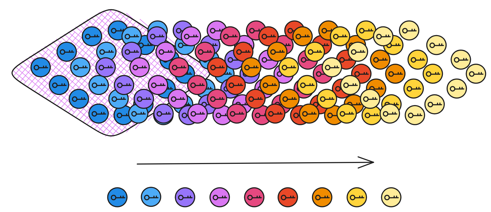
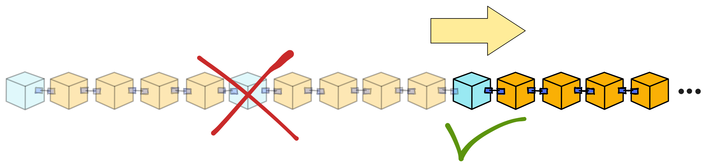

## Chain-key cryptography

Chain-key cryptography refers to the suite of cryptogenic protocols embedded in Internet Computer lower-level systems. It is the complete set of cryptographic protocols that Internet Computers rely on for runtime operations, including threshold BLS signatures, non-interactive key distribution (NIDKG), non-interactive zero-knowledge proofs (NIZK), Threshold ECDSA signatures, verifiable encrypted threshold keys (VETKeys) and so on.

The most important among these is threshold BLS signatures.

## Threshold BLS signatures

What is [threshold BLS signatures](../8.CryptographyInIC/BLS.md)? `ฅʕ•̫͡ •ʔฅ` 

It is the most important, fundamental, and core component of cryptographic key chains. Subnet operations rely on threshold BLS signatures to achieve consensus, provide message authentication to users, generate random beacons on which consensus depends, and sign catch-up packages, among other tasks. 

To give an example, a threshold BLS signature is like a "DAO" - any place the subnet needs to sign something requires enough replicas in the subnet to "agree" (sign) before it can go through. When enough replicas agree, that represents consensus and the majority rules.

 

> In traditional asymmetric cryptography, we can generate a public and private key pair; the public key is shared openly while the private key is kept secret. The public key encrypts information, the private key decrypts it. The private key signs information, the public key verifies it. You can learn more about asymmetric cryptography here.

As I explained with [consensus](../2.CoreProtocol/IntroductiontoConsensusLayer.md) earlier, when a replica in a subnet creates a block proposal, if everyone agrees the block looks good, they will each sign it with their private key to indicate their approval.

If every replica generated their own key pair, managing the keys would be complex and inefficient 🥲. Even more importantly, if users wanted to verify chain contents, they'd have to download hundreds of GBs to check everything themselves 😭. That's just unfriendly.

    

To solve this, Dfinity chose a threshold BLS signature scheme to enable subnet signatures.

### BLS signatures

Let me explain why BLS signatures were chosen.

One reason for using BLS signatures is that the final signature produced by the subnet is unique - for a given public key and message, there is only one valid signature. This unique signature property allows smart contracts to generate unpredictable random numbers: after a smart contract requests a random number, (through one round of consensus) the subnet will generate a signature on a special message, then hash that signature to derive a random number seed, and finally generate the required (pseudo) random number from the seed. 

Due to the security properties of BLS signatures, no one can predict or tamper with this randomness.

 

BLS signatures are quite different from common signature algorithms like RSA and DSA in many ways. 

First, BLS signatures are much shorter and more secure. 

A signature value only needs one coordinate of an elliptic curve point, around 160 bits is enough. But RSA and DSA signature contain two large integers, usually 320 bits are needed to achieve an equivalent security level, so BLS signatures have a clear advantage in length. The security of BLS signatures does not rely on integer factorization or other mathematical problems, but rather on computationally hard problems on elliptic curves, like the CDH problem. These kinds of problems seem even harder to break today.

 

Although BLS signatures verification is slower due to requiring some pairing computations, signature generation is very fast, requiring only a simple point multiplication. RSA and DSA are the opposite - signing is slow but verification is fast.

Another advantage of BLS signatures is they don't require maintaining signature state, the signature is fixed as long as the message content doesn't change. 

 

However, RSA and DSA signatures still need to save random numbers to prevent replay attacks. In RSA signatures, a scheme called "Probabilistic Signature Scheme" (PSS) is commonly used, which utilizes random numbers (salt) during signature generation to enhance security. Therefore, for the same message and private key, the resulting signature may vary slightly due to the introduced randomness. 

This variation is achieved by introducing random salt values into the signature, to increase security and prevent attackers from gaining information about the private key by observing multiple signatures of the same message.

 

Additionally, BLS signatures can be efficiently batch verified together, greatly improving efficiency in many use cases. This is not possible with RSA and DSA.

These properties make BLS signatures very suitable for many blockchain applications with high requirements on signature size and scalability. 

 

The algorithm itself is very elegant and a promising signature algorithm. You can learn more about the cryptographic principles of BLS signatures here.

Most importantly, BLS signatures can split the private key into share fragments and be upgraded to multi-signature or **threshold signature** schemes! Doing this directly with RSA and DSA would be very difficult. 

 

### Threshold BLS signatures

Splitting the private key into share fragments! 

It sounds very sophisticated, but it's actually just an algorithm that allows multiple parties to participate in signing. The private key is split into many shares and given to different people to keep. When signing, enough people (meeting the threshold) have to collaborate to combine the signature fragments into a valid signature. 

    

In movies, books, and games, there are often quests that require collecting multiple keys, crystals, or other artifacts to unlock the gateway to the final level or obtain the ultimate treasure. Like in Avengers: Infinity War, Thanos had to assemble the six Infinity Stones to wipe out half of all life in the universe. In the Harry Potter series, Voldemort split his soul to create multiple horcruxes, and Harry had to find and destroy them all to fully defeat Voldemort. In Dragon Ball, gathering the seven Dragon Balls allows you to summon the dragon and make a wish.

    

Plots involving collecting or combining items to produce some magical effect are common tropes across various media.

 

In reality, threshold BLS signatures implement this kind of magic through cryptography. Each person generates a signature fragment using their private key share, and when enough fragments meet the threshold, they can be combined into a complete signature. Even if some replicas (less than one third) in the subnet fail or lose network connectivity, signing can still complete. Yet the public key used to verify the signature is unique!

Although threshold signature schemes existed long before, the Internet Computer is the first blockchain to integrate this technology into the low-level protocol.

Without the full private key, only dispersed key shares, even replicas holding shares can't directly obtain signature results. Enough signature fragments have to be collected to generate the signature. Requiring multiple replicas to jointly confirm operations on the blockchain enhances security and reliability. It becomes very difficult for an adversary to control enough replicas to forge signatures.

    

BLS is the only signature scheme that enables a very simple and efficient threshold signing protocol. Replicas holding private key shares can easily generate fragmentary signatures on messages, and reaching the threshold number of fragments allows composing the complete signature for the message. Moreover, the replicas don't need interaction, each one just broadcasts out its fragment. And inheriting excellent genes from BLS, the signature is unique - for a given public key and message, there is only one valid signature. No matter which private key fragments sign, as long as enough fragments are combined, the final signature is always the same.

 

Threshold BLS signatures are the foundation of the Internet Computer. With threshold signatures, replicas in a subnet can use threshold BLSs to achieve consensus:

* When enough replicas in a subnet sign a new block, their fragments can be combined into a complete signature, meaning consensus is reached with the majority ruling. Other replicas can verify the block using the subnet's public key.

* When enough replicas sign a random beacon, their fragments also make a full signature, meaning the new signature becomes a new random number. As long as the signed message is different each time, the signature result will definitely be different too. And each private key fragment allows other replicas to verify this randomness using the subnet's public key.

* When enough replicas sign a Merkle tree root, their fragments make a complete signature, meaning most replicas in the subnet have consistent state. Users can verify the output using the subnet's public key.

 

Additionally, these threshold signatures serve as the source of unpredictable pseudorandomness:

As an unpredictable and unbiasable source of pseudorandomness available to any smart contract, this is a unique capability that enables applications impossible on other blockchains (e.g. NFT lotteries).

 

Threshold BLS signatures have another critical benefit - users need to ensure messages returned from the subnet haven't been tampered with, otherwise there could be trouble if a hacker swaps them out. 

So the subnets sign messages back to users.

    

With threshold BLSs, even if some replica nodes fail or go offline, the remaining honest nodes can still reach consensus and sign messages as long as their number meets the threshold. This maintains liveliness and security.

The fragments from honest nodes are sufficient to compose valid signatures that users can verify with the subnet's public key. Threshold signatures provide decentralization, scalability, and antifragility!

 

As I mentioned earlier - if every replica generated their own key pair, managing all those keys would be complex and inefficient 🥲. And if different replicas signed each block, for users to verify chain contents they'd have to download hundreds of GBs to check everything themselves 😭. That's just unfriendly.

But with threshold BLS signatures, it's like each subnet only has "one key pair". The private key is jointly held by replicas in the subnet, while there is only one corresponding public key for the subnet! Anyone can use the subnet public key to verify content signed by the subnet 👍!

This means verifying chain data no longer requires downloading hundreds of GBs - you can just use a 48 kb subnet public key to independently check any message. Even mobile phones, computers, and IoT devices can verify messages signed by subnets.

    

Similarly, when communication between subnets is needed, Subnet B can use Subnet A's public key to verify messages from Subnet A.

This cross-shard verification enables the Internet Computer to scale horizontally - with enough replicas, unlimited shards (subnets) can be created.

    

Each subnet is like an independent "mini blockchain", with subnets using public keys to verify communication. Since consensus already happened internally in Subnet A, Subnet B just needs to verify messages from A using its public key. This greatly streamlines cross-shard communication.

 

But wait, if every subnet has a public key, won't there be tens of thousands of keys to manage with so many subnets in the future?

No worries 😏. There's the system subnet - the NNS! The NNS Canister has a registry holding every subnet's public key. Just ask the NNS if you need a subnet's key.

And for extra safety, the NNS subnet threshold signs all other subnets' public keys. So you can use the NNS subnet key to verify its signatures on other subnets' keys.

Then cache a few common subnet keys on user devices, and we're good to go 👌. 

    

Alright, threshold BLS verification is no problem now.

 

But this is still far from enough.

## NIDKG

The replicas in a subnet need threshold BLS signatures to operate, so the first step is distributing keys to each replica. However, threshold schemes usually rely on a trusted key generation center to distribute the keys. But in a blockchain, no single replica can be easily trusted as non-malicious.

    

This requires a distributed key generation (DKG) protocol - such protocols had very limited use before, are complex to implement, and inefficient taking a long time just to distribute keys, far from practical.

The main reason is traditional DKGs either assume synchronous networks for communication, or lack robustness, or both require synchrony but aren't robust.

Synchronous communication means if there's even a slight delay in messages, the whole DKG process would fail or be insecure. And no robustness means if any replica crashes during DKG, the whole protocol fails.

 

But to realize threshold BLSs on a blockchain requires DKG, otherwise it wouldn't be a blockchain! With no choice, Dfinity's masters had to research improving DKG efficiency.

 

For ordinary people, the complex crypto theory would look like hieroglyphics. Luckily Dfinity's masters each have incredible skills.

[Dfinity](https://dfinity.org/) has many experienced experts, including computer scientists, cryptographers, researchers, and PhDs from top institutions like ETH Zurich, MIT, Stanford, UCLA, Yale, and more, with many previously at tech giants like Google, Amazon, IBM.

CTO **Jan Camenisch** is a computer scientist, IEEE and IACR fellow, published over 120 highly-cited papers on privacy and crypto, and was an IBM Chief Scientist for 19 years. **Ben Lynn** co-created BLS signatures - the "L" in BLS is for Lynn. He got his PhD from Stanford and worked at Google for 10 years. **Timo Hanke** was a professor of mathematics and cryptography at RWTH Aachen University. In 2013 he created AsicBoost, improving Bitcoin mining efficiency by 20-30%, now a standard for large mining operations.

There's also cryptographic wizard **Jens Groth**, who invented pairing-based NIZKs, pairing-based SNARKs, and sub-logarithmic sized proof systems for Bulletproofs. With a PhD from Aarhus University, he did postdoctoral research at UCLA, became a cryptography professor at UCL, and has published over 50 papers.

 

Ah yes, [Jens](https://medium.com/dfinity/jens-groth-principal-researcher-at-dfinity-receives-the-iacr-test-of-time-award-512bcddceed9) is our protagonist here.

    

Jens Groth, the big shot in the cryptography world, is no doubt a top player. He dives into the realm of zero-knowledge proof technology, allowing two strangers to prove a point without spilling any crucial beans. This wizardry finds massive applications in privacy protection, and the legendary zero-knowledge proof algorithm, Groth16, is his brainchild.

In his early days, Groth crunched numbers in Denmark, but soon discovered a burning passion for cryptography. He took a detour into the world of ciphers, rode shotgun with a few heavyweights during his postgrad, and snagged a master's degree. Later, he joined forces with a company, crafting an industrial doctorate on electronic voting.

Post-graduation, he set sail for UCLA as a postdoc, where he crossed paths with his bosom buddy Amit Sahai. Like a match made in crypto-heaven, they teamed up to figure out how to spice up zero-knowledge proofs with pairings. After a long stretch of hair-pulling and brainstorming, they cracked the code, birthing practical pairing-based zero-knowledge proof technology. This tech later became a rockstar, playing a crucial role in many cryptographic schemes.

 

This groundbreaking tech bagged two rounds of time-tested awards, showcasing its impact. Later, Groth continued his quest, concocting the Non-Interactive Zero-Knowledge (NIZK) proof, catapulting efficiency to new heights. This laid the groundwork for the development of privacy-protected blockchains.

Presently, Groth is at the DFINITY Foundation, dissecting the security of the Internet Computer and juicing up its privacy protection with NIZK. His contributions have been colossal in pushing forward blockchain technology. Beyond the 9 to 5 grind, he enjoys impromptu performances and badminton in his downtime, proving that even crypto-geniuses know how to have a good time.

 

Traditional DKG protocols just weren't cutting it for IC's high standards. IC needed a DKG protocol that could handle the hustle in an asynchronous network, even with a bunch of faulty copies, all while guaranteeing security and robustness.

To tackle the inefficiencies and headaches of DKG, he went hands-on, diving deep into the nitty-gritty. He optimized the complex back-and-forth dance DKG requires. DKG involves tossing around zero-knowledge proofs, and your run-of-the-mill zero-knowledge proof usually needs multiple rounds of chit-chat. Two people already make things tricky, and with all those copies in the subnet, who's got time for endless interactions? Plus, the complexity of zero-knowledge proof calculations demands fancy encryption algorithms and interaction protocols, gobbling up computational resources for proof generation and verification.

 

So, our guy Jens took charge, pulling off a cryptographic showdown: he cooked up a slick and efficient Non-Interactive Zero-Knowledge Proof (NIZK). Now, zero-knowledge proofs can be done without the need for a back-and-forth tango.

With NIZK in the mix, the new DKG protocol got wings. Before you knew it, NIDKG strutted onto the scene!

The fresh NIDKG protocol can work its magic in an asynchronous network with sky-high robustness. Even if a third of the copies in the subnet hit the hay, it keeps on truckin'. Copies only toss in their transactions without bothering to have a chit-chat with other copies. The other copies can bundle up transactions, crunch the numbers from the provided material to calculate the subnet public key for a threshold signature scheme, and even decrypt their own private key fragments from the transactions.

 

NIDGK is the MVP in the ChainKey game. No ifs, ands, or buts!

BLS threshold signatures are as simple and handy as a pocketknife. But slapping BLS threshold signatures onto a distributed system, securely and reliably distributing private key fragments, is a bit of a head-scratcher.

Enter NIDKG, the efficient and non-interactive protocol that patches up the weak spots in BLS threshold signatures. Now, you can seamlessly integrate BLS threshold signatures into a blockchain system, using them for consensus, tossing in some random numbers, and verifying messages from IC – it's like a cryptographic party trick.

More introduction to on-chain randomness can be found [here](../6.InternetServices/RandomNumberOnChain.md). 

 

As Dfinity boasted about their scientific team 👇.

    

The "non-interactive" in NIDKG means replicas don't need interaction. Without multiple communications, each replica just generates its polynomial secrets and NIZK proofs based on the protocol, then broadcasts them out. If interaction was required, complexity scales exponentially with more replicas, messing up the whole subnet. And any replica's slight delay could cause failure across the subnet.

 

By the way, let me drop a nugget of wisdom here: Zero-Knowledge Proof (ZK) is a cutting-edge cryptographic technique that lets you prove something to someone without spilling the beans on what that something is. Sounds mind-boggling, right? Well, in the world of cryptography, it's totally doable. It's like when your significant other tells you, "I want to tell you something, but you have to promise me first." You ask, "You've got to tell me what it is." And they respond, "You have to promise me first." It's a cryptographic dance, just like that!

Besides integrating new tech into the low-level system, Dfinity has also started applying it to other areas recently, building the encrypted utopia Dominic envisions. In 2021 they proposed using ZK proofs for identity on the Internet Computer. And in 2023 the crypto wizards are already planning to add zero knowledge proofs!

    

### The Specific Process

Alright, let's dive into the inner workings of NIDKG and get a closer look at how it throws down.

After laying the groundwork earlier, we're in the loop that NIDKG is all about each copy independently cooking up a transaction (or dealing, as we like to call it) and blasting it out into the digital cosmos. Now, this transaction isn't just any run-of-the-mill data dump – it's packing the copy's secret encrypted files, a splash of NIZK for file validation, and the blueprint to whip up the subnet's public key. It's like each copy is sending out a party invitation, but way fancier.

The other copies get wind of these transactions and play detective, verifying the NIZK magic. Once they've got enough of these transactions – we're talking a two-thirds majority here – they can piece together the subnet's public key and their very own secret slices of the cryptographic pie. It's like putting together a puzzle, but with a dash of cryptographic flair.

#### Public Parameters

Before starting, the NIDKG protocol needs some public parameters, such as NNS will tell everyone **how many replicas there are in the subnet (n)**, **what the threshold is (t)**, and some parameters that are predetermined, bilinear groups \\(G1\\) ,\\(G2\\) ,\\(GT\\) and generators \\(g1\\) ,\\(g2\\) , hash function \\(H\\) and binary tree height \\(λ\\) etc. NNS will also assign each replica a **node ID (node_id)** as the replica's own identity. ([Source code](https://github.com/dfinity/ic/blob/master/rs/consensus/src/dkg.rs#L98C25-L98C25) calls it this, I don't know why not call it replica ID 😝, maybe "replica" was coined later ~)

These parameters need to be determined and published before running the protocol.

 

#### Generate Key Pairs

In NIDKG, each replica needs to generate its own public and private key pair. The steps to generate the key pairs are:

1. Choose a random \\(x\\), uniformly randomly selected from \\(Z_{p}\\).
2. Use the chosen \\(x\\) to compute the public key:

$$
y = g_{1}^{x} 
$$

where \\(g1\\) is a predefined generator of the protocol.

3. Construct a zero knowledge proof \\(π\\) to prove knowledge of the discrete logarithm \\(x\\) of \\(y\\). This uses the standard Schnorr proof for elliptic curve discrete log.
4. Set the public key to:

$$
pk = (y, π_{dlog})
$$

where it contains \\(y\\) and the proof \\(π\\).

5. Choose another random \\(ρ\\), uniformly randomly selected from \\(Z_{p}\\).
6. Use \\(ρ\\) and the predefined protocol parameters \\(f0, ..., fλ, h\\) to compute the private key:

$$
dk\ =\ (g_{1}^ρ,\ g_{2}^x\ *\ f_{0}^ρ,\ f_{1}^ρ,\ ...,\ f_{λ}^ρ,\ h^ρ) 
$$

$$
dk_{0}\ =\ (0,\ dk) 
$$

where the private key \\(dk\\) is a forward secure private key that can be used to decrypt subsequent ciphertexts.

7. Delete the intermediate temporary variables \\(x\\), \\(ρ\\) used in the computations.
8. Use the generated public and private key pair (pk, dk) as this replica's key pair.

Each replica needs to generate such a key pair (pk, dk).

 

#### Generate dealings

The process of generating dealings:

**Each replica independently randomly generates a (t-1)-degree polynomial \\(a_{i}(x\\)).**

For example, replica \\(i\\) generates:

$$
a_{i}(x)\ =\ a_{i0}\ +\ a_{i1}*x\ +\ ...\ +\ a_{i(t-1)}*x^{t-1} 
$$

where when \\(x = 0\\), the value of the polynomial \\(a_{i}(0\\)) is a randomly generated secret \\(s\\). If it is re-distributing keys, the private key share from before is used as the secret \\(s\\).

**The constant \\(a_{i0}\\) of the polynomial represents the shared secret, \\(a_{i1},\ ...,\ a_{it-1}\\) are randomly chosen coefficients from \\(Z_{p}\\):**

$$
Set\ a_{i0}\ =\ s\ \ and\ \ pick\ random\ a_{1},\ ...,\ a_{t-1}\ \overset{$}{\leftarrow} Z_{p} 
$$

Then compute all the constant terms \\(a_{i0},\ ...,\ a_{i(t-1)}\\) of the polynomial \\(a_{i}(x\\)) corresponding \\(g_{2}\\) group elements \\(A_{i0}\ ...\ A_{i(t-1)}\\):

$$
A_{i0}\ =\ g_{2}^{a_{i0}} 
$$

$$
A_{i1} = g_{2}^{a_{i1}} 
$$

$$
... 
$$

$$
A_{i(t-1)} = g_{2}^{a_{i(t-1)}} 
$$

Then put these \\(A_{i}\\) as public parameters into the dealing \\(d\\).

So \\(A_{i0},\ ...,\ A_{i(t-1)}\\) correspond to the coefficients of the Shamir secret sharing polynomial \\(a(x)\\) used to generate the dealing. They are polynomial commitments. They are part of dealing d, used to verify the correctness of the secret sharing.

When the threshold number of dealings are collected, the public polynomial \\(a(x)\\) of all replicas can be recovered using Lagrangian interpolation, where \\(a(0)\\) is the public key of the subnet.

 

**Replica i computes its secret share \\(s_{1},\ ...,\ s_{n}\\) of the polynomial \\(a_{i}(x\\)) using Shamir secret sharing:**

$$
s_{i}\ =\ {\textstyle \sum_{k=0}^{t-1}} a_{k}i^{k} \bmod p \ \ \ (k\ =\ 1,...,t-1) 
$$

Then convert \\(s_{i}\\) to binary:

$$
s_{i}\ =\ {\textstyle \sum_{j=1}^{m}} s_{i,j} B^{j-1} 
$$

Then, we need to encrypt and broadcast the secret share \\(s_{i}\\) so that other replicas will believe that decrypting the ciphertext gives \\(s_{i}\\)!

 

So we must provide evidence that we can decrypt the ciphertext in the dealing, so other replicas can recover their private key share with enough dealings. We use a multi-recipient forward secure encryption scheme where the ciphertext is publicly verifiable.

The only problem is the plaintext should be partitioned into small chunks, as recipients need to compute discrete logs to extract these chunks. So if the chunks a recipient needs to extract are too large, they will have problems. This requires a non-interactive proof system that can ensure all chunks are moderately sized.

 

**The secret share \\(s_{i}\\) is split into multiple small chunks mi, using a forward secure encryption scheme based on bilinear pairings.**

Each chunk \\(mi\\) has a small domain, so it can be brute forced decrypted later. ElGamal encryption is used on each chunk \\(mi\\).

Before generating the dealing, we already generated a public/private key pair, now we can encrypt the chunks using the public keys of all replicas: \\(pk_{i}\ =\ (y_{i},\ π_{i}\\)).

Choose m random numbers \\(r_{m},\ s_{m}\\), uniformly randomly selected from \\(Z_{p}\\): \\(r_{1},\ s_{1},\ ...,\ r_{m},\ s_{m}\ \overset{$}{\leftarrow} \ Z_{p}\\).

First compute: \\(C_{1,1},\ ...,\ C_{n,m},\ R_{1},S_{1},\ ...,\ R_{m},S_{m}\\):

$$
C_{i,j} \ = \ y_i^{r_{j}} \ * \ g_{1}^{s_{i,j}}
$$

$$
Ri \ = \ g_{1}^{ri}
$$

$$
S_{j}\ =\ g_{1}^{s_{j}} 
$$

Then do some computations: (where \\(\tau\\) denotes epoch):

$$
\tau _ { λ _ { T + 1 } } ... \tau _ { λ _ { H } }\ =\ H _ { λ _ { H } } ( pk _ { 1 },\ ...,\ pk _ { n },\ C _ { 1 , 1 },\ ...,\ C _ { n,m },\ R _ { 1 } , S _ { 1 },\ ...,\ R _ { m }, S _ { m } ,\ \tau )
$$

$$
f\ =\ f(\tau * { 1 }\ ...\ \tau * { λ } )
$$

$$
Z_{j}\ =\ f ^ { r_{ j } } h ^ {s_{j} } \ \ \ (Z_{1},\ ...,\ Z_{m} ) 
$$

We can use the same random number \\(R\\) for all chunks to optimize performance:

$$
r\ = {\textstyle \sum_{m}^{j=1}} r_{j} B^{j-1} \bmod p 
$$

$$
R\ = \ g_{1}^{r} 
$$

The ciphertext C is the collection of encryptions of all chunks \\(y_n^{r} \ * \ g_{n}^{s_{n} }\\):

$$
C_{1} \ = \ y_1^{r} \ *\ g_{1}^{s_{1}},\ ...,\ C_{n} \ = \ y_n^{r} \* \ g_{1}^{s_{n}}
$$

Now the chunked encryption is done.

 

**Finally construct two NIZK proofs:**

* \\(π\_share\\): Proof that the secret share \\(s_{i}\\) is a correct Shamir secret sharing, satisfying the polynomial \\(a_{i}(x\\)).

$$ π_{share} \gets Prove_{share}(y_{1},\ ...,\ y_{n},\ A_{0},\ ...,\ A_{t−1},\ R,\ C1,\ ...,\ Cn;\ r,\ s_{1},\ ...,\ s_{n}) $$

* \\(π\_chunk\\): Proof that each ciphertext chunk is a correct encryption of \\(s_{i}\\).

$$
π_{chunk} \gets Prove_{chunk}(y_{1},\ ...,\ y_{n},\ R_{1},\ ...,\ R_{m},\ C_{1,1},\ ...,\ C_{n,m};\ r_{1},\ ...,\ r_{m},\ s_{1,1},\ ...,\ s_{n,m})
$$

 
 

**Replica i packages the encrypted private key share C, polynomial coefficients \\(A_{i}\\), and two NIZK proofs into a dealing \\(d_{i}\\).** It broadcasts this dealing \\(d_{i}\\) to other replicas in the subnet.
$$
d\ =\ \binom{C_{1,1},\ ...,\ C_{n,m},\ R_{1},\ S_{1},\ ...,\ R_{m},\ S_{m}}{Z_{1},\ ...,\ Z_{m},\ A_{0},\ ...,\ A_{t-1},\ π_{share},\ π_{chunk}}
$$

The key to generating a dealing is doing the secret sharing, encryption, and providing NIZK proofs. This process ensures verifiability and security of the dealing.

 

#### Verify dealings

When a replica receives a dealing d broadcast by another replica, it can verify the dealing like this:

The key is to verify the correctness of the NIZK proofs, that the plaintext chunks in the ciphertext are correct, and that it finally matches the published share verification key.

Input parameters explained:

* Optional \\(shvk\\) (share verification key), generated during public key aggregation.

* Threshold t.

* Public keys of n participants \\(pk_{1},\ ...,\ pk_{n}\\).

* Current epoch \\(τ\\).

* Dealing \\(d_{j}\\) to verify.

**Check dealing format:**

* Ensure it contains the right components: ciphertext, NIZK proofs, etc.

* Ensure each component is a valid group element.

**If there is \\(shvk_{j}\\), check if it equals \\(A_{j,0}\\).**

**Compute leaf path and epoch \\(τ\\):**

* Extract hash parameters from ciphertext.

* Run hash function to compute path \\(τ\\).

**Compute f function value:**

* Compute \\(f(τ1,\ ...,\ τλ\\)) according to path \\(τ\\).

**Verify ciphertext relation with f:**

* Check pairing relation: \\(e(g_{1}, Z_{j}) = e(R_{j}, f) · e(S_{j}, h\\))

**Verify NIZK proof \\(π\_share\\):**

* Input instance info, run \\(π\_share\\)'s verification algorithm.

**Verify NIZK proof \\(π\_chunk\\):**

* Input instance info, run \\(π\_chunk\\)'s verification algorithm.

If all checks pass, the dealing d is considered valid. Otherwise it is invalid, reject the dealing.

This verification process can be done publicly by all replicas, ensuring verifiability of dealings, i.e. PVSS (Publicly Verifiable Secret Sharing).

 

#### Combine dealings

When calling the function to recover the public key by combining dealings, the input parameters are:

* Threshold t.

* Total number of participants n.

* Index set indicating which dealings I were selected.

* Validated dealings \\(d1,\ ...,\ d\ell\\).

**Parse dealings:**

Each dealing \\(d_{j}\\) contains: \\(A_{j,0},\ ...,\ A_{j,t-1}\\).

Where \\(A_{j,k} = g_{2}^{a_{j,k} }\\), \\(a_{j,k}\\) is the polynomial coefficient of some replica j. The polynomial generated by each replica is random, like this:

 

And \\(A_{j,k}\\) is \\(a_{j,k}\\) of each replica's polynomial computed as \\( g_{2}^{a_{j,k} }\\). Like a hash function, knowing \\(A_{j,k} = g_{2}^{a_{j,k} }\\) does not reveal \\(a_{j,k}\\). As long as \\(a_{j,k}\\) is unchanged, \\(A_{j,k}\\) remains unchanged.

 

**Multiply \\(A_{j,k}\\) from each dealing to recover the public polynomial:**

Compute the public polynomial's \\(A_{0}, ..., A_{t-1}\\) of all replicas, for each \\(k\ =\ 0,\ ...,\ t-1\\) :

$$
A _ { k } \ =\ \prod _ { j=1 } ^ { \ell } A _ { j , k } ^ { L ^ { I } _ { i _ { \ell } } ( 0 ) }
$$

This recovers the public polynomial's coefficients \\(A_{0}, ..., A_{t-1}\\) through interpolation. When \\(k=0\\), \\(A_{0}\\) is the public key of the subnet.

**Generate public key:**

$$
vk = A_{0}
$$

**Compute verification key:**

$$
shvk_{j}\ =\ \prod_{k=0}^{t-1}A_{k}^{j^{k}} 
$$

If successful, return \\((vk, shvk_{1},\ ...,\ shvk_{n}\\)).

Then the public key \\(vk\\) still needs to be verified:

Check parameters \\(t,n\\) are in valid range: \\(1 <= t <= n <= N\\)

Check \\(vk, shvk_{1}...shvk_{n}\\) are all in group \\(G2\\). Set \\(shvk_{0}\\) to \\(vk\\).

Define index set \\(J = {0,...,t-1}\\).

For \\(i\\) from \\(t\\) to \\(n\\):

* Check if \\(shvk_{i}\\) equals:

$$
shvk_{i}\ =\ \prod_{j=0}^{t-1}A_{k}^{j^{k}}
$$

That is, check if \\(shvk_{i}\\) lies on the Lagrangian interpolation polynomial of \\(shvk_{0}...shvk_{(t-1)}\\).

If all checks pass, then there are no issues. This verifies \\(vk\\) and \\(shvk\\) satisfy the public key validity requirements of the threshold BLS signature scheme, ensuring they are a valid public key set that can correctly perform threshold signatures.

 

#### Retrieve Private Key

Finally each replica uses its own decryption key to decrypt and compute its private key share sk from all valid dealings.

**Parse input:**

* Recipient's decryption private key: \\(dk_{τ'}\\).

* Dealing index set used: \\(K\\).

* Dealings: \\(d1,\ ...,\ d\ell\\).

* Epoch: \\(τ\\).

**Parse each dealing:** Parse each dealing to get its various elements, including \\(C_{k,n,m}、R_{k,m}、S_{k,m}、Z_{k,m}\\) etc. These elements are in groups \\(G1\\) and \\(G2\\). Ensure \\(1 ≤ i ≤ n ≤ N\\).

**Define and compute \\(τ\\):** For each dealing, based on the given \\(τ\\) value, define a series of \\(τ_{k,1}\\) to \\( τ_{k, λ_{T} }\\), then compute subsequent \\(τ_{k,λ_{T+1} } ... τ_{k, λ}\\).

**Compute intermediate \\(f_{k}\\):** Use function f to compute intermediate \\(f_{k}\\) for each dealing's \\(τ\\) value:
$$
f_{k}\ =\ f(\tau_{k,1},\ ...,\ \tau_{k,\lambda }) 
$$
**Derive decryption key:** Based on given key update information \\(dk_{τ'}\\), derive the decryption key \\(dk_{τ_{k,1},\ ...,\ τ_{k, λ} }\\). These decryption keys are in the set \\(\{0, 1\}^{λ} × G_{1} × G_{2}^{2}\\).

**Compute \\(M_{k,j}\\):** For each element of each dealing, use the given algorithm to compute \\(M_{k,j}\\) values, involving some multiplications and exponentiations:
$$
M_{k,j}\ =\ e(C_{k,i,j},\ g_{2})\ \cdot e(R_{k,j},\ b_{k}^{-1})\ \cdot e(a_{k},\ Z_{k,j})\ \cdot e(S_{k,j},\ e_{k}^{-1}) 
$$
**Brute force search:** For each k and j, use the Baby-Step Giant-Step algorithm to brute force search for a suitable \\(s_{k,j}\\) value, such that \\(M_{k,j}\\) equals a specific value:
$$
M_{k,j}\ =\ e(g_{1},\ g_{2})^{s_{k,j}}
$$
**Compute \\(s_{k}\\):** Use the found \\(s_{k, j}\\) values to compute part of the private key \\(s_{k}\\):
$$
s_{k}\ =\ \sum_{j\in J}^{m} s_{k,j}B^{j-1} \bmod p 
$$
**Parse K and compute \\(s_{i}\\):** Parse set \\(K\\), compute \\(s_{i}\\) from all \\(s_{k}\\) using Lagrangian interpolation, involving previous private key shares and \\(s_{k, j}\\):
$$
sk\ =\ s_{i}\ =\ \sum_{j\in J}^{\ell} s_{k,j}L_{k}^{K}(0) 
$$
**Return result:** If all steps succeed, erase intermediate computations, return private key share sk.

 

**Finally, verify the private key share:** Validate secret sharing signature key validity, to verify the private key matches the signature verification parameters.

If sk is an integer in the normal range, and \\(shvk\\) equals \\(g_{2}^{sk}\\), then the verification succeeds.

 

**The key to NIDKG is that zero knowledge proofs make the verification process publicly verifiable, without needing interaction with other replicas to independently judge if a dealing is correct.**

**Each replica chooses a random secret (random number or private key share from last epoch) to generate a polynomial, then computes the shared secret \\(s_{i}\\). Finally it chunks \\(s_{i}\\), encrypts the chunks, builds two zero knowledge proofs, and packages it as a dealing for other replicas to verify. After verification, the public key of the subnet and the replica's own private key share can still be computed through non-interactive methods.**

 

### Resharing Protocol

After a subnet has generated its public key, if a new public key is generated every time subnet members change, it would be quite troublesome. Also, if the key is only updated when subnet members change, it is not secure enough. Because if over one third of replicas are compromised by hackers in various ways, the whole subnet would be paralyzed. If a hacker first silently compromises one replica, continues to lurk and silently tries to compromise the next replica, until controlling enough replicas, then launches an attack ... 

 

So to solve these two problems, the resharing protocol can retain the subnet public key, and only reshare the private key share of each replica. This also provides proactive security, periodically refreshing the private key shares of all replicas in the subnet. 

 
 

Now let's review:

Assume the old public key \\(vk\\) has passed public key validation.

In the verification after public key aggregation, it is guaranteed that \\(shvk_{1},...,shvk_{n}\\) can be derived from \\(vk\\) and \\(shvk_{1},...,shvk_{t-1}\\) through Lagrangian interpolation.

That is, \\(vk\\) and \\(shvk_{1},...,shvk_{n}\\) satisfy the same \\(t-1\\) degree polynomial \\(a(i\\)):

\\[
vk\ =\ A _ { 0 } \ =\ \prod _ { j=1 } ^ { \ell } A_ {j,0} ^ {L ^ { I } _{ i _ { \ell } } ( 0 ) } \ = \ g _ { 2 } ^ { a _{ 0 } }
\\]

\\[
    shvk_{ i } = g^{ a( i ) }_ { 2 }\ \ \ (i\ =\ 1,\ ...,\ n)\ = A_{ i }
\\]

For any index set \\(I\\) containing \\(1<=i_{1} < ... < i_{t} <= n \\) , we can compute the public key \\(vk\\) from \\(shvk_{i}\\) using:

\\[
vk\ =\ \prod_{j=1}^{t} shvk_{ i_{ j } } ^ { L^{I}_ {i_{ j } }(0)}
\\]

During key resharing, given \\(t\\) dealings \\(d_{1},...,d_{t}\\) that correspond to valid \\(shvk_{ i_{ 1 } },...,shvk_{ i_{ t } }\\) respectively.

When verifying the validity of these dealings, we know:

$$
A _ { 1 , 0 } = shvk _ { i _ { 1 } } ,\ ...,\ A _ { t , 0 } = shvk _ { i _ { t } }
$$

Compute the new public key \\(vk'\\) from these dealings:

$$
vk' \ = \ A _ { 0 } \ = \ \prod _ { j = 1 } ^ { t } A _ { j , 0 } ^ { L ^ { I } _ { i _ { \ell } } ( 0 ) }
$$

Substitute \\( A _ { 1 , 0 } = shvk _ { i _ { 1 } },\ ...,\ A_{ t , 0 } = shvk _ { i _ { t } } \\) into this formula, we get:

$$
vk'\ =\ A _ { 0 } \ = \ \prod _ { j = 1 } ^ { t } shvk _ { i _ { j } } ^ { L ^ { I } _ { i _ { j } } ( 0 ) }
$$

The new \\(vk' = A_{0}\\), so \\(vk' = vk\\). Thus the verification keys are perfectly retained.

 

So each time after key update, the public polynomial \\(a(i\\)) plotted looks something like this: the other coefficients of the public polynomial change each time, but each different public polynomial passes through the same point when \\(x = 0\\).

 
 

This ensures that each NIDKG can recover the same public key. The subnet public key remains unchanged, but the other coefficients of the public polynomial change, thus achieving forward security.

 

### Epochs

First is to ensure security of each replica, making it difficult for hackers to attack. Second is that even if a few minority replicas are attacked, as long as the hacker does not compromise more than one third of replicas at once, the subnet will not be threatened. As long as the hacker does not acquire enough private key shares within one epoch, they cannot pose a threat to the subnet.

 
     

Even if the hacker severs node connections, the subnet can purge anomalous nodes by frequently changing private key shares.

When new replicas join the subnet, the resharing protocol is also run to share private key shares with the new replicas.

 

So how often should the private keys be changed? Once per epoch, where an epoch contains many consensus rounds, usually 500 rounds (adjustable by the NNS).

[As mentioned before](https://claude.ai/chat//2.核心协议/2.共识层.html#首先是出块前的准备), Internet Computer has the concept of "epochs". The replicas in each subnet change private key shares once per epoch. The concept of epochs comes from the paper [Pixel: Multi-signatures for Consensus](https://eprint.iacr.org/2019/514), co-authored by Dfinity's engineering manager Manu Drijvers, Gregory Neven, Hoeteck Wee and Sergey Gorbunov.

The paper designs an efficient and secure forward secure multi-signature scheme Pixel that can be directly applied to existing blockchains, while bringing significant performance improvements.

> The paper proposes a new forward secure multi-signature scheme Pixel that can be used in PoS blockchains to prevent posterior corruption attacks. This scheme is based on hierarchical identity-based encryption and achieves highly efficient forward secure multi-signatures without relying on a trusted setup. Pixel signatures consist of just two group elements regardless of the number of signers. Verification requires just 3 pairings and 1 exponentiation, supporting non-interactive aggregation. Compared to tree-based forward secure signatures, Pixel provides significant improvements in storage, bandwidth, and verification time. It also compares Pixel to BLS-based signatures, demonstrating that Pixel satisfies both efficiency and forward security.

 

## Chain Evolution Technology

Two other important parts of chain key cryptography are Summary Blocks and Catch-up Packages (CUPs). Their role is to help subnets smoothly perform on-chain changes and upgrades, which we call Chain-evolution Technology.

What are on-chain changes and upgrades? During operation of a subnet, the replicas in the subnet may increase or leave, and the algorithms and protocols of the replicas also need continuous improvements and optimizations. This requires dynamically adjusting the blockchain state.

If backward compatibility is not considered and protocols are directly upgraded in a subnet, forks are very likely to occur. This is extremely detrimental to decentralized networks. This requires a carefully designed on-chain upgrade mechanism, i.e. chain evolution technology.

 

### Summary Blocks

The first block of each epoch is a Summary Block. It is the beginning of an epoch, serving as a transition between epochs.

It is the key to the smooth running of each era. The summary block records important information about an era, such as which replicas are responsible for consensus, which replicas are responsible for random beacons, etc. during that era. Each era has different characteristics, and this information is updated at the start of each new era. 

The Summary Block provides base parameters and initialization information for an epoch. With the Summary Block as the cornerstone, the subnet can stably run throughout the entire epoch. It is like rules set before a competition, to let all players clearly understand their positioning and responsibilities.

Summarizing this critical information into Summary Blocks has many benefits:

1. New replicas can quickly sync subnet state, without needing to execute from genesis once.
2. Key parameters are centrally managed, convenient for on-chain governance and upgrades.

It can be seen that Summary Blocks serve as "anchors" in smoothly performing on-chain changes.

Several very important data fields in each epoch's Summary Block:

The **currentRegistryVersion** determines which replicas comprise the consensus committee for this epoch. The consensus committee will be responsible for all consensus layer activities like block production, validation, finalization, etc. during this epoch.

The **nextRegistryVersion**, each consensus round, the block producer will put the latest registry version number it knows into the proposal (this version number must be no earlier than the block it is extending). This ensures the value of this field in each epoch's Summary Block is always the newest.

The "currentRegistryVersion" of this epoch will become the "currentRegistryVersion" of the next epoch. Similarly, the "currentRegistryVersion" of this epoch also comes from the "nextRegistryVersion" in the previous epoch's Summary Block.

The **currentDealingSets** is the set of threshold signature dealings that determine the threshold signature key used to sign messages this epoch.

The **nextDealingSets** is the set of dealings prepared in the previous epoch, which will be set as the "nextDealingSets" this epoch. The "nextDealingSets" of this epoch will become the "currentDealingSets" of the next epoch.

That is, the NIDKG protocol or key resharing process is carried out every epoch. Assume key resharing occurred in epoch 4, it would be placed in the "nextDealingSets" of the Summary Block in epoch 5, and set as the "currentDealingSets" in epoch 6. Meaning the replicas that shared private key shares in epoch 4 serve as the consensus committee.

This provides enough time for the replicas in the subnet to run the NIDKG protocol or key resharing. If not enough dealings are collected, the protocol will continue using the dealings from this epoch in the next epoch, to buy more time to generate sufficient dealings.

The **collectDealingParams** describes the parameters of the set of dealings to be collected this epoch. This epoch, the block producers will put these parameters into dealings, then into the blocks in their proposals.

The dealing committee that receives these dealings is determined by the "nextRegistryVersion" in the Summary Block. The members of the "nextRegistryVersion" generate dealings this epoch, then become the consensus committee next epoch, and finally become the random beacon committee two epochs later.

**The dealing, consensus, and random beacon committees are different each epoch, with replicas taking turns being responsible for different tasks in each committee. The dealing committee has two epochs to run the NIDKG protocol and prepare their private keys. Next epoch they become the consensus committee, then are responsible for subnet consensus, and finally subnet random beacons.**

Through the current and next registry versions, current and next dealing sets, and dealing collection parameters, a Summary Block for an epoch contains all the rules and configurations the consensus layer needs to follow for the current epoch.

> Note that even if a replica is removed from a subnet, (if possible) it should fulfill an extra epoch of assigned committee duties. For example if it worked in the consensus committee for one epoch, it should go to the random beacon committee for one more epoch before leaving the subnet.

 

### Catch-up Packages

A Catch-up Package (CUP) is a special message containing a snapshot of the current state, allowing replicas to recover to the current state at the start of a new epoch without needing to know past information.

The CUP does not contain the full state of the entire subnet. The CUP only contains the root of the Merkle tree resulting from converting the entire subnet state into a Merkle tree, plus some other critical data.

#### Structure of a CUP

It contains all the key information a replica needs to start working in a new epoch:

* Digest of the entire replica state (root of the Merkle tree). This is also a snapshot of the entire subnet state.
* The Summary Block of the current epoch, containing key information about this epoch.
* The first random beacon of the current epoch, which is the random number seed needed to generate new blocks.
* Threshold signature of the subnet. This can verify validity and authority of the CUP.

The catch-up packet still leans on threshold BLS signatures because, let's face it, threshold BLS signatures are the lifeblood of subnet consensus. The replication state of the whole subnet is a hefty beast, running into the hundreds of Gs. That's way too much for comfort. So, what do we do? Chop up the whole subnet state into chunks and transform it into a Merkle tree. Just toss the root node of that Merkle tree to the replicas for a breeze of a low-threshold signature! (\*\^▽^*) 

Generating a CUP requires waiting until the end of the epoch to obtain the complete state information. Then the state is processed into a tree structure, calculating the root as the digest. This greatly reduces message size.

The CUP only contains a digest of the subnet replica state (root of the Merkle tree), not the complete state. Replicas can pull required state from peer replicas in the P2P layer, then combine with the Summary Block and random number seed in the CUP message to reconstruct the state at that time and continue working in the new epoch.

Using a threshold signature ensures there is only one valid CUP each epoch, the subnet public key remains unchanged, so the CUP can be verified by any replica.

It is similar to saving game progress. When restarting the game we can directly load the progress, without needing to replay everything. The CUP saves the current progress state of the blockchain network.

CUPs are also not permanently saved. Each replica only needs to save the latest CUP.

This is undoubtedly an important step for Internet Computer towards being practical and evolvable. It provides a framework for on-chain parameter adjustments, replica migrations, algorithm upgrades, etc.

 

#### The Role of Catch-Up Packages

I mentioned before that when a new replica joins a subnet, it can quickly catch up to the subnet's current state using catch-up packages. Catch-up packages also allow replicas that have fallen far behind other replicas (due to downtime or long network disconnects) to get up to date.

Subnets do not permanently store all blocks and do not rely on historical blocks for validation. Instead, each replica only keeps the most recent blocks to maintain network health, deleting older blocks when no longer needed. Once a block is finalized in consensus, the execution layer can update state. Subnets only need to persist the latest container state - old blocks and old state become useless.

So whenever a subnet generates a catch-up package, it can delete old blocks. This gives IC much better storage efficiency compared to typical blockchains that permanently retain all blocks and state.

Also, based on IC's economic model, it uses a reverse Gas model. If developers do not replenish their deployed smart contracts (Canisters) in time, the smart contracts will be permanently deleted once they consume all their Gas (Cycles).

    

Catch-Up Packages also let subnets recover even if most replicas crash. As long as one replica survives, a brand new subnet can rise from the ashes using the Package and the replica's state.

    

Subnets can use CUPs to balance their load too. If too many Canisters are installed on a subnet, the NNS can split it into two subnets. Each new subnet keeps truckin' using the Package from the original subnet, with each subnet keeping half of the Canisters.

    

In each consensus round, one replica in the subnet cooks up a block. Each block contains the latest registry version the block creator downloaded from the NNS. Other replicas only notarize the block if that registry is around.

Within an epoch, all the subnets' replicas run the same replica version. To avoid forks, the replicas gotta switch versions at the same block height. For example, if the replicas find an upgrade is needed in the new version, they start upgrading next epoch.

After consensus is reached on the latest registry version among replicas across all subnets, next step is to switch to the new version. Subnet replicas upgrade protocols to the latest after generating the Package. When a new protocol version is needed, the Summary Block at epoch start will give the heads up; all replicas running the old protocol keep running the consensus protocol until the Summary Block of the next epoch is finalized and the corresponding Package is created; once that Package is good to go the replicas gotta hurry up and upgrade the protocol, install the new version, and keep on truckin' with the full protocol starting from the Package.

During upgrades the subnet can keep processing read queries, but can't process updates, putting Canisters in read-only mode. Afterwards the upgrade itself needs to be installed and the VM (Internet Computer Virtual Machine) restarted to complete the upgrade, so query calls go dark too. Overall, downtime during subnet upgrades is just a few minutes.

    

This is how each Internet Computer subnet fixes bugs, adds new features, which is the super critical capability allowing Internet Computer to run forever.

 

## Chain Key Tokens

Canisters are super powerful Wasm virtual containers. Andreas, one of the WebAssembly VM designers and Google senior engineer, also worked on designing Canisters at Dfinity. They're so powerful we can even use Canisters as mini servers!

Knowing how insecure bridge security is, constantly getting hacked.

Well if we can use Canisters as servers, could we run other blockchain nodes on them? 😉 The answer is yesss - this directly brings smart contract capabilities to Bitcoin.

 

But Bitcoin and Ethereum use ECDSA for signatures, while Internet Computer uses BLS signatures. Also, we can't directly put private keys in a Canister. If we use a Canister to run other blockchain nodes (like a Bitcoin node), each replica in the subnet would have the same Canister, so we couldn't ensure security of the Bitcoin private key held in the Canister, because if any one replica gets hacked, the Bitcoin private key in the Canister would be leaked.

Of course, no worries, Dfinity crypto experts Jens Groth and Victor Shoup got this. 😏

It's just like threshold BLS signatures, we just need to deploy a threshold ECDSA algorithm in the subnet!

 

In traditional ECDSA, there is only one private key that can be used for signing. The idea behind threshold ECDSA signatures is, don't centralize the signing key in one place, but rather split the key across multiple replicas, so no single replica can sign alone, multiple replicas must collaborate to generate a signature. This way even if some individual replicas are compromised, the overall system's signing private key will not be leaked.

To sign, each replica will use its private key share to generate a "signature share". Then combine all the signature shares from the replicas, and that gives the full signature. When combining the shares, malicious shares from dishonest replicas will be filtered out. Each replica's private key share is only known to itself.

 

Let's take a simple example, say there are 7 replicas in the subnet, each holding a private key share. Of them 2 replicas may be compromised and dishonest. We set a threshold of at least 5 replicas needing to collaborate to generate a signature.

When a user requests a signature, the 7 replicas each generate a signature share. The 5 honest replicas will generate correct shares, while the 2 dishonest may generate incorrect shares. The system will then choose any 5 of the 7 shares at random to combine, reconstructing the full signature. Since there are only 2 dishonest replicas, when choosing 7 shares there will definitely be 5 from honest ones, so incorrect signature shares can be filtered out, correctly generating the signature.

 

Dfinity's expert mentors also made threshold ECDSA satisfy multiple properties fitting Internet Computer:

* Threshold ECDSA is also non-interactive. It can ensure signatures are eventually output even if network communication is unreliable. This means signatures will be returned to users even if some messages are heavily delayed or some replicas temporarily go offline.
* The signing phase is very efficient. If preprocessing has prepared auxiliary info, when a user requests a signature, each replica only needs to broadcast minimal info to complete signing, no extra coordination communication needed.
* Supports the BIP32 standard, allowing deriving multiple signing keys from a master key.
* Under reasonable crypto assumptions, this protocol provides the same level of security as single-point ECDSA. That is, the difficulty of an attacker forging signatures is equivalent to breaking the single-point ECDSA signature scheme.

    

The benefit of this approach is the attacker has to compromise multiple replicas simultaneously to forge signatures. Even if a small number of replicas are compromised, the "ECDSA private key" will not directly leak, allowing the overall system to continue operating securely. This improves security.

Learn more about ckBTC and ckETH.

 

## VETKeys

VETKey is a technology that derives decentralized keys via IDs.

By way of threshold signature encryption, replicas within the subnet collaboratively derive the private key corresponding to the ID. But here's the kicker: each replica is left clueless about the final private key. There's no Achilles' heel – we're talking about top-notch security here. Even if a few replicas are compromised, the actual private key stays under wraps. Compared to traditional schemes, it's a safer bet as it doesn't rely on a trusted execution environment.

Users can encrypt private data. The replicas then join forces to decrypt the key and deliver it to the user. However, the actual key remains a secret throughout the process. Plus, a single subnet public key (a master key, if you will) can spawn an infinite number of isolated identity keys. This massively simplifies key management. It also paves the way for a variety of end-to-end encrypted applications, such as private chats, confidential payments, key custodian services, and so on.

Let's [take a closer look at](https://neutronstardao.github.io/constellation.github.io/3.ChainKey/VETkeys.html) this on-chain key derivation scheme.

 

## Summary

The greatest innovation of the Internet Computer lies in its use of a series of complex cryptographic technologies. It has achieved self-consensus within the subnet, which can be perceived as a type of sharding technology. With chain-key cryptography, secure cross-subnet communication can take place between subnets. As it does not require global consensus across the entire network, the Internet Computer can achieve horizontal scalability by adding more subnets.

    

Hence, the threshold BLS signature is the cryptographic heart that keeps the Internet Computer running, with consensus requiring the threshold BLS signature. A host of other cryptographic technologies revolve around the threshold BLS signature. For instance, the secure distribution of threshold BLS signature keys, secret resharing, on-chain evolution technology, and randomness based on threshold BLS signature form the core protocols of the Internet Computer's foundation. Technologies such as Chain-Key Token and VETKey are advanced applications that indirectly use the threshold BLS signature.

 
 
