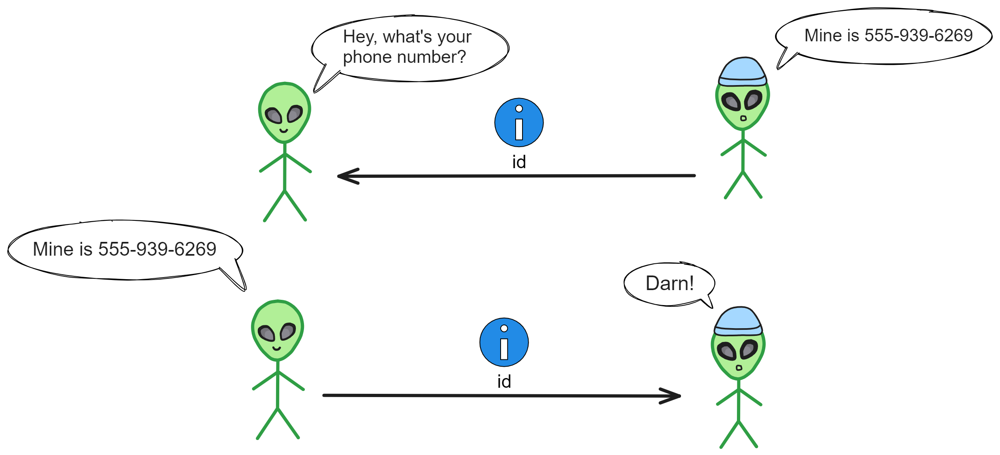
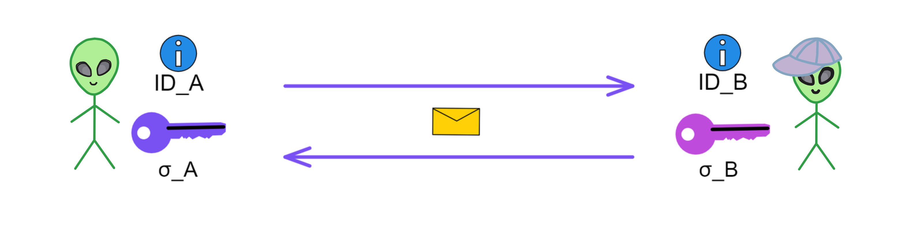

# VETKeys

All the data uploaded to blockchains nowadays is out there for all to see. **If you wanna peek into what an account's been up to or what they've got stored away, it's all laid bare.** Now blockchain tech might beef up security and availability, but it also opens the door to privacy leaks 'cause everything gets copied to so many nodes. Encryption can help protect privacy, but managing keys gets kinda hairy.  

So Web3 users just ain't allowed to have no privacy, huh?

 

Privacy is definitely indispensable. All you need to do is encrypt it with the public key and then store it on the blockchain, right?

A'ight, lemme just whip up a public-private key pair real quick. Encrypt with the public key, decrypt with the private key, bam, easy peasy. (Holla if you need an explainer on public-key cryptography).

 

It could work in theory, it's just kinda risky in practice:

What if you lose the private key?

What if some hacker gets ahold of it?

What if you wanna decrypt on another device?

Moving private keys between devices is a pain and prone to leakage!

 

This is where [IBE](https://en.wikipedia.org/wiki/Identity-based_encryption) (Identity-Based Encryption) comes in handy. IBE was first proposed in 1984 by famous cryptographer Adi Shamir (yeah, the same Shamir behind [Shamir's Secret Sharing](https://en.wikipedia.org/wiki/Shamir%27s_secret_sharing) and the S in RSA). 

But back then he could only come up with identity-based signatures, which were meh. IBE remained an open problem for years, until the Boneh-Franklin scheme and Cocks' quadratic residuosity-based encryption cracked it in 2001.

 

## IBE

IBE is a type of encryption that uses identity info to simplify key management. You can think of it as a special form of public key encryption. 

With regular public key encryption, each user has their own public and private key pair. To send an encrypted message to a user, you need their public key.

But with IBE, users don't need to generate separate key pairs. They can just use their identity, like an ID number or email, as their "public key." Of course you can't use the ID directly as a public key. IBE actually encrypts the file using a master public key together with the user's ID.

So you can think of it as the master public key and the user ID combining to form a "user public key" to encrypt the file. 

> Note the master key and user ID don't actually get combined, they just work together during encryption.

    

IBE relies on a trusted third party: a Private Key Generator (PKG). The PKG first generates a master key pair. The master public key is made public, and is used together with the user ID to encrypt messages.

The master private key can derive a decryption key from the user ID, which is then sent to the user with that ID. The user can then encrypt messages using their ID.

The decryption key corresponding to an ID is derived from the master private key. With the PKG's master key pair, decryption keys can be computed for all IDs!

 

So the diagram actually looks like this:

    

 

> According to [the paper](https://eprint.iacr.org/2001/090), the specific cryptographic principles are as follows:
>
> 1. Setup phase:
>
> (1) Choose a bilinear group (G1,G2,GT,e): This is a set of groups G1, G2 and GT with special mathematical relationships. Some computations can be done through the pairing operation e() between these groups.
>
> (2) Choose a random generator P∈G1, where P is a base point in group G1. 
>
> (3) Choose a random master secret key s ∈ Zp: s is a random number.
>
> (4) A hash function H: {0,1}* → G1: used to map identity information to group G1.
>
> 2. Key Extraction phase: 
>
> (1) For identity ID, compute H1(ID) to get public key QID: QID = H1(ID). QID ∈ G1*.
>
> (2) Use master secret key s and public key QID to compute decryption key SID = sQID. The decryption key generator center computes the user's private key based on their identity, and sends it to the corresponding user.
>
> 3. Encryption phase:
>
> (1) To encrypt message M for ID, choose a random number r, r ∈ Zq*.
>
> (2) Compute ciphertext C which contains two parts: C1 = rP, C2 = M⊕e(H2(ID), P)r. So C = (rP, M⊕e(H2(ID), P)r).
>
> Breaking it down: After choosing random r, first compute ciphertext component C1 = rP. Then compute gID = e(QID, P) ∈ G2, where P is a master public key and e is the bilinear map. Next compute ciphertext component C2 = M ⊕ H2(grID), where M is the plaintext and H2 is a hash function. The ciphertext C is <C1, C2>.
>
> 4. Decryption phase:
>
> (1) Receive ciphertext C. 
>
> (2) Use decryption key SID and C1 to compute pairing e(SID, C1), which can restore e(H2(ID), P)r: e(SID, C1) = e(sQID, rP) = e(QID, P)r.
>
> (3) Then decrypt message M = C2⊕e(H2(ID), P)r.

 

If everyone had to generate their own key pairs, it'd be a hot mess tryna keep track of all those public keys to encrypt stuff. You'd have a ginormous pile of confusing keys for every person you encrypt messages with. But with IBE, folks just need to hold on to one master public key, then use someone's ID directly to encrypt messages with them - piece of cake.

    

Users can switch up their ID periodically, and just have the PKG derive a new decryption key for the new ID. 

Lost your decryption key? No prob, just have the PKG whip up a new one, then hurry and decrypt those files. Worried someone got their mitts on your decryption key? No biggie, get a new ID, get a new decryption key. You can even set expiration dates on IDs.

    

Users can encrypt files using their ID with the PKG, and decrypt files using the decryption key derived by the PKG. So the ID acts like the public key, while the decryption key is derived by the PKG.

Through the PKG's master key, a unique decryption key can be computed for every ID.

 

For example, if Bob's email is bob@example.com, then according to this system, a decryption key corresponding to bob@example.com can be derived. With this decryption key, Bob can decrypt any information encrypted to bob@example.com .

This way, users don't need to separately save their decryption keys. The whole system only needs one master key, and can derive the matching decryption key based on identity.

IBE avoids the hassle in public key encryption of transmitting and saving each user's public keys. Users only need to know the other's identifier to encrypt messages.

In real applications, IBE systems often use the user's email as their ID. You only need to know the recipient's email to encrypt and send an email, without needing to obtain their public key. This simplifies key management processes.

    

Let's get real - IBE is public key encryption, just with the keys tied to users' identity info.

 

The big sell for IBE is you can straight up use identities as public keys, no messing with certs, and pulling keys is easy peasy. But here's the catch - the PKG knows everyone's decryption key keys.

So if some hacker punks the PKG and jacks the master key pair, all the users' data is toast! Their biz gets leaked cuz the PKG holds their secrets. One PKG breach means game over for privacy across the system.

    

We can't just randomly pick one subnet node as the PKG if we wanna use IBE on blockchain. Even selecting based on each era's first random beacon is shaky - what if that node turns malicious? Or the chosen PKG node goes rogue later on? We'd be screwed. And passing keys between nodes each period ain't secure either.

So we need something craftier than just winging it with a random PKG node.

To really lock down data security, the Dfinity team dropped "[vetKeys: How a Blockchain Can Keep Many Secrets](https://eprint.iacr.org/2023/616.pdf)" in 2023. It presents a distributed key derivation scheme: **verifiably encrypted threshold key derivation**, or vetKD for short. The core of vetKD is Verifiably Encrypted Threshold BLS, aka vetBLS. Let me break down how vetKD works based on the paper.

 

## VetIBE

VetIBE replaces the traditional IBE's third party Private Key Generator (PKG) with subnet nodes. It uses threshold cryptography to make IBE key derivation more decentralized and verifiable, avoiding a single point of failure.

In regular IBE, the PKG derives a user's decryption key by multiplying the master private key with the hash of the user ID.

> dID = sQID. Here dID is the user's decryption key. sQID represents multiplying the master private key s with the point QID on the elliptic curve group G1.
>
> The decryption key dID is obtained by multiplying the master key s with the user public key QID on the elliptic curve group.

 

In vetIBE, the subnet as a whole takes the PKG's place. Nodes threshold sign the user ID, and the resulting signature when reaching the threshold is the decryption key for that ID. Multiple nodes jointly generate the master key, and use DKG to share splits of the master key. (This is also how subnets generate consensus and random numbers using BLS threshold signatures).

**Users encrypt files with their ID and the subnet's public key, and decrypt with the BLS threshold signature as the decryption key for that ID.**

    

But hold up, we've got an issue here - if nodes just sign the ID with their private key splits then shoot that back to users raw, that ain't secure. Hackers could snatch enough signature shards to equal the decryption key for that ID! So we can't have nodes sending back signature pieces in the clear. Time to slap on another layer of public key encryption!

    

We can solve this security issue by having the user generate a temporary transport key pair: Before initiating the request, the user directly generates a transport key pair (tsk, tpk). Then they initiate the key derivation request, sending the transport public key tpk, user ID to the subnet. Each node in the subnet signs the ID, then encrypts the signature shard using the user's transport public key, and sends it back to the user. Upon receiving the encrypted signature shards, the user first decrypts them using their own transport private key to obtain the signature shards. Then they combine the signature shards into the complete signature (decryption key) to decrypt the file.

 

So let's recap the encryption/decryption flow: 

The basic idea of vetIBE is that the user first encrypts the information, then stores it on the blockchain.

When a user needs to encrypt a file, they encrypt the file using the user ID and subnet public key mpk. Then they store the ciphertext in the Canister.

When a user needs to decrypt a file, they first generate a transport key pair (tpk, tsk). Then they initiate the key derivation request, sending tpk, ID to the nodes.

Each node uses its private key shard ski to compute the BLS signature shard for the ID: σi = H(id)^ski.

    

Then each replica encrypts its own signature shard using the transport public key tpk, generating an encrypted signature shard eki, and sends it to the user.

    

The user receives t encrypted signature shards from t different replicas, and then decrypts them individually using the transport private key tsk to obtain t signature shards. The user combines these to produce the subnet's signature σ on the ID. This σ is the decryption key corresponding to the ID.

    

> The specific encryption process is:
>
> The user calls the interface, inputting the identity ID and plaintext message m.
>
> Invoke the hash function, perform hash operation on ID h = H1(id), obtaining value h.
>
> Choose a random number s, compute t = H2(s, M), where H2 is another hash function.
>
> Compute C1 = g2^t, C2 = s ⊕ H3(e(H1(id), mpk)^t) = s ⊕ H3(e(h, mpk)^t), C3 = M ⊕ H4(s). The ciphertext is C = (C1, C2, C3).
>
> With vetKD, now each subnet is a "decentralized PKG"!

We call the derived keys vetKeys.

 

So in vetIBE, the user does not have a fixed public key, but instead temporarily generates a transport public key tpk as needed. Then they obtain the decryption key through the nodes' collaboration. The user ID and tpk together serve as the "identity" for deriving the decryption key, but the user does not have a fixed key pair.

As the name implies, the transport public key is used to encrypt the transmission of the signature shards!

 

## What if the user loses the transport private key for decryption?

Actually, the file is encrypted using the subnet public key and ID. To decrypt the file, the key derived by the subnet based on the ID is needed (the BLS signature), not the transport key. The transport key is only used to ensure the security of the signature shards.

So as long as a new transport keypair is generated again, and sent to the subnet to encrypt the signature shards with this new transport public key, a new BLS signature can be derived. The user can decrypt and obtain the BLS signature plaintext with the new transport private key, and thus decrypt the file.

 

The user does not need to store the private key locally, and can acquire the key anytime with a new transport public key.

Compared to local key storage solutions, this blockchain assisted derivation mechanism can better ensure availability for users. As long as the user ID exists, the file can be decrypted. And the security of the user's ID can also be guaranteed by ii (Internet Identity).

 

## What should the user do if they want to decrypt the file on another device?

There is a solution. Similarly, log in to the dapp with ii to acquire the ID. Then generate a new transport keypair! You know what to do next 😏.

 

## How can end-to-end encrypted communication be achieved then?

It's very simple with vetIBE technology:

User A logs in to the dapp to acquire identity ID_A, and obtains the corresponding user decryption key, which is the BLS signature of ID_A: σ_A.

User B also generates their own ID_B and user decryption key: σ_B.

Now both User A and User B have their own public keys (IDs) and decryption keys (σ). User A can encrypt and send messages using the other party's ID.

User B decrypts with their own decryption key σ_B to complete the communication.

    

Hol' up...

You still worried it ain't secure? What if someone's device gets hacked and the hacker snatches the decryption key for that ID. Now using that ID to chat is busted. And since the decryption key for the ID is unique, it means the user's gotta change their ID and derive a new decryption key. Plus any previous messages sent could be cracked.

 

Dang, looks like I gotta bust out my ultimate signature move: **Communication ID!**

Since the decryption key can be calculated from the ID and subnet, I'll just generate temporary communication ID for both parties. Encrypt everything with the pre-arranged IDs, and both sides can ask the subnet to derive the keys.

 

For example:

Say A's crushin' on B and wants to chat privately. First they generate a communication ID using: A's ID + B's ID + the first message from A, then hash it all to get the communication ID.

A encrypts "010" using B's ID_B and sends it to B. (Could be a random number, doesn't matter as long as each message is unique).

Then A can generate the communication ID: sender ID + receiver ID + 010, hash it to get the communication ID.

B receives and decrypts using their derived decryption key to get 010. Then generates the communication ID using the same process.

Boom! 👌 With the communication ID, both can now derive decryption keys through the subnet and chat freely. Sending love letters n' stuff.

    

It's secure cuz both sides encrypt with the communication ID. This keeps it locked down:

The communication ID is designed so only A and B can get the keys.

Only ciphertext travels, third parties can't decrypt.

The way the keys get made has built-in protections, so even if some nodes get hacked, the secrets stay secret. 

Even if someone hacks device A or B, the private key won't leak directly, 'cause the user ID private key ain't stored locally. You just need a new comm ID, and you can re-generate the comm ID private key through the subnet.

This keeps the transmission secure while also solving the issue of user devices being hacked. Compared to old school end-to-end encryption that just stores keys locally, the vetIBE system can get better hack resistance with the blockchain's help.

 

That covers vetIBE. The paper also mentions vetSIG, vetPRF, vetVRF - which combine into vetKD.

I've blabbed enough already lol, so I'll give the quick lowdown on the others! Lemme know if the casual tone and humor lands or needs adjustment.

 

## vetSIG

BLS signatures are inherently verifiable, so they can be directly used for signatures. vetBLS allows nodes to generate BLS signatures in encrypted form. The user can recover the signature upon receiving it, thus achieving vetSIG.

It's quite similar to vetIBE, except vetIBE derives a decryption key from an ID, while vetSIG simply uses a subnet's BLS threshold signature. 

The steps are:

1. The user generates tpk, tsk, and sends tpk to the nodes.

2. When a user wants the BLS signature of message m, they send m and tpk to the nodes.

3. Each node uses its sk share to compute a signature share σi of m, encrypts it with tpk, and sends eki to the user. 

4. The user receives t eki's, decrypts to obtain the signature shares, and recovers the full signature σ.

5. The user uses σ as the signature of m relative to public key pk, thus achieving vetSIG.

 

## vetPRF

The uniqueness of BLS signatures, combined with a hash function under a random oracle, can construct a PRF. vetBLS allows nodes to generate BLS signatures in encrypted form. The user recovers the signature and hashes it with the input to obtain the output, achieving vetPRF.

The steps are:

1. The user generates tpk, tsk, and sends tpk.

2. When a user wants to compute the PRF output for input x, they send x and tpk to the nodes.

3. Each node computes a BLS signature share of x, encrypts it, and sends to the user. 

4. The user receives the encrypted shares, recovers the full signature σ.

5. The user computes y = H'(pk,x,σ) as the PRF output on x, thus achieving vetPRF.

 

## vetVRF

Building on vetPRF, using the BLS signature as proof constructs a verifiable VRF. Verification is done by verifying correctness of the BLS signature. 

The steps are:

1. Based on vetPRF, the user wants to prove correctness of y.

2. They send the signature σ as proof, along with y to the verifier.

3. The verifier checks e(σ, g2) = e(H(x), pk) to verify correctness of y, thus achieving vetVRF.

 

## Summary

vetKD achieves secure and efficient threshold key derivation. Users do not need to generate and manage private keys themselves, making it very suitable for blockchain scenarios. vetKD is better suited as infrastructure for blockchain networks, providing unified key management and access control. It utilizes the security properties of blockchains to reduce the burden on users, and provides a more user-friendly and secure key management solution.

 

So what problems does vetKD solve exactly?

Specifically:

Through threshold encryption, vetKD allows blockchain nodes to collaboratively derive keys, without any individual node knowing the final key. There is no single point of failure, improving security. Even if some nodes are compromised, the actual private keys will not be directly revealed. Compared to traditional schemes, it does not rely on a trusted execution environment and has higher security. 

Users can encrypt private data, nodes collaborate to decrypt the key and send it to the user, without revealing the actual key in the process. Moreover, a single subnet public key (master key) can derive unlimited separate identity keys, greatly simplifying key management. Various end-to-end encryption applications can also be enabled, such as private chat, private payments, and key escrow.

In summary, vetKD allows blockchain applications to protect user data privacy while retaining the verifiability and transparency of blockchains, filling an important gap in this field and having significant innovative value.

 
 
