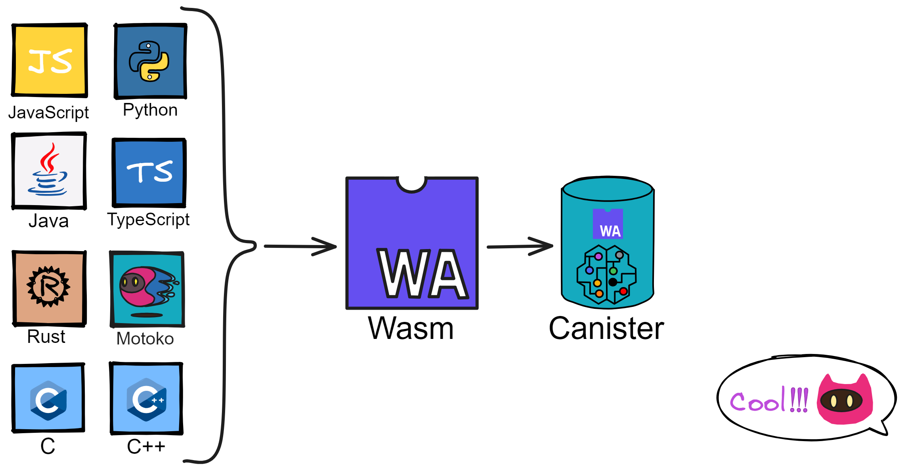
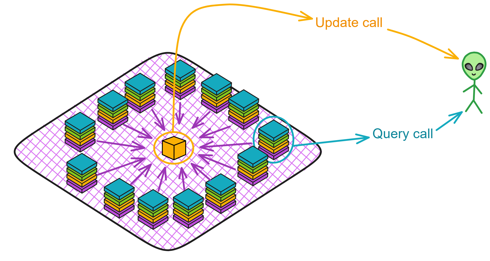
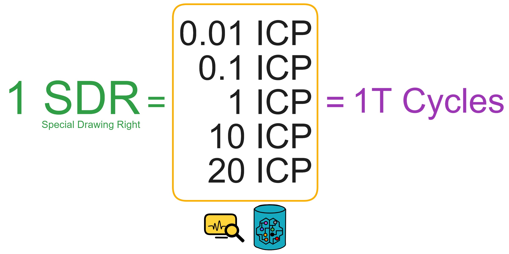
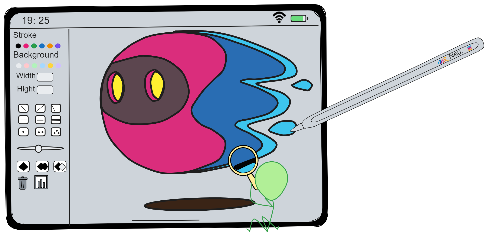

## What is Canister?

Inside a Canister there is something called WebAssembly (Wasm) bytecode that represents the program of the smart contract; there are also a set of memory pages that represent the state of the contract. A Canister is like a miniature server that can store data, maintain state, communicate over WebSocket, etc.

The memory pages are like a notebook for the contract. By installing or upgrading the computer, we can modify the Wasm bytecode. When we execute messages on a contract, the contract's state will change, as if we made edits in the contract's notebook.

Each Canister runs in a sandboxed environment, isolated from other Canisters and the rest of the system, ensuring privacy and integrity of data. Canisters execute via the WebAssembly (Wasm) runtime, which provides memory safety and type safety guarantees. Wasm also restricts the system calls a Canister can access, preventing malicious Canisters from performing harmful operations.

It's worth mentioning that currently many public blockchains like Ethereum, Polkadot, etc are considering transitioning to the Wasm virtual machine. Dfinity Foundation engineer Andreas, as the inventor, has participated in establishing most standards related to the Wasm VM.

WebAssembly is a virtual machine abstraction that provides a safe, portable, efficient, and lightweight execution environment. It enables fast cold start times in milliseconds and extremely low resource consumption. Existing programming languages like C/C++, Rust, etc. can be compiled to WebAssembly bytecode and executed in a sandboxed environment.

## WebAssembly

WebAssembly (Wasm) is a universal code format that is efficient, portable, and supported by the open source community. Although it was initially designed for high-performance web applications, it is also well-suited for general-purpose computing. It is being widely used in web apps, client-server apps, blockchain apps, and more. As a faster, more efficient and portable code format, Wasm is key to building performant applications on the IC. Wasm is a stack-based virtual machine instruction format with a two-tiered design. In Dapp projects, the Wasm code for smart contracts is generated by compiling high-level languages like Rust and Motoko.

Wasm's portability and high performance have quickly made it one of the most popular code formats on the internet. Most high-level languages can compile to efficient, portable Wasm code. In addition to LLVM producing Wasm, popular languages like C/C++, Rust, Go, Java, JavaScript can efficiently compile to Wasm.

Wasm code can execute internally in browsers and also run in virtual machines with very little efficiency loss compared to native execution. For example, Cloudflare uses Wasm to provide “serverless functions”, and advanced blockchains use it to run performant smart contracts.

Wasm is hardware and software agnostic, able to run in diverse environments with the goal of executing on stack-based virtual machines. Both browsers and standalone sandboxed processes can support Wasm execution via a VM. The Internet Computer utilizes the Wasmtime project to run user-defined Canister smart contracts with great performance.

Wasm code execution can easily be sandboxed for isolation. The Internet Computer leverages OS-level process isolation and sandboxing for protection. Each Canister compiles and runs Wasm code in its own sandboxed process, only communicating with the main process through secure, audited IPC. The sandbox is given the least privileges required to execute. Additionally, Wasm code can be formally verified.

Wasm has many advantages like formal specification, near-native performance, broad language support, evolving open source community, deterministic execution, and memory safety.

Diving Deeper into Canisters
------------ 

The IC is a revolutionary public blockchain that enables smart contracts to run directly on-chain in a secure and reliable way. On the IC, smart contracts exist in the form of Canisters. What are Canisters? They are computational units that bundle a smart contract's code and state together. Each Canister defines interfaces that can be called by other Canisters or users off-chain (via browser or app).

Multiple Canisters can communicate through asynchronous messaging. Each message execution is fully isolated, supporting massive concurrency. Additionally, a Canister smart contract can be upgraded - the controller (developer or other Canister) can update the Canister's code. 

What's a controller? It is responsible for deploying the Canister to the IC, and can also control the Canister's start/stop, update the Canister's code, delete the Canister, etc.

A developer identity (dfx can generate multiple identities, i.e. principal ids) can act as a controller, controlling multiple Canisters. A Canister's controller can also add other controllers to the Canister.

To ensure smooth running of a Canister, the controller also needs to add sufficient Cycles to the Canister. Cycles are like Gas on the IC, used for the computational and storage resources required to execute the Canister. The subnet will monitor each Canister's resource consumption and deduct from its Cycles balance.

 

Although Canisters represent a huge leap over smart contracts, they are not the end goal. Canisters exist to enable a new generation of massively scalable, interoperable internet services. Everything we can build on the internet today can be rearchitected onto blockchains using Canisters. With close collaboration between potentially millions of Canisters, enormous decentralized networks can be built. 

Services with billions of users may require thousands of Canisters collaborating to store and manage user data, serve content, execute transactions, etc. But this is the future the Internet Computer is designed for. Its network architecture and protocols are engineered for internet scale.

### User Access

Users can directly access Canisters using a browser or mobile app, no servers or command lines required. This is because the IC itself supports running web services. On the IC, tokens, smart contracts, databases, websites can all run directly inside a Canister. Decentralized apps are now truly decentralized, no longer relying on other centralized servers.

To ensure high performance of Canisters, the IC's servers are equipped with ample SSD storage and memory. Each Canister's state and code is replicated across nodes, allowing near instant access. State updates are verified via cryptographic signing by nodes. For isolation, each Canister runs in an independent sandbox. Every message spawns a Canister process to compile and execute code, update state, generate response, etc. Execution details are kept in the call context. This allows the Canister to run securely and reliably.

In summary, the Canister mechanism enables smart contracts to truly run in a decentralized, scalable, and secure way on a public blockchain. This will usher in a new era for blockchain applications. It is through Canisters that the IC becomes the first and only public blockchain capable of running web content and services at scale. No more clunky command lines and centralized servers - the future is here!

### External User Authentication 

The IC does not have a centralized user registry to identify users. Before sending requests to subnets, users first generate a public-private key pair. The hash of the user's public key serves as their universal identifier (also called principal id) for identifying themselves to Canisters. 

When sending messages to subnets, the message is signed with the private key. The signature and public key are then sent together to edge nodes, who verify the signature and pass the principal id to the target Canister. The Canister then approves the requested operation based on the principal id and other parameters specified in the message.

New users generate a key pair and derive their user identifier from the public key during their first interaction with the IC. Existing users authenticate using the private key stored in their client. Users can also delegate signing rights to associate multiple key pairs with a single user identity. This is useful for accessing the IC from multiple devices under the same identity.

In summary, the IC has users register identities via public key hashes and retain the corresponding private keys themselves. Each interaction is signed with the private key, automatically verified by the system via the signature and public key, identifying the source. New users register identities by generating key pairs, while existing users authenticate via their private keys. Thus decentralized user identity is achieved without centralized services. Pretty clever!

### Actors

Canisters follow the Actor model. State is not shared between containers and there are no state locks. Communication is used to coordinate transactions. Calls between Canisters are also asynchronous. Canisters can communicate but data is isolated - atomicity only exists within execution of a single method in a Canister.

In the Actor model, an Actor can modify its private state, send messages to other Actors, create new Actors, etc. The similarities between Actors and Canisters are very apparent:

* A Canister has private state that only it can modify.
* It has single-threaded execution with no need for locking.
* Canisters communicate via asynchronous message passing.
* Canisters can create other Canisters.

The core difference is that communication between Canisters is bidirectional with a request-response pattern. The IC handles callback of responses to callers.

In Actor terminology, each Actor has a mailbox address for receiving messages. Similarly, each Canister has a Canister id (fundamentally a type of principal id too) that allows Canisters and user interfaces to exchange messages.

Although individual Canisters have single-threaded state updates, the IC can massively parallelize execution across potentially millions of Canisters. This overcomes limitations of early smart contract platforms. Additionally, read-only queries can be parallelized internally in a Canister for huge scalability.

The Motoko language is directly inspired by the Actor model, providing a natural way to develop Canister logic.

### Scalability

On platforms like Ethereum, smart contract computation and storage are bundled together in a single unit - each smart contract handles its own data storage and logic. This makes horizontal scalability difficult. In contrast, the IC decouples computation (in Canisters) from storage (replicated across subnets). Storage and computation can scale independently.

This means, unlike monolithic smart contracts, Canisters can completely focus on computational logic while relying on the independent, persistent chain for data storage. If a Canister runs out of storage, additional Canisters can be created for storage. Or a "parent Canister" can be deployed solely for spawning Canisters - here's a demo project to try it out!

Canisters can also be dynamically instantiated and load balanced on demand. Internet Computer services can elastically scale to internet size, impossible on platforms bundling storage and computation.

Another key difference is that queries are read-only, allowing parallel execution. A Canister can handle potentially thousands of queries per second - overwhelming smart contract architectures. This unlocks use cases reliant on high query throughput and low latency, like serving interactive web experiences.

### Query Calls and Update Calls

In blockchain systems, every replica must reach consensus to update state - ensuring data consistency but inevitably introducing latency. If only querying state without modification, consensus can be skipped.

Each query call can be responded to autonomously by a single replica, like reading from a database, without going through consensus. This greatly reduces latency. Operations like viewing account balances or getting game leaderboards can leverage query calls. Query calls are like going to a restaurant and having the waiter immediately tell you what's on the menu, without needing to hold a staff meeting to decide!

Canisters expose two types of calls: **update calls** and **query calls**.

Update calls: create, update, delete. Modify in-memory data. Since they change data, consensus is required across subnets. Consensus necessitates **single-threaded** message handling, no concurrency.

Query calls: read. Each query call does a fast read of the node's current data. As no data is changed, no consensus is needed so **multi-threaded** execution is supported allowing concurrent handling. A Canister can process many query methods simultaneously.

|             | Consensus? | Persistence? | Execution? | Latency? |
| ----------- | ---------- | ------------ | ---------- | -------- |
| Update Call | Yes        | Yes          | Sequential | 2-3 secs |
| Query Call  | No         | No           | Parallel   | <100ms   |

### Certified Variables

However, directly responding via query calls also poses security risks since a single replica is queried independently. If that replica is compromised by an attacker, incorrect results could be returned. Query results are also not recorded in consensus, so errors cannot be verified.

To address this, Dfinity introduced **certified variables**. Writes are automatically certified via subnet signatures. Anyone can verify the authenticity of these key data values using the subnet's public key. If a query call returns a certified variable's value, its trustworthiness matches update calls.

A Canister's certified variables are hashed and recorded in each round's certification state, which is consensus-based.

As part of each round's certification state, every subnet allocates a small set of bytes to record certified variables. Their values can be written via update calls, representing authoritative state that can be verified through the certification state mechanism each round.

Additionally, a Canister can use its certified variables to store the root of a Merkle tree. In this way, as long as a query call's response is a leaf node of the Merkle tree rooted at the Canister's certified variable, it can be verified.

This is like a restaurant menu listing original prices for dishes. The waiter tells you the discounted price. But with the original price printed as proof, you can verify the waiter's reply. This provides the low latency of query calls while still ensuring result integrity.

### Canister Memory Management

Canisters utilize two different types of memory. The first is heap memory, used as temporary data storage space. The second is stable memory, a larger pool for permanent data storage.

One is **heap memory**, the memory heap exposed by WebAssembly, similar to the heap used by programs at runtime. All variables and data structures defined in high-level languages are stored in the Wasm heap, which is a **4 GiB** 32-bit address space. However, the heap is best suited only as temporary space since it can be wiped clean on each smart contract upgrade. Data layouts may also change. Thus, it is not recommended to persist important data long-term in heap memory.

The other is **stable memory**, additional 64-bit addressable memory provided by the Canister, currently **96 GiB** in size. Developers must explicitly use stable memory via related APIs. Stable memory can be seen as persistent storage where developers can place data needing long-term retention. A common usage pattern is serializing heap state into bytes before and after upgrades and saving that to stable memory, then deserializing and loading it back in during recovery.

To enable orthogonal persistence and allow programs to resume after upgrades, Canisters employ some special mechanisms:

1. Page protection - memory is split into 4KiB pages, with OS page protections enabling page faults on access to map persisted data into memory and track memory writes.
2. Heap delta - a persisted tree-like data structure tracks modified pages in memory.
3. Checkpoint files - every N block epochs a checkpoint file is generated to capture the current memory state.

Additionally, the IC does some optimizations for performance:

1. Memory map checkpoint files to reduce memory usage and read overhead.
2. Only track page modifications for update calls, not queries, accelerating queries.
3. Page prefetching on page faults, loading multiple pages to reduce faults and speed memory-intensive operations.

Through this design, the IC provides developers a sophisticated memory management system combining orthogonal persistence, heap, and stable memory for seamless execution and data storage. Developers can write programs without worrying about persistence - the system automatically persists memory and recovers on failure. Various optimization mechanisms also ensure high performance. This reliable memory abstraction gives developers a foundation for building secure, reliable blockchain applications.

Under the hood, the IC system uses page protection, versioning, and performance optimizations to enable efficient memory handling.

You can learn more [here](https://wiki.internetcomputer.org/wiki/IC_Smart_Contract_Memory).

### Inverse Gas Model

We know Ethereum's high gas fees have long been lamented by users. But on the IC, the gas costs of running smart contracts are prepaid by developers, not users.

Accessing the internet should be free, as it is on Web2 - this dramatically lowers barriers for users and improves ease of use for applications.

The IC uses an inverse gas model where the costs of running Canisters (gas fees) are covered by the teams deploying the applications, by default. Of course, if each user needs to create their own Canister, the ability to top up Cycles can be added.

Gas consumed on the IC is called Cycles, obtained by burning ICP tokens. ICP can be one-way converted to Cycles. Cycles are stabilized algorithmically, pegged to 1 SDR (SDR can be seen as a stable unit calculated from a basket of fiat currencies). In addition to gas, Cycles will play a key role as a stablecoin and tradeable unit in the IC's future ecosystem.

Cycles Price Stability:

$$ 1\times\ 10^{12}\ cycles\ =\ 1\ SDR $$

(1 T Cycles is 1 Trillion Cycles. 1 TC is 1 T Cycles, where C is the abbreviation for Cycles.)

A [Canister](https://neutronstardao.github.io/constellationzh.github.io/4.%E5%AE%B9%E5%99%A8(Canister)/4.XRC.html) on the system subnet fetches price data from off-chain exchanges via HTTP out call to calculate how many Cycles can be exchanged for 1 SDR.

Each Canister has its own Cycles balance, and Canisters can send Cycles to each other.

Deploying a Canister initially requires a large amount of Cycles (minimum 0.1 Tcycles, default 3 Tcycles), but subsequent code updates consume very few Cycles.

If a Canister's Cycles become insufficient to sustain it for 30 days, the Canister enters a frozen state. After 30 days without recharging, the Canister will be deleted. Frozen Canisters cannot function normally - all calls will be rejected.

Through this inverse gas model, the IC removes the friction of gas costs for end users, improving mainstream adoption. The prepaid gas reserve also enables Canisters to run reliably without interruptions.

### Random Numbers Provided to Canisters

Random numbers are critical for many blockchain applications like gambling and lotteries that require unpredictable randomness. However, generating truly secure randomness has always been a huge challenge for deterministic distributed systems.

The IC solves this problem through a unique technical mechanism at its core - a component called the "random tape." Each subnet generates a random tape during every round of the consensus protocol. It is a special digital signature that can seed a deterministic pseudorandom number generator.

The random tape has two key characteristics:

1. It is unpredictable before generation. This ensures randomness.
2. The generation process does not introduce additional time delays. This ensures both efficiency and security.

When a smart contract needs randomness, it can make a system call request. If the random tape for the next block has already been generated, the system will use it directly to seed and respond to the request. Since the random tape is generated synchronously during consensus, the call response is fast without impacting performance.

Per the first characteristic, we can ensure the random number is unpredictable at the time of request. Per the second, acquiring the random number generally won't cause extra latency.

This mechanism fundamentally resolves the conflicting requirements of deterministic execution and secure random number generation. It cleverly balances consistency of distributed state with the application's need for randomness.

Specifically, the random tape mechanism plays a crucial role in:

1. **Ensuring randomness** - each random tape is unpredictable before generation, providing a truly secure source of randomness for smart contracts.
2. **Efficient response** - no additional latency introduced for random number generation, meeting performance requirements.
3. **Simple access** - smart contracts just make a call to easily get randomness, very convenient.
4. **Self-consistent** - deterministic algorithms generate consistent random numbers on each node from the random tape seed, preserving state consistency.
5. **Cryptographically secure** - random tapes generated via BLS threshold signatures, resilient against prediction and manipulation attempts.

### Motoko

Additionally, the IC needed a simple, safe language. The reason is simple - while the IC uses Wasm for smart contracts and is very open, programming languages with good Wasm support like C++ and Rust are relatively difficult for beginners.

The IC provides a purpose-built language called Motoko that embraces the IC's programming model and leverages unique blockchain capabilities. Motoko has a powerful type system, actor model, persistence support, asynchronous messaging, and other features, while also providing automatic memory management, generics, pattern matching and other modern language capabilities. This enables developers to write Canister smart contracts in a safe and efficient manner.

Learn more about Motoko [here](./Motoko.md).

