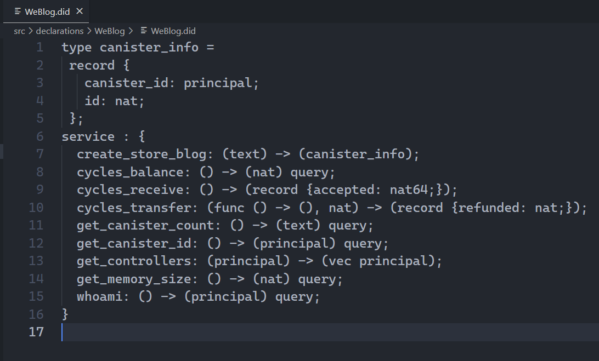

## Experience Fast Dapp Development

If you're interested, here is a small [demo](https://github.com/NeutronStarPRO/WeBlog). You can refer to the [official docs](https://internetcomputer.org/docs/current/developer-docs/) to deploy locally and try it out, or deploy to the [Motoko playground](https://m7sm4-2iaaa-aaaab-qabra-cai.raw.ic0.app/) to experience it. 

 

After setting up the basic development environment, here are some concepts related to Canisters. 

 

### Canister State

A canister has its own lifecycle with four states: Created, Running, Stopping, Stopped.

Created: No code, no memory, cannot receive or send messages.

Running: Code installed, can receive and send messages.

Stopping: No longer receives or processes new messages, only receives replies to previous messages.

Stopped: Stops running, canister can be deleted, code uninstalled or upgraded.

### Wallet

A wallet is a dedicated canister that allows storing and managing cycles. A wallet belongs to a principal.

### Principal

A principal is essentially an identifier that can be used to identify identities and canisters (possibly more in the future).

For example, a principal ID can identify an identity. When you first use the developer SDK, the dfx command line tool creates a default developer identity (with a key pair) - this default developer identity is identified by its Principal ID.

Note developer identities can also be used to derive Account IDs to represent "identities" that hold ICP tokens in the Ledger canister.

Similarly, a canister ID is also a principal.

So when referring to a principal, it could represent either an identity or a canister, like a wallet canister.

### Controller

A controller is a principal with the rights to install, upgrade, and delete a canister.

Typically a canister's controller can be set to an identity principal, or that identity's corresponding wallet canister.

In dfx 0.9 and later, the default identity is the controller of canisters by default, no longer the wallet canister (equivalent to dfx specifying --no-wallet).

### Candid UI

IC's application layer also integrates a message interface definition language and data format: Candid UI. When deployed, it can parse the public functions in the backend canisters and automatically generate a frontend webpage. This allows smart contract developers unfamiliar with frontends to easily test their contracts. It is used for typed, high-level, cross-language interoperability. This enables easy communication between any two canisters, even if written in different high-level languages.

The autogenerated Candid file looks like this. 👇 Candid is a data description language and also a specification for cross-language calling. It can describe the interfaces and data types exposed by a canister.

After local deployment, it provides frontend and backend URLs. The frontend URL directly shows the frontend page, with the backend canister autogenerated by Candid UI.

The page generated by Candid UI looks like this:

Update call: Candid UI also simulates the actual latency of calling the IC, showing 6.59s in the bottom right corner. This function tells the canister to create a new canister to store the blog, which is time consuming.

Creating a blog post takes 2.116s, still decently fast.

Querying data takes 0.016s, blazing fast.

### Canister id

When creating a canister, the system assigns it a globally unique canister id. Edge nodes use the id to locate which subnet it is in, then forward messages there. Also, prepending the frontend canister id with the domain ic0.app forms the URL, e.g. [https://zur5z-byaaa-aaaag-aaxeq-cai.ic0.app](https://zur5z-byaaa-aaaag-aaxeq-cai.ic0.app/) (my blog URL).

/assets/3.%E9%83%A8%E7%BD%B2%E8%87%AA%E5%B7%B1%E7%9A%84Canister/1222.png)

/assets/3.%E9%83%A8%E7%BD%B2%E8%87%AA%E5%B7%B1%E7%9A%84Canister/image-20230221193009340.png)