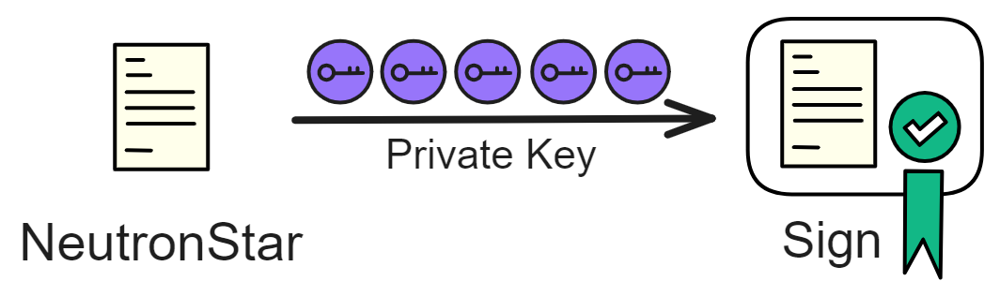
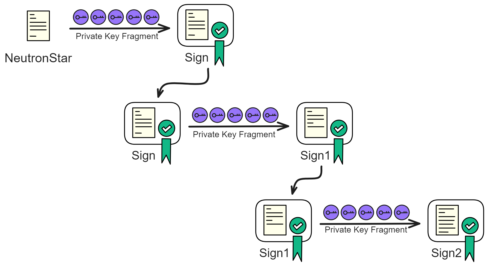
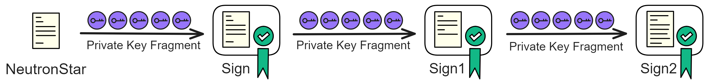

## Threshold Relay - An Elegant On-Chain Random Number Solution

Whether in real life or in distributed systems like blockchain, random numbers are commonly used. In the realm of blockchain, the need for random numbers is particularly crucial.

In the underlying consensus protocols of blockchain, a random number is required to designate a leader for block creation. For example, in Ethereum's Beacon Chain, which utilizes a Proof of Stake (PoS) consensus, there are 36 slots in each epoch, with one block produced per slot (12 seconds). At the beginning of each slot, a validator is randomly selected from the validator set to be responsible for creating a block during that slot.

In higher-level applications, smart contracts also require random numbers for activities such as lotteries and dice rolling.

Additionally, the multiplication operations in some Multi-Party Computation (MPC) protocols rely on random number sources to generate arrays.

 

Therefore, providing a reliable source of random numbers for a group of participants is a critical issue that needs to be addressed.

 

## Unpredictable and Non-Bias

In a blockchain system, the first thing to ensure is that each member receives the same random number.

Secondly, it also needs to be reliable, meaning that the random number is unpredictable and non-bias:

* In the case where an adversary has both historical information and current information, it should still be impossible to predict future random numbers. 

    It is not acceptable for a malicious adversary to predict future random numbers, even if they can influence and predict a random number three rounds later by their current influence.

* Non-bias can also be understood as destructiveness. That is, a malicious adversary cannot interfere with the random number generation process. For example, if an adversary manipulates the last few bits, causing damage to the original random number, it is considered insecure.

In other words, no valid information should be extractable from different inputs.

 

## Threshold Relay

The scheme of using BLS threshold signatures to generate random numbers is a simple and practical approach. (Of course, BLS threshold signatures require a [DKG protocol](../3.ChainKey/Chainkey.md#nidkg), which is a disadvantage, but on the IC, the NIDKG has addressed this issue, so the rest is quite straightforward ~)

On the IC, there is a [random beacon committee](../3.ChainKey/Chainkey.md#summary-blocks), and the members of the committee are responsible for generating a random number in each round. The committee members are changed after each epoch, and the committee consists of a subset of all nodes in the subnet.

The committee can ensure that the performance does not degrade significantly when there are a large number of nodes in the subnet. The performance of the subnet is related to the number of nodes participating in the consensus; more nodes lead to increased communication and computation overhead.

The method of generating random numbers is also simple—by signing a message.

Let's consider generating a key pair first. **Using a private key to sign a message results in a unique signature, given that the private key and the message are fixed.** 

Moreover, before the signature is produced, no one knows what the signature will be.

> Of course, if the private key is compromised, others can use it to sign the message and, therefore, learn the signature content in advance.

While threshold signatures do not have a unique private key, each member independently computes a signature fragment using their private key share. These signature fragments are then collected through broadcasting, and once a sufficient number is gathered, the signatures are synthesized.

Hence, even the members responsible for signing cannot predict the signature outcome and cannot interfere with the signing process. Only with the aggregation of signature fragments is the result known. Subsequent signatures require nodes to broadcast new signature fragments in the next round to complete the entire signature and obtain the random number.

Assuming a total of 7 members with a threshold of 5, even if 2 members refuse to sign, it does not affect the generation of the signature.

As long as the message being signed is different each time, the resulting signature will also be different each time.

We can hash the result of the previous round's signature, sign it again to generate a new signature. This new signature can then be used as a seed to derive a random number. This process can be repeated by hashing the signature and signing it again, creating a chain of linked signatures.

In each round, the process involves signing the previous signature, creating a nested chain of signatures. 

The process of generating random numbers is manipulable, unpredictable, low-cost, fast, and convenient. It is difficult to collude, making it an ideal random number generation scheme. 😎💪🚀 

Here is a [presentation](https://dfinity.org/pdf-viewer/pdfs/viewer?file=../library/threshold-relay-blockchain-stanford.pdf) from 2017 regarding threshold relay. 

 

Moreover, everyone can verify the generated random numbers (signatures) using the subnet's public key. This achieves a publicly verifiable, unpredictable, secure, fast, and efficient random number generation (buffed up with confidence). Using the BLS threshold signature scheme allows continuous and uninterrupted output of signatures, round after round, making it extremely convenient. 

 

After solving the key distribution problem with NIDKG, BLS threshold signatures can be used to generate random numbers. Using such verifiable random numbers in consensus algorithms can achieve effects similar to Proof of Work (PoW), ensuring a secure and random selection of block-producing nodes. Each member of the consensus committee has the opportunity to produce a block. 

Smart contracts (Canisters) can also derive random numbers from this seed. 

For each subnet and each round, different random numbers are generated. 

 

 

 

**What are true random numbers and pseudo-random numbers? What is the difference between the two?**

Pseudo-random numbers are generated by deterministic algorithms, and their distribution and correlation can be assessed through statistical tests. However, as pseudo-random numbers are generated by algorithms rather than from a genuine random process, they can only simulate true randomness as closely as possible. Pseudo-random numbers are predictable and controllable since they depend on a "seed value" for initialization. Common pseudo-random number generation algorithms include linear congruential methods, Mersenne Twister, etc.

On the other hand, true random numbers are entirely unpredictable and non-repetitive. True random numbers typically rely on some physical process for generation, such as dice rolling, spinning wheels, noise from electronic components, and nuclear fission. Implementing true random number generators is challenging, and they tend to be less efficient.

Additionally, true randomness may not be achievable if the entropy source information is limited. Higher entropy corresponds to better randomness, meaning more disorder and unpredictability. From a probability theory perspective, true random numbers can be further categorized into statistical randomness and quantum randomness. Quantum random numbers are influenced by the inherent randomness in quantum mechanics, theoretically making them more "true" than statistical random numbers.

>  Traditional randomness fundamentally depends on the lack of understanding of various variables, making it impossible to calculate or predict. If we have precise data on variables such as gravity acceleration at the picometer level, the air model for the entire enclosed space, all forces acting during a coin toss, the mass density material of the coin, etc., along with powerful computational resources, we could calculate the coin's motion and outcome.

In computing, the Linux kernel implements a statistical true random number generator by collecting various noises during machine runtime, including hardware runtime speed, user-computer interaction speeds (e.g., keypress intervals, mouse movement speed), intervals between specific interrupts, and response times for block IO requests. A random number generator is an example of utilizing atmospheric noise to produce true random numbers. Some systems attempt to obtain even truer random numbers by monitoring the spontaneous behavior of quantum particles.

 

**Criteria for Evaluating Random Number Generation Schemes:**

1. **Unpredictability:** Unpredictability applies to all participants, producers, and consumers alike. It means that, based on historical data, no one can predict the possible values of the next random number, maintaining a Markov property. In public random number schemes, it is required that no one can improve prediction probabilities based on any public information.

2. **Immutability:** During the generation of random numbers, collaborating participants cannot affect the process, change the outcome, or gain other advantages, such as obtaining the result of an upcoming random number in advance.

3. **Non-Acquaintance:** Simultaneous knowledge of the random number is shared among all participants. No party can know the result in advance.

4. **Tamper Resistance:** The producer of random numbers cannot forge a random number. Once a random number is generated, it cannot be modified by anyone.

5. **Non-Selection:** In the process of producing random numbers, multiple random numbers may be generated simultaneously. The producer cannot selectively present only one of them or substitute one for another.

6. **Non-Concealment:** Once the random number is generated, the producer cannot refuse to disclose it publicly. The generated random number must be made public and cannot be hidden or retracted.

7. **Participation:** In the random number generation process, relevant parties can easily participate. The random number generation scheme should facilitate broad participation by the general public, reducing or eliminating participation barriers, and the right to participate should not be deprived.

8. **Auditability:** After the completion of the random number generation process, the entire process should be auditable.

9. **Cost:** The production cost of random numbers should be as low as possible.

10. **Response Speed:** The random number generation process should be fast enough.

 
