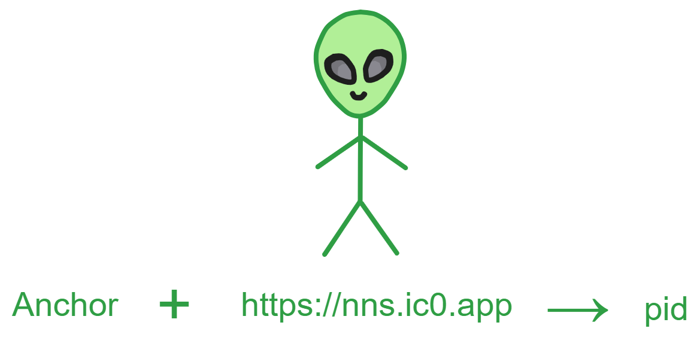

## My Account, Snatched!

It was a dark and stormy night in 2009. In a dingy internet cafe, the air was thick with cigarette smoke and the scent of instant noodles, mingling with the cacophony of furious typing, satisfied slurping, frustrated cursing, desperate cries to teammates, and groans of despair as defeat loomed - the din filled the room.

Amidst the chatter and whir of computers, no one noticed the cryptic code flickering on John Smith's screen as his fingers flew across the keyboard. The monitor's wavering glow lit his face indistinctly, but a sly twinkle could be glimpsed in his eyes.

Streams of code flowed from his fingertips, through the keyboard into the CPU, then jumped into the LAN cable, fiber optic lines, as if heeding their master's call. Surging underground in the city, stealthily crossing under the sea, darting between mountains - crossing thousands of miles in a blink, flashing through the vast network topology, heading for the target address.

At the other end of the wire, a hapless victim sat numbly clicking his mouse.

"Security risks detected. Click here to download protective software."

"Uh, okay."

Little did he know, sinister code was approaching, poised to strike his computer a fatal blow. Instructions from thousands of miles away had already infiltrated his digital domain through the trojan. Bringing back his account and password to John's screen.

John was gloating in his dim, noisy corner - yes! Another fish on the hook. That's the 7th catch today.

## Please Enter Your Password

Over 10 years ago, losing accounts was quite common. Countless John Smiths lurked in obscure corners, cracking countless user accounts. Times have changed, and today's internet environment is much safer than before.

Since the early information age of the 21st century, our lives have become increasingly reliant on the internet. Shopping, chatting, gaming, watching videos, getting things done - everything requires logging into various websites and apps. But with it comes the headache of managing passwords.

Most netizens lack security awareness. With so many accounts, people find it hard to remember them all, so many opt for simple username and password combinations.

However, this approach has many flaws.

Firstly, our brains are not good at memorizing so many passwords. Most people have numerous online accounts, each requiring a unique password for security. But remembering all these is nearly impossible, so people tend to reuse passwords or use simple, easy ones. While convenient, this greatly compromises account security.

Even with complex passwords, attackers can still steal them through phishing, keyloggers, cracking, etc. Once they have the password, they can impersonate us for malicious acts.

Also, when we forget passwords, we have to reset via email or SMS, which can be insecure. Hackers can steal the reset messages to hijack accounts.

Losing an account means losing online data, friends, comments, activity records - everything gone in a flash.

To address this, many sites now use two-factor authentication - after username and password entry, users have to further verify via SMS code, email code, etc. No doubt this improves security, but also increases complexity.

Website login is shifting towards "single sign-on" - ideally, one account for all sites.

WeChat and Google have achieved this. They allow logging into many third-party mini programs and sites directly through phone-binding. This "scan to login" is more secure and convenient than pure username-password.

It would be so much easier if all sites could log in with one account like WeChat or Google. Then we'd only need one password to seamlessly browse the entire web. But not all sites support Google login, and as people become more privacy-conscious, centralizing account data under big corporations is risky.

We must also consider privacy. Many sites secretly collect personal info like login times, locations, devices. This valuable data can be abused to track our online activities or even sold to mysterious advertisers or third parties.

Also, people may not realize accounts don't fully belong to them. They can be forgotten, lost, or revoked. Today's internet services typically require registration with phone number or email.

But users don't really own those either. Phone numbers belong to telcos, emails belong to email and domain providers. If they take back your number, email, domain, your account will be in trouble and possibly lost if you can't change it.

Not only do users not own account names, they don't legally own the accounts either.

For example, WeChat account ownership belongs to [Tencent](https://tech.sina.com.cn/roll/2020-09-08/doc-iivhuipp3172175.shtml). Article 7.1.2 of its [Terms of Service states](https://weixin.qq.com/agreement?lang=zh_CN):

> "**Ownership of all Weixin accounts belong to Tencent. After completing the application for registration, the user only obtains the right to use the Weixin account, and the usage right only belongs to the initial registrant.**"

Essentially, account ownership lies with service providers, users only have usage rights. Thus, providers can unilaterally suspend or cancel accounts, which is legally valid. Platform account bans, Trump's Twitter ban, etc are such cases.

We need new solutions to this problem - more secure password tools, advanced encryption, new authentication methods like behavior-based - and to develop ways for users to truly own and fully control their online identities, so they can never be lost or taken away.

## Finding Better Solutions

There are solutions, and they already exist.

That is to rebuild the internet's identity system in a decentralized way using blockchain:

1. Use decentralized networks and blockchain tech. Accounts and content are stored in user-controlled decentralized networks, not relying on any centralized platforms.
2. Employ self-sovereign identity tech. Users can create and control their own digital identities, no reliance on phone numbers or emails.
3. Use peer-to-peer networks for direct user connections, no need for centralized servers. Content is distributed across the network, not dependent on single platforms.
4. Encrypt and distributedly store user data, not centralized, harder to delete.
5. Utilize open source software and protocols, avoid reliance on proprietary corporate platforms.

Although there is still much work to be done, these technologies provide hope for users to truly control their digital lives. We should continue pushing their development, empowering each user with decentralized network ownership.

DFINITY has created an advanced, secure decentralized identity called **Internet Identity** (also called "ii"), which can be used on apps in its ecosystem. Logging into Dapps requires no passwords, no memorizing complex private keys or seed phrases - just easy control of your decentralized identity.

Websites collect no information about users' online activities when using [Internet Identity](https://identity.ic0.app). It creates and manages anonymous, independent accounts for you on each site, letting you enjoy the privacy protection of having many accounts without the hassle of managing them. It frees you not just from complex username and password management, but also makes your use of web services more secure and private overall.

Users can create a decentralized identity by facial scan, fingerprint, Ledger or [Yubikey](https://en.wikipedia.org/wiki/YubiKey) hardware wallet. This identity can then log in/register with various Dapps.

Logging into different Dapps with the same identity will generate different accounts. That is, identities are isolated and non-portable (unlike ETH). The identity is a completely isolated account on each Dapp. It's like each Dapp gets a derived identity, a subgroup, from the main identity, controlling all Dapps with one DID. And you can log in from different devices but get the same identity on the Dapp.

Let's take a deeper look at ii:

ii is an identity authentication mechanism, still based on private keys, public keys, etc under the hood. But users don't have to log in with private keys or seed phrases.

There are two key concepts: delegation chain, DID identity.

Let's look at them one by one:

## Delegation Chain

The user's phone and computer have a TPM secure enclave chip that can generate a keypair. The public key will be uploaded and stored in the ii backend Canister; the private key is generated and saved by the device's TPM chip, inaccessible by anyone (including the user).

To interact with IC's smart contracts, all messages need to be signed as a whole. On IC, user-Dapp interactions also require signature authentication every time, and the private key is in a secure enclave requiring fingerprint to use. Of course users can't be asked to fingerprint sign every request.

So ii uses delegation to form a delegation chain. Expiry times are set for delegated keys, which then sign with their private keys.

First the browser can generate a temporary keypair (session key).

Then the secure enclave's private key signs the expiry time, user identity, third party domain name, etc.

This signature is the delegation. (The seed is a secret generated by ii's Canister).

The delegation is the secure enclave's private key signing some information, indicating the private key trusts these delegated data to do other things on its behalf.

With this delegation, the browser's temporary private key can now sign requests.

We send out the delegation, blue public key, temporary private key signed request, pink temporary public key. As shown below.

The receiver gets the **blue public key**, delegation, pink private key signed content, **pink public key**.

Use the **blue public key** to decrypt the signature, finding the **pink public key** inside, meaning the **blue private key** has signed the **pink public key**. This proves the blue private key has delegated authority, like a general wielding the emperor's tiger tally to dispatch troops and commanders, the tiger tally representing the emperor's authorization.

But it's not fully done yet. We still have to send all these to ii's backend Canister for certification before it takes effect.

When you send that info, inside ii's Canister it will generate a unique identity identifier for the user's logged in Dapp - [the Principal id](pid.md), pid for short.

Next comes how ii derives identities for users, so sit tight!

## DID Identities

Compared to traditional centralized identity systems, DID's main features and advantages lie in its decentralization, self-sovereign control, and privacy protection.

Decentralized Identity (DID) is a digital identity model not dependent on centralized authorities. It allows individuals and organizations to own and control their digital identities without requiring validation through any third-party intermediaries. Traditional identity models typically rely on centralized identity providers like government agencies, social media platforms, or corporations that hold and manage users' personal information, posing privacy and security risks.

DID uses an entirely different approach. Based on blockchain technology, it enables individuals to create their own digital identity without reliance on any single centralized authority. Each DID is unique, cryptographically secure, with users fully controlling their own identity data. This means users can better safeguard their privacy by choosing what entities to share their identity with, when, and how much. Unlike traditional models, DID gives users greater control and self-sovereignty over their identities.

DID also helps lower risks of identity theft and data breaches since there is no centralized database for attackers to target. Additionally, DID's portability allows users to seamlessly share their identity information across online services without having to repeatedly verify and recreate identities.

Decentralized identity represents a more secure, private, and user-friendly identity model with the potential to transform the digital identity landscape and power the digital society of the future. Internet Identity (ii) is one example of a DID-based digital identity system. When it comes to ii identities, the Principal id is essential.

### Principal id

Principal id (pid for short) is essentially an identifier that can be used to identify identities and Canisters.

For example:

When you log into a Dapp with ii, ii will generate a pid for you.

When you first use IC's SDK, the dfx command line tool will create a default developer identity (with a keypair) for you - this developer identity is a pid.

When you deploy a Canister to the mainnet, the NNS system will also allocate a pid to the Canister, though we prefer calling it a Canister id to distinguish it.

The pids used in ii are derived from the Anchor and Dapp domain name. The Anchor is like a username, a string of numbers assigned when you register with ii (similar to a QQ number).

The specific derivation process is:

First compute a seed:

* ii's Canister takes a random system seed salt (32 bytes) from the subnet's random beacon.
* Get the app domain name and Anchor.
* Concatenate the **length of salt, salt, length of Anchor, Anchor, length of domain, domain**.
* Hash the concatenated string with SHA256 to get the seed.

Then compute the user's raw pid:

* Concatenate the **length of ii Canister id, ii Canister id, and seed**.
* DER encode the concatenated string.
* Hash the DER encoding with SHA224 to get the body of the raw pid.
* Finally append 0x02 to the end of the raw pid body to form the user's raw pid.

Then convert the raw pid's format:

1. Calculate the 4 byte CRC32 checksum of the raw pid binary value.
2. Prepend the checksum to the raw pid value.
3. Base32 encode the connected result.
4. Insert `-` every 5 characters as separator.
5. Uniformly display in lowercase.

For example, take a raw pid: 0xABCD01

1. Its CRC32 checksum is 0x233FF206
2. Encoding after attaching the checksum gives em77ebvlzuaq
3. Inserting `-` every 5 chars gives em77e-bvlzu-aq

> This seed-derived key approach enhances anonymity and cross-domain portability of user identities.

Through this random seed approach, independent pids can be derived for each Anchor and frontend domain.

Including the ii Canister id in pid derivation can prevent collisions of the same seed generating the same pids in different Canisters, improving isolation.

### Dapp Sub-identities

For example, if your Anchor is 77752, to log into the NNS Dapp, you need to derive an identity exclusive to NNS from 77752 and nns.ic0.app. The ii Canister id remains unchanged.

Logging into a Dapp from different devices with the same Anchor generates the same pid identity, since the domain name and Anchor are unchanged.

When a user logs into different Dapps with one Anchor, the pid identities differ, because the Dapp domain names differ.

**Essentially, pids are sub-identities of a user (Anchor) when logging into different Dapps.**

> However, there's an issue - currently most Dapp domain names contain the Canister id, so when a Canister is deleted and redeployed, the Dapp's identity data will change.
>
> To address this, on IC when a Canister is deleted its Canister id is still reserved for the controller (developer who deployed it). The developer can keep using the previous Canister id when redeploying.

After all the above steps, ii's Canister will have generated a unique pid (sub-identity) for you.

After ii's series of checks, it will also add the non-public seed, Dapp domain, Anchor, expiry time, temporary public key into the delegation. The Canister will sign this delegation with a public key it constructs, saving the signature in ii Canister's certification variable.

Canisters can sign messages:

* The public key contains the Canister id and a seed, different seeds can generate different public keys for that Canister.
* The signature is a certificate which contains a hash tree. The hash of the signed message is embedded in the tree.

When verifying the signature, first check if the certificate is valid, the certificate must contain the Canister id of the signer. Then check if the tree is valid, if it contains the hash computed from the seed and message.

If both of these checks pass, then the signature is valid.

In this way, a Canister can use the state tree to do digital signatures without relying on an external private key. The signature information is directly embedded in the Canister's authentication variables.

This mechanism has many advantages: the signing process is fully controlled by the Canister itself. Each Canister can have multiple key pairs. And the signature information is written to the system's state tree, ensuring non-repudiation. The certificate mechanism provides high flexibility and fast validation.

After signing, it returns to the frontend browser (frontend is polling all the time), now the browser can sign the request with the temporary private key. The user's browser sends the message, signature of the message, temporary public key, and delegation to the subnet, so the subnet knows the temporary private key's signature is ok and can interact with the subnet.

The client (whether using agent-js, agent-rs or any way to communicate with the IC API) must sign the message before sending it to a canister on the IC. The subnet will verify this signature and derive the caller's pid from the signature. So unless the client has the same private key, it cannot impersonate someone else's delegation.

Let me add one more point.

## Device Binding

Previously I said: *Logging into a Dapp from different devices with the same Anchor generates the same pid identity, since the domain name and Anchor are unchanged.*

Wait, how does ii enable logging into Dapps with the same Anchor across devices?

ii is an identity authentication mechanism. It doesn't store user info, only a user's ii identity. User data is stored by the Dapps themselves.

ii's Canister stores Anchors and user devices. Anchors start from 10000 and increment.

Each device saved by a user in ii is a public key. Users can add, remove devices, i.e. manage these public keys. So if a user loses their phone, it's like losing a public key - they can log in with the Anchor on another device and remove the lost phone device.

ii's backend Canister will add a user's different device public keys, binding them to the user's Anchor corresponding Master key, which is internal to the Canister. This way, as long as one device is added, the devices (public keys) saved in ii can be changed, without the user needing to handle private keys.

This Master key can be seen as an overarching private key. As long as devices are bound to it, there's no need to worry about losing the ii identity. If all devices are lost, login is still possible with a recovery phrase. If that is lost too, then it's gone 😝.

This achieves the effects described earlier:

* The pid identity differs when a user logs into different Dapps with one Anchor.
* The pid identity is the same when a user logs into a Dapp from different devices with one Anchor.

That covers the basics of Internet Identity (ii).

Here are some ii resources to get started with development and use:

Official docs: https://internetcomputer.org/docs/current/samples/internet-identity-sample

Official code samples: https://github.com/dfinity/examples/tree/master/motoko/cert-var

npm package: https://www.npmjs.com/package/@dfinity/auth-client?activeTab=readme

Kyle's blog post on integrating ii login: https://kyle-peacock.com/blog/dfinity/integrating-internet-identity

Integration demo: [https://sdk.nnsdao.com/docs/quick-start/dfinity-progarmming-practice/#identity%E7%BB%91%E5%AE%9Awallet](https://sdk.nnsdao.com/docs/quick-start/dfinity-progarmming-practice/#identity绑定wallet)