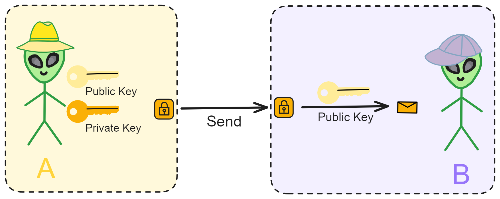
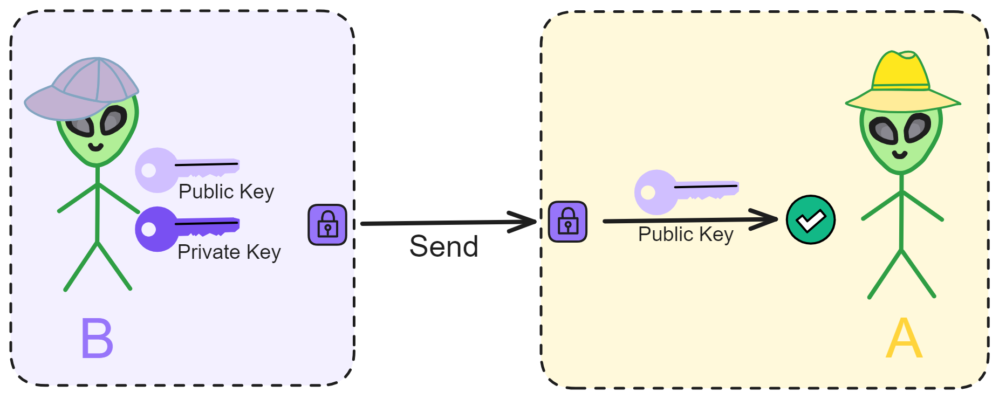
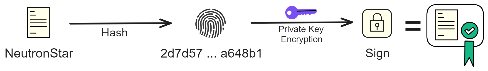
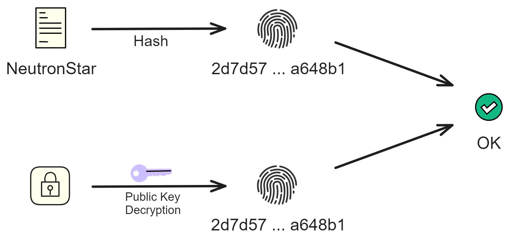
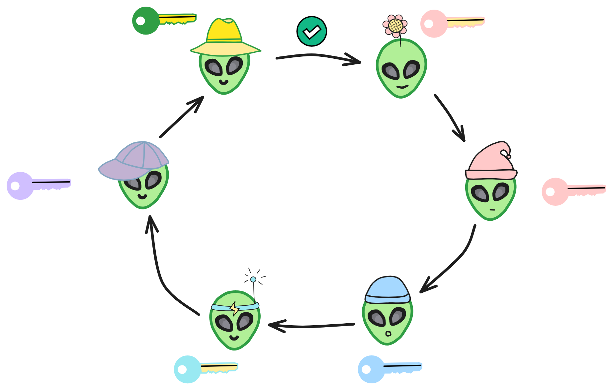

## Cryptographic Fundamentals

Cryptography is a fascinating and highly significant field that explores how to encode and decode information to achieve confidentiality. 

 

Its origins can be traced back thousands of years when ancient governments used codes for transmitting confidential information, and merchants employed them to safeguard trade details. For instance, the Caesar cipher from ancient Rome involved shifting letters by a certain number of positions for encryption. Though simple, such encryption methods were effective for their time.

Over the centuries, cryptographic techniques have evolved. In the medieval period, more complex encryption methods emerged. True modern cryptography, however, began in the 20th century, thanks to advancements in computing that supported more sophisticated algorithms.

Cryptography primarily focuses on two aspects: cryptographic algorithms and cryptanalysis. Cryptographic algorithms encompass the rules for encryption and decryption, essentially the encryption and decryption algorithms. Symmetric encryption and asymmetric encryption are typical examples.

 

Symmetric encryption, the most basic encryption method, employs the same key for both encryption and decryption. Classical examples like the Caesar cipher fall under symmetric encryption. However, a drawback is that both the sender and receiver need to know the same key, introducing risks in key distribution and storage.

This led to the development of asymmetric encryption. Asymmetric encryption uses a key pair, with the public key being openly shared and the private key kept confidential. Information encrypted with the public key can only be decrypted using the corresponding private key, resolving the key distribution issue. Asymmetric encryption forms the foundation of modern cryptographic systems.

 

Cryptanalysis involves methods to decipher encrypted information. Techniques for breaking codes have evolved over time. Simple codes can be cracked using frequency analysis, while complex passwords may require high-performance computers for brute-force attacks. Hence, modern encryption algorithms aim for high computational complexity to resist brute-force attacks. The emergence of quantum computing technology poses a threat to many current encryption algorithms.

 

Cryptography has numerous crucial applications in today's society, including ensuring the security of internet communications, electronic payment transactions, and privacy protection. It has become an integral component of the foundational infrastructure of modern information society. Without reliable cryptographic protection, many internet services would face severe security risks.

Although cryptography has a long history, it remains an active field, playing a vital role in supporting various digital activities in contemporary society.

 

## Symmetric Encryption

Symmetric encryption is one of the origins of modern cryptography, where a single key is used for both encrypting and decrypting information. Its roots can be traced back to ancient times, with examples like the Caesar cipher representing a simple substitution encryption method.

In symmetric encryption, communicating parties agree on an encryption method and then encrypt and decrypt messages using the corresponding key (decryption method). It's a straightforward process.

 

Imagine symmetric encryption like two good friends, A and B, who want to encrypt their letters using a code to keep others from understanding the contents. They decide on a rule: shifting each letter in the alphabet three positions to the right, turning 'a' into 'd,' 'b' into 'e,' and so on.

Now, they can use this rule to encrypt and decrypt each other's letters. As long as they keep this rule secret, others won't understand the content of their letters. This rule is the encryption key.

The significant advantage of symmetric encryption is that it uses the same key for both encryption and decryption, providing fast computation suitable for encrypting large amounts of data. However, the challenge lies in the secure distribution and storage of the key.

A and B cannot communicate the key through public letters or phone calls due to the risk of eavesdropping. Therefore, complex protocols are needed for a secure key exchange, often involving encryption algorithms.

Moreover, symmetric encryption requires each pair of users to have a unique key. When dealing with many users, this results in a large number of keys, which must be securely stored, adding a considerable burden.

 

Before the 1970s, symmetric encryption dominated practical applications. In the 1970s, asymmetric encryption was invented, marking another significant milestone. Asymmetric encryption uses different keys for encryption and decryption.

Typical symmetric encryption algorithms include DES (Data Encryption Standard), AES (Advanced Encryption Standard), etc.

 

Symmetric encryption is simple and user-friendly but faces challenges in key distribution.

To address this issue, asymmetric encryption, also known as public-key encryption, was developed.

 

## Asymmetric Encryption

Typical asymmetric encryption algorithms include RSA, ECC, etc.

 

Asymmetric encryption involves each person generating 2 keys: one public key and one private key. The public key is openly shared, which eliminates the difficulty of transmitting the key, while the private key is kept secret. 

**Information encrypted with the public key can be decrypted with the private key. Conversely, information encrypted with the private key can also be decrypted with the public key.**

For example, if person A and person B are communicating, they publicly share their public keys. 

Person A can encrypt information with Person B's public key and send it to Person B. Then Person B can decrypt the information with their own private key.

If B encrypts a message with their private key and sends it to A, then A can decrypt it using B's public key. If A can successfully decrypt the message, it proves that the message definitely came from B and was not forged by someone else. 

Since the public key is openly available, anyone can use B's public key to verify messages from B. 

In other words, B has applied a "signature" (digital signature) to the information.

Digital signatures can also derive various variants, such as ring signatures which can hide the identity of the signer, threshold signatures which can distributedly generate the private key to reduce single point of failure. If you want to sign multiple documents with one signature, use aggregate signatures. There are also identity-based signatures, etc.

 

However, directly encrypting a message with the private key is very inefficient and computationally expensive. If the message is large and complex, it becomes even harder to encrypt, requiring a lot of time.

This is when hash algorithms become very useful.

 

Hash Algorithms
----

A hash algorithm converts input content of arbitrary length into a fixed length output. No matter how long the input message is, the length of the computed message digest is always fixed. It is mainly used to more quickly determine if two contents are the same, or to check if a published source file has been tampered with or corrupted.

> A message digest is a type of hash algorithm, but with additional stricter requirements, such as being non-reversible, more stringent collision resistance, etc.

Given the same algorithm and encoding, a message corresponds to a unique hash value. And it is impossible to compute the original message from a hash value, the hash value can only be derived from the message. 

**A hash algorithm generates a unique fingerprint for a file.** (The probability of hash collisions can be ignored.)

For example, I hash `NeutronStar` using the SHA-256 algorithm to get (HEX) this string:

`2d7d57c075dd0f07eaca5c61c1e2a52d9f851f2e17d495540e7165fc98a648b1`

Hashing `Neutronstar` gives: 

`89096b669b06b3150db816f060ea8067a15d51f11b94c882c9cf1d9e68dab4f9`

Even a slight change in the message results in a very different value.

Hashing `0` with SHA-256 algorithm gives:

`5feceb66ffc86f38d952786c6d696c79c2dbc239dd4e91b46729d73a27fb57e9`

We can also hash the above long string again using SHA-256, computing the hash of 5feceb66ffc86f38d952786c6d696c79c2dbc239dd4e91b46729d73a27fb57e9:

`5122a1d1bc9d87662dcf5fb870adf8c55faf2ce12fad1bacac2fe7df88172466`

By hashing like this, we always get a hash value of the same length.

 

Digital Signatures
----

With hash algorithms, implementing signatures becomes much easier. 

Simply hash the original file first, then encrypt the hash value with the private key to get the file's signature. 

Verifying the signature is also very simple. Just decrypt the signature using the signer's public key. And hash the source file too, compare the 2 hash values. If the hash values are the same then there is no problem.

What if the hash value we get after decrypting with the public key is different from the hash of the original file? 

It could be that the original file was damaged or replaced, or the public key was replaced by an attacker, or the signature was replaced. 

 

Signatures can ensure three things: 

* Confirm the information is sent by the signer, anyone can verify the validity of the signature.
* Confirm the information has not been modified from signing to receiving, including modifications by intermediaries during transmission. 
* Confirm the information has not been lost during transmission.
* The signature cannot be forged. No one else can forge the signature.
* The signed message cannot be altered: A signed message cannot be tampered with. As soon as a signed message is tampered with, any person can discover the inconsistency between the message and the signature.
* The signature is non-repudiable: The signer cannot later deny their own signature.

 

Traditional digital signature technology implements basic authentication functions. In some blockchain application scenarios, there are special privacy protection needs such as identity anonymity and content hiding. 

In these cases, special digital signature technologies such as group signatures, ring signatures, or blind signatures are needed to achieve this. For example, in a weakly centralized or multi-centralized blockchain scenario, in order to achieve complete anonymity, the signer only wants to prove that they are within a certain range of legitimate users, rather than allowing a regulatory role to deduce the signer's identity. This requires the use of multi-signature technology. 

 

### Multi-Signature

Multi-signature is a very important signing method. 

Multi-signature requires multiple parties to jointly complete the signing. 7 people, each with a private key, set the threshold to 5. That is, at least 5 out of the 7 people need to sign for it to take effect.

For example, a document that needs to be signed jointly by multiple departments, or a property jointly held by multiple banks.

### Group Signature

The concept of group signatures was first proposed by Chaum and Heyst in 1991. A member within a group can anonymously sign on behalf of the group, the signature can prove it comes from the group, but cannot determine which member it comes from. 

The key to group signature schemes is the group manager, who is responsible for adding group members and revealing the signer's identity in case of disputes.

In some group signature designs, the responsibilities of adding group members and revoking signature anonymity are separated and assigned to the group manager and the revocation manager, respectively.

### Ring Signature

Let's say I'm an early contributor and core developer of Bitcoin. 

I want to anonymously publish a message (revealing who Satoshi Nakamoto is), but I don't want to be completely anonymous. I want to reveal to the outside world that I am one of the early developers of Bitcoin, so I have credibility.

This is where ring signatures come in handy.

In a ring signature, I first need to select a temporary set of public keys that includes my own. Then, using my private key and the public keys of others in the set, I independently generate a signature, without any other setup required. 

The other members in the signature set may not even know that they have been included in the final signing set. One of the security properties of ring signatures is that determining which member's key was used to generate the signature is computationally infeasible.

Ring signatures are similar to group signatures, but differ in two places: first, the anonymity of individual signatures cannot be revoked; second, any user group can serve as a group.

### Blind Signature

Blind signatures were proposed by David Chaum in 1982. It refers to the signer signing a message without being able to see the original content.

On the one hand, blind signatures can protect the signed content and prevent the signer from seeing the original content.

On the other hand, blind signatures prevent tracking, as the signer cannot correlate content with signature results.

### Threshold Signature

In 1979, after Shamir proposed [the secret sharing](./SecretSharing.md) technique, Desmedt et al formally proposed the concept of threshold signatures in 1994.

In a threshold signature, each key shard is only part of the total private key. 

Each member uses the key shard to generate a signature shard for the information. After collecting enough signature shards, the complete signature is assembled. This process is done off-chain. 

During verification, only one on-chain verification is required.

This does not rely on the signature of a single entity. Even if some key shards are leaked or some participants have problems, as long as the number of leaked key shards does not reach the threshold, the signature remains secure.

Note that multi-signature and threshold signatures are different technologies. The members of a multi-signature are fixed. Multiple participants sign multiple times using different private keys, with each signature being independent of each other. Final verification is done by scripts or contracts to determine if each signature can be verified, requiring multiple verifications.

Threshold signatures are used for key escrow, recovery, power distribution, etc., and are also endowed with more features such as dynamic thresholds, active private key updates, public verifiability of sub-shards, etc.

In recent years, threshold signatures have been gradually applied in blockchain systems. Threshold signatures are commonly used in random oracles, censorship resistance, consensus algorithms, and distributed pseudorandom number generators.

Similar to the signature mechanism in asymmetric encryption, the threshold signature mechanism also consists of two parts: threshold key generation & distribution, and threshold key signing.

When generating the threshold key, it relies on the Distributed Key Generation (DKG) protocol, which brings multiple participants together to generate a total key pair and key share that meets certain requirements. Each member corresponds to a private key shard, and each member can only know their own private key shard, no one knows the total private key. 

Learn more [here](./SecretSharing.md). 

 

