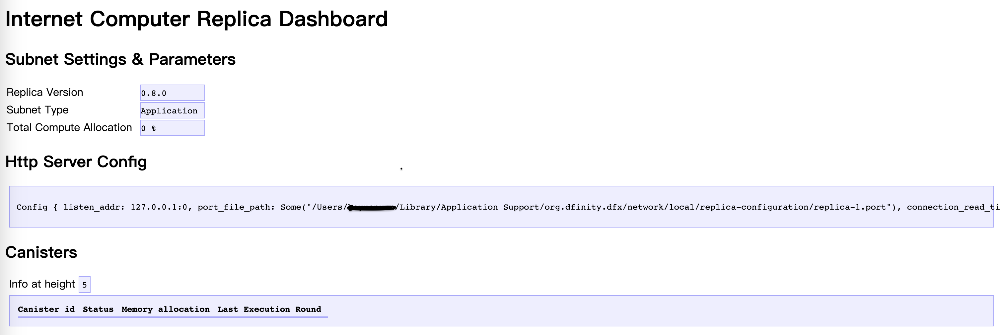

## Quick Start Guide for DApp Development

The Internet Computer (IC), short for Internet Computer, is a public blockchain platform introduced by the DFINITY Foundation. It aims to expand the functionality of blockchain to host websites and backend software.

IC, through innovative protocols and advanced technology, offers unparalleled speed, storage efficiency, and the capability to deploy websites directly on the chain.

Its core features include:

- **Decentralization**: IC is a decentralized cloud service system, reliable, with no single points of failure.
- **Scalability**: The structure of IC allows for infinite scalability while maintaining high performance.
- **Interoperability**: Different applications on IC can seamlessly interact, providing a smoother user experience.
- **Cost Efficiency**: IC offers low-cost computing resources, cheaper than other blockchains and traditional cloud services.

<br>

## DApp

DApp (Decentralized Application) refers to decentralized applications running on a blockchain network. Unlike traditional centralized applications, DApp is not controlled by any individual, and its internal data is tamper-proof.

The decentralization of DApp is attributed to the application of blockchain technology. Blockchain is a distributed database composed of multiple nodes, each storing a complete copy of the data. Consensus algorithms in blockchain ensure data consistency.

Smart contracts act like automated vending machines, without the need to trust any third party: the deployer of the vending machine, machine provider, city management, etc. An automated vending machine not controlled by any single entity! 


Developing a DApp on IC is straightforward: you need a front-end canister and several back-end canisters.

1. **Smart Contract Development (Back-end):** Contracts running on the blockchain, defining the core business logic of the DApp.
2. **User Interface (Front-end):** The interface through which users interact with the DApp, which can be a webpage, mobile app, or other forms.

Contracts are written in Motoko or Rust and deployed in canisters to run after being compiled into Wasm bytecode.

<br>

## Developing DApp on IC

### Preparations

Before getting started, you need some basic knowledge and tools:

- **Install Necessary Software:** This includes the DFINITY Canister SDK (dfx), the command-line tool for IC. If not installed yet, check [here](安装开发环境) for installation.
- **Choose Programming Language:** Mainly use Motoko (specifically designed for IC) and Rust. Other supported languages include [Python](https://demergent-labs.github.io/kybra), [TS](https://demergent-labs.github.io/azle), [C++](https://docs.icpp.world).

<br>

### Considered Best Practices

- **Code Security:** Always ensure smart contract code is secure.
- **User Experience:** Design an intuitive and responsive user interface.
- **Contract Upgrades:** Plan how to update and upgrade smart contracts.
- **Resource Optimization:** Optimize contracts to reduce resource consumption and costs.

<br>

### Practical Analysis

Let's start with a Web3 version of LinkedIn demo, analyze the code, and attempt to add new features.

LinkedUp's [source code](https://github.com/dfinity/linkedup) is in the DFINITY official repository. Now, let's try to understand the code (ignoring the frontend for now).

Since we aim to build a social network, the main **requirements** are:

* Users can create their own profiles.
* Users can modify their profile information.
* Users can view information on others' profiles.
* Users can follow each other to establish connections.

<br>

Let's first look at the `dfx.json` file in the project's root directory.

The `dfx.json` file is the basic configuration file for the entire project. It provides information about which canisters are in the project, where these canisters are located, the dfx version, and more.

The project includes three canisters: Connectd, Linkedup, and Linkedup_assets.

```json
{
  "canisters": {
    "connectd": {
      "main": "src/connectd/main.mo"
    },
    "linkedup": {
      "main": "src/linkedup/main.mo"
    },
    "linkedup_assets": {
      "dependencies": ["linkedup"],
      "frontend": {
        "entrypoint": "src/linkedup/public/main.js"
      },
      "type": "assets",
      "source": [
        "src/linkedup/public",
        "dist/linkedup_assets"
      ]
    }
  },
  "defaults": {
    "build": {
      "packtool": ""
    }
  },
  "networks": {
    "tungsten": {
      "providers": ["https://gw.dfinity.network"],
      "type": "persistent"
    },
    "local": {
      "bind": "0.0.0.0:8000",
      "type": "ephemeral"
    }
  },
  "dfx": "0.6.22"
}
```

#### Project Backend Structure:

* Linkedup Canister is responsible for business logic, such as creating personal profiles and modifying profile information. It also provides API interfaces for Linkedup to call Connectd Canister, allowing the frontend to interact only with Linkedup.

* Connectd Canister primarily establishes relationships between users, providing APIs for Linkedup Canister to call.

<br>

### Connectd Canister

Let's carefully analyze the code of the Connectd Canister:

```json
├── connectd
│   ├── digraph.mo
│   ├── main.mo
│   └── types.mo
```

Under the Connectd Canister, there are three Motoko files:

- `main.mo` is the main code file of the Connectd Canister, defining an `actor`.
- `types.mo` is the module file containing custom type definitions, imported and used in `main.mo`.
- `digraph.mo` is a module file defining a public class that `main.mo` can instantiate and use its API to handle relationship data.

Now, let's delve into the code line by line.

<br>

In `types.mo`, some custom types are defined:

```js
import Principal "mo:base/Principal";

module {
  public type Vertex = Principal;
};
```

<br>

`digraph.mo` is a module file that implements a simple directed graph data structure, providing basic functionalities such as adding vertices, adding edges, and querying adjacent vertices. This implementation allows easy construction and manipulation of a directed graph.

The code defines a class for a "User Relationship Graph" (Digraph) to represent relationships between users. This graph is a directed graph where users are considered vertices, and relationships between users are considered directed edges.

```js
import Array "mo:base/Array";
import Iter "mo:base/Iter";
import Types "./types";

module {
  type Vertex = Types.Vertex;

  public class Digraph() {
    var vertexList: [Vertex] = [];
    var edgeList: [(Vertex, Vertex)] = [];

    public func addVertex(vertex: Vertex) {
      vertexList := Array.append<Vertex>(vertexList, [vertex]);
    };

    public func addEdge(fromVertex: Vertex, toVertex: Vertex) {
      edgeList := Array.append<(Vertex, Vertex)>(edgeList, [(fromVertex, toVertex)]);
    };

    public func getAdjacent(vertex: Vertex): [Vertex] {
      var adjacencyList: [Vertex] = [];
      for ((fromVertex, toVertex) in Iter.fromArray<(Vertex, Vertex)>(edgeList)) {
        if (fromVertex == vertex) {
          adjacencyList := Array.append<Vertex>(adjacencyList, [toVertex]);
        };
      };
      adjacencyList
    };
  };
};
```

<br>

`main.mo` manages the connections between users. It defines APIs that can be called externally, and the graph-related operations are performed by instantiating the graph class.

This helps organize and query relationships between users, suitable for scenarios such as social networks and relationship graphs.

```js
import Digraph "./digraph";
import Types "./types";

actor Connectd {
  type Vertex = Types.Vertex;
  var graph: Digraph.Digraph = Digraph.Digraph();

  public func healthcheck(): async Bool { true };

  public func connect(userA: Vertex, userB: Vertex): async () {
    graph.addEdge(userA, userB);
  };

  public func getConnections(user: Vertex): async [Vertex] {
    graph.getAdjacent(user)
  };
};
```

### Linkedup Canister

After understanding the Connectd Canister, let's look at the Linkedup Canister. Remember that the Connectd Canister serves the Linkedup Canister.

Similarly, let's check the directory structure of Linkedup Canister:

```json
linkedup
    ├── database.mo
    ├── main.mo
    ├── types.mo
    └── utils.mo
```

Linkedup Canister also has `main.mo` and `type.mo`. `main.mo` handles the main business logic, `types.mo` is responsible for defining new types, and the added `utils.mo` module contains commonly used utility functions.

The `database.mo` module, similar to the previous `digraph.mo`, defines a simple database module. It deals with data structures and corresponding processing functions related to business logic.

Now, let's dive into the code.

In `types.mo`, three types are defined: `UserId`, `NewProfile`, and `Profile`:

```js
import Principal "mo:base/Principal";

module {
  public type UserId = Principal;

  public type NewProfile = {
    firstName: Text;
    lastName: Text;
    title: Text;
    company: Text;
    experience: Text;
    education: Text;
    imgUrl: Text;
  };

  public type Profile = {
    id: UserId;
    firstName: Text;
    lastName: Text;
    title: Text;
    company: Text;
    experience: Text;
    education: Text;
    imgUrl: Text;
  };
};
```

The `database.mo` module implements a simple user directory system. It defines a public class named `Directory`, which internally contains a `hashMap`. This `hashMap` has keys of type `UserId` and values of type `Profile`, storing and querying user profiles.

```js
import Array "mo:base/Array";
import HashMap "mo:base/HashMap";
import Iter "mo:base/Iter";
import Option "mo:base/Option";
import Principal "mo:base/Principal";
import Types "./types";

module {
  type NewProfile = Types.NewProfile;
  type Profile = Types.Profile;
  type UserId = Types.UserId;

  public class Directory() {
    let hashMap = HashMap.HashMap<UserId, Profile>(1, isEq, Principal.hash);

    public func createOne(userId: UserId, profile: NewProfile) {
      hashMap.put(userId, makeProfile(userId, profile));
    };

    public func updateOne(userId: UserId, profile: Profile) {
      hashMap.put(userId, profile);
    };
     
    public func findOne(userId: UserId): ?Profile {
      hashMap.get(userId)
    };

    public func findMany(userIds: [UserId]): [Profile] {
      func getProfile(userId: UserId): Profile {
        Option.unwrap<Profile>(hashMap.get(userId))
      };
      Array.map<UserId, Profile>(userIds, getProfile)
    };

    public func findBy(term: Text): [Profile] {
      var profiles: [Profile] = [];
      for ((id, profile) in hashMap.entries()) {
        let fullName = profile.firstName # " " # profile.lastName;
        if (includesText(fullName, term)) {
          profiles := Array.append<Profile>(profiles, [profile]);
        };
      };
      profiles
    };

    func makeProfile(userId: UserId, profile: NewProfile): Profile {
      {
        id = userId;
        firstName = profile.firstName;
        lastName = profile.lastName;
        title = profile.title;
        company = profile.company;
        experience = profile.experience;
        education = profile.education;
        imgUrl = profile.imgUrl;
      }
    };

    func includesText(string: Text, term: Text): Bool {
      let stringArray = Iter.toArray<Char>(string.chars());
      let termArray = Iter.toArray<Char>(term.chars());

      var i = 0;
      var j = 0;

      while (i < stringArray.size() and j < termArray.size()) {
        if (stringArray[i] == termArray[j]) {
          i += 1;
          j += 1;
          if (j == termArray.size()) { return true; }
        } else {
          i += 1;
          j := 0;
        }
      };
      false
      };
  };
  func isEq(x: UserId, y: UserId): Bool { x == y };
};
```


`utils.mo` defines some utility functions:

```js
import Array "mo:base/Array";
import Option "mo:base/Option";
import Database "./database";
import Types "./types";

module {
  type NewProfile = Types.NewProfile;
  type Profile = Types.Profile;
  type UserId = Types.UserId;

  // Profiles
  // Provides a "directory" class instance from the database module and userId to query Profile
  public func getProfile(directory: Database.Directory, userId: UserId): Profile {
    let existing = directory.findOne(userId);
    switch (existing) {
      case (?existing) { existing };
      case (null) {
        {
          id = userId;
          firstName = "";
          lastName = "";
          title = "";
          company = "";
          experience = "";
          education = "";
          imgUrl = "";
        }
      };
    };
  };

  // Connections
  // Checks whether x is included in the xs array
  public func includes(x: UserId, xs: [UserId]): Bool {
    func isX(y: UserId): Bool { x == y };
    switch (Array.find<UserId>(xs, isX)) {
      case (null) { false };
      case (_) { true };
    };
  };

  // Authorization Management

  let adminIds: [UserId] = [];

  public func isAdmin(userId: UserId): Bool {
    func identity(x: UserId): Bool { x == userId };
    Option.isSome(Array.find<UserId>(adminIds, identity))
  };

  public func hasAccess(userId: UserId, profile: Profile): Bool {
    userId == profile.id or isAdmin(userId)
  };
};
```

`main.mo` defines an `actor` responsible for business logic:

```js
// Make the Connectd app's public methods available locally
import Connectd "canister:connectd";
import Database "./database";
import Types "./types";
import Utils "./utils";

actor LinkedUp {
  // Instantiate the directory class in the database module
  var directory: Database.Directory = Database.Directory();

  type NewProfile = Types.NewProfile;
  type Profile = Types.Profile;
  type UserId = Types.UserId;

  // Healthcheck
    
  public func healthcheck(): async Bool { true };

  // Profiles

  // User creates a homepage
  public shared(msg) func create(profile: NewProfile): async () {
    // Call the function of the directory class
    directory.createOne(msg.caller, profile);
  };

  // User updates information
  public shared(msg) func update(profile: Profile): async () {
    // Check if the user has permission
    if(Utils.hasAccess(msg.caller, profile)) {
      directory.updateOne(profile.id, profile);
    };
  };
  
  // Query user's homepage information
  public query func get(userId: UserId): async Profile {
    Utils.getProfile(directory, userId)
  };

  // Query user information by name
  public query func search(term: Text): async [Profile] {
    directory.findBy(term)
  };

  // Connections

  // Caller connects with another user
  public shared(msg) func connect(userId: UserId): async () {
    // Call Connectd's public functions API, await for the result
    await Connectd.connect(msg.caller, userId);
  };

  // Query the profiles of friends of a person
  public func getConnections(userId: UserId): async [Profile] {
    let userIds = await Connectd.getConnections(userId);
    directory.findMany(userIds)
  };

  // Query whether a person is a friend of the caller
  public shared(msg) func isConnected(userId: UserId): async Bool {
    let userIds = await Connectd.getConnections(msg.caller);
    Utils.includes(userId, userIds)
  };

  // User Authentication
  // Query the caller's Principal Id
  public shared query(msg) func getOwnId(): async UserId { msg.caller }

};
```

After understanding the code structure and details, we attempt to [compile and deploy the project](https://github.com/xiaoyuanxun/linkedup).

We enter the project's root directory and start the local IC network first:

```shell
dfx start
```

Then you can see information similar to the following in the terminal:

```shell
Running dfx start for version 0.14.3
Initialized replica.

Dashboard: http://localhost:55777/_/dashboard
```

This means that the IC local network has started successfully. We can open the dashboard link above to view the network status, etc.:



Then we compile and deploy canister:

```shell
dfx deploy
```

The terminal will display the following information:

```shell
Deploying all canisters.
Creating a wallet canister on the local network.
The wallet canister on the "local" network for user "default" is "bnz7o-iuaaa-aaaaa-qaaaa-cai"
Creating canisters...
Creating canister connectd...
connectd canister created with canister id: bkyz2-fmaaa-aaaaa-qaaaq-cai
Creating canister linkedup...
linkedup canister created with canister id: bd3sg-teaaa-aaaaa-qaaba-cai
Creating canister linkedup_assets...
linkedup_assets canister created with canister id: be2us-64aaa-aaaaa-qaabq-cai
Building canisters...

Building frontend...
Installing canisters...
Creating UI canister on the local network.
The UI canister on the "local" network is "br5f7-7uaaa-aaaaa-qaaca-cai"
Installing code for canister connectd, with canister ID bkyz2-fmaaa-aaaaa-qaaaq-cai
Installing code for canister linkedup, with canister ID bd3sg-teaaa-aaaaa-qaaba-cai
Installing code for canister linkedup_assets, with canister ID be2us-64aaa-aaaaa-qaabq-cai
Uploading assets to asset canister...
Fetching properties for all assets in the canister.
Starting batch.
Staging contents of new and changed assets in batch 1:
  /index.html 1/1 (7196 bytes) sha c7545fb06d97f8eede0a28524035f8c909e2ad456e26da2e29e4510bd87b8eb4 
  /templates.js 1/1 (3188 bytes) sha 9a29bc111afcbbf07194ee385d7c7c5dc084fc6a5c545f9f3a75e01aba19d4bd 
  /templates.js (gzip) 1/1 (772 bytes) sha 2b9db874caa4da5e3fa029c49c9f1970846d8f184dbbed38ada826b340525239 
  /index.js.LICENSE.txt 1/1 (494 bytes) sha bce8afa69662344f3076e34d586e8a319541e6220f7d33d24c638d2e41e8b3f5 
  /index.js.LICENSE.txt (gzip) 1/1 (303 bytes) sha 825daec9b568cb21931839f253a52c6568c67067f728b017d07e3e8e4ab9ad4b 
  /index.js.map (gzip) 1/1 (486875 bytes) sha 292293e601f5d89b74f738059ac3de6f0f8880de21e4b02900f5b3dde4b7f133 
  /index.js.map 2/2 (512088 bytes) sha d3bc05cedd9145e6e95ac69e617677e9362afab04be5c2aaec484e5ea18b6e91 
  /index.js 1/1 (1532332 bytes) sha 9a45f461b9eb3685fd69f74e51717a809a2781621308f32c78c36c44f9ac7b09 
  /utils.js 1/1 (267 bytes) sha d931b0c93683a02c41427208d424ad52239ae1f5ada1d8dbea5a3fd041969c13 
  /index.html (gzip) 1/1 (1448 bytes) sha 532c56fb849e459afdeee85fa91f59ac9990ad03b8db655bc3aa36acff1e65c6 
  /utils.js (gzip) 1/1 (199 bytes) sha 054727654de247397e5db169d1399ad9001a9a19cc8381e2a3a7d184ee87d32a 
  /index.js.map 1/2 (1900000 bytes) sha d3bc05cedd9145e6e95ac69e617677e9362afab04be5c2aaec484e5ea18b6e91 
  /index.js (gzip) 1/1 (256156 bytes) sha cf3ba66fe82622bb31d124a1c8daa3abbf387760a858e3a25f6a27b161230fbb 
  /main.js (gzip) 1/1 (2038 bytes) sha 1ebe40bb131aed3f67823a56b0536387c6a4820855f4e3db3f9879ff7ca9289f 
  /main.js 1/1 (7682 bytes) sha bea749dd6d5fe8dace9812606f02eb76754c31992ecf2e69801de5585cf3f87c 
  /index.css 1/1 (15386 bytes) sha 5488d6d439f6abdc3104b499e399ce2f588448ce81be46cbdb9a5e9ef2bedf2b 
  /index.css (gzip) 1/1 (3082 bytes) sha 166ed706f6011b8b95c3160cca68d47955421dd29d64d609e6e6d4cf6b3c47a6 
Committing batch.
Committing batch with 24 operations.
Deployed canisters.
URLs:
  Frontend canister via browser
    linkedup_assets: http://127.0.0.1:4943/?canisterId=be2us-64aaa-aaaaa-qaabq-cai
  Backend canister via Candid interface:
    connectd: http://127.0.0.1:4943/?canisterId=br5f7-7uaaa-aaaaa-qaaca-cai&id=bkyz2-fmaaa-aaaaa-qaaaq-cai
    linkedup: http://127.0.0.1:4943/?canisterId=br5f7-7uaaa-aaaaa-qaaca-cai&id=bd3sg-teaaa-aaaaa-qaaba-cai
```

We will understand what `dfx deploy` has done in sections:

Firstly, it created a wallet canister for the `default` user on the local network. This wallet canister comes with some default cycles, which will be used to create and manage other canisters:
```shell
Creating a wallet canister on the local network.
The wallet canister on the "local" network for user "default" is "bnz7o-iuaaa-aaaaa-qaaaa-cai"
```

Then, it created two backend canisters and one frontend asset canister required for the business:

```shell
Creating canisters...
Creating canister connectd...
connectd canister created with canister id: bkyz2-fmaaa-aaaaa-qaaaq-cai
Creating canister linkedup...
linkedup canister created with canister id: bd3sg-teaaa-aaaaa-qaaba-cai
Creating canister linkedup_assets...
linkedup_assets canister created with canister id: be2us-64aaa-aaaaa-qaabq-cai
```

Afterwards, it compiled the backend and frontend code into WebAssembly (Wasm) files that can be deployed within the canisters:

```
Building canisters...
Building frontend...
```

Then, it installed the Wasm files into the canisters:

```shell
Installing canisters...
Creating UI canister on the local network.
The UI canister on the "local" network is "br5f7-7uaaa-aaaaa-qaaca-cai"
Installing code for canister connectd, with canister ID bkyz2-fmaaa-aaaaa-qaaaq-cai
Installing code for canister linkedup, with canister ID bd3sg-teaaa-aaaaa-qaaba-cai
Installing code for canister linkedup_assets, with canister ID be2us-64aaa-aaaaa-qaabq-cai
Deployed canisters.
```

Upload frontend static resources to the Asset Canister:

```shell
Uploading assets to asset canister...
Fetching properties for all assets in the canister.
Starting batch.
Staging contents of new and changed assets in batch 1:
  /index.html 1/1 (7196 bytes) sha c7545fb06d97f8eede0a28524035f8c909e2ad456e26da2e29e4510bd87b8eb4 
  /templates.js 1/1 (3188 bytes) sha 9a29bc111afcbbf07194ee385d7c7c5dc084fc6a5c545f9f3a75e01aba19d4bd 
  /templates.js (gzip) 1/1 (772 bytes) sha 2b9db874caa4da5e3fa029c49c9f1970846d8f184dbbed38ada826b340525239 
  /index.js.LICENSE.txt 1/1 (494 bytes) sha bce8afa69662344f3076e34d586e8a319541e6220f7d33d24c638d2e41e8b3f5 
  /index.js.LICENSE.txt (gzip) 1/1 (303 bytes) sha 825daec9b568cb21931839f253a52c6568c67067f728b017d07e3e8e4ab9ad4b 
  /index.js.map (gzip) 1/1 (486875 bytes) sha 292293e601f5d89b74f738059ac3de6f0f8880de21e4b02900f5b3dde4b7f133 
  /index.js.map 2/2 (512088 bytes) sha d3bc05cedd9145e6e95ac69e617677e9362afab04be5c2aaec484e5ea18b6e91 
  /index.js 1/1 (1532332 bytes) sha 9a45f461b9eb3685fd69f74e51717a809a2781621308f32c78c36c44f9ac7b09 
  /utils.js 1/1 (267 bytes) sha d931b0c93683a02c41427208d424ad52239ae1f5ada1d8dbea5a3fd041969c13 
  /index.html (gzip) 1/1 (1448 bytes) sha 532c56fb849e459afdeee85fa91f59ac9990ad03b8db655bc3aa36acff1e65c6 
  /utils.js (gzip) 1/1 (199 bytes) sha 054727654de247397e5db169d1399ad9001a9a19cc8381e2a3a7d184ee87d32a 
  /index.js.map 1/2 (1900000 bytes) sha d3bc05cedd9145e6e95ac69e617677e9362afab04be5c2aaec484e5ea18b6e91 
  /index.js (gzip) 1/1 (256156 bytes) sha cf3ba66fe82622bb31d124a1c8daa3abbf387760a858e3a25f6a27b161230fbb 
  /main.js (gzip) 1/1 (2038 bytes) sha 1ebe40bb131aed3f67823a56b0536387c6a4820855f4e3db3f9879ff7ca9289f 
  /main.js 1/1 (7682 bytes) sha bea749dd6d5fe8dace9812606f02eb76754c31992ecf2e69801de5585cf3f87c 
  /index.css 1/1 (15386 bytes) sha 5488d6d439f6abdc3104b499e399ce2f588448ce81be46cbdb9a5e9ef2bedf2b 
  /index.css (gzip) 1/1 (3082 bytes) sha 166ed706f6011b8b95c3160cca68d47955421dd29d64d609e6e6d4cf6b3c47a6 
Committing batch.
Committing batch with 24 operations.
```

Also, a UI Canister was created locally. It can be used to visually invoke and test the backend canister interfaces:

```shell
Creating UI canister on the local network.
The UI canister on the "local" network is "br5f7-7uaaa-aaaaa-qaaca-cai"
```

Finally, display the link for successful deployment. You can click on the link for Linkedup_assets to view the frontend.

Clicking on Connectd and Linkedup allows you to debug the backend interfaces through CandidUI:

```shell
Deployed canisters.
URLs:
  Frontend canister via browser
    linkedup_assets: http://127.0.0.1:4943/?canisterId=be2us-64aaa-aaaaa-qaabq-cai
  Backend canister via Candid interface:
    connectd: http://127.0.0.1:4943/?canisterId=br5f7-7uaaa-aaaaa-qaaca-cai&id=bkyz2-fmaaa-aaaaa-qaaaq-cai
    linkedup: http://127.0.0.1:4943/?canisterId=br5f7-7uaaa-aaaaa-qaaca-cai&id=bd3sg-teaaa-aaaaa-qaaba-cai
```

We open the Linkedup CandidUI window to test the backend business logic:

<div class="center-image">
    
</div>


We attempt to call the `create` function to create personal homepage information.

After entering the information, click CALL.

Successful return of `()` can be observed, taking 2.107 seconds, as the update function (defined as `public shared`) requires consensus from the underlying system, typically taking around 2 seconds.

<div class="center-image">
    
</div>


We can also use the `get` function to query someone's homepage information.

It returns a `record` structure, and this call only takes 0.015 seconds to return results because the query function does not go through consensus and is typically in the millisecond range.

<div class="center-image">
    
</div>


Feel free to try other function calls.

Candid UI is not all-powerful; its main drawback is its single identity. For example, we cannot test the business logic of Connect and establish connections between two identities.

Therefore, for production use, Rust Agent or JS Agent libraries are commonly employed for automated testing.

At this point, we have completed understanding this demo; you can stop the local IC network:
```shell
dfx stop
```

<br>

## Resources

[Motoko documentation](https://internetcomputer.org/docs/current/motoko/main/motoko): Official documentation for the Motoko language.

[Motoko playground](https://m7sm4-2iaaa-aaaab-qabra-cai.raw.ic0.app): A sandbox for quickly writing and testing Motoko code from the browser.

[examples](https://github.com/dfinity/examples): Official code examples from DFINITY.

[DFINITY education](https://github.com/orgs/DFINITY-Education/repositories): Educational resources on data structures, web development, blockchain, and more.

[create-ic-app](https://github.com/MioQuispe/create-ic-app): Templates for popular frameworks (Vue, React, Vanilla JS, Svelte).

[juno](https://juno.build/docs/intro): Build on-chain backend services through a UI interface.

[The invoice canister](https://github.com/dfinity/invoice-canister): Code for handling payments on the IC.

[motoko-book](https://github.com/Web3NL/motoko-book): A book about Motoko.

[motokobootcamp-2023](https://github.com/motoko-bootcamp/motokobootcamp-2023): Motoko training camp in 2023, including various development tutorials.

[bootcamp-2022](https://github.com/motoko-bootcamp/bootcamp-2022): Motoko training camp in 2022, including various development tutorials.

[kyle's blog](https://kyle-peacock.com/blog): Kyle's blog about IC dev.

[Integrating Internet Identity](https://kyle-peacock.com/blog/dfinity/integrating-internet-identity): Kyle demonstrates how to integrate Internet Identity.

[awesome-icp](https://github.com/dfinity/awesome-icp): A list of excellent projects.

[awesome-motoko](https://github.com/motoko-unofficial/awesome-motoko): A list of excellent projects.