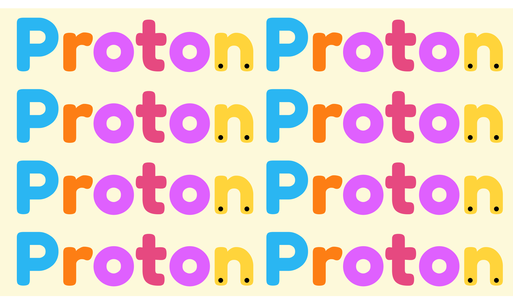
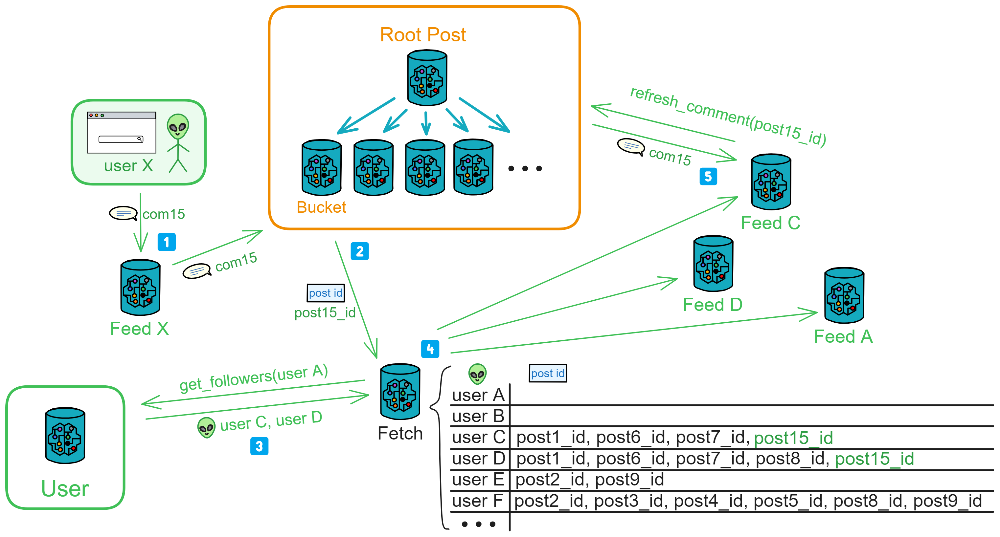
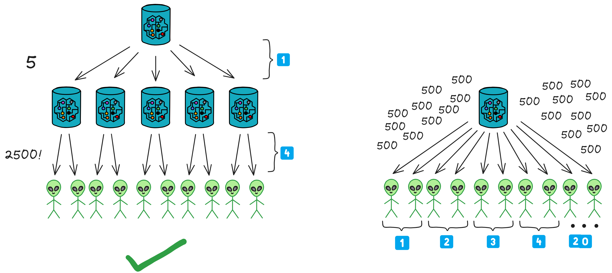
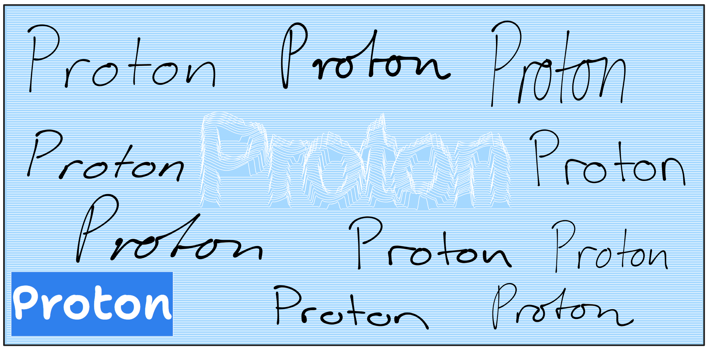

## Proton

> Slow is fast.
>
> Decentralized.

Now, we are designing a decentralized social media within the Actor model.

I call it Proton. We design for the future.

The Internet Computer (IC) is designed as a decentralized cloud service at its core. Decentralization at the core implies that the websites and services we deploy, including smart contracts,

    
        but if it goes against the community's will and causes public outrage, it could be voted down by DAO.
    
    
        won't be arbitrarily shut down by certain individuals.
    

Applications deployed on the upper layer can be controlled by us, storing our private data. Alternatively, we can choose to control them through DAO, making them fully decentralized DApps, subject to community governance.

[IC smart contracts](4.容器(Canister)/1.Canister.md) are WebAssembly (Wasm) containers called Canisters, similar to small servers for cloud services. They are powerful and can directly provide services such as computation, storage, hosting web pages, HTTP invocation (oracle), WebSocket, and more.

Canisters, implemented in Motoko or Rust, follow the Actor programming model. Understanding the basic principles of the Actor model is essential. The Actor model is a concurrency model that achieves parallel and distributed computing through message passing and asynchronous processing.

Therefore, when designing DApps, each Canister should be responsible for different functional modules. For example, some Canisters may handle user profiles, while others handle post storage.

Additionally, attention should be paid to the scalability of Canisters. We can dynamically create the same type of Canister to handle high loads.

 

## Design Philosophy

We aim to build a truly open Web3 DApp based on the modular data sovereignty of the Actor model.

We want each user to have their independent space (Feed Canister), fully controlled by themselves. **Users only need to interact with their own Canister, and subsequent pushes are collaboratively and gradually automated by the Canisters.**

 

Users can even deploy their independent Feed Canister and interact with Proton directly through code. (This is cumbersome and suitable only for programmer users, who can develop advanced custom features for the container.) This allows the community to create custom advanced features.

**Feed is everyone's service terminal, where people can freely switch between their Feed and frontend pages. The community can develop various custom frontend pages and Feeds.**

Its appeal lies in the privacy and customization freedom of personal Canisters. The earlier it is deployed, the more content accumulates over time.

 

Essentially, it is a public posting space. The architecture is designed for anyone who wants to publish content on a decentralized network.

**There is no concept of "borders" here. It is no longer an isolated data island; people can freely publish and access content.**

**Its existence transcends any single application; it can represent all platforms on the decentralized internet.**

**If people want to publish content on the decentralized network, they can choose to do so in such public spaces instead of platforms like "X", "Reddit," or "Quora."**

There is no entity control; content is paramount, and individual sovereignty is supreme.

 

## Approach

Firstly, there is an extensible public area to receive all user posts, and a user area to record user registration, personal profiles, and follow relationships.

We create a Feed for each user to store their own information flow. Feed is also the user's private space, and no one except the user can delete posts in it.

 

**The interaction between users and the public area is automatically completed by the Feed Canister. Users only need to query their Feed to obtain the latest information flow from those they follow. Posting, commenting, liking, and other interactions are also automatically completed by the Feed Canister.**

Users can also add several advanced custom features, deploying an independent Feed to interact with the public area. For example, only sending posts point-to-point to a few Feeds to create a private social circle, or connecting AI to automatically post, etc. Any feature is possible, and the community can develop and expand various functions at will. For example, adding a point-to-point messaging feature.

 

## Message Transmission Process

When a user posts, the Feed first stores the post in its own information flow, and then sends the post point-to-point to the followers' Feeds and the public area's Bucket according to the fan list. However, if there are ten thousand followers, it's not ideal because the exchange of messages between Canisters is limited by the max input/out queue size. It cannot send so many messages at once. The Feed needs to send them in batches, taking a long time to complete.

To increase throughput, we add a message relay station: Fetch. The Feed first sends the post to the public area and then sends the post ID and followers to Fetch. After recording, Fetch notifies these followers' Feeds one by one according to an algorithm, indicating which posts to fetch. Finally, the Feed goes to the public area to fetch the posts.

This way, even with many followers, they can sequentially fetch posts from the public area under Fetch's adjustment.

 

This is a fully open, decentralized application with slightly slower message delivery. This design sacrifices speed for decentralization, similar to Bitcoin.

The advantage is that the user's frontend only needs to query their Feed to get posts from people they follow. It's convenient and fast, with the backend entirely decentralized and decoupled. If a few Canisters go down, it doesn't affect the continued operation of the system. (If Fetch goes down, a few more can be created.)

If the system cannot recover temporarily, the Feed can send posts to followers in batches using ignore call point-to-point. In other words, the Feed has two built-in posting processes: posting through the Fetch relay station and point-to-point posting. It's just that point-to-point posting will be a bit slower.

 

Alright, after so much explanation, let's now detail this architecture.

 

## Architecture

Based on the Actor model, it's a point-to-point distributed push-fetch architecture.

 

Overall, you can divide Proton into four modules: User, Feed, Post, and Fetch.

- **User:** The user area responsible for recording user information and relationships. It records user profiles and follow relationships.
- **Post:** The public area that stores all publicly posted posts. Root Post can create many Buckets to store posts.
- **Feed:** The information flow storing a user's personal information flow. Root Feed creates a Feed for each user.
- **Fetch:** The relay station responsible for pushing a user's latest information flow. It records the posts, comments, or likes in a user's Feed that haven't been fetched.

Users can follow others (and unfollow), view the latest posts in the public area (posts from everyone), view their information flow (posts from those they follow and their own posts), post, repost, comment, like, and bookmark (and unbookmark).

### User

The user area records user information and relationships. It stores basic user information in the User canister, such as UserId, name, company, school, occupation, personal profile, follow relationships, and their own Feed Canister ID, etc.

Users can call functions here to follow someone, update their profile, or query who they are following and someone's follow relationships.

When a user follows someone new or has a new follower, the user's Feed needs to be notified to update the list.

### Post

The public area that stores all publicly posted posts. Root Post can create many Buckets to store posts.

#### Root Post

The public area is responsible for storing all publicly posted threads.

Root Post can create many Bucket Canisters to store threads.

Root Post has the ability to create Buckets, query who owns available Buckets, query all Buckets, and query filled Buckets.

 

Root Post initially creates 5 Buckets. When one Bucket is filled, another Bucket is created, ensuring that there are always 5 available Buckets.

When a user opens the frontend interface, the backend Feed immediately queries Root Post for the available Bucket. Root Post randomly returns a Bucket, and the Feed stores a variable indicating the "available Bucket," updating this variable after obtaining the Canister ID.

- Call the Bucket to query the latest 5 threads and retrieve the latest public threads.
- When a user posts to the public area, call Bucket to store the thread.

When a user's Feed fetches a batch of thread IDs from Fetch, it can use the thread IDs to query the Bucket for the threads.

 

#### Bucket

Bucket can add and retrieve threads.

There are 3 query functions: querying the total number of threads in a Canister, querying specific threads based on IDs (up to 7 IDs can be passed at once), and querying the latest n threads (with parameters specifying the number of latest threads).

When querying specific or the latest threads, the thread content and current likes and comments need to be returned.

 

Bucket is responsible for receiving threads, comments, and likes.

When Bucket receives a new thread, it checks for ID conflicts before accepting it. It notifies Comment Fetch and Like Fetch of threads with updated comments and likes.

 

### Feed

Information flow, storing users' personal information flows. Root Feed creates a Feed for each user.

 

#### Root Feed

Root Feed is responsible for creating a Canister for each user and recording the total number of created Canisters and their Canister IDs.

 

#### Feed

**Users participate in Proton's interactions through their own Feed: viewing, posting, commenting, liking, etc. - all through Feed.**

 

User's Feed records followers (used for pushing threads, comments, and likes), following (detecting when receiving threads), information flow (only stores the latest 3000 threads), and saved threads (up to 500 threads).

 

Each thread has a publication time, the user ID of the publisher (`UserId`), thread ID (`PostId`), and the ID of the person who reposted it (`RepostId`, empty if not reposted).

 

The thread ID is the combination of Bucket Canister ID, UserId, and an incrementing number. For example, aaaaa-aaa-bbbbb-bbb-1, aaaaa-aaa-bbbbb-bbb-2, aaaaa-aaa-bbbbb-bbb-3, ...

 

Querying threads:

There are 3 functions to query threads in Feed: querying the total number of threads, querying a specific thread based on its ID, and querying the latest n threads (with parameters specifying the number of latest threads).

 

Posting:

When user A posts a new thread, the frontend sends the thread to user A's Feed.

Feed receives the message, creates a new thread, and stores it. Then, it sends the thread content to the public area's Bucket for storage, visible to everyone. It also sends the thread poster, thread ID, and users C and D (followers) to Fetch.

Fetch records and notifies users C and D's Feed to fetch content based on thread ID. After sending the notification, it deletes user C and thread ID; Fetch stores only "to be notified" records.

Users C and D's Feed, upon receiving thread IDs to fetch, retrieves the corresponding threads from the public area and adds them to their own Feed thread flow. (In this example, user C will receive threads with ID 1, 6, 7, 15, and user C's Feed fetches threads 1, 6, 7, 15 from Bucket.)

When users C and D open the frontend to query their Feed, they can see the new threads posted by A, ensuring they get the latest threads immediately.

 

If later user E follows user A, their Feed will only receive new threads from user A.

 

**The frontend only needs to send one request; subsequent push operations (such as notifying the public area) are handled by the Canister.**

As the number of users increases, one Fetch may not handle a large number of posting requests. In this case, a new Fetch for message pushing can be created, and the relay station service can be horizontally scaled as needed.

 

Deletion:

Posts cannot be deleted; blockchain: once posted, it cannot be undone.

Ignore the posts in the followers' Feeds, keeping only the latest 3000 posts. (Additionally, Feed is someone's private space)

 

Repost:

User C reposts a post to H, I, J, K: `Reposter: C`, `Post ID: post15_id`, `Followers: Users H, I, J, K`, sent to Fetch.

Fetch records it and notifies the Feeds of H, I, J, K.

These Feeds go to the public area to fetch the post based on the ID.

> When user C reposts a post, the original poster remains user A, and the reposter is user C.

 

Comment:

The comment process is similar to the posting process, using Comment Fetch for comments.

Anyone who sees a post (user X) can comment. The frontend calls Feed, providing post_id and the comment content.

Upon receiving the comment, Feed first checks its 3000-item information flow for the post. If found, it adds the comment to the post in its Feed.

Then, it notifies the public area's Bucket to update the comments.

After receiving a comment, Bucket notifies Comment Fetch of the post ID with new comments.

Comment Fetch first goes to the User user area to find out who the post author's followers are. If the author is not found, the request is rejected.

Then, it adds the post ID, the poster, and the followers to the "to be notified" list.

After Comment Fetch sends out notifications one by one, followers fetch the post's comments based on the provided post ID and update them in their Feeds.

 

If follower D reposted this post, D's Feed, upon receiving a new comment notification, continues to notify Comment Fetch: post15_id, D's followers.

Comments cannot be deleted.

 

Like:

The like process is similar to the posting process, using Like Fetch for likes.

Anyone who sees a post (user X) can like it. After the public area's Bucket receives a like, it notifies Like Fetch of the post ID with new likes.

Like Fetch first goes to the User user area to find out who the post author's followers are. If the author is not found, the request is rejected.

Then, it adds the post ID, the poster, and the followers to the "to be notified" list.

After Like Fetch sends out notifications one by one, followers fetch the post's like count based on the provided post ID and update it in their Feeds.

 

If follower D reposted this post, D's Feed, upon receiving a new like notification, continues to notify Like Fetch: post15_id, D's followers.

Likes cannot be deleted.

 

### Fetch

Responsible for receiving posting, commenting, and liking messages from everyone and notifying relevant Feeds.

 

#### Root Fetch

Root Fetch dynamically creates multiple Fetch based on the number of users. It can create 3 types of Fetch: Post Fetch, Like Fetch, Comment Fetch. It can also query Root Fetch for available Fetch.

 

#### Post Fetch

Receives notifications from posters: post ID, poster, reposter, followers, Cycles.

Internally maintains a notification table: records which post IDs each user is waiting to be notified about.

Notifies followers' Feeds in batches using the ignore call algorithm.

 

#### Comment Fetch

Receives new comment notifications from Bucket: post ID, poster (A), reposter (empty).

Goes to the User user area based on the poster (or reposter) to find out who the poster's followers are.

Internally maintains a notification table: records which post IDs each user is waiting to be notified about.

Notifies followers' Feeds in batches using the ignore call algorithm.

If follower C reposted this post, C's Feed, upon receiving new comment notifications, continues to notify Comment Fetch: post15_id, C's followers.

 

#### Like Fetch

Receives new like notifications from Bucket: post ID, poster (A), reposter (empty).

Goes to the User user area based on the poster (or reposter) to find out who the poster's followers are.

Internally maintains a notification table: records which post IDs each user is waiting to be notified about.

Notifies followers' Feeds in batches using the ignore call algorithm.

If follower C reposted this post, C's Feed, upon receiving new like notifications, continues to notify Like Fetch: post15_id, C's followers.

 

The above User, Post, Fetch, Feed form the basic architecture of Proton.

 

On this architecture, we can imagine more advantages brought by modular Actor model...

 

### Everything is up to the user's choice.

Users can choose to send posts privately to a few followers' Feeds through Feed, without making them public.

Users can also establish their own "community server," a community public area under their control. In this way, people's Feeds can subscribe to this community service area, and Feed requests updates from the community server every 2 hours. Feed retains the last updated post id, and when making a request, it provides the last post id; the community server will then retrieve and return the posts since the last update to Feed.

The entire system is modular and can be spontaneously constructed by the community. For example, users can establish their own community servers, broadcast matrices, etc. (Broadcast matrix will be introduced later.)

 

### Automatic Pressure Adjustment

After Fetch accumulates a certain amount of messages, it adjusts the notification order and interval through an algorithm (which Feed to notify first and how many Feeds to notify at intervals, in milliseconds, before notifying other Feeds), ensuring that the query pressure on the public area is not too high. After receiving a notification, Feed should wait for 20 seconds before retrying if fetching fails.

 

If the public area faces too much query pressure, it will inform Root Fetch: "Notify Feed more slowly," and Root Fetch will notify the several Fetch below it to reduce the notification frequency. If the pressure remains high after 10 minutes, Root Post can also create a new Bucket to have new posts sent to the new Bucket.

Additionally, as the number of users increases, Fetch itself can also be expanded as needed.

 

Since every time Feed sends a message, Fetch has to notify many other Feeds, this open environment can easily lead to DoS attacks. Therefore, when Feed sends information to Fetch, a Gas fee must be paid. Fetch will only put the information into the "to be notified" list after receiving the Gas fee.

 

### Broadcast Matrix

For example, if 1000 people like post 15 in 2 minutes, Fetch only needs to notify post 15's followers once. Then these followers can check the public area's Bucket themselves to see how many likes there are.

> Of course, Fetch can also record how many likes a post has, whom to notify, accumulate for a certain period, and then directly notify the followers' Feed: a post has 1000 likes. In this case, Feed does not need to check the number of likes in the Bucket; Fetch has recorded it all.
>
> However, this is more centralized. All Feeds obey Fetch's commands and trust the like count given by Fetch. If Fetch is compromised, false like counts may occur. Therefore, letting Feed check the Bucket itself is the most authentic approach.

 

Now, let's think about a high-concurrency scenario: If Fetch needs to notify 10,000 Feeds, but due to the Canister system's message queue limit, let's assume one Fetch can only send notifications to 500 Feeds at a time.

If only one Fetch is working, it needs 20 times to complete the notification. In this case, multiple Fetches need to collaborate.

One Fetch divides the list of users to be notified into 5 parts and then distributes them to 5 Fetches. This way, 2500 notifications can be sent at once, and it only takes 4 times to complete the push!

Canister's message output queue is 500, so we can establish relays with different sending capacities: 500, 2500, 5000, 10000...

One Canister can send 500 messages at a time, five Canisters can send 2500 messages at once, ten Canisters can send 5000 messages at once, and twenty Canisters can send 10000 messages at once.

    

For safety, in practical use, we should leave some message output to ensure other communications are normal and urgent situations can call for Root Fetch's message output. Therefore, we should set a limit that one Fetch can send a maximum of 430 notifications at a time.

To prevent DoS attacks, users should send some Cycles when posting, commenting, or liking. The charges for different types of broadcast matrices vary.

If someone has many followers, they can choose not to trust anyone and establish a private broadcast matrix for notifying their own followers.

 

However, these are plans for the future. For now, let's design the framework and continuously optimize the details after implementing the basic functionality.

 

## Plan

**Final Plan: Modular, Public Database, User Cloud Terminal.**

Modular: Classify Canisters by function, each performing its own duties.

Public Database: An open database where anyone can directly publish and retrieve content.

User Cloud Terminal: Each user has their own independent server (Canister) providing on-chain private services.

 

## Implementation

This is a complex, large-scale application.

In this tutorial, we will use Motoko to build the basic functionality of this DApp.

🆗 [Let’s go!]() 🆗

 

