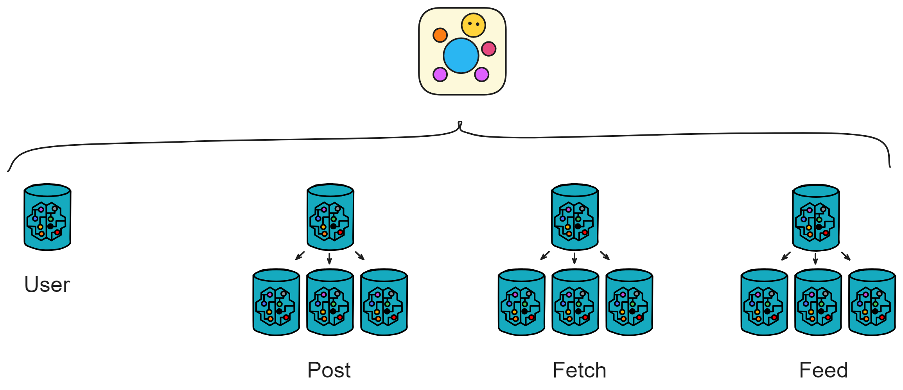

Following the design in the previous article, let's gradually complete the code for Proton.

We can divide Proton into 4 modules.👇

Each module corresponds to different functionalities, flexibly combined.

<a href="4.UserModule.md">

    
1️⃣
            

                User Module
            

            

                Manage user relationships and user profiles
            

    

</a>

    
1️⃣
        <a href="4.UserModule.md#define-user-profiles-typesmo">
            

                typse.mo
            

            

                Define type aliases
            

        </a>
    

    
2️⃣
        <a href="4.UserModule.md#directed-graph-digraphmo">
            

                digraph.mo
            

            

                Directed graph
            

        </a>
    

    
3️⃣
        <a href="4.UserModule.md#storing-user-information-databasemo">
            

                database.mo
            

            

                Store user profiles
            

        </a>
    

    
4️⃣
        <a href="4.UserModule.md#integrating-all-functions-mainmo">
            

                main.mo
            

            

                Manage users
            

        </a>
    

 

 
<a href="5.PostModule.md">

    
2️⃣
        

            Post Module
        

        

            Store all posts
        

    

</a>

    
1️⃣
    <a href="5.PostModule.md#managing-canisters-rootpostmo">
        

            rootPost.mo
        

        

            Manage all Buckets
        

    </a>
    

    
2️⃣
    <a href="5.PostModule.md#post">
        

           bucket.mo
        

        

            Store posts
        

    </a>
    

 

 
<a href="6.FeedModule.md">

    
3️⃣
        

            Feed Module
        

        

            User's own cloud terminal
        

    

</a>

    
1️⃣
    <a href="6.FeedModule.md#creating-feed-canister-rootfeedmo">
        

            rootFeed.mo
        

        

            Create Feed
        

    </a>
    

    
2️⃣
    <a href="6.FeedModule.md#storing-data-databasemo">
        

            database.mo
        

        

            Store modules
        

    </a>
    

    
3️⃣
    <a href="6.FeedModule.md#user-cloud-services-feedmo">
        

            feed.mo
        

        

            User's cloud terminal
        

    </a>
    

 

 

<a href="7.FetchModule.md">

    
4️⃣
        

            Fetch Module
        

        

            Manage user relationships and user profiles
        

    

</a>

    
1️⃣
    <a href="7.FetchModule.md#rootfetchmo">
        

            rootFetch.mo
        

        

            Manage Fetch Canister
        

    </a>
    

    
2️⃣
    <a href="7.FetchModule.md#postfetchmo">
        

            postFetch.mo
        

        

            Notify posts
        

    </a>
    

    
3️⃣
    <a href="7.FetchModule.md#likefetchmo">
        

            likeFetch.mo
        

        

            Notify likes
        

    </a>
    

    
4️⃣
    <a href="7.FetchModule.md#commentfetchmo">
        

            commentFetch.mo
        

        

            Notify comments
        

    </a>
    

 

🫡

 
