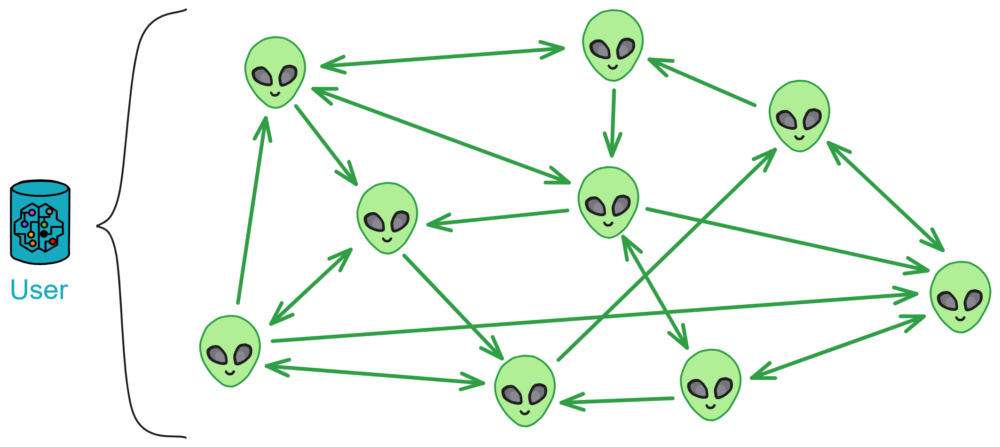
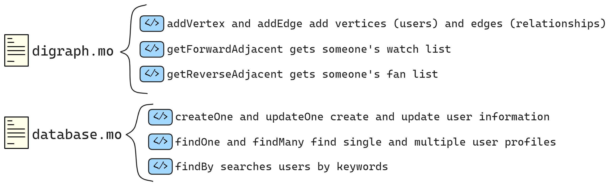

Let's take a look at the User module.

## User

The User module is responsible for Proton's user-related functionalities.

The functionalities we need are: follow user, unfollow user, get following list, get followers list, create and update user profiles, as well as user search functionality.

<br>

To implement the functionality of users following each other, we first need to store the follow relationships between users. We can use a directed graph as the data structure.

For the user-following functionality, we can model it as a directed graph:

* <div class="home-box">
        <div class="box">1️⃣
            <a href="4.UserModule.md#Define user profiles: types.mo">
                <div>
                    typse.mo
                </div>
                <div>
                    Define type aliases
                </div>
            </a>
        </div>
        <div class="box">2️⃣
            <a href="4.UserModule.md#有向图digraphmo">
                <div>
                    digraph.mo
                </div>
                <div>
                    Directed graph
                </div>
            </a>
        </div>
        <div class="box">3️⃣
            <a href="4.UserModule.md#存储用户信息databasemo">
                <div>
                    database.mo
                </div>
                <div>
                    Store user profiles
                </div>
            </a>
        </div>
        <div class="box">4️⃣
            <a href="4.UserModule.md#集成所有功能mainmo">
                <div>
                    main.mo
                </div>
                <div>
                    Manage users
                </div>
            </a>
        </div>
    </div>
* If user A follows user B, a directed edge (arrow) is drawn from node A to node B.
* This forms a directed graph representing the follow relationships between users.

<div class="center-image">

</div>

A directed graph can visually represent the follow relationships between users, making it easy to understand and implement related algorithms.

Graph algorithms can also be used to analyze social relationships, such as finding the shortest path between nodes or checking who among the users you follow is followed by them.

<br>

### Define user profiles: types.mo

Before the directed graph, we need to define some type aliases to list the information in user profiles. In Motoko, use the `type` keyword to create type aliases, giving a new name to a type to make the code more straightforward and understandable.

Referring to the previous [LinkedUp](), define in a separate module and import it in the file using the module.

Now, let's define the vertices of the directed graph (users) and user profiles.

```js
import Principal "mo:base/Principal"; // Import relevant content from the Motoko base library
import Time "mo:base/Time";

module {

    public type Vertex = Principal;
    public type UserId = Principal;
    public type Time = Time.Time;

    public type NewProfile = {
        name: Text;
        biography: Text;
        company: Text;
        education: Text;
        imgUrl: Text;
        feedCanister: ?Principal;
    };

    public type Profile = {
        id: UserId;
        name: Text;
        biography: Text;
        company: Text;
        education: Text;
        imgUrl: Text;
        feedCanister: ?Principal;
    };

};
```

Import statement:

```js
import Principal "mo:base/Principal";
```

This line of code means importing a module from Motoko's standard library, specifically the `Principal` module, which is related to identity and can be considered as the ID of users or services on the IC.

### Directed Graph: digraph.mo

Now, let's create the digraph.mo file and define a class `Digraph` to represent the follow relationships between users.

Write down the types defined earlier:

```js
module {
  type Vertex = Types.Vertex;
}；
```

`vertexList` stores all the vertices, and `edgeList` stores all the directed edges, representing the follow relationships:

```js
type Vertex = Types.Vertex;

public class Digraph() {
    var vertexList: [Vertex] = []; // Vertices
    var edgeList: [(Vertex, Vertex)] = []; // Directed edges
}；
```

`addVertex` is used to add vertices (users), and `addEdge` is used to add edges (follow relationships), using `assert` to ensure the uniqueness of edges:

```js
type Vertex = Types.Vertex;

public class Digraph() {
    var vertexList: [Vertex] = []; // Vertices
    var edgeList: [(Vertex, Vertex)] = []; // Directed edges

    // The public keyword indicates that this function is accessible to anyone
    // If private, it can only be called by code within the Canister, not publicly accessible
    public func addVertex(vertex: Vertex) {
      vertexList := Array.append<Vertex>(vertexList, [vertex]);
    };

    // Add a directed edge from fromVertex to toVertex
    public func addEdge(fromVertex: Vertex, toVertex: Vertex) {
      // Check if it already exists
      assert(Array.find<(Vertex, Vertex)>(edgeList, func((x, y): (Vertex, Vertex)): Bool {
        x == fromVertex and y == toVertex
      }) == null);
      edgeList := Array.append<(Vertex, Vertex)>(edgeList, [(fromVertex, toVertex)]);
    };

}；
```

<br>

`getForwardAdjacent` and `getReverseAdjacent` are used to get forward and reverse adjacent vertices, representing the user's following list and followers list, implemented by iterating through the edge list:

```js
import Array "mo:base/Array";
import Iter "mo:base/Iter";
import Types "./types";

module {

  type Vertex = Types.Vertex;

  public class Digraph() {

    var vertexList: [Vertex] = []; // Vertices
    var edgeList: [(Vertex, Vertex)] = []; // Directed edges

    public func addVertex(vertex: Vertex) {
      vertexList := Array.append<Vertex>(vertexList, [vertex]);
    };

    // Add a directed edge from fromVertex to toVertex
    public func addEdge(fromVertex: Vertex, toVertex: Vertex) {
      // Check if it already exists
      assert(Array.find<(Vertex, Vertex)>(edgeList, func((x, y): (Vertex, Vertex)): Bool {
        x == fromVertex and y == toVertex
      }) == null);
      edgeList := Array.append<(Vertex, Vertex)>(edgeList, [(fromVertex, toVertex)]);
    };

    // Get vertices adjacent to the forward edge, i.e., get someone's following list
    public func getForwardAdjacent(vertex: Vertex): [Vertex] {
      var adjacencyList: [Vertex] = [];
      for ((fromVertex, toVertex) in Iter.fromArray<(Vertex, Vertex)>(edgeList)) {
        if (fromVertex == vertex) {
          adjacencyList := Array.append<Vertex>(adjacencyList, [toVertex]);
        };
      };
      adjacencyList
    };
    
    // Get vertices adjacent to the reverse edge, i.e., get someone's followers list
    public func getReverseAdjacent(vertex: Vertex): [Vertex] {
      var adjacencyList: [Vertex] = [];
      for ((fromVertex, toVertex) in Iter.fromArray<(Vertex, Vertex)>(edgeList)) {
        if (toVertex == vertex) {
          adjacencyList := Array.append<Vertex>(adjacencyList, [fromVertex]);
        };
      };
      adjacencyList
    };

  };
  
};
```

Now, with the directed graph storing user relationships, we also need a place to store user profiles.

<br>

### Storing User Information: database.mo

Let's create another file specifically for storing user profiles: database.mo.

Define a storage class `Directory` for user information, using `HashMap` to store user IDs and their corresponding profiles:

```js
public class Directory() {
    let hashMap = HashMap.HashMap<UserId, Profile>(1, isEq, Principal.hash);
};
```

> A hash table, also known as a hash map, is a data structure that allows direct access to data based on key values. A hash table calculates a function (known as a hash function) for a key value, mapping the queried data to a position for access, thus speeding up the search for a specific key value.
>
> The working principle of a hash table can be explained with an intuitive example:
>
> Suppose there is a dictionary with a large amount of information about Chinese characters. To quickly find a specific character, a table is created initially arranged alphabetically by the pinyin letters of each character (similar to the "Pinyin Check Character Table" at the beginning of the dictionary). This establishes a kind of functional relationship between each character and its pinyin letters. When searching for a character, it is only necessary to locate the first letter, the second letter, the third letter, and so on, in this table. Most of the time, it's even possible to determine the accurate position of the character in the dictionary without searching through every letter of its pinyin. In this example, "finding the nth letter of the pinyin" is analogous to the hash function's rule, and the "Pinyin Check Character Table" can be understood as a kind of hash table.

There are also some functions to implement the functionalities of creating user profiles, updating user profiles, retrieving individual user profiles, retrieving multiple user profiles, and searching for users based on keywords.

The `createOne` and `updateOne` functions are used to create and update user profiles by calling the `put` function to add user IDs and profiles to the HashMap.

```js
public class Directory() {
  let hashMap = HashMap.HashMap<UserId, Profile>(1, isEq, Principal.hash);
  
  public func createOne(userId: UserId, profile: NewProfile) {
    hashMap.put(userId, makeProfile(userId, profile));
  };

  public func updateOne(userId: UserId, profile: NewProfile) {
    hashMap.put(userId, makeProfile(userId, profile));
  };
  
  // Other functions...
}
```

The `findOne` function is used to retrieve an individual user profile by calling the `get` function from the HashMap.

```js
public func findOne(userId: UserId): ?Profile {
  hashMap.get(userId)
};
```

The `findMany` function is used to retrieve multiple user profiles by iterating through the list of user IDs and calling the `getProfile` function.

```js
public func findMany(userIds: [UserId]): [Profile] {
  func getProfile(userId: UserId): Profile {
    Option.unwrap<Profile>(hashMap.get(userId))
  };
  Array.map<UserId, Profile>(userIds, getProfile)
};
```

The `findBy` function is used to search for users based on keywords, iterating through the user profiles in the HashMap and finding matching profiles.

```js
public func findBy(term: Text): [Profile] {
  var profiles: [Profile] = [];
  for ((id, profile) in hashMap.entries()) {
    if (includesText(profile.name, term)) {
      profiles := Array.append<Profile>(profiles, [profile]);
    };
  };
  profiles
};
```

The auxiliary function `makeProfile` is used to create an instance of a user profile, and `includesText` is used to determine if one string contains another.

```js
func makeProfile(userId: UserId, profile: NewProfile): Profile {
  {
    id = userId;
    name = profile.name;
    biography = profile.biography;
    company = profile.company;
    education = profile.education;
    imgUrl = profile.imgUrl;
    feedCanister = profile.feedCanister;
  }
};

func includesText(string: Text, term: Text): Bool {
  let stringArray = Iter.toArray<Char>(string.chars());
  let termArray = Iter.toArray<Char>(term.chars());

  var i = 0;
  var j = 0;

  while (i < stringArray.size() and j < termArray.size()) {
    if (stringArray[i] == termArray[j]) {
      i += 1;
      j += 1;
      if (j == termArray.size()) { return true; }
    } else {
      i += 1;
      j := 0;
    }
  };
  false
};
```


database.mo: 

```js
import Array "mo:base/Array";
import Hash "mo:base/Hash";
import HashMap "mo:base/HashMap";
import Iter "mo:base/Iter";
import Nat "mo:base/Nat";
import Option "mo:base/Option";
import Principal "mo:base/Principal";
import Time "mo:base/Time";
import Types "./types";
import TrieMap "mo:base/TrieMap";
import TrieSet "mo:base/TrieSet";

module {
  
  type NewProfile = Types.NewProfile;
  type Profile = Types.Profile;
  type UserId = Types.UserId;
  type Time = Time.Time;

  public class Directory() {

    let hashMap = HashMap.HashMap<UserId, Profile>(1, isEq, Principal.hash);

    public func createOne(userId: UserId, profile: NewProfile) {
      hashMap.put(userId, makeProfile(userId, profile));
    };

    public func updateOne(userId: UserId, profile: NewProfile) {
      hashMap.put(userId, makeProfile(userId, profile));
    };

    public func findOne(userId: UserId): ?Profile {
      hashMap.get(userId)
    };

    public func findMany(userIds: [UserId]): [Profile] {
      func getProfile(userId: UserId): Profile {
        Option.unwrap<Profile>(hashMap.get(userId))
      };
      Array.map<UserId, Profile>(userIds, getProfile)
    };

    public func findBy(term: Text): [Profile] {
      var profiles: [Profile] = [];
      for ((id, profile) in hashMap.entries()) {
        if (includesText(profile.name, term)) {
          profiles := Array.append<Profile>(profiles, [profile]);
        };
      };
      profiles
    };

    // Helpers

    func makeProfile(userId: UserId, profile: NewProfile): Profile {
      {
        id = userId;
        name = profile.name;
        biography = profile.biography;
        company = profile.company;
        education = profile.education;
        imgUrl = profile.imgUrl;
        feedCanister = profile.feedCanister;
      }
    };

    func includesText(string: Text, term: Text): Bool {
      let stringArray = Iter.toArray<Char>(string.chars());
      let termArray = Iter.toArray<Char>(term.chars());

      var i = 0;
      var j = 0;

      while (i < stringArray.size() and j < termArray.size()) {
        if (stringArray[i] == termArray[j]) {
          i += 1;
          j += 1;
          if (j == termArray.size()) { return true; }
        } else {
          i += 1;
          j := 0;
        }
      };
      false
    };
  };

  func isEq(x: UserId, y: UserId): Bool { x == y };
};

```
<br>

### Integrating All Functions: main.mo

After completing types.mo, digraph.mo, and database.mo, the final step is to integrate the aforementioned modules using the actor and implement all functionalities.

<div class="center-image">
    
</div>

The Digraph class implements a directed graph data structure for storing relationships between users. The Database class implements a database for user profiles.



Now, we use the User actor class to implement the main functionalities of the user module. The User class represents a user in the social network, including functions such as following other users, retrieving the list of followers, obtaining the list of followers, creating and updating user profiles, and searching for users.

Relationships between modules:


The User actor relies on the Digraph and Database classes to implement the underlying data structures.

<br>

In Motoko, an `actor` is a special type that can be thought of as a small machine or service capable of executing code. Each actor has a unique Principal ID, and it can be considered an entry point for a microservice in a service-oriented architecture.

```js
actor class Feed(...) = this { ... }
```

Here, we see an `actor class`, which is a special form of an `actor` that can accept parameters to create new `actor` instances. This is similar to classes in object-oriented programming.

According to the previous design, the functionalities we want to implement are summarized as follows:

- Allow one user to follow another user, updating the directed graph's edges and notifying the followed user's Feed Canister to update the followers' list.
- Query the following list and followers list of a specific user through the directed graph.
- Add and update a user's profile.
- Query user profiles.


Here is the English translation:

<br>

We create a `rootFeedCanister` to record the Root Feed Canister.

The `init` function is used to initialize the user's root Feed Canister.

The `getRootFeedCanister` function is used to retrieve the user's root Feed Canister.

```js
// Define UserActor
actor class User() = this {
    
    // Use a variable to represent the Root Feed Canister (used to store user feed data)
    // Principal.fromText is used here, so import the module above: import Principal
    stable var rootFeedCanister = Principal.fromText("2vxsx-fae");

    // Initialization function, set Root Feed Canister
    public shared({caller}) func init(_rootFeedCanister: Principal) {
        rootFeedCanister := _rootFeedCanister;
    };

    // Query Root Feed Canister
    // The query keyword indicates a query function, used to query data
    // The response is very fast, does not go through consensus, and does not change the Canister state
    public query func getRootFeedCanister(): async Principal {
        rootFeedCanister
    };
}
```

Public, private, and shared functions:

Functions in Motoko can be `public` (public), `private` (private), similar to access control in other programming languages. `shared` functions are a special type of public function that can communicate between different actors.

```js
public shared({caller}) func init(...) { ... }
```

This function can be called by an external actor, and `{caller}` is a pattern match used to obtain the identity of the caller.

<br>

The `follow` function is used for a user to follow another user, involving updating the follower's Feed Canister and updating the directed graph.

```js
// Function for a user to follow another user
public shared({caller}) func follow(user: Vertex): async () {
    // Check if Root Feed Canister is anonymous
    assert(not Principal.isAnonymous(rootFeedCanister));
    
    // Create a RootFeedActor instance based on Root Feed Canister
    let rootFeedActor: RootFeedActor = actor(Principal.toText(rootFeedCanister));
    
    // Iterate through all user Feed Canisters in Root Feed Actor
    for((_, _feedCanister) in (await rootFeedActor.getAllUserFeedCanister()).vals()) {
        
        // Create a FeedActor instance based on Feed Canister
        let feedActor: FeedActor = actor(Principal.toText(_feedCanister));
        
        // Ignore the return value when calling followers, the list of followers is in the Feed Canister
        ignore feedActor.updateFollowers(Array.append(
            graph.getReverseAdjacent(user),
            [caller]
        ));
    };
    // Add an edge in the graph, indicating that the user is following another user
    graph.addEdge(caller, user);
};
```

The `shared` keyword is used to declare a function or type as shared. This means that they can be shared and used between different actors.

If you declare a `public shared` function in one actor, this function can be called by other actors and modify their state through asynchronous message passing.

[`public shared func oneway() { };`](https://github.com/Web3NL/motoko-book/blob/main/src/internet-computer-programming-concepts/actors.md) is an example of a function with no return type that can modify the actor's state and returns `()` regardless of success.

Motoko also defines a series of shared types. Only shared types can be used as parameters and return values for public shared functions. These shared types include all primitive types (except the `Error` type), the `Option` type, tuple types, immutable array types, object types, etc. For example, [`Nat`](https://github.com/Web3NL/motoko-book/blob/main/src/internet-computer-programming-concepts/async-data/shared-types.md) and [`Text`](https://github.com/Web3NL/motoko-book/blob/main/src/internet-computer-programming-concepts/async-data/shared-types.md) are shared types.

<br>

The `getFollowingList` and `getFollowersList` functions retrieve the user's following list and followers list.

The `createProfile` and `updateProfile` functions create and update user profiles.

The `getProfile` function retrieves the user's profile.

The `searchProfile` function searches for users based on keywords.

Overall, this is how it looks:


The complete `main.mo` file is as follows:

```js
import Array "mo:base/Array";
import Digraph "./digraph";
import Database "./database";
import Principal "mo:base/Principal";
import Types "./types";

// Define UserActor
actor class User() = this {
    
    // Use a variable to represent the Root Feed Canister (used to store user feed data)
    // Principal.fromText is used here, so import the module above: import Principal
    stable var rootFeedCanister = Principal.fromText("2vxsx-fae");

    // Initialization function, set Root Feed Canister
    public shared({caller}) func init(_rootFeedCanister: Principal) {
        rootFeedCanister := _rootFeedCanister;
    };

    // Query Root Feed Canister
    // The query keyword indicates a query function, used to query data
    // The response is very fast, does not go through consensus, and does not change the Canister state
    public query func getRootFeedCanister(): async Principal {
        rootFeedCanister
    };

// ==================== Follow Info ====================

    // Define type aliases
    type Vertex = Types.Vertex;
    type RootFeedActor = Types.RootFeedActor;
    type FeedActor = Types.FeedActor;

    // Create a directed graph instance
    var graph: Digraph.Digraph = Digraph.Digraph();

    // Function for a user to follow another user
    public shared({caller}) func follow(user: Vertex): async () {
        // Check if Root Feed Canister is anonymous
        assert(not Principal.isAnonymous(rootFeedCanister));
        
        // Create a RootFeedActor instance based on Root Feed Canister
        let rootFeedActor: RootFeedActor = actor(Principal.toText(rootFeedCanister));
        
        // Iterate through all user Feed Canisters in Root Feed Actor
        for((_, _feedCanister) in (await rootFeedActor.getAllUserFeedCanister()).vals()) {
            
            // Create a FeedActor instance based on Feed Canister
            let feedActor: FeedActor = actor(Principal.toText(_feedCanister));
            
            // Ignore the return value when calling followers, the list of followers is in the Feed Canister
            ignore feedActor.updateFollowers(Array.append(
                graph.getReverseAdjacent(user),
                [caller]
            ));
        };
        // Add an edge in the graph, indicating that the user is following another user
        graph.addEdge(caller, user);
    };

    // Get the user's following list
    public query({caller}) func getFollowingList(user: Vertex): async [Vertex] {
        graph.getForwardAdjacent(user)
    };

    // Get the followers list
    public query({caller}) func

 getFollowersList(user: Vertex): async [Vertex] {
        graph.getReverseAdjacent(user)
    };

// ==================== Profiles ====================

    // Define type aliases
    type NewProfile = Types.NewProfile;
    type Profile = Types.Profile;
    type UserId = Types.UserId;

    // Create a database instance to store user profiles
    var directory: Database.Directory = Database.Directory();

    // Create a user profile
    public shared({caller}) func createProfile(profile: NewProfile): async () {
        directory.createOne(caller, profile);
    };

    // Update a user's profile
    public shared({caller}) func updateProfile(profile: NewProfile): async () {
        directory.updateOne(caller, profile);
    };

    // Get a user's profile based on user ID
    public query func getProfile(userId: UserId): async ?Profile {
        directory.findOne(userId)
    };

    // Search for user profiles based on a search term
    public query func searchProfile(term: Text): async [Profile] {
        directory.findBy(term)
    };

}
```

Now, the User module is complete with basic social network functionalities. It maintains relationships between users using a directed graph, stores and queries user profiles using a database, and updates user activities through the Root Feed Canister.

Next, we'll move on to building [the Post module](./5.PostModule.md). 

<br>

