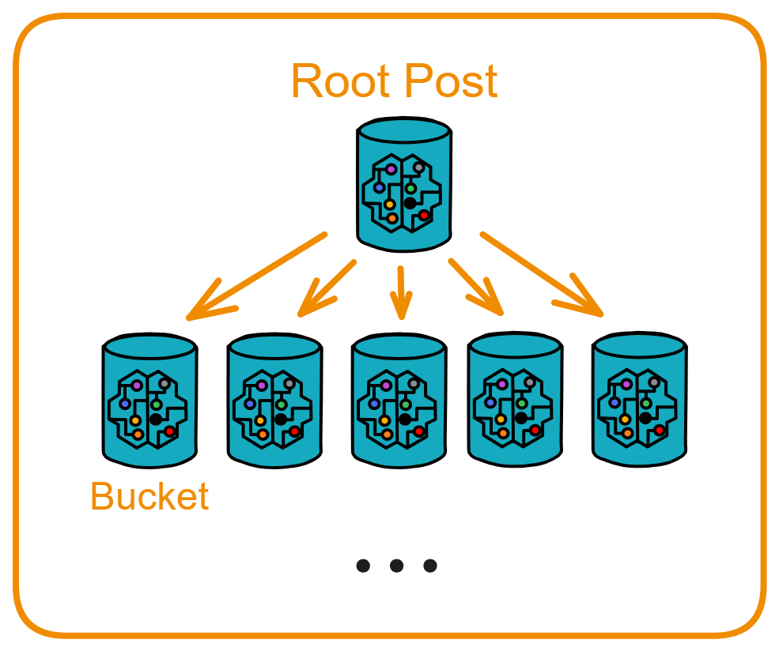

## Post

Users publish and retrieve posts through the Feed, and all posts are stored in a Bucket. The notification fetching feature is handled through Fetch. 

The next thing we have to implement is the Post module. However, we need types like Post, Like, Comment, and interactions with other Canisters. Moreover, these types are also needed in Feed and Fetch. 

Therefore, for types that need to be globally shared, we can place them outside the module folder: 

```plaintext
src
  ├── feed
  ├── fetch
  ├── post
  ├── user
  ├── types.mo  👈
  └── utils.mo
```

When using them, reference the contents of types.mo into the types.mo inside the module folder and then import them into other files.

<br>

For example, define the Post type representing posts that users publish and place it in types.mo outside the module folder. You can see more details in [8. Shared Types](./8.共享类型.md). A post includes various information such as post ID, publisher, post index, publication time, content, likes, comments, and more.

```motoko
public type Post = {
    postId: PostId;
    feedCanister: Principal;
    index: Nat;
    user: UserId;
    content: Text;
    var repost: [Repost];
    var like: [Like];
    var comment: [Comment];
    createdAt: Time;
};
```



According to the previous design, the Post module has two Canisters: Root Post and Bucket.

Root Post is responsible for coordinating all Buckets:

- Create a sufficient number of Buckets (always keep 5 available).
- Query all Buckets, available Buckets, and full Buckets.

<br>

Bucket is the place directly storing post content:

- Store posts.
- Query the total number of posts, query a single post by post ID, query multiple posts, and get the latest posts.
- After receiving new comments, notify through CommentFetch.
- Also maintain the addresses of two sub-modules, providing functions for updating and querying these two Canisters.
- The Bucket uses the `checkBucketMemory` function to check the number of posts. When approaching the threshold, notify the Root Post module to recreate the Bucket.

<br>

### Managing Canisters: rootPost.mo

Take a look at the Root Post Canister. Root Post needs to manage Buckets, and we can use a `TrieMap` to record three different states of Buckets: `buckets` stores all created Buckets, `availableBuckets` stores available Buckets, and `unavailableBuckets` stores Buckets that are already full.

Since 5 Canisters need to be created after deploying the Canister, we also need an initialization function and later functions to add new Buckets. When creating a Bucket, we also need to tell the Bucket the Canister ID of the Comment Fetch and Like Fetch in the system. Therefore, in Root Post, we need to record and save Comment Fetch and Like Fetch.

Finally, there are functions to query all Buckets, query available Buckets, and query full Buckets.

<br>

First, define some stable variables and mappings to save Buckets.

In Motoko, the `stable` keyword is used to define stable variables. The values of these variables should persist during the Canister upgrade process. This is a unique feature of Motoko, using the stable memory of the Internet Computer Protocol (ICP) to maintain data persistence during Canister upgrades. Stable memory can accommodate up to 400 GiB of data, regardless of the language used, whether it's Motoko, Rust, or any other language. Stable memory is a feature that allows IC to store data for an extended period.

With the definition of these stable variables and mappings, the state, total number, and other information of multiple Buckets can be persistently stored. They can continue to be used after Canister upgrades, achieving persistent management of Buckets.

```js
stable let T_CYCLES = 1_000_000_000_000; // Predefine 1T Cycles for later use
stable let BUCKET_MAX_POST_NUMBER: Nat = 5000; // Record the maximum number of posts each Bucket can store
stable var bucketIndex: Nat = 0; // Record the number of Buckets already created

// Define an array to save information about all created Buckets
stable var bucketsEntries: [(Nat, Principal)] = [];
// buckets is a map created based on bucketsEntries, where the key is the index, and the value is the principal of the Bucket
let buckets = TrieMap.fromEntries<Nat, Principal>(bucketsEntries.vals(), Nat.equal, Hash.hash);

// availableBucketsEntries and availableBuckets are used to record currently available Buckets
stable var availableBucketsEntries: [(Nat, Principal)] = [];
let availableBuckets = TrieMap.fromEntries<Nat, Principal>(availableBucketsEntries.vals(), Nat.equal, Hash.hash);

// unavailableBucketsEntries and unavailableBuckets are used to record currently unavailable Buckets
stable var unavailableBucketsEntries: [(Nat, Principal)] = [];
let unavailableBuckets = TrieMap.fromEntries<Nat, Principal>(unavailableBucketsEntries.vals(), Nat.equal, Hash.hash);
```

<br>

The `_createBucket()` function creates a Canister:

Using the `Bucket` function of the `Bucket.Bucket` object, it creates a new `Bucket` actor, passing the principal (ID) of the Root Post Canister, `commentFetchCanister`, and `likeFetchCanister` as parameters.

```js
// Logic to create a Bucket
private func _createBucket(): async Principal {
    // Add 4T Cycles to each Bucket
    Cycles.add(4 * T_CYCLES);
    let newBucket = await Bucket.Bucket(
        Principal.fromActor(this),
        commentFetchCanister,
        likeFetchCanister
    );

    // Save the principal of the newly created Bucket to the 'buckets' mapping, with the key as the current 'bucketIndex'
    buckets.put(bucketIndex, Principal.fromActor(newBucket));
    // Also save it to the 'availableBuckets' mapping, indicating that this Bucket is currently available
    availableBuckets.put(bucketIndex, Principal.fromActor(newBucket));

    // Increment 'bucketIndex' by 1, indicating an increase in the number of created Buckets
    bucketIndex += 1;
    
    // Return the principal of the newly created Bucket
    Principal.fromActor(newBucket)
};
```

This way, the `_createBucket()` function can create a new `Bucket` actor and save its principal to two mapping tables, indicating the created and available states.

It encapsulates the specific logic for creating a Bucket and is called by the `createBucket()` public function. It uses `bucketIndex` to identify each Bucket and increments this index after creation.

It provides an easy way to create Buckets in batches, specifying their states and facilitating the management of multiple Buckets.

<br>

Next, continue building functions to create and manage multiple Buckets.

```js
// Start by creating 5 Buckets and adding them to the 'buckets' and 'availableBuckets' mapping tables
public shared({caller}) func init(): async {
    var i = 0;
    label l loop {
        if(i >= 5) break l;

        Cycles.add(4 * T_CYCLES);
        let newBucket = await Bucket.Bucket(
            Principal.fromActor(this),
            commentFetchCanister,
            likeFetchCanister
        );

        buckets.put(bucketIndex, Principal.fromActor(newBucket));
        availableBuckets.put(bucketIndex, Principal.fromActor(newBucket));
        bucketIndex += 1;

        i += 1;
    };
};

// Add previously created Buckets in bulk to 'buckets' and 'availableBuckets'
public shared({caller}) func addAvailBucket(bucketArray: [Principal]): async () {
    for(_bucket in bucketArray.vals()) {
        buckets.put(bucketIndex, _bucket);
        availableBuckets.put(bucketIndex, _bucket);
        bucketIndex += 1;
    };
};

// Return the current number of created Buckets
public query func getBucketIndex(): async Nat { bucketIndex };

// Public function to create a Bucket, internally calls _createBucket()
public shared({caller}) func createBucket(): async Principal {
    await _createBucket()
};
```

Now our Canister can manage the creation and addition of Buckets. The creation and lifecycle of all Buckets can be centrally managed.

<br>

Later, we need to write query functions:

```js
// Query available Buckets
public query func getAvailableBucket(): async ?Principal {
    if(availableBuckets.size() == 0) return null;
    availableBuckets.get(Nat.rem(Option.unwrap(Nat.fromText(Int.toText(Time.now()))), availableBuckets.size()))
};

// Query all Buckets
public query func getAllBuckets(): async [Principal] {
    Iter.toArray(buckets.vals())
};

// Query all available Buckets
public query func getAllAvailableBuckets(): async [Principal] {
    Iter.toArray(availableBuckets.vals())
};

// Query all Buckets that are already full
public query func getAllUnavailableBuckets(): async [Principal] {
    Iter.toArray(unavailableBuckets.vals())
};
```

<br>

When creating a Bucket, we also need to tell the Bucket system the Canister IDs of the Comment Fetch and Like Fetch, so in the Root Post we also need to record and save the Comment Fetch and Like Fetch:

```js
// Persistently save the principal id of the commentFetch canister
stable var commentFetchCanister = _commentFetchCanister;

// Externally query the currently saved commentFetch canister id  
public query func getCommentFetchCanister(): async Principal {
  commentFetchCanister
};

// Authorize specific caller to update the saved commentFetch canister id
public shared({caller}) func updateCommentFetchCanister**(
  newCommentFetchCanister: Principal  
): async () {
  commentFetchCanister := newCommentFetchCanister; 
};
```

Now the principal ID of the likeFetch canister can be persistently saved, flexibly updated via the update function, and externally queried.

```js 
// Persistently save the principal id of the likeFetch canister
stable var likeFetchCanister = _likeFetchCanister;

// Externally query the currently saved likeFetch canister id
public query func getLikeFetchCanister(): async Principal {
  likeFetchCanister
};

// Authorize specific caller to update the saved likeFetch canister id  
public shared({caller}) func updateLikeFetchCanister**(
  newLikeFetchCanister: Principal
): async () {
  likeFetchCanister := newLikeFetchCanister;
}; 
```

<br>

Finally there are two system functions `preupgrade()` and `postupgrade()`, used to save and reset the entries of buckets, availableBuckets and unavailableBuckets before and after the Canister upgrade.

```js
system func preupgrade() {
  bucketsEntries := Iter.toArray(buckets.entries());
  availableBucketsEntries := Iter.toArray(availableBuckets.entries());
  unavailableBucketsEntries := Iter.toArray(unavailableBuckets.entries());
};

system func postupgrade() {
  bucketsEntries := [];
  availableBucketsEntries := []; 
  unavailableBucketsEntries := [];
};
```

The `preupgrade()` function is called before the Canister upgrade, it saves all the entries in buckets, availableBuckets and unavailableBuckets to the corresponding arrays bucketsEntries, availableBucketsEntries and unavailableBucketsEntries. 

The `postupgrade()` function is called after the Canister upgrade, it clears the bucketsEntries, availableBucketsEntries and unavailableBucketsEntries arrays, effectively resetting the data in buckets, availableBuckets and unavailableBuckets.

Thus, by saving and resetting entries before and after the upgrade, the data in buckets, availableBuckets and unavailableBuckets is not lost after the Canister upgrade.

`preupgrade` and `postupgrade` are defined as system functions, automatically called by the Runtime, developers don't need to call them.

This code implements data migration for Canister upgrades, by saving and resetting state before and after the upgrade, ensuring the transparency of the Canister upgrade.

<br>

<div class="center-image">

</div>

The complete rootPost.mo file is as follows:

```js
import Hash "mo:base/Hash";
import Nat "mo:base/Nat";
import TrieMap "mo:base/TrieMap";
import Principal "mo:base/Principal";
import Types "./types";
import Bucket "./bucket";
import Iter "mo:base/Iter";
import Cycles "mo:base/ExperimentalCycles";
import Time "mo:base/Time";
import Int "mo:base/Int";
import Option "mo:base/Option";
import IC "mo:ic";

actor class RootPost(
    _commentFetchCanister: Principal,
    _likeFetchCanister: Principal
) = this {

    stable let T_CYCLES = 1_000_000_000_000;
    stable let BUCKET_MAX_POST_NUMBER: Nat = 5000;
    stable var bucketIndex: Nat = 0;

    stable var bucketsEntries: [(Nat, Principal)] = [];
    let buckets = TrieMap.fromEntries<Nat, Principal>(bucketsEntries.vals(), Nat.equal, Hash.hash);

    stable var availableBucketsEntries: [(Nat, Principal)] = [];
    let availableBuckets = TrieMap.fromEntries<Nat, Principal>(availableBucketsEntries.vals(), Nat.equal, Hash.hash);

    stable var unavailableBucketsEntries: [(Nat, Principal)] = [];
    let unavailableBuckets = TrieMap.fromEntries<Nat, Principal>(unavailableBucketsEntries.vals(), Nat.equal, Hash.hash);

    // Start by creating 5 Buckets
    public shared({caller}) func init(): async () {
        var i = 0;
        label l loop {
            if(i >= 5) break l;

            Cycles.add(4 * T_CYCLES);
            let newBucket = await Bucket.Bucket(
                Principal.fromActor(this),
                commentFetchCanister,
                likeFetchCanister
            );

            buckets.put(bucketIndex, Principal.fromActor(newBucket));
            availableBuckets.put(bucketIndex, Principal.fromActor(newBucket));
            bucketIndex += 1;

            i += 1;
        };
    };

    public shared({caller}) func addAvailBucket(bucketArray: [Principal]): async () {
        for(_bucket in bucketArray.vals()) {
            buckets.put(bucketIndex, _bucket);
            availableBuckets.put(bucketIndex, _bucket);
            bucketIndex += 1;
        };
    };

    public query func getBucketIndex(): async Nat { bucketIndex };

    public shared({caller}) func createBucket(): async Principal {
        await _createBucket()
    };

    private func _createBucket(): async Principal {
        Cycles.add(4 * T_CYCLES);
        let newBucket = await Bucket.Bucket(
            Principal.fromActor(this),
            commentFetchCanister,
            likeFetchCanister
        );

        buckets.put(bucketIndex, Principal.fromActor(newBucket));
        availableBuckets.put(bucketIndex, Principal.fromActor(newBucket));

        bucketIndex += 1;

        Principal.fromActor(newBucket)
    };

    public shared({caller}) func reCreateBucket(): async () {
        for((_key, _bucket) in availableBuckets.entries()) {
            if(_bucket == caller) {
                ignore await _createBucket();
                availableBuckets.delete(_key);
                unavailableBuckets.put(_key, _bucket);
            };
        };
    };

    // Query available buckets
    public query func getAvailableBucket(): async ?Principal {
        if(availableBuckets.size() == 0) return null;
        availableBuckets.get(Nat.rem(Option.unwrap(Nat.fromText(Int.toText(Time.now()))), availableBuckets.size()))
    };

    // Query all Buckets
    public query func getAllBuckets(): async [Principal] {
        Iter.toArray(buckets.vals())
    };

    public query func getAllAvailableBuckets(): async [Principal] {
        Iter.toArray(availableBuckets.vals())
    };

    // Query the full Bucket
    public query func getAllUnavailableBuckets(): async [Principal] {
        Iter.toArray(unavailableBuckets.vals())
    };

// ==================== CommentFetchCanister ====================

    stable var commentFetchCanister = _commentFetchCanister;
    
    public query func getCommentFetchCanister(): async Principal { commentFetchCanister };

    public shared({caller}) func updateCommentFetchCanister(
        newCommentFetchCanister: Principal
    ): async () {
        commentFetchCanister := commentFetchCanister;
    };


// ==================== LikeFetchCanister ====================

    stable var likeFetchCanister = _likeFetchCanister;
    
    public query func getLikeFetchCanister(): async Principal { likeFetchCanister };

    public shared({caller}) func updateLikeFetchCanister(
        newLikeFetchCanister: Principal
    ): async () {
        likeFetchCanister := newLikeFetchCanister;
    };

    system func preupgrade() {
        bucketsEntries := Iter.toArray(buckets.entries());
        availableBucketsEntries := Iter.toArray(availableBuckets.entries());
        unavailableBucketsEntries := Iter.toArray(unavailableBuckets.entries());
    };

    system func postupgrade() {
        bucketsEntries := [];
        availableBucketsEntries := [];
        unavailableBucketsEntries := [];
    };
}
```

```js
### Storing Posts: bucket.mo

Bucket is a Canister for storing posts, and each Bucket can store a certain number of posts. It supports functions for storing, querying, updating posts, and notifying the Fetch Canister.

The Bucket needs to provide functions for querying the number of posts, querying a single post by post ID, querying multiple posts, and getting the latest posts.

After receiving new comments or likes, the Bucket also needs to communicate with the Comment Fetch Canister and Like Fetch Canister.

When the number of posts stored in the Bucket is approaching the threshold, Root Post will create a new Bucket.

This is the beginning of the `Bucket` module, where posts are actually stored. The `actor class` keyword indicates that this is an Actor class that can be called externally. The parameters `(rootPostCanister, _commentFetchCanister, _likeFetchCanister)` indicate that this Actor class needs to be initialized with the IDs of these three Canisters.

```js
actor class Bucket(
    rootPostCanister: Principal,
    _commentFetchCanister: Principal,
    _likeFetchCanister: Principal
) = this {
    // ...
};
```

Overall, this Bucket is used to receive various operations (new comments, likes, etc.) to update posts. All data is stored in an immutable form, allowing for efficient querying and sharing.

First, define some types, variables, and data structures.

```js
// Define several type aliases
type FeedActor = Types.FeedActor;
type PostImmutable = Types.PostImmutable;
type NewComment = Types.NewComment;
type NewLike = Types.NewLike;
type NewRepost = Types.NewRepost;
type CommentFetchActor = Types.CommentFetchActor;
type LikeFetchActor = Types.LikeFetchActor;
type RootPostActor = Types.RootPostActor;

stable let BUCKET_MAX_POST_NUMBER: Nat = 5000; // Maximum number of posts each Bucket can store
stable let FLOOR_BUCKET_MAX_POST_NUMBER: Nat = BUCKET_MAX_POST_NUMBER - 50; // A lower threshold
stable let installer = msg.caller;

// postId -> PostImmutable
// The main data is stored in feedMap, which is a mapping from post ID to PostImmutable
stable var feedMapEntries: [(Text, PostImmutable)] = [];
// Stored in a TrieMap, using Text for hashing and comparison
let feedMap = TrieMap.fromEntries<Text, PostImmutable>(feedMapEntries.vals(), Text.equal, Text.hash);
```

`TrieMap` is an efficient key-value storage structure. Using `TrieMap`, it maintains post information, providing functions for storing, batch storing, updating comments, updating likes, updating reposts, etc. The definitions of `feedMapEntries` and `feedMap` are used to store post data, one in array form and the other in TrieMap form.

<br>

Storing Posts:

The `storeFeed()` function is used to store a single post. It is `public shared`, so it can be called by external callers.

```js
public shared({caller}) func storeFeed(post: PostImmutable): async Bool {
    ignore checkBucketMemory();
    _storeFeed(post);
};
```

`batchStoreFeed()` is used to store multiple posts in batches, internally using a loop to call `_storeFeed()` for each post.

```js
public shared({caller}) func batchStoreFeed(posts: [PostImmutable]): async () {
    for(post in posts.vals()) {
        ignore _storeFeed(post);
    };
};
```

`updatePostRepost()` is used to update the repost information of a post. It calls `_updatePostRepost()` to perform the actual update and asserts to ensure the update is successful.

```js
public shared({caller}) func updatePostRepost(postId: Text, newRepost: NewRepost): async Bool {
    assert(_updatePostRepost(postId, newRepost));
    true
};
```

`_storeFeed()` and `_updatePostRepost()` are private functions, representing the internal logic for storing and updating.

<br>

Next are functionalities for updating post comments and likes:

The `updatePostComment` function is used to update the comment information of a post. It takes the post ID and new comment as parameters. Internally, it calls the `_updatePostComment` function to actually perform the comment update.

After a successful update, the updated post object is returned from `_updatePostComment`. Then, it notifies the `CommentFetchActor` to update the comment cache.

The `updatePostLike` function is used to update the like information of a post. It takes the post ID and new like as parameters. Internally, it calls `_updatePostLike` to perform the like update.

After a successful update, it similarly returns the updated post object and notifies the `LikeFetchActor` to update the like cache.

```js
```js
// Update Post Comment Information
// The caller parameter indicates that only the requester with a valid identity in the request can call the function
public shared({caller}) func updatePostComment(postId: Text, newComment: NewComment): async Bool {
    switch(_updatePostComment(postId, newComment)) {
        case(null) { return false; };
        case(?_post) {
            // Notify commentFetch
            let commentFetchActor: CommentFetchActor = actor(Principal.toText(commentFetchCanister));
            ignore commentFetchActor.receiveNotify(_post);
        };
    };
    // Return a Bool value indicating whether the update was successful
    true
};

public shared({caller}) func updatePostLike(postId: Text, newLike: NewLike): async Bool {
    switch(_updatePostLike(postId, newLike)) {
        case(null) { return false; };
        case(?_post) {
            // Notify likeFetch
            let likeFetchActor: LikeFetchActor = actor(Principal.toText(likeFetchCanister));
            ignore likeFetchActor.receiveNotify(_post);
        };     
    };
    true
};
```

We encapsulate the functions for manipulating posts through private functions. External callers only need to call the public update functions and don't need to be concerned with the internal storage and update logic. Private functions can encapsulate state management, making the code more modular and maintainable.

<br>

The `_updatePostComment` function is used to update the comments of a post. It retrieves the original post from `feedMap`, updates the `comment` field with the new comment `newComment`, and puts it back into `feedMap`.

`feedMap` is a hash table for storing posts, where the key is `postId` and the value is `PostImmutable` records.

```js
private func _updatePostComment(postId: Text, newComment: NewComment): ?PostImmutable {
    switch(feedMap.get(postId)) {
        case(null) { return null; };
        case(?post) {
            let _newPost = {
                postId = post.postId;
                feedCanister = post.feedCanister;
                index = post.index;
                user = post.user;
                repost = post.repost;
                content = post.content;
                like = post.like;
                comment = newComment;
                createdAt = post.createdAt;
            };
            feedMap.put(postId, _newPost);
            ?_newPost
        };
    };
};
```

<br>

`_updatePostLike` similarly updates the `like` field of a post.

```js
private func _updatePostLike(postId: Text, newLike: NewLike): ?PostImmutable {
    switch(feedMap.get(postId)) {
        case(null) { return null; };
        case(?post) {
            let _newPost = {
                postId = post.postId;
                feedCanister = post.feedCanister;
                index = post.index;
                user = post.user;
                repost = post.repost;
                content = post.content;
                like = newLike;
                comment = post.comment;
                createdAt = post.createdAt;
            };
            feedMap.put(postId, _newPost);
            ?_newPost              
        };
    };
};
```

<br>

`_updatePostRepost` updates the `repost` field of a post.

```js
private func _updatePostRepost(postId: Text, newRepost: NewRepost): Bool {
    switch(feedMap.get(postId)) {
        case(null) { return false; };
        case(?post) {
            feedMap.put(postId, {
                postId = post.postId;
                feedCanister = post.feedCanister;
                index = post.index;
                user = post.user;
                content = post.content;
                repost = newRepost;
                like = post.like;
                comment = post.comment;
                createdAt = post.createdAt;
            });
            true
        };
    };
};
```

<br>

Using the `immutable` data structure `PostImmutable` ensures data consistency and avoids accidental modifications.

```js
// Save the new post to feedMap
// Check if postId already exists, and save only if it doesn't to avoid duplication
private func _storeFeed(post: PostImmutable): Bool {
    ignore Utils.checkPostId(post.postId);
    switch(feedMap.get(post.postId)) {
        case(?_post) {
            // Debug.print("This post has been stored");
            return false;
        };
        case(null) {
            feedMap.put(post.postId, post);
            return true;
        };
    };
};
```

<br>

The `checkBucketMemory` function checks if the current Bucket is approaching its capacity limit, and if so, notifies the Root Post Actor to create a new Bucket.

```js
func checkBucketMemory(): async () {
    if(feedMap.size() > FLOOR_BUCKET_MAX_POST_NUMBER) {
        let rootPostActor: RootPostActor = actor(Principal.toText(rootPostCanister));
        ignore rootPostActor.reCreateBucket();
    }
};
```

<br>

```js
// Update Post Comment Information
// The `caller` parameter indicates that only the requester with a valid identity in the request can call the function
public shared({caller}) func updatePostComment(postId: Text, newComment: NewComment): async Bool {
    switch(_updatePostComment(postId, newComment)) {
        case(null) { return false; };
        case(?_post) {
            // Notify Comment Fetch
            let commentFetchActor: CommentFetchActor = actor(Principal.toText(commentFetchCanister));
            ignore commentFetchActor.receiveNotify(_post);
        };
    };
    // Return a Bool value indicating whether the update was successful
    true
};

public shared({caller}) func updatePostLike(postId: Text, newLike: NewLike): async Bool {
    switch(_updatePostLike(postId, newLike)) {
        case(null) { return false; };
        case(?_post) {
            // Notify Like Fetch
            let likeFetchActor: LikeFetchActor = actor(Principal.toText(likeFetchCanister));
            ignore likeFetchActor.receiveNotify(_post);
        };     
    };
    true
};
```

We encapsulate the functions for manipulating posts through private functions. External callers only need to call the public update functions and don't need to be concerned with the internal storage and update logic. Private functions can encapsulate state management, making the code more modular and maintainable.

<br>

The `_updatePostComment` function is used to update the comments of a post. It retrieves the original post from `feedMap`, updates the `comment` field with the new comment `newComment`, and puts it back into `feedMap`.

`feedMap` is a hash table for storing posts, where the key is `postId` and the value is `PostImmutable` records.

```js
private func _updatePostComment(postId: Text, newComment: NewComment): ?PostImmutable {
    switch(feedMap.get(postId)) {
        case(null) { return null; };
        case(?post) {
            let _newPost = {
                postId = post.postId;
                feedCanister = post.feedCanister;
                index = post.index;
                user = post.user;
                repost = post.repost;
                content = post.content;
                like = post.like;
                comment = newComment;
                createdAt = post.createdAt;
            };
            feedMap.put(postId, _newPost);
            ?_newPost
        };
    };
};
```

<br>

`_updatePostLike` similarly updates the `like` field of a post.

```js
private func _updatePostLike(postId: Text, newLike: NewLike): ?PostImmutable {
    switch(feedMap.get(postId)) {
        case(null) { return null; };
        case(?post) {
            let _newPost = {
                postId = post.postId;
                feedCanister = post.feedCanister;
                index = post.index;
                user = post.user;
                repost = post.repost;
                content = post.content;
                like = newLike;
                comment = post.comment;
                createdAt = post.createdAt;
            };
            feedMap.put(postId, _newPost);
            ?_newPost              
        };
    };
};
```

<br>

`_updatePostRepost` updates the `repost` field of a post.

```js
private func _updatePostRepost(postId: Text, newRepost: NewRepost): Bool {
    switch(feedMap.get(postId)) {
        case(null) { return false; };
        case(?post) {
            feedMap.put(postId, {
                postId = post.postId;
                feedCanister = post.feedCanister;
                index = post.index;
                user = post.user;
                content = post.content;
                repost = newRepost;
                like = post.like;
                comment = post.comment;
                createdAt = post.createdAt;
            });
            true
        };
    };
};
```

<br>

Using the `immutable` data structure `PostImmutable` ensures data consistency and avoids accidental modifications.

```js
// Save the new post to feedMap
// Check if postId already exists, and save only if it doesn't to avoid duplication
private func _storeFeed(post: PostImmutable): Bool {
    ignore Utils.checkPostId(post.postId);
    switch(feedMap.get(post.postId)) {
        case(?_post) {
            // Debug.print("This post has been stored");
            return false;
        };
        case(null) {
            feedMap.put(post.postId, post);
            return true;
        };
    };
};
```

<br>

The `checkBucketMemory` function checks if the current Bucket is approaching its capacity limit, and if so, notifies the Root Post Actor to create a new Bucket.

```js
func checkBucketMemory(): async () {
    if(feedMap.size() > FLOOR_BUCKET_MAX_POST_NUMBER) {
        let rootPostActor: RootPostActor = actor(Principal.toText(rootPostCanister));
        ignore rootPostActor.reCreateBucket();
    }
};
```

<br>

We need a function to query the total number of posts:

```js
// Query how many posts there are in total
public query func getPostNumber(): async Nat {
    feedMap.size()
};
```

<br>

There is also a function to get the specific content of posts, implementing the ability to quickly retrieve several posts at once.

This functionality is used in the Feed Canister to fetch posts:

When several people that a user follows post new content, the IDs of these posts are sent to Fetch. Eventually, these IDs are sent to another Feed. At this point, Feed receives many post IDs at once and needs to send these IDs to the Bucket to get the content of these posts all at once.

```js
// Query several posts by ID (can pass in 7 IDs to return the content of 7 posts at once)
public query func getPosts(postIdArray: [Text]): async [PostImmutable] { // Receives a Text array postIdArray as a parameter
    // Create a Buffer to store the query results, with a size equal to the size of postIdArray
    let result = Buffer.Buffer<PostImmutable>(postIdArray.size());
    // Iterate over each ID in postIdArray
    for(postId in postIdArray.vals()) {
        // For each ID, look it up in feedMap and add it to the result Buffer if found
        switch(feedMap.get(postId)) {
            case(null) {};
            case(?post) { result.add(post); };
        };
    };
    // After the iteration, convert the Buffer to an array using toArray() and return
    Buffer.toArray<PostImmutable>(result)
};
```

We use Buffer to avoid the overhead of concatenating arrays multiple times. The query function can be called externally, encapsulating the data query. It returns an array type, making it convenient for the caller to handle the query results.

This allows for batch querying of the content of multiple posts.

<br>

After batch precision querying posts by ID, two more functions related to querying are needed: a function to individually query a post by ID and a function to query the latest n posts.

```js
public query func getPost(postId: Text): async ?PostImmutable {
    switch(feedMap.get(postId)) {
        case(null) { return null; };
        case(?post) { return ?post; }; 
    };
};

// Query the latest n posts
public query func getLatestFeed(n: Nat): async [PostImmutable] {
    let feedArray = Iter.toArray(
        Iter.sort<PostImmutable>(
        feedMap.vals(),
        func (x: PostImmutable, y: PostImmutable): Order.Order {
            if(x.createdAt > y.createdAt) return #less
            else if(x.createdAt < y.createdAt) return #greater
            else return #equal
    }));
    if(n <= feedArray.size()) {
        Array.subArray(feedArray, 0, n)
    } else {
        Array.subArray(feedArray, 0, feedArray.size())
    }
};
```

Finally, there are two system functions related to upgrades, managed by the `preupgrade` and `postupgrade` functions, to handle the state of the Bucket.

<br>

The complete file for `bucket.mo` is as follows: 
```js
import Types "./types";
import TrieMap "mo:base/TrieMap";
import Principal "mo:base/Principal";
import Array "mo:base/Array";
import Order "mo:base/Order";
import Text "mo:base/Text";
import Hash "mo:base/Hash";
import Nat "mo:base/Nat";
import Iter "mo:base/Iter";
import Debug "mo:base/Debug";
import Option "mo:base/Option";
import Buffer "mo:base/Buffer";
import Utils "../utils";

shared(msg) actor class Bucket(
    rootPostCanister: Principal,
    _commentFetchCanister: Principal,
    _likeFetchCanister: Principal
) = this {
    
    type FeedActor = Types.FeedActor;
    type PostImmutable = Types.PostImmutable;
    type NewComment = Types.NewComment;
    type NewLike = Types.NewLike;
    type NewRepost = Types.NewRepost;
    type CommentFetchActor = Types.CommentFetchActor;
    type LikeFetchActor = Types.LikeFetchActor;
    type RootPostActor = Types.RootPostActor;

    stable let BUCKET_MAX_POST_NUMBER: Nat = 5000;
    stable let FLOOR_BUCKET_MAX_POST_NUMBER: Nat = BUCKET_MAX_POST_NUMBER - 50;

    stable let installer = msg.caller;

    // postId -> PostImmutable
    stable var feedMapEntries: [(Text, PostImmutable)] = [];
    let feedMap = TrieMap.fromEntries<Text, PostImmutable>(feedMapEntries.vals(), Text.equal, Text.hash);

    // Store post
    public shared({caller}) func storeFeed(post: PostImmutable): async Bool {
        ignore checkBucketMemory();
        _storeFeed(post);
    };

    public shared({caller}) func batchStoreFeed(posts: [PostImmutable]): async () {
        for(post in posts.vals()) {
            ignore _storeFeed(post);
        };
    };

    public shared({caller}) func updatePostRepost(postId: Text, newRepost: NewRepost): async Bool {
        assert(_updatePostRepost(postId, newRepost));
        true
    };

    // Update post comment information
    public shared({caller}) func updatePostComment(postId: Text, newComment: NewComment): async Bool {
        switch(_updatePostComment(postId, newComment)) {
            case(null) { return false; };
            case(?_post) {
                // Notification commentFetch
                let commentFetchActor: CommentFetchActor = actor(Principal.toText(commentFetchCanister));
                ignore commentFetchActor.receiveNotify(_post);
            };
        };
        true
    };

    public shared({caller}) func updatePostLike(postId: Text, newLike: NewLike): async Bool {
        switch(_updatePostLike(postId, newLike)) {
            case(null) { return false; };
            case(?_post) {
                // Notification likeFetch
                let likeFetchActor: LikeFetchActor = actor(Principal.toText(likeFetchCanister));
                ignore likeFetchActor.receiveNotify(_post);
            };     
        };
        true
    };

    func checkBucketMemory(): async () {
        if(feedMap.size() > FLOOR_BUCKET_MAX_POST_NUMBER) {
            let rootPostActor: RootPostActor = actor(Principal.toText(rootPostCanister));
            ignore rootPostActor.reCreateBucket();
        }
    };

    private func _updatePostComment(postId: Text, newComment: NewComment): ?PostImmutable {
        switch(feedMap.get(postId)) {
            case(null) { return null; };
            case(?post) {
                let _newPost = {
                    postId = post.postId;
                    feedCanister = post.feedCanister;
                    index = post.index;
                    user = post.user;
                    repost = post.repost;
                    content = post.content;
                    like = post.like;
                    comment = newComment;
                    createdAt = post.createdAt;
                };
                feedMap.put(postId, _newPost);
                ?_newPost
            };
        };
    };

    private func _updatePostLike(postId: Text, newLike: NewLike): ?PostImmutable {
        switch(feedMap.get(postId)) {
            case(null) { return null; };
            case(?post) {
                let _newPost = {
                    postId = post.postId;
                    feedCanister = post.feedCanister;
                    index = post.index;
                    user = post.user;
                    repost = post.repost;
                    content = post.content;
                    like = newLike;
                    comment = post.comment;
                    createdAt = post.createdAt;
                };
                feedMap.put(postId, _newPost);
                ?_newPost              
            };
        };
    };

    private func _updatePostRepost(postId: Text, newRepost: NewRepost): Bool {
        switch(feedMap.get(postId)) {
            case(null) { return false; };
            case(?post) {
                feedMap.put(postId, {
                    postId = post.postId;
                    feedCanister = post.feedCanister;
                    index = post.index;
                    user = post.user;
                    content = post.content;
                    repost = newRepost;
                    like = post.like;
                    comment = post.comment;
                    createdAt = post.createdAt;
                });
                true              
            };
        };
    };

    private func _storeFeed(post: PostImmutable): Bool {
        ignore Utils.checkPostId(post.postId);
        switch(feedMap.get(post.postId)) {
            case(?_post) {
                // Debug.print("This post has been stored");
                return false;
            };
            case(null) {
                feedMap.put(post.postId, post);
                return true;
            };
        };
    };

// ==================== Query ====================

    public query func getPostNumber(): async Nat {
        feedMap.size()
    };

    public query func getPosts(postIdArray: [Text]): async [PostImmutable] {
       let result = Buffer.Buffer<PostImmutable>(postIdArray.size());
       for(postId in postIdArray.vals()) {
        switch(feedMap.get(postId)) {
            case(null) {};
            case(?post) { result.add(post); };
        };
       };
       Buffer.toArray<PostImmutable>(result)
    };

    public query func getPost(postId: Text): async ?PostImmutable {
        switch(feedMap.get(postId)) {
            case(null) { return null; };
            case(?post) { return ?post; }; 
        };
    };

    public query func getLatestFeed(n: Nat): async [PostImmutable] {
        let feedArray = Iter.toArray(
            Iter.sort<PostImmutable>(
            feedMap.vals(),
            func (x: PostImmutable, y: PostImmutable): Order.Order {
                if(x.createdAt > y.createdAt) return #less
                else if(x.createdAt < y.createdAt) return #greater
                else return #equal
        }));
        if(n <= feedArray.size()) {
            Array.subArray(feedArray, 0, n)
        } else {
            Array.subArray(feedArray, 0, feedArray.size())
        }
    };

// ==================== CommentFetchCanister ====================

    stable var commentFetchCanister = _commentFetchCanister;
    
    public query func getCommentFetchCanister(): async Principal { commentFetchCanister };

    public shared({caller}) func updateCommentFetchCanister(
        newCommentFetchCanister: Principal
    ): async () {
        commentFetchCanister := commentFetchCanister;
    };


// ==================== LikeFetchCanister ====================

    stable var likeFetchCanister = _likeFetchCanister;
    
    public query func getLikeFetchCanister(): async Principal { likeFetchCanister };

    public shared({caller}) func updateLikeFetchCanister(
        newLikeFetchCanister: Principal
    ): async () {
        likeFetchCanister := newLikeFetchCanister;
    };

    system func preupgrade() {
        feedMapEntries := Iter.toArray(feedMap.entries());
    };

    system func postupgrade() {
        feedMapEntries := [];
    };
}
```

The next module is [the Feed module](./6.FeedModule.md). 