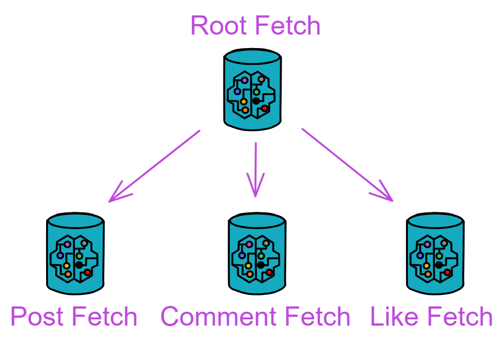

## Fetch

The Fetch module is responsible for notifying relevant users. There are a total of 4 Canisters:

<div class="center-image">

</div>


The functionality of the Root Fetch Canister is relatively simple; it is responsible for creating and managing all types of Fetch Canisters. The Post Fetch Canister is responsible for notifying followers about post updates. Comment Fetch Canister and Like Fetch Canister handle the notification of comments and likes.

Since the code in this module has high redundancy, we will only detail the code for Root Fetch Canister, Post Fetch Canister, and Like Fetch Canister.

<br>

### rootFetch.mo

<div class="center-image">

</div>


First, define types and variables.

```js
actor class RootFetch(
    userCanister: Principal,
) = this {

    type RootFeedActor = Types.RootFeedActor;
    type PostFetchActor = Types.PostFetchActor;
    type CommentFetchActor = Types.CommentFetchActor;
    type LikeFetchActor = Types.LikeFetchActor;

    stable let T_CYCLES = 1_000_000_000_000;
    stable var rootFeedCanister = Principal.fromText("2vxsx-fae");
    stable var postFetchCanisterIndex: Nat = 0;
    stable var commentFetchCanisterIndex: Nat = 0;
    stable var likeFetchCanisterIndex: Nat = 0;

    // Create three TrieMaps to store posts, comments, and likes.
    // This makes it easy to manage and retrieve relevant data, such as finding comments or likes for a post.

    // Its type is an array of tuples, each tuple containing a natural number (Nat) and a Principal.
    stable var postFetchMapEntries: [(Nat, Principal)] = [];
    // Build a Map from the values of the postFetchMapEntries array, using Nat.equal for key equality and Hash.hash for hashing.
    let postFetchMap = TrieMap.fromEntries<Nat, Principal>(postFetchMapEntries.vals(), Nat.equal, Hash.hash);

    stable var commentFetchMapEntries: [(Nat, Principal)] = [];
    let commentFetchMap = TrieMap.fromEntries<Nat, Principal>(commentFetchMapEntries.vals(), Nat.equal, Hash.hash);
    
    stable var likeFetchMapEntries: [(Nat, Principal)] = [];
    let likeFetchMap = TrieMap.fromEntries<Nat, Principal>(likeFetchMapEntries.vals(), Nat.equal, Hash.hash);    
};
```

<br>

After creating the Root Fetch Canister, we establish relationships between user feeds, posts, comments, and likes by creating child Canisters in the initialization function.

```js
public shared({caller}) func init(
    _rootFeedCanister: Principal,
    _initPostFetchCanister: Principal,
    _initCommentFetchCanister: Principal,
    _initLikeFetchCanister: Principal
): async () {
    rootFeedCanister := _rootFeedCanister;

    // Define three maps to store different types of fetch canisters.
    postFetchMap.put(postFetchCanisterIndex, _initPostFetchCanister);
    commentFetchMap.put(commentFetchCanisterIndex, _initCommentFetchCanister);
    likeFetchMap.put(likeFetchCanisterIndex, _initLikeFetchCanister);

    // Also define three index variables for generating a unique index for each fetch canister.
    postFetchCanisterIndex += 1;
    commentFetchCanisterIndex += 1;
    likeFetchCanisterIndex += 1;

    // Create four actor objects using the actor function.
    let rootFeedActor: RootFeedActor = actor(Principal.toText(_rootFeedCanister));
    let _postFetchActor: PostFetchActor = actor(Principal.toText(_initPostFetchCanister));
    let _commentFetchActor: CommentFetchActor = actor(Principal.toText(_initCommentFetchCanister));
    let _likeFetchActor: LikeFetchActor = actor(Principal.toText(_initLikeFetchCanister));
    let _allUserFeedCanister = await rootFeedActor.getAllUserFeedCanister();

    // Call the initUserToFeed method for the three Fetch Canisters, passing in the list of user feed canisters to initialize the relationship between users and feeds in these Fetch Canisters.
    // Use assert to confirm that all three initUserToFeed calls are executed successfully.
    assert(await _postFetchActor.initUserToFeed(_allUserFeedCanister));
    assert(await _commentFetchActor.initUserToFeed(_allUserFeedCanister));
    assert(await _likeFetchActor.initUserToFeed(_allUserFeedCanister));
};
```

Next is the function to create the Post Fetch Canister:

Create a new Post Fetch Canister and store the newly created Canister ID in the Map.
It also interacts with the Root Feed Canister.

```js
public shared({caller}) func createPostFetchCanister(): async Principal {
    // Add 4T Cycles to each Canister
    Cycles.add(4 * T_CYCLES);
    // Call the constructor of the PostFetch module to create a new PostFetch Canister
    let _canister = await PostFetch.PostFetch();
    // Get the Canister ID of the newly created Canister
    let _canisterId = Principal.fromActor(_canister);
    // Put the Principal of the new Canister into the postFetchMap
    postFetchMap.put(postFetchCanisterIndex, _canisterId);
    // Increment the index
    postFetchCanisterIndex += 1;

    // postFetch: initUserToFeed
    // Use assert to check if rootFeedCanister is not anonymous
    assert(not Principal.isAnonymous(rootFeedCanister));
    // Convert rootFeedCanister to text using Principal.toText, then create a RootFeedActor using the actor keyword
    let rootFeedActor: RootFeedActor = actor(Principal.toText(rootFeedCanister));
    // Use assert to check and ensure calling the initUserToFeed method of _canister, passing the Principal list of all user Feed Canisters
    assert(await _canister.initUserToFeed((await rootFeedActor.getAllUserFeedCanister())));

    // Return the Canister ID of the newly created Canister
    _canisterId
};

// Create Fetch Canisters responsible for notifying comments and likes, similar to creating Post Fetch Canister:

public shared({caller}) func createCommentFetchCanister(): async Principal {
    Cycles.add(4 * T_CYCLES);
    let _canister = await CommentFetch.CommentFetch(
        userCanister
    );
    let _canisterId = Principal.fromActor(_canister);
    commentFetchMap.put(commentFetchCanisterIndex, _canisterId);
    commentFetchCanisterIndex += 1;

    // initUserToFeed
    assert(not Principal.isAnonymous(rootFeedCanister));
    let rootFeedActor: RootFeedActor = actor(Principal.toText(rootFeedCanister));
    assert(await _canister.initUserToFeed((await rootFeedActor.getAllUserFeedCanister())));

    _canisterId
};

public shared({caller}) func createLikeFetchCanister(): async Principal {
    Cycles.add(4 * T_CYCLES);
    let _canister = await LikeFetch.LikeFetch(
        userCanister
    );
    let _canisterId = Principal.fromActor(_canister);
    likeFetchMap.put(likeFetchCanisterIndex, _canisterId);
    likeFetchCanisterIndex += 1;

    // initUserToFeed
    assert(not Principal.isAnonymous(rootFeedCanister));
    let rootFeedActor: RootFeedActor = actor(Principal.toText(rootFeedCanister));
    assert(await _canister.initUserToFeed((await rootFeedActor.getAllUserFeedCanister())));

    _canisterId
};

// Finally, we write query functions to query various Fetch Canisters.

public query func getAllPostFetchCanister(): async [Principal] {
    // Get all Canister IDs from the Map
    Iter.toArray(postFetchMap.vals())
    // Iter.toArray is a function that converts an iterator to an array, turning all Canister IDs in the Map into an array
};

public query func getAllCommentFetchCanister(): async [Principal] {
    Iter.toArray(commentFetchMap.vals())
};

public query func getAllLikeFetchCanister(): async [Principal] {
    Iter.toArray(likeFetchMap.vals())
};
```

### postFetch.mo

Post Fetch is responsible for notifying a user's posts to their followers.

<div class="center-image">

</div>

The content in postFetch.mo will be translated in the next response.

```js
import Types "./types";
import TrieMap "mo:base/TrieMap";
import Principal "mo:base/Principal";
import Array "mo:base/Array";
import Timer "mo:base/Timer";
import Debug "mo:base/Debug";
import Iter "mo:base/Iter";

actor class PostFetch() = this {

    // Internal maintenance of a notification table: records the post IDs to be notified for each user.
    // Define notifyMapEntries as an array of tuples, each tuple containing a Principal and an array of Text [Text].
    // The stable keyword ensures that the data of this variable will be saved even in the case of contract upgrades.
    stable var notifyMapEntries: [(Principal, [Text])] = [];
    let notifyMap = TrieMap.fromEntries<Principal, [Text]>(notifyMapEntries.vals(), Principal.equal, Principal.hash);

    // Notification function: post ID, poster, forwarder, followers, Cycles
    // When receiveNotify is called, it takes an array of Principals and a post ID.
    public shared({caller}) func receiveNotify(to: [Principal], postId: Text): async () {
        for(_user in to.vals()) {
            Debug.print(
                "Canister PostFetch, Func receiveNotify, "
                # "to : " # Principal.toText(_user) # " ,"
                # "postId : " # postId
            );
        };
        // Each Principal represents a user. The function iterates through each user in the array and checks if there is a record for the user in notifyMap.
        for(_follower in to.vals()) {
            switch(notifyMap.get(_follower)) {
                case(null) {
                    // If not, create a new one containing only the current post ID.
                    notifyMap.put(_follower, [postId]);
                };
                // If yes, append the current post ID to the array of post IDs for this user.
                case(?_postIdArray) {
                    notifyMap.put(_follower, Array.append(_postIdArray, [postId]));
                };
            };
        };
    };

    // Provide a way to query the current state of notifyMap by converting TrieMap entries to an array and returning it.
    public query func getNotifyMapEntries(): async [(Principal, [Text])] {
        Iter.toArray(notifyMap.entries())
    };

    // userToFeed

    // User relationship management
    // Define a new TrieMap that saves the relationship between each user's principal id and their Feed Canister id.
    stable var userToFeedEntries: [(Principal, Principal)] = [];
    var userToFeed = TrieMap.fromEntries<Principal, Principal>(userToFeedEntries.vals(), Principal.equal, Principal.hash);
    
    // Initialize userToFeed
    public shared({caller}) func initUserToFeed(_userToFeedArray: [(Principal, Principal)]): async Bool {
        userToFeed := TrieMap.fromEntries(
            _userToFeedArray.vals(),
            Principal.equal,
            Principal.hash
        );
        true
    };

    // Add new relationships
    public shared({caller}) func addUserToFeedEntry(entry: (Principal, Principal)): async Bool {
        switch(userToFeed.get(entry.0)) {
            case(?_feedCanister) { return false; };
            case(null) {
                userToFeed.put(entry.0, entry.1);
                true
            } 
        }
    };

    // Query the existing hash table
    public query func getUserToFeedEntries(): async [(Principal, Principal)] {
        Iter.toArray(userToFeed.entries())
    };

    public query({caller}) func whoami(): async Principal { caller };

    // Timer

    type FeedActor = Types.FeedActor;

    // Notify followers' Feed in batches using the ignore call based on the algorithm.
    // Callback function triggered by the timer
    func notify(): async () {
        // Debug.print("postFetch notify !");
        let _notifyMap = notifyMap;
        // Check each entry in notifyMap, for each user
        for((_user, _postIdArray) in _notifyMap.entries()) {
            // Try to get the corresponding Feed canister from userToFeed
            switch(userToFeed.get(_user)) {
                case(null) { };
                // If the Feed canister is found, create a notification
                // and call the batchReceiveFeed function to pass all pending post IDs
                case(?_feedId) {
                    // Debug.print("Notify feed canister " # Principal.toText(_feedId));
                    let feedActor: FeedActor = actor(Principal.toText(_feedId));
                    ignore feedActor.batchReceiveFeed(_postIdArray);
                    // Remove the entry for this user from notifyMap to avoid duplicate notifications
                    notifyMap.delete(_user);
                };
            };
        };
    };

    // Define a recurring timer cycleTimer that calls the notify function periodically (every 2 seconds).
    // The purpose of the notify function is to notify users that their Feed has been updated.
    let cycleTimer = Timer.recurringTimer(
        #seconds(2),
        notify
    );

    // System functions, as mentioned earlier, won't go into details here.
    system func preupgrade() {
        notifyMapEntries := Iter.toArray(notifyMap.entries());
        userToFeedEntries := Iter.toArray(userToFeed.entries());
    };

    system func postupgrade() {
        notifyMapEntries := [];
        userToFeedEntries := [];
    };
};
```

<br>

### likeFetch.mo

Like Fetch Canister is similar to the Post Fetch Canister, with only one procedural difference. Like Fetch Canister queries followers based on the owner of the post and then notifies the followers. In contrast, Post Fetch Canister only notifies based on the direct list of followers provided by the post author.

```js
import Principal "mo:base/Principal";
import TrieMap "mo:base/TrieMap";
import Types "./types";
import Array "mo:base/Array";
import Timer "mo:base/Timer";
import Iter "mo:base/Iter";
import Debug "mo:base/Debug";

actor class LikeFetch(
    userCanister: Principal
) = this {

    // Define type aliases
    type UserActor = Types.UserActor;
    type PostImmutable = Types.PostImmutable;
    type Repost = Types.Repost;

    // Use a stable variable notifyMapEntries to store notifications (tuples of Principal and an array of Text).
    // Initialize a TrieMap as the actual notification Map.
    stable var notifyMapEntries: [(Principal, [Text])] = [];
    let notifyMap = TrieMap.fromEntries<Principal, [Text]>(notifyMapEntries.vals(), Principal.equal, Principal.hash);
    
    // Receive notification for a post
    // First, obtain the followers list of the owner of the post from the user's actor,
    // and then call the _storeNotify function to store notifications for followers and reposters.
    public shared({caller}) func receiveNotify(post: PostImmutable): async () {
        // Retrieve followers of the user who posted this post
        let userActor: UserActor = actor(Principal.toText(userCanister));
        let postUserFollowers = await userActor.getFollowersList(post.user);

        // Notify followers
        _storeNotify(postUserFollowers, post.postId);

        // Notify users who reposted the post
        _storeNotify(
            Array.map<Repost, Principal>(
                post.repost,
                func (x: Repost): Principal {
                    x.user
                }
            ), 
            post.postId
        );
    };

    public shared({caller}) func receiveRepostUserNotify(to: [Principal], postId: Text): async () {
        _storeNotify(to, postId);
    };

    public query func getNotifyMapEntries(): async [(Principal, [Text])] {
        Iter.toArray(notifyMap.entries())
    };

    // Store notifications
    // It checks if the specified Principal already has a notification list.
    // If not, it creates a new list and adds the post ID; if yes, it appends the post ID to the existing list.
    private func _storeNotify(to: [Principal], postId: Text) {
        for(_follower in to.vals()) {
            switch(notifyMap.get(_follower)) {
                case(null) {
                    notifyMap.put(_follower, [postId]);
                };
                case(?_postIdArray) {
                    let _newPostIdArray = Array.append(_postIdArray, [postId]);
                    notifyMap.put(_follower, _newPostIdArray);
                };
            };
        };
    };
// userToFeed

    stable var userToFeedEntries: [(Principal, Principal)] = [];
    var userToFeed = TrieMap.fromEntries<Principal, Principal>(userToFeedEntries.vals(), Principal.equal, Principal.hash);

    public shared({caller}) func initUserToFeed(_userToFeedArray: [(Principal, Principal)]): async Bool {
        userToFeed := TrieMap.fromEntries(
            _userToFeedArray.vals(),
            Principal.equal,
            Principal.hash
        );
        true
    };

    public shared({caller}) func addUserToFeedEntry(entry: (Principal, Principal)): async Bool {
        switch(userToFeed.get(entry.0)) {
            case(?_feedCanister) { return false; };
            case(null) {
                userToFeed.put(entry.0, entry.1);
                true
            } 
        }
    };

    public query func getUserToFeedEntries(): async [(Principal, Principal)] {
        Iter.toArray(userToFeed.entries())
    };
    
    public query({caller}) func whoami(): async Principal { caller };

// Timer

    type FeedActor = Types.FeedActor;

    func notify(): async () {
        // Debug.print("likeFetch notify !");
        let _notifyMap = notifyMap; 
        for((_user, _postIdArray) in _notifyMap.entries()) {
            switch(userToFeed.get(_user)) {
                case(null) { };
                case(?_feedId) {
                    let feedActor: FeedActor = actor(Principal.toText(_feedId));
                    ignore feedActor.batchReceiveLike(_postIdArray);
                    notifyMap.delete(_user);
                };
            };
        };
    };

    let cycleTimer = Timer.recurringTimer(
        #seconds(2),
        notify
    );

    system func preupgrade() {
        notifyMapEntries := Iter.toArray(notifyMap.entries());
        userToFeedEntries := Iter.toArray(userToFeed.entries());
    };

    system func postupgrade() {
        notifyMapEntries := [];
        userToFeedEntries := [];
    };

};
```

<br>

### commentFetch.mo

Comment Fetch Canister is the same as the Like Fetch Canister, so there's no need to repeat the explanation.

Here is the commentFetch.mo source file:

```js
import Principal "mo:base/Principal";
import TrieMap "mo:base/TrieMap";
import Types "./types";
import Array "mo:base/Array";
import Timer "mo:base/Timer";
import Iter "mo:base/Iter";
import Debug "mo:base/Debug";

actor class CommentFetch(
    userCanister: Principal
) = this {
    
    type UserActor = Types.UserActor;
    type PostImmutable = Types.PostImmutable;
    type Repost = Types.Repost;

    // A list where each element is a tuple containing a Principal and an array of Text strings.
    // This list is used to initialize notifyMap, which is a TrieMap structure for efficiently storing and retrieving key-value pairs.
    stable var notifyMapEntries: [(Principal, [Text])] = [];
    let notifyMap = TrieMap.fromEntries<Principal, [Text]>(notifyMapEntries.vals(), Principal.equal, Principal.hash);
    
    public shared({caller}) func receiveNotify(post: PostImmutable): async () {
        // Retrieve followers of the user who posted this post
        let userActor: UserActor = actor(Principal.toText(userCanister));
        let postUserFollowers = await userActor.getFollowersList(post.user);

        // Notify followers
        _storeNotify(postUserFollowers, post.postId);

        // Notify users who reposted the post
        _storeNotify(
            Array.map<Repost, Principal>(
                post.repost,
                func (x: Repost): Principal {
                    x.user
                }
            ), 
            post.postId
        );
    };

    public shared({caller}) func receiveRepostUserNotify(to: [Principal], postId: Text): async () {
        _storeNotify(to, postId);
    };

    private func _storeNotify(to: [Principal], postId: Text) {
        for(_follower in to.vals()) {
            switch(notifyMap.get(_follower)) {
                case(null) {
                    notifyMap.put(_follower, [postId]);
                };
                case(?_postIdArray) {
                    notifyMap.put(_follower, Array.append(_postIdArray, [postId]));
                };
            };
        };
    };

    public query func getNotifyMapEntries(): async [(Principal, [Text])] {
        Iter.toArray(notifyMap.entries())
    };

// userToFeed

    stable var userToFeedEntries: [(Principal, Principal)] = [];
    var userToFeed = TrieMap.fromEntries<Principal, Principal>(userToFeedEntries.vals(), Principal.equal, Principal.hash);

    public shared({caller}) func initUserToFeed(_userToFeedArray: [(Principal, Principal)]): async Bool {
        userToFeed := TrieMap.fromEntries(
            _userToFeedArray.vals(),
            Principal.equal,
            Principal.hash
        );
        true
    };

    public shared({caller}) func addUserToFeedEntry(entry: (Principal, Principal)): async Bool {
        switch(userToFeed.get(entry.0)) {
            case(?_feedCanister) { return false; };
            case(null) {
                userToFeed.put(entry.0, entry.1);
                true
            } 
        }
    };

    public query func getUserToFeedEntries(): async [(Principal, Principal)] {
        Iter.toArray(userToFeed.entries())
    };
    
    public query({caller}) func whoami(): async Principal { caller };

// Timer

    type FeedActor = Types.FeedActor;

    func notify(): async () {
        // Debug.print("commentFetch notify !");
        let _notifyMap = notifyMap; 
        for((_user, _postIdArray) in _notifyMap.entries()) {
            switch(userToFeed.get(_user)) {
                case(null) { };
                case(?_feedId) {
                    // Debug.print("commentFetch Notify feed canister " # Principal.toText(_feedId));
                    let feedActor: FeedActor = actor(Principal.toText(_feedId));
                    ignore feedActor.batchReceiveComment(_postIdArray);
                    notifyMap.delete(_user);
                };
            };
        };
    };

    let cycleTimer = Timer.recurringTimer(
        #seconds(2),
        notify
    );

    system func preupgrade() {
        notifyMapEntries := Iter.toArray(notifyMap.entries());
        userToFeedEntries := Iter.toArray(userToFeed.entries());
    };

    system func postupgrade() {
        notifyMapEntries := [];
        userToFeedEntries := [];
    };
};
```

<br>
