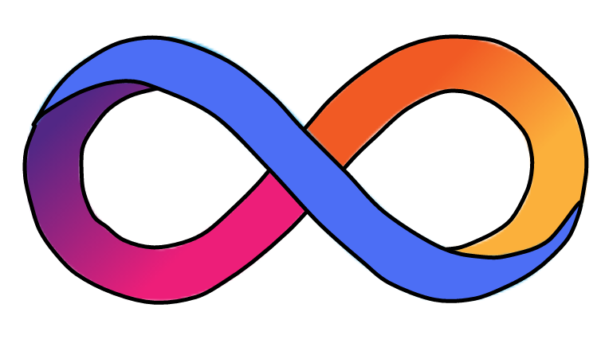

# Constellation Book: Your Journey to the Internet Computer

If you have only heard of IC but have been busy with Ethereum and Polkadot projects without delving into IC, then you've come to the right place to learn more about it [here](1.OverviewofIC/1.md)!

If you are still unfamiliar with Web3, blockchain, Bitcoin, and IC, don't worry, start [here](0.JourneytoWeb3/JourneyoftheDreamWeaver.md). Let me guide you through the history of encryption and quickly get you started in Web3 development!

The structure of the "Internet Computer Roaming Guide": the first half is vivid and interesting, and the second half is concise; the first half talks about IC principles, and the second half discusses development in practice.

## Why write this book?

Initially, after learning about IC, I collected and organized materials from IC whitepapers, Medium, ICPL forums, and IC Developer Forums. After talking to a friend about the IC architecture, I told her that I was organizing notes on IC resources and would share them when they were ready. I didn't expect that it would take a year. After experiencing the long years of procrastination, and with what I learned later, I finally put together the first version of the notes. After a period of further study, I thought it would be better to share these notes. Making it an open-source book helps everyone learn about IC and contributes to the IC developer community.

 

Learn blockchain with zero thresholds and level the learning field for IC.

## Why open source?

I really like the Rust open-source community. There are many open-source books and high-quality projects in the Rust community, which have helped me a lot. I have learned a lot from the Rust open-source community. Projects like Bitcoin, Ethereum, and their related projects also have a strong open-source atmosphere, and I hope that more and more open-source projects will emerge in the IC community for everyone to learn from each other.

 

In addition, the IC content is updated and iterated quickly. With open-source, everyone can contribute, keeping the content fresh and up-to-date.

 

Join the developer discussion group for this book, correct errors, make modifications, suggest improvements, and contribute to the open-source book together!

 

[OpenChat](https://oc.app/4jwox-pyaaa-aaaar-amjbq-cai/?ref=3iq22-xyaaa-aaaar-amjrq-cai&code=834791b392db154c), [Discord](https://discord.gg/5Y8QPHvR), [Github](https://github.com/NeutronStarDAO/ConstellationBook-English)

 
