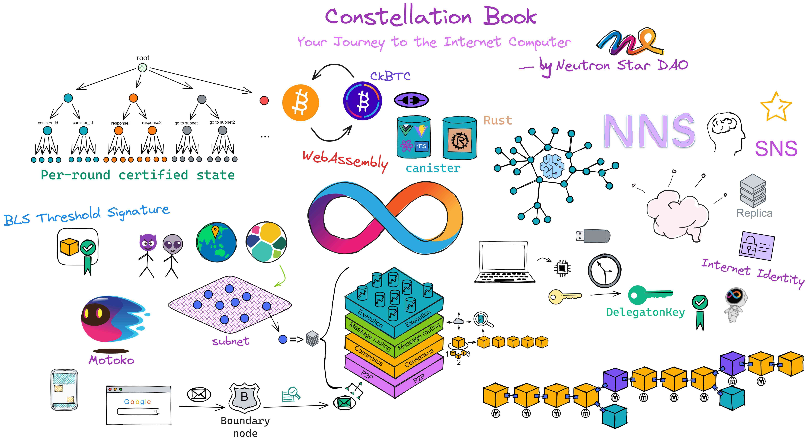
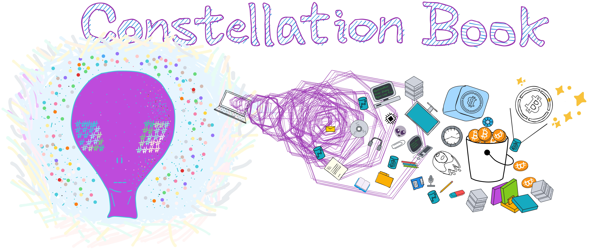

# Constellation Book: Your Journey to the Internet Computer

If you have only heard of IC but have been busy with Ethereum and Polkadot projects without delving into IC, then you've come to the right place to learn more about it [here](./OverviewofIC/OverviewofIC.md)!

If you are still unfamiliar with Web3, blockchain, Bitcoin, and IC, don't worry, start [here](./JourneytoWeb3/JourneyoftheDreamWeaver.md). Let me guide you through the history of encryption and quickly get you started in Web3 development!

Here is the general structure of Constellation book :The first half is lively and interesting, the second half is concise; the first half talks about the principles of IC, and the second half discusses practical development.

 

### Why we write this book?

Initially, after learning about IC, I collected and organized information from the IC whitepaper, Medium, ICPL Forum, and IC Developer Forum. After explaining the IC architecture to a friend, I told her that I was compiling notes on IC information to share once I finished organizing them. Unexpectedly, it took a year to organize them after a long period of procrastination. Later, after learning more, I finally compiled the first version of my notes. After further study, I thought it would be best to share these notes as an open-source book to help everyone learn about IC and contribute to the IC developer community.

 

Zero-threshold learning of blockchain, eliminating the threshold for learning IC.

### Why make it open source?

I love the Rust open-source community, which has many open-source books and projects that have been very helpful to me. I have learned a lot from the Rust open-source community. Projects like Bitcoin, Ethereum, and related ones also have a strong open-source atmosphere, and I hope that the IC community will also have more and more open-source projects for everyone to learn from.

Additionally, IC's content updates quickly, and open-source contributions help keep the content fresh and up-to-date.

 

Join the developer discussion group for this book, make corrections, suggest changes, and contribute to this open-source book together!

 

Discord: https://discord.gg/5Y8QPHvR
